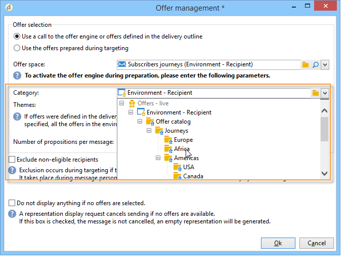

# Aanbiedingen op een outbound-kanaal{#offers-on-an-outbound-channel}

## E-mailaanbieding {#email-offer-delivery}

In onze database is er een categorie reisaanbiedingen voor Afrika. De geschiktheid, context en representaties van elk aanbod zijn geconfigureerd. We willen nu een campagne opzetten om onze aanbiedingen via e-mail te presenteren.

1. Maak een marketingcampagne en een doelworkflow.

   

1. Bewerk de e-maillevering en klik op de knop **[!UICONTROL Offers]** pictogram.

   

1. Kies de e-mailruimte voor uw aanbiedingsomgeving die overeenkomt met de feestdagen.

   

1. Kies de categorie die de Afrikaanse reisaanbiedingen bevat.

   

1. Stel het aantal aanbiedingen in de levering in op twee.

   

1. Sluit het venster Aanbiedingsbeheer en maak de inhoud van uw levering.

   

1. Gebruik de menu&#39;s om een eerste aanbiedingsvoorstel in te voegen en de HTML renderfunctie te kiezen.

   

1. Voeg het tweede voorstel voor een aanbieding in.

   

1. Klikken **[!UICONTROL Preview]** Als u een voorvertoning van uw voorstellen in de levering wilt bekijken, selecteert u een ontvanger om een voorvertoning van de voorstellen te bekijken terwijl deze worden ontvangen.

   

1. Sla uw levering op en start de doelworkflow.
1. Open uw levering en klik op de knop **[!UICONTROL Audit]** tabblad van uw levering: u kunt zien dat de aanbiedingsengine de voorstellen heeft geselecteerd die uit de verschillende aanbiedingen in de catalogus moeten worden gemaakt.

   

## Voer een aanbiedingssimulatie uit {#perform-an-offer-simulation}

1. In de **[!UICONTROL Profiles and Targets]** klikt u op de knop **[!UICONTROL Simulations]** klikt u op de koppeling **[!UICONTROL Create]** knop.

   

1. Kies een label en geef indien nodig de instellingen voor uitvoering op.

   

1. Sla de simulatie op. Dit wordt vervolgens op een nieuw tabblad geopend.

   

1. Klik op de knop **[!UICONTROL Edit]** dan **[!UICONTROL Scope]**.

   

1. Kies de categorie waarvoor u aanbiedingen wilt simuleren.

   

1. Kies de aanbiedingsruimte die voor de simulatie moet worden gebruikt.

   

1. Voer geldigheidsdatums in. U moet ten minste een begindatum invoeren. Hiermee kan het filter voor de aanbiedingsengine worden aangeboden en worden de opties gekozen die op een bepaalde datum geldig zijn.
1. Geef zo nodig een of meer thema&#39;s op om het aantal aanbiedingen te beperken tot de thema&#39;s die dit trefwoord in hun instellingen bevatten.

   In ons voorbeeld **Reizen** categorie bevat twee subcategorieën met twee aparte thema&#39;s. We willen een simulatie voor aanbiedingen uitvoeren met de **Klanten > 1 jaar** thema.

   

1. Kies de ontvangers u wilt richten.

   

1. Configureer het aantal aanbiedingen dat naar elke ontvanger moet worden verzonden.

   In ons voorbeeld kiest de aanbiedingsengine de drie aanbiedingen met het hoogste gewicht voor elke ontvanger.

   

1. Sla uw instellingen op en klik vervolgens op **[!UICONTROL Start]** in de **[!UICONTROL Dashboard]** om de simulatie uit te voeren.

   

1. Als de simulatie is voltooid, raadpleegt u de **[!UICONTROL Results]** voor een gedetailleerde uitsplitsing van de voorstellen per aanbieding.

   In ons voorbeeld heeft de aanbiedingsmotor de uitsplitsing van het aanbod gebaseerd op drie voorstellen.

   

1. De weergave van **[!UICONTROL Breakdown of offers by rank]** om de lijst met voorstellen weer te geven die door de aanbiedingsengine zijn geselecteerd.

   

1. Indien nodig kunt u de bereikinstellingen wijzigen en de simulatie opnieuw uitvoeren door op **[!UICONTROL Start simulation]**.

   

1. Om de simulatiegegevens te bewaren, gebruik de geschiedenis of de uitvoerfuncties beschikbaar in het rapport.

   
