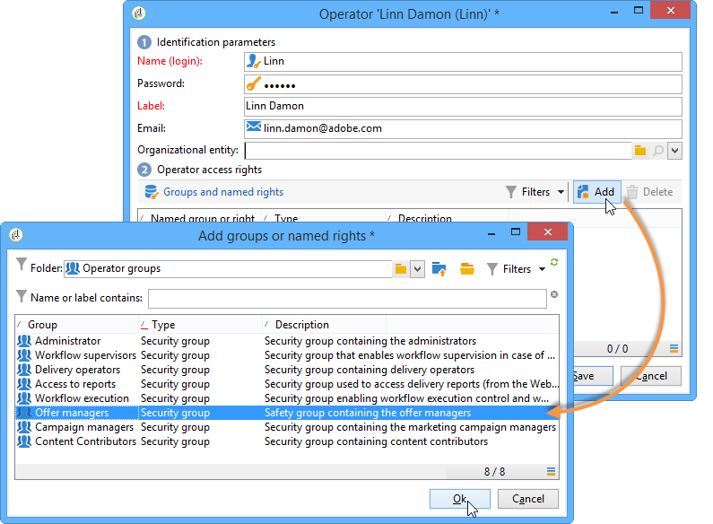

# Operatorprofielen{#operator-profiles}

Er zijn twee soorten operatoren die Interactie gebruiken: bieden managers en leveringsmanagers aan. Ze hebben elk specifieke rechten die ze slechts toegang geven tot bepaalde delen van de boom en het platform.

* **[!UICONTROL Offer manager]** : aanbiedingen maken en onderhouden
* **[!UICONTROL Delivery manager]** : goedkeurt en gebruikt voorstellen

De stappen voor het maken van operatoren die specifiek zijn voor Interactie zijn identiek aan de stappen die worden gebruikt om alle andere operatoren op het platform te maken. Zie [deze sectie](../../platform/using/access-management.md#creating-an-operator)voor meer informatie. De rechten worden gevormd tijdens de verwezenlijking van de exploitant.

## Aanbiedingsmanager {#offer-manager}

1. Maak een nieuwe operator.
1. Ga naar het **[!UICONTROL Groups and named rights]** venster, klik **[!UICONTROL Add]** en selecteer de **[!UICONTROL Offer manager]** groep.

   

De aan de aanbiedingsmanager toegewezen rechten stellen hen in staat de volgende taken uit te voeren:

* Pas **[!UICONTROL Design]** omgevingen aan.
* Bekijk **[!UICONTROL Live]** omgevingen.
* Vorm beleidsfuncties (vooraf bepaalde ruimten en filters).
* Categorieën maken en wijzigen.
* Maak voorstellen.
* Geschiktheid van aanbieding configureren.
* Voorstel goedkeuren.

   >[!NOTE]
   >
   >De aanbiedingsmanager kan slechts in twee gevallen een aanbieding goedkeuren. Het eerste geval was dat niemand in het bijzonder als recensent werd gespecificeerd, en het tweede is dat de exploitant die belast was met het creëren van sjablonen (met het recht om recensenten toe te wijzen) hem/haar als recensent in het aanbiedingsmalplaatje specificeerde waarop het aanbod was gebaseerd.

## Leveringsmanager {#delivery-manager}

1. Maak een nieuwe operator.
1. Ga naar het **[!UICONTROL Groups and named rights]** venster, klik **[!UICONTROL Add]** en selecteer de **[!UICONTROL Delivery manager]** groep.

   

De aan de leveringsmanager toegewezen rechten zijn/laten hen toe om de volgende taken uit te voeren:

* Weergaveomgevingen **[!UICONTROL Live]** .
* Categorieën voorstellen weergeven en wijzigen.
* Aanbiedingen goedkeuren als s/he is opgegeven als een van de controleurs.

   >[!NOTE]
   >
   >De leveringsmanager kan een aanbieding slechts goedkeuren als hij als recensent tijdens de aanbiedingsconfiguratie is bepaald.

## Reparatie van rechten volgens exploitant {#recap-of-rights-according-to-operator}

<table> 
 <tbody> 
  <tr> 
   <td> </td> 
   <td> <strong>Aanbiedingsbeheer (bewerken)</strong>  </td> 
   <td> <strong>Aanbiedingsmanager (live)</strong>  </td> 
  </tr> 
  <tr> 
   <td> <strong>Boomstructuurniveau</strong>  </td> 
   <td> </td> 
   <td> </td> 
  </tr> 
  <tr> 
   <td> Voorstellen die worden bewerkt/Live voorstellen  </td> 
   <td> Lezen/Schrijven  </td> 
   <td> Lezen  </td> 
  </tr> 
  <tr> 
   <td> Ontvanger - Milieu  </td> 
   <td> Lezen/Schrijven  </td> 
   <td> Lezen  </td> 
  </tr> 
  <tr> 
   <td> Beheer  </td> 
   <td> Lezen/Schrijven  </td> 
   <td> Lezen  </td> 
  </tr> 
  <tr> 
   <td> Spaties  </td> 
   <td> Lezen/Schrijven  </td> 
   <td> Lezen  </td> 
  </tr> 
  <tr> 
   <td> Vooraf gedefinieerde aanbiedingsfilters  </td> 
   <td> Lezen/Schrijven  </td> 
   <td> Lezen  </td> 
  </tr> 
  <tr> 
   <td> Typologie  </td> 
   <td> Lezen/Schrijven  </td> 
   <td> Lezen  </td> 
  </tr> 
  <tr> 
   <td> Typologieregels  </td> 
   <td> Lezen/Schrijven  </td> 
   <td> Lezen  </td> 
  </tr> 
  <tr> 
   <td> Aanbiedingscatalogus  </td> 
   <td> Lezen/Schrijven  </td> 
   <td> Lezen  </td> 
  </tr> 
  <tr> 
   <td> Aanbiedingscategorie  </td> 
   <td> Lezen/Schrijven  </td> 
   <td> Lezen  </td> 
  </tr> 
 </tbody> 
</table>

<table> 
 <tbody> 
  <tr> 
   <td> </td> 
   <td> <strong>Leveringsmanager (bewerken)</strong>  </td> 
   <td> <strong>Leveringsmanager (live)</strong>  </td> 
  </tr> 
  <tr> 
   <td> <strong>Boomstructuurniveau</strong>  </td> 
   <td> </td> 
   <td> </td> 
  </tr> 
  <tr> 
   <td> Voorstellen die worden bewerkt/Live voorstellen  </td> 
   <td> </td> 
   <td> Lezen  </td> 
  </tr> 
  <tr> 
   <td> Ontvanger - Milieu  </td> 
   <td> </td> 
   <td> Lezen  </td> 
  </tr> 
  <tr> 
   <td> Beheer  </td> 
   <td> </td> 
   <td> </td> 
  </tr> 
  <tr> 
   <td> Spaties  </td> 
   <td> </td> 
   <td> </td> 
  </tr> 
  <tr> 
   <td> Vooraf gedefinieerde aanbiedingsfilters  </td> 
   <td> Lezen  </td> 
   <td> Lezen  </td> 
  </tr> 
  <tr> 
   <td> Typologie  </td> 
   <td> Lezen  </td> 
   <td> Lezen  </td> 
  </tr> 
  <tr> 
   <td> Typologieregels  </td> 
   <td> </td> 
   <td> Lezen  </td> 
  </tr> 
  <tr> 
   <td> Aanbiedingscatalogus  </td> 
   <td> Lezen  </td> 
   <td> Lezen  </td> 
  </tr> 
  <tr> 
   <td> Aanbiedingscategorie  </td> 
   <td> </td> 
   <td> Lezen  </td> 
  </tr> 
 </tbody> 
</table>

