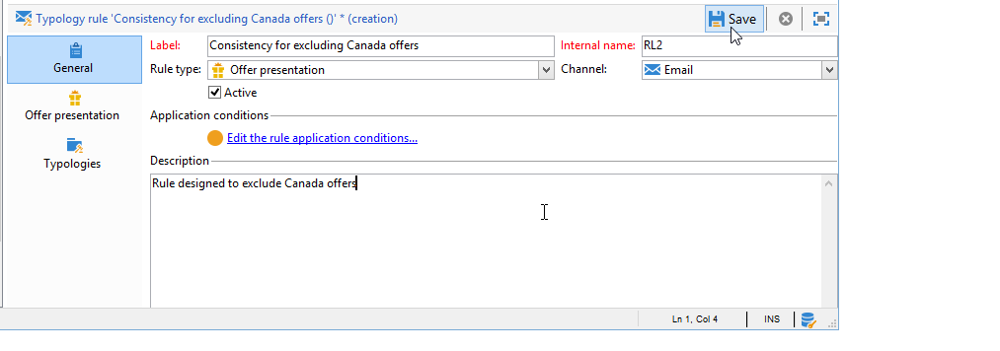
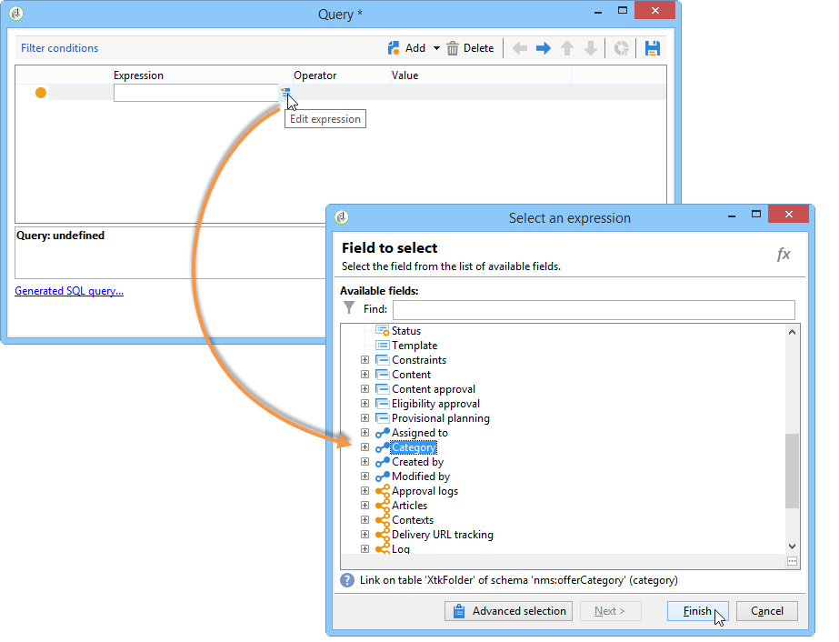
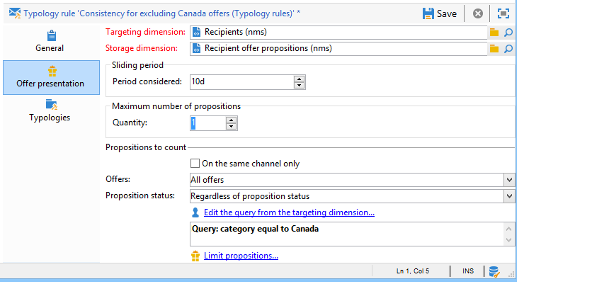
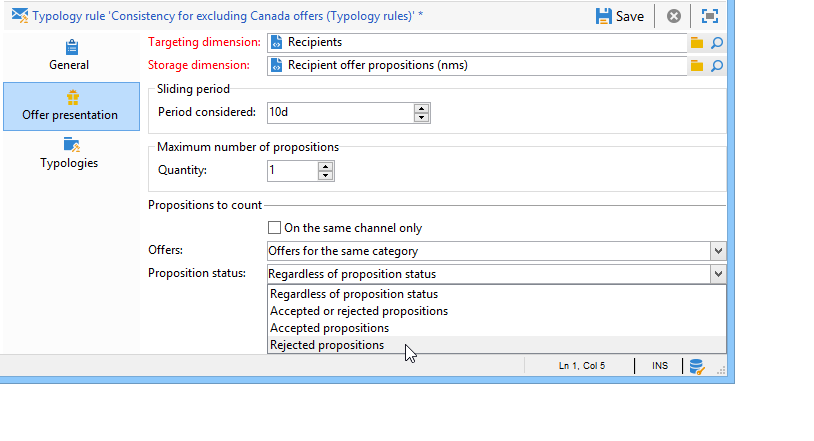

# Presentatieregels{#presentation-rules}

## Presentatieregel maken {#creating-a-presentation-rule}

In onze databank staan verschillende reisaanbiedingen voor Europa, Afrika, de Verenigde Staten en Canada. We willen voorstellen verzenden voor een reis naar Canada, maar als de ontvanger dit soort aanbiedingen weigert, willen we ze niet meer sturen

We gaan onze regels zodanig configureren dat de reis naar Canada slechts één keer per ontvanger wordt aangeboden en niet opnieuw wordt aangeboden als ze wordt afgewezen.

1. Ga in de Adobe Campagne-structuur naar **[!UICONTROL Administration]** > **[!UICONTROL Campaign management]** > **[!UICONTROL Typology management]** > **[!UICONTROL Typology rules]** knooppunt.
1. Maak een nieuwe **[!UICONTROL Offer presentation]** tekstregel.

   

1. Wijzig zo nodig het label en de beschrijving.

   

1. Kies de **[!UICONTROL All channels]** optie om de lijn tot alle kanalen uit te breiden.

   

1. Klik op de **[!UICONTROL Edit expression]** koppeling en kies het **[!UICONTROL Category]** knooppunt als een expressie.

   

1. Kies de categorie die overeenkomt met uw reisaanbieding voor Canada en klik **[!UICONTROL OK]** om het venster met zoekopdrachten te sluiten.

   

1. Kies op het **[!UICONTROL Offer presentation]** tabblad dezelfde afmetingen als de afmetingen die in de omgeving zijn geconfigureerd.

   

1. Geef de periode op waarin de regel van toepassing wordt.

   

1. Beperk het voorstel tot één voorstel, zodat ontvangers die al een reis naar Canada hebben afgewezen geen ander soortgelijk aanbod meer ontvangen.

   

1. Selecteer het **[!UICONTROL Offers for the same category]** filter om alle aanbiedingen uit te sluiten van de categorie **Canada** .

   

1. Selecteer het **[!UICONTROL Rejected propositions]** filter om alleen rekening te houden met voorstellen die door de ontvanger zijn afgewezen.

   

1. Kies de ontvangers waarop deze regel van toepassing is.

   In ons voorbeeld kiezen we de ontvangers van de **frequente reizigers** .

   

1. Verwijs naar de regel in een aanbiedingstype.

   

1. Ga naar het aanbiedingsmilieu, (**Milieu - Ontvanger** in dit geval) en verwijs de nieuwe typologie net gecreeerd gebruikend de drop-down lijst in het **[!UICONTROL Eligibility]** lusje.

   

## De presentatieregel toepassen {#applying-the-presentation-rule}

Hier volgt een voorbeeld van de eerder gemaakte typologieregel.

We willen een eerste voorstel verzenden dat tot de categorie Canada behoort. Indien het aanbod eenmaal door een van de ontvangers wordt afgewezen, wordt het niet opnieuw aan hen aangeboden.

1. Kies in de map **Ontvanger frequente reizigers** een van de profielen om de aanbiedingen te controleren waarvoor ze in aanmerking komen: Klik op het **[!UICONTROL Propositions]** tabblad en klik vervolgens op het **[!UICONTROL Preview]** tabblad.

   In ons voorbeeld komt **Tim Ramsey** in aanmerking voor een aanbod dat deel uitmaakt van de categorie **Amerika** .

   

1. Begin door een e-maillevering te creëren die uw **Frequente reizigers** ontvangers met voorstellen zal richten.
1. Selecteer de vraagparameters van de aanbiedingsmotor.

   In ons voorbeeld wordt de categorie **Reizen in Amerika** gekozen, die de subcategorieën **Canada** en de **Verenigde Staten** bevat.

   

1. Voeg je voorstellen in in de tekst van het bericht en verzend de levering. Voor meer op dit, verwijs naar [Ongeveer uitgaande kanalen](../../interaction/using/about-outbound-channels.md).

   De begunstigde heeft het aanbod ontvangen waarvoor hij in aanmerking komt.

1. De ontvanger heeft het aanbod van Canada afgewezen, zoals blijkt uit de geschiedenis van het voorstel.

   

1. Controleer de aanbiedingen waarvoor ze nu in aanmerking komen.

   We zien dat er geen aanbiedingen voor Canada worden gekozen.

   

**Verwante onderwerpen**

* [Aanbiedingen beheren en redundantie beheren op verschillende kanalen](https://helpx.adobe.com/campaign/kb/simplifying-campaign-management-acc.html#Manageoffersandcontrolredundancyacrosschannels)