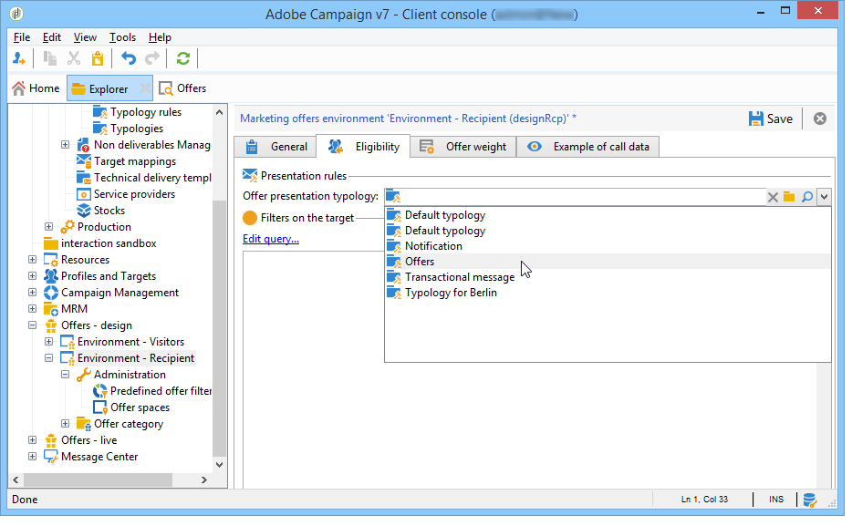

# Presentatieregels{#presentation-rules}

## Presentatieregel maken {#creating-a-presentation-rule}

In onze databank staan verschillende reisaanbiedingen voor Europa, Afrika, de Verenigde Staten en Canada. We willen voorstellen verzenden voor een reis naar Canada, maar als de ontvanger dit soort aanbiedingen weigert, willen we ze niet meer sturen

We gaan onze regels zodanig configureren dat de reis naar Canada slechts één keer per ontvanger wordt aangeboden en niet opnieuw wordt aangeboden als ze wordt afgewezen.

1. Ga in de Adobe Campaign-boom naar de **[!UICONTROL Administration]** > **[!UICONTROL Campaign management]** > **[!UICONTROL Typology management]** > **[!UICONTROL Typology rules]** knooppunt.
1. Een nieuwe **[!UICONTROL Offer presentation]** typeregel.

   

1. Wijzig zo nodig het label en de beschrijving.

   

1. Kies de optie **[!UICONTROL All channels]** om de regel tot alle kanalen uit te breiden.

   

1. Klik op de knop **[!UICONTROL Edit expression]** en kies de **[!UICONTROL Category]** knooppunt als expressie.

   

1. Kies de categorie die overeenkomt met uw reisaanbod voor Canada en klik op **[!UICONTROL OK]** om het vraagvenster te sluiten.

   

1. In de **[!UICONTROL Offer presentation]** kiest u dezelfde afmetingen als de afmetingen die in de omgeving zijn geconfigureerd.

   

1. Geef de periode op waarin de regel van toepassing wordt.

   

1. Beperk het voorstel tot één voorstel, zodat ontvangers die al een reis naar Canada hebben afgewezen geen ander soortgelijk aanbod meer ontvangen.

   

1. Selecteer de **[!UICONTROL Offers for the same category]** filter om alle aanbiedingen uit te sluiten van de **Canada** categorie.

   

1. Selecteer de **[!UICONTROL Rejected propositions]** filter om alleen rekening te houden met door de ontvanger afgewezen voorstellen.

   

1. Kies de ontvangers waarop deze regel van toepassing is.

   In ons voorbeeld kiezen we de **Frequente reizigers** ontvangers.

   

1. Verwijs naar de regel in een aanbiedingstype.

   

1. Ga naar de aanbiedingsomgeving, (**Milieu - ontvanger** in dit geval) en verwijst u naar de nieuwe typologie die u zojuist hebt gemaakt met de vervolgkeuzelijst in het dialoogvenster **[!UICONTROL Eligibility]** tab.

   

## De presentatieregel toepassen {#applying-the-presentation-rule}

Hier volgt een voorbeeld van de eerder gemaakte typologieregel.

We willen een eerste voorstel verzenden dat tot de categorie Canada behoort. Indien het aanbod eenmaal door een van de ontvangers wordt afgewezen, wordt het niet opnieuw aan hen aangeboden.

1. In de **Frequente reizigers** de ontvankelijke omslag, kies één van de profielen om de aanbiedingen te controleren waarvoor zij verkiesbaar zijn: klik **[!UICONTROL Propositions]** en vervolgens de **[!UICONTROL Preview]** tab.

   In ons voorbeeld: **Tim Ramsey** komt in aanmerking voor een aanbod dat deel uitmaakt van het **Amerika** categorie.

   

1. Begin met het maken van een e-maillevering voor uw **Frequente reizigers** ontvangers met voorstellen.
1. Selecteer de vraagparameters van de aanbiedingsmotor.

   In ons voorbeeld **Reizen in Amerika** gekozen categorie, die de **Canada** en **Verenigde Staten** subcategorieën.

   

1. Voeg je voorstellen in in de tekst van het bericht en verzend de levering. Raadpleeg voor meer informatie hierover [Informatie over uitgaande kanalen](../../interaction/using/about-outbound-channels.md).

   De begunstigde heeft het aanbod ontvangen waarvoor hij in aanmerking komt.

1. De ontvanger heeft het aanbod van Canada afgewezen, zoals blijkt uit de geschiedenis van het voorstel.

   

1. Controleer de aanbiedingen waarvoor ze nu in aanmerking komen.

   We kunnen zien dat er geen aanbiedingen voor Canada worden gekozen.

   
