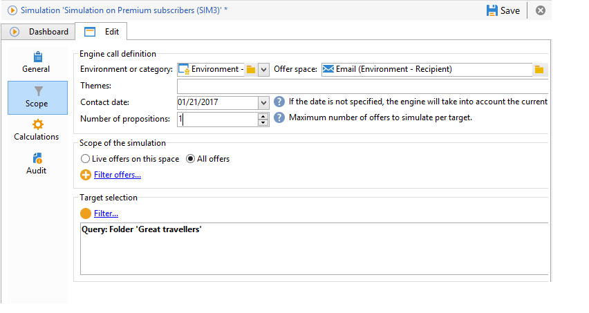

# Simulatiebereik{#simulation-scope}

## Definitie van het toepassingsgebied {#definition-of-the-scope}

Open het **[!UICONTROL Scope]** tabblad om uw instellingen te kiezen.

De volgende punten zijn verplicht:

* Omgeving of aanbiedingencategorie.
* Ruimte bieden.
* Datum contactpersoon. Aanbiedingen die op de contactdatum niet in aanmerking komen, worden niet in aanmerking genomen.
* Doelpopulatie.

   Als u geen filter op uw doel vormt, zal de volledige ontvankelijke lijst met rekening worden gehouden.

* Aantal voorstellen dat per doel moet worden gesimuleerd.

   De ontvanger zal deze vele voorstellen ontvangen. Als u bijvoorbeeld 5 invoert, ontvangt elke ontvanger maximaal vijf aanbiedingsvoorstellen.

   

Als u de aanbiedingen wilt verfijnen waarmee rekening moet worden gehouden voor de simulatie, kunt u een of meerdere thema&#39;s toevoegen (vooraf opgegeven in de categorieën).

U kunt er ook voor kiezen om de simulatie uit te voeren voor alle aanbiedingen of alleen voor de aanbiedingen die online zijn. Met sommige filters kunt u desgewenst uw selectie wijzigen.

>[!NOTE]
>
>U moet een contactdatum opgeven. Hierdoor kan de interactie-engine de aanbiedingen sorteren in de geselecteerde omgeving of categorie. Als geen datum wordt gevormd, zal de simulatie een fout opheffen.

## Rapportassen toevoegen {#adding-reporting-axes}

U kunt de simulatieanalyse verbeteren door rapportassen op het doel of de aanbiedingen zelf via het **[!UICONTROL Calculations]** lusje toe te voegen.

Klik hiertoe op de **[!UICONTROL Add]** knop en kies de gewenste velden. De assen zullen voor de berekening van de simulatie worden gebruikt en worden getoond in het analyseverslag. Raadpleeg [Simulatie bijhouden](../../interaction/using/simulation-tracking.md)voor meer informatie.

