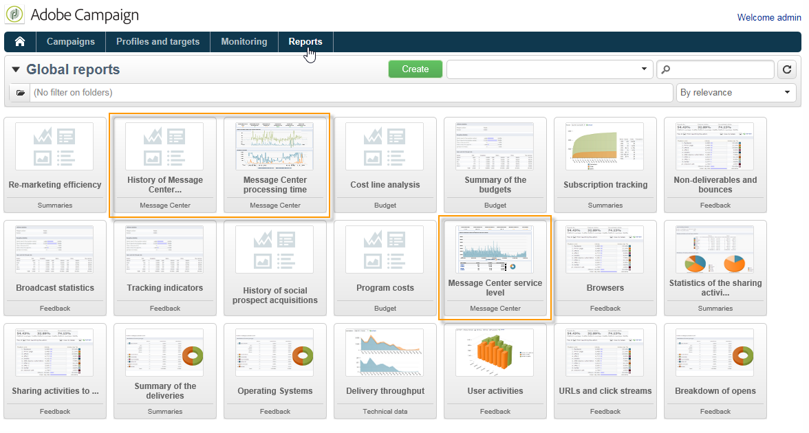

# Over transactiemeldingsrapporten{#about-transactional-messaging-reports}

Adobe Campaign bevat verschillende rapporten waarmee u de activiteit en het vloeiend functioneren van uitvoeringsinstanties kunt beheren. Deze rapporten van het Centrum van Bericht kunnen van het **[!UICONTROL Reports]** lusje van de controleinstantie worden betreden.

