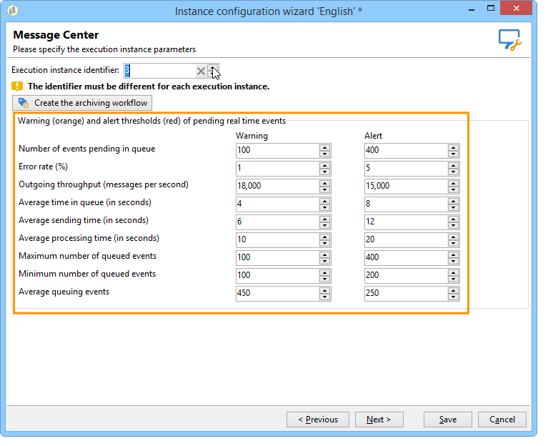

# Aanvullende configuraties {#mc-additional-configurations}


## Drempels controleren {#monitoring-thresholds}

U kunt de waarschuwingsdrempels (oranje) en waakzame drempels (rood) van de indicatoren vormen die in **de dienstniveau van het Centrum van het Bericht** en **de verwerkingstijd van het Centrum van het Bericht** (verwijs naar [Transformonal overseinenrapporten van de Toegang](../../message-center/using/about-transactional-messaging-reports.md)) verschijnen.

Volg de onderstaande stappen om dit te doen:

1. Open de plaatsingstovenaar op **uitvoeringsinstantie**.

1. Ga naar de pagina **[!UICONTROL Message Center]**.

1. Gebruik de pijlen om de drempels te veranderen.

   

>[!NOTE]
>
>Het aantal gebeurtenissen in wachtrij wordt weergegeven in de sectie [Systeemindicatoren](../../production/using/monitoring-processes.md#system-indicators) van de pagina voor procesbewaking van Adobe Campaign. Raadpleeg [deze sectie](../../installation/using/deploying-an-instance.md#deployment-wizard) voor meer informatie over de implementatiewizard.

## Gebeurtenissen opschonen {#purging-events}

Met de [implementatiewizard](../../production/using/database-cleanup-workflow.md#deployment-wizard) kunt u configureren hoe lang de gegevens in de database moeten worden opgeslagen.

Gebeurtenissen worden automatisch gewist door de [workflow voor het opschonen van databases](../../production/using/database-cleanup-workflow.md). Dit werkschema zuiveert de gebeurtenissen die op de uitvoeringsinstanties en de gebeurtenissen worden ontvangen en worden opgeslagen die op een controleinstantie worden gearchiveerd.

Gebruik de pijlen naar wens om de instellingen voor leegmaken te wijzigen.

Instellingen voor het opschonen van gebeurtenissen op een besturingsinstantie:


Instellingen voor het opschonen van gebeurtenissen op een uitvoeringsinstantie:


Zie [deze sectie](../../production/using/database-cleanup-workflow.md) voor meer informatie over de workflow voor het opschonen van databases.


## Technische workflows {#technical-workflows}

U moet ervoor zorgen dat de technische werkschema&#39;s op de controleinstantie en de verschillende uitvoeringsinstanties inderdaad zijn gecreeerd en begonnen alvorens om het even welke transactionele berichtmalplaatjes op te stellen.

De diverse technische werkschema&#39;s met betrekking tot transactioneel overseinen (het Centrum van het Bericht) worden verdeeld tussen de controleinstantie en de uitvoeringsinstantie(s).

### Workflows voor besturingsinstanties {#control-instance-workflows}

Op de controle instantie, of u één of verscheidene uitvoeringsinstanties hebt geregistreerd, moet u één archiveringswerkschema voor elke **[!UICONTROL Message Center execution instance]** externe rekening creëren. Klik op de knop **[!UICONTROL Create the archiving workflow]** om de workflow te maken en te starten.


Deze workflows zijn vervolgens toegankelijk via de map **Beheer > Productie > Message Center**. Nadat de workflows voor archivering zijn gemaakt, worden deze automatisch gestart.

<!--**Minimal architecture**

Once the control and execution modules are installed on the same instance, you must create the archiving workflow using the deployment wizard. Click the **[!UICONTROL Create the archiving workflow]** button to create and start the workflow.

-->

### Workflows voor uitvoeringsinstanties {#execution-instance-workflows}

Op de uitvoeringsinstantie(s) zijn de technische workflows voor transactiemelding toegankelijk via de map **Beheer > Productie > Berichtcentrum**. Je moet ze gewoon starten. De workflows in de lijst zijn:

* **[!UICONTROL Processing batch events]** (interne naam:  **[!UICONTROL batchEventsProcessing]** ): met deze workflow kunt u batchgebeurtenissen in een wachtrij onderverdelen voordat deze aan een berichtsjabloon zijn gekoppeld.
* **[!UICONTROL Processing real time events]** (interne naam:  **[!UICONTROL rtEventsProcessing]** ): met deze workflow kunt u real-time gebeurtenissen in een wachtrij onderverdelen voordat deze aan een berichtsjabloon zijn gekoppeld.
* **[!UICONTROL Update event status]** (interne naam:  **[!UICONTROL updateEventStatus]** ): in deze workflow kunt u een status aan de gebeurtenis toewijzen.

   De volgende gebeurtenisstatussen zijn beschikbaar:

   * **[!UICONTROL Pending]** : de gebeurtenis bevindt zich in de wachtrij. Er is nog geen berichtsjabloon aan toegewezen.
   * **[!UICONTROL Pending delivery]** : de gebeurtenis is in de rij, is een berichtmalplaatje toegewezen aan het en het wordt verwerkt door de levering.
   * **[!UICONTROL Sent]** : deze status wordt gekopieerd uit de leveringslogboeken. Dit betekent dat de levering is verzonden.
   * **[!UICONTROL Ignored by the delivery]** : deze status wordt gekopieerd uit de leveringslogboeken. Het betekent dat de levering is genegeerd.
   * **[!UICONTROL Delivery failed]** : deze status wordt gekopieerd uit de leveringslogboeken. Het betekent dat de levering is mislukt.
   * **[!UICONTROL Event not taken into account]** : de gebeurtenis kon niet aan een berichtmalplaatje worden verbonden. De gebeurtenis wordt niet verwerkt.

## Multibranding configureren {#configuring-multibranding}

In deze sectie wordt één oplossing beschreven voor het configureren van URL&#39;s voor bijhouden en spiegelen per merk, voor transactieberichten in Adobe Campaign.

### Vereisten {#prerequisites}

* Alle gastheren moeten aan het configuratiedossier van de instantie (`config-<instance>.xml`) worden toegevoegd.
* Aan elk merk moet een subdomein worden toegewezen.
* U moet een HTTPS-certificaat voor alle merken hebben als de webtracering wordt uitgevoerd op HTTPS-pagina&#39;s.

Om multibranding te vormen, moet u zowel uitvoeringsinstanties als controleinstantie vormen.

### Uitvoeringsinstantie {#execution-instance}

Voer in de uitvoeringsinstantie(s) de onderstaande stappen uit:

1. Maak één extern account per merk.

   >[!NOTE]
   >
   >Leer hoe u in [deze sectie](../../message-center/using/configuring-instances.md#control-instance) een instantie van uitvoering kunt maken.

1. Breid het schema nms:extAccount uit om het volgen URL toe te voegen:

   ```
   <attribute advanced="true" desc="URL of the tracking servers" label="Tracking server URL"
   length="100" name="trackingURL" type="string"/>
   ```

   >[!NOTE]
   >
   >Leer hoe te om een bestaand schema in [Uitbreidend een schema](../../configuration/using/extending-a-schema.md) sectie uit te breiden.

1. Wijzig de vorm nms:extAccount:

   ```
   <container label="Message domain branding" type="frame">
        <static type="help"> These parameters are used to override the DNS alias and addresses used during message delivery. When not populated, the values of the 'NmsServer_MirrorPageUrl' and 'NmsEmail_DefaultErrorAddr' options are used.</static>
        <input xpath="@mirrorURL"/>
        <input xpath="@trackingURL"/>
        <input img="nms:sendemail.png" menuId="deliveryMenuBuilder" type="scriptEdit">
               xpath="errorAddress"/>
      </container>
   ```

1. Wijzig de opties NmsTracking_OpenFormula en NmsTracking_ClickFormula om de externe account te gebruiken in plaats van een globale optie.

   Hiervoor vervangt u:

   ```
   <%@ include option='NmsTracking_ServerUrl' %>
   ```

   met:

   ```
   <%@ value object="provider" xpath="@trackingURL" %>
   ```

   >[!IMPORTANT]
   >
   >Deze wijzigingen kunnen leiden tot conflicten tijdens de upgrade. Mogelijk moet u deze formules handmatig samenvoegen met de nieuwe versie.

### Control-instantie {#control-instance}

Voor de controleinstantie, moet u leveringsmalplaatjes en externe rekeningen verbinden.

Volg de onderstaande stappen om dit te doen:

1. Maak één externe account per merk met dezelfde interne naam als gedefinieerd op de [uitvoeringsinstantie](#execution-instance) (stap 1).

1. Eén standaardleveringssjabloon per merk maken.

   >[!NOTE]
   >
   >    Leer hoe te om een leveringsmalplaatje in [deze sectie te creëren](../../delivery/using/creating-a-delivery-template.md#creating-a-new-template).

1. In de leveringsmalplaatje **[!UICONTROL Properties]**, plaats het verpletteren aan de externe rekening van het merk.
