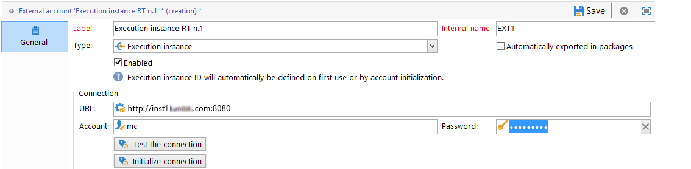

# Instanties configureren {#creating-a-shared-connection}

Om de mogelijkheden van het transactionele overseinen te gebruiken, moet u de controle en uitvoeringsinstanties vormen. U kunt beide gebruiken:
* [Eén besturingsinstantie](#control-instance) gekoppeld aan een of meer uitvoeringsinstanties
* [Verschillende besturingsinstanties](#using-several-control-instances) gekoppeld aan verschillende uitvoeringsinstanties

>[!IMPORTANT]
>
>De uitbreidingen van het schema beïnvloedden de middelen die door [Technische workflows voor Message Center](../../message-center/using/additional-configurations.md#technical-workflows) op of controle of uitvoeringsinstanties moeten op de andere instanties worden gedupliceerd die door de Transactionele overseinenmodule worden gebruikt.

U moet ook de uitvoeringsinstantie(s) opgeven en verbinden met de besturingsinstantie(s).

Alle stappen nodig om de controle en uitvoeringsinstanties te vormen en aan te sluiten worden beschreven in deze sectie.

>[!IMPORTANT]
>
>De bedieningsinstantie en de uitvoeringsinstantie(s) moeten op verschillende computers zijn geïnstalleerd. Ze kunnen niet dezelfde Campagne-instantie delen.

## Vorm de controleinstantie {#control-instance}

Om de controleinstantie en de uitvoeringsinstanties te verbinden, moet u eerst creëren en vormen **[!UICONTROL Execution instance]** type externe account **op de besturingsinstantie**. Daarom moet [gepubliceerd](../../message-center/using/publishing-message-templates.md#template-publication), kunnen de transactionele berichtmalplaatjes aan de uitvoeringsinstanties worden opgesteld.

Als u meerdere uitvoeringsinstanties gebruikt, moet u net zoveel externe accounts maken als er uitvoeringen zijn.

>[!NOTE]
>
>Wanneer uitvoeringsinstanties door verscheidene controleinstanties worden gebruikt, kunnen de gegevens door omslag en door exploitant worden verdeeld. Zie voor meer informatie [Verschillende besturingsinstanties gebruiken](#using-several-control-instances).

### Een externe account maken

>[!NOTE]
>
>De onderstaande stappen moeten worden uitgevoerd **op de besturingsinstantie**.

Om een **[!UICONTROL Execution instance]** Typ een externe account en pas het volgende toe:

1. Ga naar de **[!UICONTROL Administration > Platform > External accounts]** map.
1. Selecteer een van de uitvoerinstantietypen voor externe accounts die bij Adobe Campaign buiten de box worden geleverd, klik met de rechtermuisknop en kies **[!UICONTROL Duplicate]** .

   

1. Wijzig het label naar wens.

   

1. Selecteer **[!UICONTROL Enabled]** optie om de externe rekening operationeel te maken.

   

1. Geef het adres op van de server waarop de uitvoeringsinstantie is geïnstalleerd.

   

1. De rekening moet de Agent van het Centrum van het Bericht zoals die in de exploitantomslag wordt bepaald aanpassen. De door Adobe Campaign verschafte out-of-box-account is standaard **[!UICONTROL mc]** .

   

1. Voer het wachtwoord van de account in zoals gedefinieerd in de map met operatoren.

   >[!NOTE]
   >
   >Om te vermijden ingaand een wachtwoord telkens als u aan de instantie het programma opent, kunt u het IP adres van de controleinstantie in de uitvoeringsinstantie specificeren. Zie voor meer informatie [De uitvoeringsinstantie(s) configureren](#execution-instance).

1. Geef de herstelmethode op die door de uitvoeringsinstantie moet worden gebruikt. De gegevens die moeten terugkrijgen worden door:sturen aan de controleinstantie door de uitvoeringsinstantie, om aan transactiebericht en gebeurtenisarchieven toe te voegen.

   

   De inzameling van gegevens komt of via de dienst van het Web voor die HTTP/HTTPS toegang, of via de Federated Module van de Toegang van Gegevens (FDA) gebruikt.

   >[!NOTE]
   >
   >Houd er rekening mee dat als u FDA via HTTP gebruikt, alleen uitvoeringsinstanties met een PostSQL-database worden ondersteund. MSSQL- of Oracle-databases worden niet ondersteund.

   De tweede methode (FDA) wordt geadviseerd als de controleinstantie directe toegang tot het gegevensbestand van de uitvoeringsinstanties heeft. Als niet, kies de de diensttoegang van het Web. De FDA rekening om te specificeren valt met de verbinding aan de gegevensbestanden van de diverse uitvoeringsinstanties die op de controleinstantie worden gecreeerd.

   

   Voor meer informatie over Federated Data Access (FDA) raadpleegt u [deze sectie](../../installation/using/about-fda.md).

1. Klikken **[!UICONTROL Test the connection]** om ervoor te zorgen dat de besturingsinstantie en de uitvoeringsinstantie aan elkaar zijn gekoppeld.

   

Herhaal deze stappen om zoveel externe accounts te maken als er uitvoeringsinstanties zijn.

### Uitvoeringsinstanties identificeren {#identifying-execution-instances}

Elke uitvoeringsinstantie moet met een unieke herkenningsteken worden geassocieerd om de geschiedenis van elke uitvoeringsinstantie te onderscheiden wanneer het bekijken van hen op de controleinstantie.

Deze id kan worden toegewezen aan elke uitvoeringsinstantie **handmatig**. In dat geval moet deze stap worden uitgevoerd **op elke uitvoeringsinstantie**. Hiervoor gebruikt u de implementatiewizard zoals hieronder beschreven:

1. Open de implementatiewizard op een uitvoeringsinstantie.
1. Ga naar de **[!UICONTROL Message Center]** venster.
1. Wijs de gekozen id toe aan de instantie.

   

1. Herhaal bovenstaande stappen voor elke uitvoeringsinstantie.

De id kan ook **automatisch** toegeschreven. Ga om dit te doen naar de **besturingsinstantie** en klik op de knop **[!UICONTROL Initialize connection]** knop.

## De uitvoeringsinstantie(s) configureren {#execution-instance}

>[!NOTE]
>
>De onderstaande stappen moeten worden uitgevoerd **in de uitvoeringsinstantie(s)**.

Voer de onderstaande stappen uit om de uitvoeringsinstantie(s) aan te sluiten op de besturingsinstantie.

Opdat de controleinstantie met de uitvoeringsinstantie kan verbinden zonder het moeten een wachtwoord geven, ga eenvoudig het IP adres van de controleinstantie in **Berichtencentrum** sectie toegangsrechten. Lege wachtwoorden zijn echter standaard niet toegestaan.

Als u een leeg wachtwoord wilt gebruiken, gaat u naar de uitvoeringsinstanties en definieert u een beveiligingszone die is beperkt tot het IP-adres van het informatiesysteem dat de gebeurtenissen levert. Deze veiligheidszone moet lege wachtwoorden toestaan en goedkeuren `<identifier> / <password>` tekstverbindingen. Raadpleeg [deze sectie](../../installation/using/security-zones.md) voor meer informatie.

>[!NOTE]
>
>Wanneer uitvoeringsinstanties door verscheidene controleinstanties worden gebruikt, kunnen de gegevens door omslag en door exploitant worden verdeeld. Zie voor meer informatie [Verschillende besturingsinstanties gebruiken](#using-several-control-instances).

1. Ga in een uitvoeringsinstantie naar de map met operatoren ( **[!UICONTROL Administration > Access management > Operators]** ).
1. Selecteer **Berichtencentrum** agent.

   

1. Selecteer **[!UICONTROL Edit]** tabblad, klikt u op **[!UICONTROL Access rights]** en klik vervolgens op de knop **[!UICONTROL Edit the access parameters...]** koppeling.

   

1. In de **[!UICONTROL Access settings]** venster, klikt u op de knop **[!UICONTROL Add a trusted IP mask]** verbinding en voeg het IP adres van de controleinstantie toe.

   

Herhaal deze stappen voor elke uitvoeringsinstantie wanneer u meerdere uitvoeringsinstanties gebruikt.

## Verschillende besturingsinstanties gebruiken {#using-several-control-instances}

U kunt een uitvoeringscluster met diverse controleinstanties delen. Voor dit type architectuur is de volgende configuratie vereist.

Stel dat uw bedrijf bijvoorbeeld twee merken beheert, elk met een eigen bedieningsinstantie: **Control 1** en **Control 2**. Er worden ook twee uitvoeringsinstanties gebruikt. U moet een verschillende exploitant van het Centrum van het Bericht voor elke controleinstantie ingaan: een **mc1** voor de **Control 1** en een **mc2** voor de **Control 2** -instantie.

Maak in de boomstructuur van alle uitvoeringsinstanties één map per operator (**Map 1** en **Map 2**), en de gegevenstoegang van elke exploitant tot hun omslag beperken.

### Controleinstanties configureren {#configuring-control-instances}

>[!NOTE]
>
>De onderstaande stappen moeten worden uitgevoerd **op besturingsinstanties**.

1. Op de **Control 1** besturingsinstantie, maakt één externe account per uitvoeringsinstantie en voert u de **mc1** in elke externe rekening. De **mc1** operator wordt vervolgens voor alle uitvoeringsinstanties gemaakt (zie [Uitvoeringsinstanties configureren](#configuring-execution-instances)).

   

1. Op de **Control 2** besturingsinstantie, maakt één externe account per uitvoeringsinstantie en voert u de **mc2** in elke externe rekening. De **mc2** operator wordt vervolgens voor alle uitvoeringsinstanties gemaakt (zie [Uitvoeringsinstanties configureren](#configuring-execution-instances)).

   

   >[!NOTE]
   >
   >Voor meer bij het vormen van een controleinstantie, zie [deze sectie](#control-instance).

### Uitvoeringsinstanties configureren {#configuring-execution-instances}

>[!NOTE]
>
>De onderstaande stappen moeten worden uitgevoerd **op uitvoeringsinstanties**.

Om verscheidene controleinstanties te gebruiken, moet deze configuratie op ALLE uitvoeringsinstanties worden uitgevoerd.

1. Eén map per operator maken in het dialoogvenster **[!UICONTROL Administration > Production > Message Center]** knooppunt: **Map 1** en **Map 2**. Raadpleeg voor meer informatie over het maken van mappen en weergaven [deze pagina](../../platform/using/access-management-folders.md).

   

1. Maak de **mc1** en **mc2** operators door de standaardoperator voor het Berichtencentrum te dupliceren (**mc**). Voor meer informatie over het maken van operatoren raadpleegt u [deze sectie](../../platform/using/access-management-operators.md).

   

   >[!NOTE]
   >
   >**mc1** en **mc2** de exploitanten moeten **[!UICONTROL Message Center execution]** en hebben geen toegang tot de Adobe Campaign-clientconsole. Een exploitant moet altijd met een veiligheidsstreek verbonden zijn. Raadpleeg [deze sectie](../../installation/using/security-zones.md) voor meer informatie.

1. Controleer voor elke operator de **[!UICONTROL Restrict to information found in sub-folders of]** en selecteer de relevante map (**Map 1** voor de **mc1** exploitant en **Map 2** voor de **mc2** operator).

   

1. Geef elke exploitant lees en schrijf toestemmingen voor hun omslag. Klik hiertoe met de rechtermuisknop op de map en selecteer **[!UICONTROL Properties]** . Selecteer vervolgens de **[!UICONTROL Security]** en voegt de relevante exploitant toe (**mc1** for **Map 1** en **mc2** for **Map 2**). Zorg ervoor dat de **[!UICONTROL Read/Write data]** worden ingeschakeld.

   
