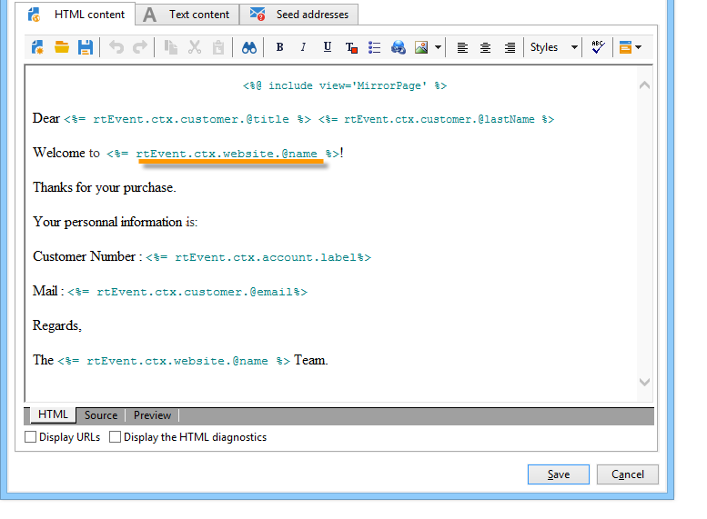

# Berichtinhoud maken{#creating-message-content}

De definitie van de inhoud van het transactiebericht is gelijk aan die voor normale leveringen in Adobe Campaign. Voor een e-maillevering kunt u bijvoorbeeld inhoud in HTML- of tekstindeling maken, bijlagen toevoegen of het bezorgingsobject aanpassen. Raadpleeg voor meer informatie het hoofdstuk over [e-maillevering](../../delivery/using/about-email-channel.md).

>[!CAUTION]
>
>Afbeeldingen in het bericht moeten openbaar toegankelijk zijn. Adobe Campagne biedt geen mechanisme voor het uploaden van afbeeldingen voor transactieberichten.\
>In tegenstelling tot JSSP of webApp, heeft `<%=` geen standaardescaping.
>
>In dit geval moet u alle gegevens die uit de gebeurtenis komen, op de juiste wijze verwijderen. Deze escape is afhankelijk van de manier waarop dit veld wordt gebruikt. Gebruik in een URL bijvoorbeeld encodeURIComponent. U kunt escapeXMLString gebruiken om in de HTML te worden weergegeven.

Zodra u uw berichtinhoud hebt bepaald, kunt u gebeurtenisinformatie in het berichtlichaam integreren en het personaliseren. Gebeurtenisgegevens worden via personalisatietags in de tekst ingevoegd.

* Alle verpersoonlijkingsgebieden komen van de lading.
* Het is mogelijk om één of verscheidene verpersoonlijkingsblokken in een transactiebericht van verwijzingen te voorzien. De blokinhoud wordt tijdens de publicatie aan de uitvoeringsinstantie toegevoegd aan de leveringsinhoud.

Voer de volgende stappen uit om personalisatietags in te voegen in de tekst van een e-mailbericht:

1. Klik in de berichtsjabloon op het tabblad dat overeenkomt met de e-mailindeling (HTML of tekst).
1. Voer de tekst van het bericht in.
1. Voeg in de tekst de tag in met behulp van de **[!UICONTROL Real time events>Event XML]** menu&#39;s.

   

1. Vul de tag in met de volgende syntaxis: naam **element**.@**kenmerknaam** , zoals hieronder wordt weergegeven.

   

