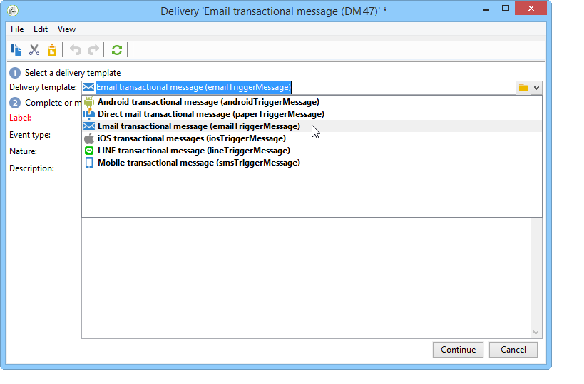

# Berichtsjabloon maken{#creating-the-message-template}

1. Ga naar de **[!UICONTROL Message Center >Transactional message templates]** map in de Adobe Campaign-structuur.
1. Klik in de lijst met transactiemalplaatjes met de rechtermuisknop en selecteer **[!UICONTROL New]** in het vervolgkeuzemenu of klik op de **[!UICONTROL New]** knop boven de lijst met transactionele berichtsjablonen.

   

1. Selecteer in het leveringsvenster de leveringssjabloon die geschikt is voor het kanaal dat u wilt gebruiken.

   

1. Wijzig indien nodig het label.
1. Selecteer het type gebeurtenis dat overeenkomt met het bericht dat u wilt verzenden.

   

   Gebeurtenistypen moeten vooraf in de console worden gemaakt. Zie Gebeurtenistypen [maken voor meer informatie hierover](../../message-center/using/creating-event-types.md).

   >[!NOTE]
   >
   >Een gebeurtenistype mag nooit aan meerdere sjablonen worden gekoppeld.

1. Ga een aard en een beschrijving in, dan klik **[!UICONTROL Continue]** om het berichtlichaam tot stand te brengen (verwijs naar het [Creëren van berichtinhoud](../../message-center/using/creating-message-content.md)).

   

