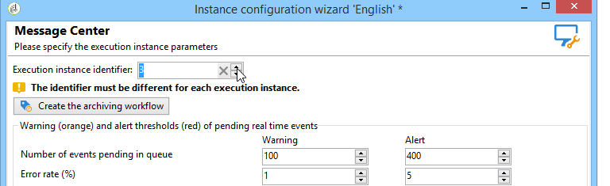

# Uitvoeringsinstanties identificeren{#identifying-execution-instances}

Een unieke herkenningsteken moet aan elke instantie worden toegewezen om de geschiedenis van elke uitvoeringsinstantie te onderscheiden wanneer u hen in de controleinstantie bekijkt. Deze stap is verplicht, zelfs als de controle- en uitvoeringsinstanties op dezelfde computer zijn geïnstalleerd. Dit herkenningsteken kan manueel op elke uitvoeringsinstantie, via de plaatsingstovenaar worden toegeschreven, of automatisch door de **Initialize verbindingsknoop** van de controleinstantie te klikken (zie de instantie [van de](../../message-center/using/creating-a-shared-connection.md#control-instance)Controle).

Als u handmatig een id wilt toewijzen, opent u de implementatietovenaar op elke uitvoeringsinstantie, gaat u naar het **[!UICONTROL Message Center]** venster en wijst u uw gekozen id toe aan de instantie.

