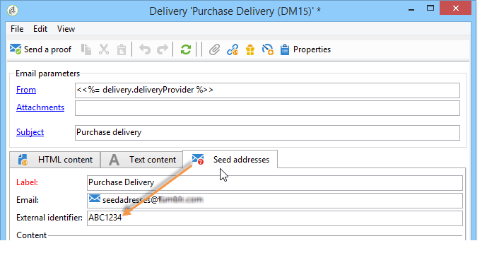

# Het beheren van zaadadressen in transactionele berichten{#managing-seed-addresses-in-transactional-messages}

Met een zaadadres kunt u een voorbeeld van uw bericht weergeven, een proefdruk verzenden en de personalisatie van testberichten vóór verzending via e-mail of SMS uitvoeren. De zaadadressen zijn verbonden met de levering en kunnen niet voor andere leveringen worden gebruikt.

## Een zaadadres maken {#creating-a-seed-address}

1. Klik in de transactiemalplaatje van het bericht, op het **[!UICONTROL Seed addresses]** lusje.

   

1. Wijs er een label aan toe zodat u het later gemakkelijk kunt selecteren.

   

1. Voer het zaadadres in (e-mail of mobiele telefoon, afhankelijk van het communicatiekanaal).

   

1. Voer de externe id in: in dit optionele veld kunt u een zakelijke sleutel invoeren (unieke id, naam + e-mail, enz.) Deze instelling geldt voor alle toepassingen op uw website die worden gebruikt om uw profielen te identificeren. Als dit veld ook aanwezig is in de marketingdatabase van Adobe Campagne, kunt u een gebeurtenis vervolgens afstemmen op een profiel in de database.

   

1. Voeg testgegevens in (zie [Persoonlijke gegevens](../../message-center/using/personalization-data.md)).

   

## Verschillende zaadadressen maken {#creating-several-seed-addresses}

1. Klik op de **[!UICONTROL Add other seed addresses]** koppeling en klik vervolgens op de **[!UICONTROL Add]** knop.

   

1. Volg de configuratiestappen voor een zaadadres dat in het [Creëren van een sectie van het zaadadres](#creating-a-seed-address) wordt gedetailleerd.
1. Herhaal dit proces om zoveel adressen te maken als u nodig hebt.

   

Zodra de adressen worden gecreeerd, kunt u hun voorproef en verpersoonlijking tonen. Zie [Transactiebericht voorvertonen](../../message-center/using/transactional-message-preview.md).
