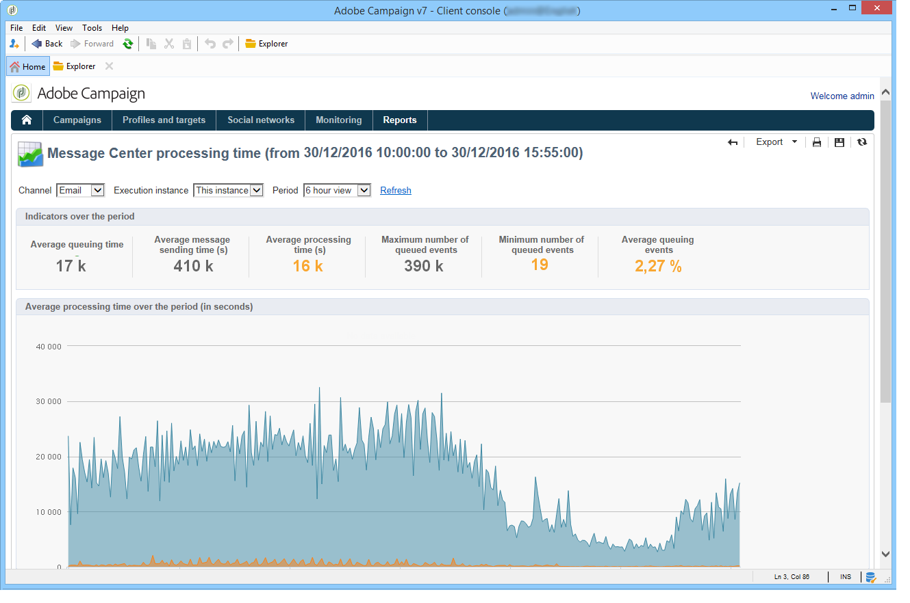

# Verwerkingstijd van Message Center{#message-center-processing-time}

Dit rapport geeft de belangrijkste indicatoren weer die betrekking hebben op de real-time wachtrij. Dit rapport, gericht op technische beheerders, kan ook via het **[!UICONTROL Monitoring]** universum in de controle instantie worden betreden.

Enkel zoals voor het **[!UICONTROL Message Center service level]** rapport, kunt u verkiezen om de algemene statistieken of die met betrekking tot een bepaalde uitvoeringsinstantie te tonen. U kunt de gegevens ook filteren op kanaal en over een bepaalde periode. De indicatoren in de **[!UICONTROL Indicators over the period]** sectie worden berekend over de geselecteerde periode:

* **[!UICONTROL Average queuing time]** : de gemiddelde tijd die met succes gebeurtenissen gebruikte in het Centrum van het Bericht verwerkte. Alleen de verwerkingstijd wordt in aanmerking genomen.
* **[!UICONTROL Average message sending time (s)]** : de gemiddelde tijd die met succes gebeurtenissen gebruikte in het Centrum van het Bericht verwerkte. Alleen de levertijd van de mta wordt in aanmerking genomen.
* **[!UICONTROL Average processing time (s)]** : de gemiddelde tijd die met succes gebeurtenissen gebruikte in het Centrum van het Bericht verwerkte. De berekening neemt de verwerkingstijd in aanmerking en de tijd die de gegevens verzenden.
* **[!UICONTROL Maximum number of queued events]** : maximumaantal gebeurtenissen aanwezig in de rij van het Centrum van het Bericht op om het even welk bepaald ogenblik.
* **[!UICONTROL Minimum number of queued events]** : minimumaantal gebeurtenissen aanwezig in de rij van het Centrum van het Bericht op om het even welk bepaald ogenblik.
* **[!UICONTROL Average number of queued events]** : gemiddeld aantal gebeurtenissen aanwezig in de rij van het Centrum van het Bericht op om het even welk bepaald ogenblik.

>[!NOTE]
>
>De drempelwaarden voor de waarschuwing (oranje) en de rode indicator kunnen worden geconfigureerd in de implementatiewizard van Adobe Campagne. Zie [Controledrempels](../../message-center/using/monitoring-thresholds.md).

