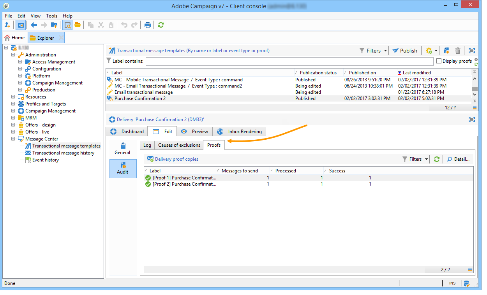

# Een proef verzenden{#sending-a-proof}

U kunt berichtlevering testen door een bewijs naar een eerder gecreeerd zaadadres te verzenden.

Het verzenden van een proef impliceert het zelfde proces zoals voor een regelmatige levering (voor meer op dit, verwijs naar [deze sectie](../../delivery/using/steps-validating-the-delivery.md#sending-a-proof)). Als u echter een bewijs wilt verzenden binnen Message Center, moet u de volgende bewerkingen vooraf uitvoeren:

* Creeer één of meerdere zaadadressen (verwijs naar [Het beheren van zaadadressen in transactionele berichten](../../message-center/using/managing-seed-addresses-in-transactional-messages.md)) met testgegevens (verwijs naar [Personalisatiegegevens](../../message-center/using/personalization-data.md)).
* Creeer de berichtinhoud (verwijs naar [Creërend berichtinhoud](../../message-center/using/creating-message-content.md)).

Het bewijs verzenden:

1. Klik op de knop **[!UICONTROL Send a proof]** in het leveringsvenster.
1. Analyseer de levering.
1. Corrigeer eventuele fouten en bevestig de levering.

   

1. Controleer of het bericht aan het zaadadres is bezorgd en of de inhoud ervan aan uw configuratie voldoet.

   

In elke sjabloon kunt u proefdrukken openen via het tabblad **[!UICONTROL Audit]**.

