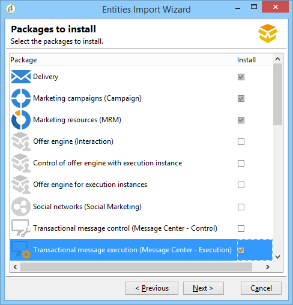

# Transactionele berichtenarchitectuur{#transactional-messaging-architecture}

## Informatie over uitvoerings- en besturingsinstanties {#about-execution-and-control-instances}

In de Campagne van Adobe, werden de transactionele overseinenmogelijkheden (die ook als Centrum van het Bericht worden bekend) ontworpen om scalability te steunen en de dienst te verlenen 24/7. Het bestaat uit verschillende gevallen:

* een controle-instantie waarin de berichtmalplaatjes worden gecreeerd;
* een of meer uitvoeringsinstanties die gebeurtenissen ontvangen en berichten leveren.

Om deze mogelijkheden te gebruiken, melden de gebruikers van de Campagne van Adobe aan de controleinstantie om transactionele berichtmalplaatjes tot stand te brengen, de berichtvoorproef te produceren gebruikend een zaadlijst, vertoningsrapporten en controleuitvoeringsinstanties.

De instanties van de uitvoering ontvangen gebeurtenissen, koppelen hen aan transactionele berichtmalplaatjes, en verzenden een gepersonaliseerd bericht naar elke ontvanger.


## Verschillende besturingsinstanties ondersteunen {#supporting-several-control-instances}

>[!CAUTION]
>
>Het delen van een uitvoeringscluster met verschillende besturingsinstanties wordt alleen ondersteund voor omgevingen op locatie.

Het is mogelijk om een uitvoeringscluster onder verscheidene controleinstanties te delen. Bijvoorbeeld, als u verscheidene gespecialiseerde opslag beheert, kunt u één controleinstantie per merk vormen en hen verbinden allen aan de zelfde uitvoeringscluster.


>[!NOTE]
>
>Voor meer op de noodzakelijke configuratie, verwijs naar het [Gebruiken van verscheidene controleinstanties](../../message-center/using/creating-a-shared-connection.md#using-several-control-instances).

## Instanties installeren {#installing-instances}

Er zijn verscheidene voorzorgsmaatregelen om te nemen wanneer het installeren van de Transactieberichtpakketten. Adobe raadt u aan in een testomgeving te werken voordat u de productie start. U hebt ook een compatibele Adobe Campaign-licentie nodig. Neem voor meer informatie contact op met de manager van uw Adobe-account.

>[!CAUTION]
>
>De bedieningsinstantie en de uitvoeringsinstantie(s) moeten op verschillende computers zijn geïnstalleerd. Ze kunnen niet dezelfde Campagne-instantie delen.

Als u meerdere kanalen moet gebruiken, moet u gerelateerde pakketten installeren en configureren voordat u Transactieberichtpakketten installeert. Zie Een [leveringskanaal](#adding-a-delivery-channel)toevoegen.

* Selecteer de **[!UICONTROL Transactional message control]** module om de besturingsinstantie op uw computer te installeren.

   

* Selecteer de **[!UICONTROL Transactional message execution]** module om de uitvoeringsinstantie op uw computer te installeren.

   

## Een leveringskanaal toevoegen {#adding-a-delivery-channel}

Een leveringskanaal toevoegen (mobiel kanaal, Mobile App-kanaal, enz.) moet worden uitgevoerd voordat het Transactiebericht-pakket wordt geïnstalleerd. Als u een transactie overseinenproject op het e-mailkanaal bent begonnen, dan besluit tijdens het project om een nieuw kanaal toe te voegen, moet u deze stappen volgen:

1. Installeer het kanaal dat u nodig hebt, bijvoorbeeld het **mobiele kanaal**, met de wizard voor het importeren van pakketten ( **[!UICONTROL Tools > Advanced > Import package... > Adobe Campaign Package]** ).
1. Voer een dossier uit de invoer ( **[!UICONTROL Tools > Advanced > Import package... > File]** ), en selecteer het ****`[Your language]`**datakitnmspackmanagementCenter.xml** - dossier.
1. Bewaar in de **[!UICONTROL XML content of the data to import]** map alleen de leveringssjabloon die overeenkomt met het toegevoegde kanaal. Als u bijvoorbeeld het **mobiele kanaal** hebt toegevoegd, houdt u alleen het element **entities** dat overeenkomt met het **[!UICONTROL Mobile transactional message]** (smsTriggerMessage). Als u het **Mobile App Channel** hebt toegevoegd, moet u alleen het **iOS-transactierbericht** (iosTriggerMessage) en het **Android-transactiebericht** (androidTriggerMessage) bewaren.

   

## Transactieberichten en binnenkomende interactie {#transactional-messages-and-inbound-interaction}

Wanneer gecombineerd met de Binnenkomende module van de Interactie, laat het transactieoverseinen u toe om een marketing aanbieding op te nemen die aan de ontvanger in het bericht wordt gewijd.

>[!NOTE]
>
>De module Interactie wordt beschreven in [Interactie](../../interaction/using/interaction-and-offer-management.md).

Om transactioneel overseinen met Interactie te gebruiken, moet u de volgende configuraties toepassen:

* Installeer het **Interaction** -pakket op de besturingsinstantie en configureer uw aanbiedingencatalogus.

   >[!CAUTION]
   >
   >Herhaal de aanbiedingen niet naar de uitvoeringsinstanties.

* De gebeurtenis moet een id bevatten die aan de ontvangers is gekoppeld, zodat u de aanbiedingen kunt aanpassen. Het **@externalId** -kenmerk moet de waarde van deze id bevatten. **De interactie** wordt gevormd door gebrek om de ontvanger van de primaire sleutel te identificeren:

   ```
   <rtEvent type="order_confirmation" email="john.doe@adobe.com" externalId="1242"> 
   ```

   U kunt **interactie** zodanig configureren dat identificatie plaatsvindt in het veld dat u kiest, bijvoorbeeld op het e-mailadres:

   ```
   <rtEvent type="order_confirmation" email="john.doe@adobe.com" externalId="john.doe@yahoo.com"> 
   ```

Maak uw leveringssjablonen op de manier die u gebruikt voor een e-mailcampagne:

* Voeg het voorstel toe aan je template voor transactieberichten.
* Controleer de voorvertoning, verzend een proefdruk en publiceer de sjabloon.

U moet ook de eenheidswijze op uw aanbiedingsruimten toelaten. Zie [deze sectie](../../interaction/using/creating-offer-spaces.md)voor meer informatie.

## Transactieberichten en pushmeldingen {#transactional-messaging-and-push-notifications}

In combinatie met de Mobile App Channel-module kunt u met een transactiebericht transactieberichten verzenden via meldingen op mobiele apparaten.

>[!NOTE]
>
>Het kanaal van de Mobiele App is gedetailleerd in [deze sectie](../../delivery/using/about-mobile-app-channel.md).

Als u transactiemodules voor berichten wilt gebruiken met Mobile App Channel, moet u de volgende configuraties toepassen:

1. Installeer het **Mobile App Channel** -pakket op de controle- en uitvoeringsinstanties.
1. Repliceer het type **mobiele toepassing** van Adobe Campagne-service en de mobiele toepassingen die deze service bevat op de uitvoeringsinstanties.

De gebeurtenis moet de volgende elementen bevatten:

* De id van het mobiele apparaat (**registrationId** voor Android en **deviceToken** voor iOS). Deze ID vertegenwoordigt het &quot;adres&quot;dat het bericht zal worden verzonden naar.
* De koppeling naar de mobiele toepassing of integratietoets (**uuid**) waarmee u verbindingsgegevens kunt herstellen die specifiek zijn voor de toepassing.
* Het kanaal waarnaar de kennisgeving wordt verzonden (**wishedChannel**): 41 voor iOS en 42 voor Android
* Alle gegevens die nuttig zijn voor personalisatie

Hier volgt een voorbeeld van een gebeurtenis die deze informatie bevat:

```
<SOAP-ENV:Envelope xmlns:xsd="http://www.w3.org/2001/XMLSchema" xmlns:xsi="http://www.w3.org/2001/XMLSchema-instance" xmlns:SOAP-ENV="http://schemas.xmlsoap.org/soap/envelope/">
   <SOAP-ENV:Body>
     <urn:PushEvent>
         <urn:sessiontoken>mc/</urn:sessiontoken>
         <urn:domEvent>

              <rtEvent wishedChannel="41" type="DELIVERY" registrationToken="2cefnefzef758398493srefzefkzq483974">
                <mobileApp _operation=”none” uuid="com.adobe.NeoMiles"/>
                <ctx>
                    <deliveryTime>1:30 PM</deliveryTime>
                    <url>http://www.adobe.com</url>
                </ctx>
              </rtEvent>

         </urn:domEvent>
     </urn:PushEvent>           
   </SOAP-ENV:Body>
</SOAP-ENV:Envelope>
```

>[!NOTE]
>
>Het maken van berichtsjablonen blijft hetzelfde.

## Transactieberichten en LIJN {#transactional-messaging-and-line}

In combinatie met het lijnkanaal kunt u met transactiemeldingen realtime berichten verzenden naar de LINE-app die is geïnstalleerd in mobiele apparaten voor consumenten. Dit wordt gebruikt om het Welkome bericht te verzenden wanneer een gebruiker van de LIJN de pagina van het merk toevoegt.

Om transactionele berichtmodule met LIJN te gebruiken, zijn de volgende elementen nodig voor de configuratie op uw **marketing** instantie en uw **uitvoerings** instantie:

* Installeer het **[!UICONTROL LINE Connect]** pakket op beide instanties.
* Installeer het **[!UICONTROL Transactional message control]** pakket op uw marketinginstantie en het **[!UICONTROL Transactional message execution]** pakket op de uitvoeringsinstantie.
* Maak een **externe LINE-account** en - **service** op beide instanties met dezelfde naam voor synchronisatie. Raadpleeg deze [pagina](../../delivery/using/line-channel.md#creating-a-line-account-and-an-external-account-)voor meer informatie over het maken van een externe LINE-account en -service.

Vervolgens moet u in het menu **[!UICONTROL Explorer]** , in **[!UICONTROL Platform]** > **[!UICONTROL External account]** , verschillende externe accounts configureren in beide gevallen:

1. Maak een **[!UICONTROL External database]** externe account in uw **uitvoeringsinstantie** met de volgende configuratie:

   

   * **[!UICONTROL Label]** en **[!UICONTROL Internal name]** : Geef uw externe account de naam die u nodig hebt.
   * **[!UICONTROL Type]** : selecteren **[!UICONTROL External database]** .
   * **[!UICONTROL Enabled]** moet worden ingeschakeld.
   Van de **[!UICONTROL Connection]** categorie:

   * **[!UICONTROL Type]** : Selecteer uw databaseserver, bijvoorbeeld PostgresSQL.
   * **[!UICONTROL Server]** : Voer de URL van de databaseserver in.
   * **[!UICONTROL Account]** : Voer uw databaseaccount in.

      >[!NOTE]
      >
      >De databasegebruiker moet leesrechten hebben voor de volgende tabellen voor FDA-verbinding: XtkOption, NmsVisitor, NmsVisitorSub, NmsService, NmsBroadLogRtEvent, NmsBroadLogBatchEvent, NmsTrackingLogRtEvent, NmsTrackingLogBatchEvent, NmsRtEvent, NmsBatchEvent, NmsBroad LogMsg, NmsTrackingUrl, NmsDelivery, NmsWebTrackingLogXtkFolder.

   * **[!UICONTROL Password]** : Voer het wachtwoord voor uw databaseaccount in.
   * **[!UICONTROL Database]** : Voer de databasenaam van de uitvoeringsinstantie in.
   * **[!UICONTROL Target of an HTTP relay to remote database's account]** moet worden ingeschakeld.


1. Maak een **[!UICONTROL External Database]** account in uw **marketingexemplaar** met de volgende configuratie.

   

   * **[!UICONTROL Label]** en **[!UICONTROL Internal name]** : Geef uw externe account de naam die u nodig hebt.
   * **[!UICONTROL Type]** : selecteren **[!UICONTROL External database]** .
   * Ingeschakelde doos moet worden gecontroleerd.
   Van de **[!UICONTROL Connection]** categorie:

   * **[!UICONTROL Type]** : selecteren **[!UICONTROL HTTP relay to remote Database]** .
   * **[!UICONTROL Server]** : Voer de server-URL van de uitvoeringsinstantie van uw campagne in.
   * **[!UICONTROL Account]** : Voer de account in die wordt gebruikt voor toegang tot uw uitvoeringsinstantie.
   * **[!UICONTROL Password]** : Voer het wachtwoord in voor de account die wordt gebruikt om toegang te krijgen tot uw uitvoeringsexemplaar.
   * **[!UICONTROL Data Source]** : Voer de volgende syntaxis in **[!UICONTROL nms:extAccount:ID of your external database account in the execution instance]** .


1. Maak een **[!UICONTROL Execution instance]** externe account in uw **marketinginstantie** met de volgende configuratie om de workflow voor gegevenssynchronisatie te maken:

   

   * **[!UICONTROL Label]** en **[!UICONTROL Internal name]** : Geef uw externe account de naam die u nodig hebt.
   * **[!UICONTROL Type]** : selecteren **[!UICONTROL Execution instance]** .
   * Ingeschakelde doos moet worden gecontroleerd.
   Van de **[!UICONTROL Connection]** categorie:

   * **[!UICONTROL URL]** : Voer de URL van de uitvoeringsinstantie in.
   * **[!UICONTROL Account]** : Voer uw account in die u gebruikt om toegang te krijgen tot uw uitvoeringsexemplaar.
   * **[!UICONTROL Password]** : Voer het wachtwoord in voor de account die wordt gebruikt om toegang te krijgen tot uw uitvoeringsexemplaar.
   Van de **[!UICONTROL Account connection method]** categorie:

   * **[!UICONTROL Method]** : selecteren **[!UICONTROL Federated Data Access (FDA)]** .
   * **[!UICONTROL FDA account]** : Selecteer uw FDA-account in de vervolgkeuzelijst.
   * Klik op de **[!UICONTROL Create the archiving workflow]** knop.
   * Klik op de **[!UICONTROL Create data synchronization workflow]** knop om de workflow voor het synchroniseren van LINE-gegevens te maken.


1. U kunt nu transactiemeldingen maken. Raadpleeg deze [pagina](../../message-center/using/introduction.md)voor meer informatie.
