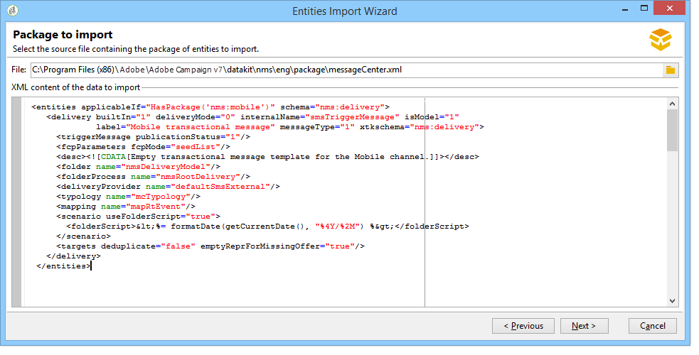

# Architectuur van transactionele berichten {#transactional-messaging-architecture}


Transactioneel overseinen baseert zich op een specifieke architectuur, die uit verscheidene gevallen bestaat:

* A **besturingsinstantie**, waarop de berichtsjablonen worden gemaakt.

* Een of meer **uitvoeringsinstanties**, die gebeurtenissen ontvangen en berichten leveren.


| Control-instantie | Uitvoeringsinstantie |
|--- |--- |
| Adobe Campaign-gebruikers melden zich aan bij de besturingsinstantie om: <ul><li>Transactieberichtsjablonen maken</li><li>De voorvertoning van een bericht genereren met behulp van een zaadlijst</li><li>Rapporten weergeven</li><li>De uitvoeringsinstanties controleren</li></ul> | Uitvoeringsinstanties zijn hier: <ul><li>Gebeurtenissen ontvangen</li><li>Koppel ze aan transactiemalplaatjes</li><li>Verzend een gepersonaliseerd bericht naar elke ontvanger</li></ul> |

## Instanties installeren {#installing-instances}

Er zijn verscheidene voorzorgsmaatregelen om te nemen wanneer het installeren van de Transactieberichtpakketten. Adobe raadt u aan in een testomgeving te werken voordat u de productie start. U hebt ook een compatibele Adobe Campaign-licentie nodig. Neem voor meer informatie contact op met de manager van uw Adobe-account.

>[!IMPORTANT]
>
>De bedieningsinstantie en de uitvoeringsinstantie(s) moeten op verschillende computers zijn geïnstalleerd. Ze kunnen niet dezelfde Campagne-instantie delen.

Als u meerdere kanalen moet gebruiken, moet u gerelateerde pakketten installeren en configureren voordat u Transactieberichtpakketten installeert. Zie voor meer informatie [Een leveringskanaal toevoegen](#adding-a-delivery-channel).

## Control-instantie {#control-instance}

Selecteer de optie **[!UICONTROL Transactional message control]** pakket via de **[!UICONTROL Tools]** > **[!UICONTROL Advanced]** > **[!UICONTROL Import package]** -menu. Zie voor meer informatie [Campaign Classic-standaardpakketten installeren](../../installation/using/installing-campaign-standard-packages.md).


De gedetailleerde stappen om de controleinstantie te vormen worden voorgesteld in [deze sectie](../../message-center/using/configuring-instances.md#control-instance).

### Verschillende besturingsinstanties ondersteunen {#supporting-several-control-instances}

>[!IMPORTANT]
>
>Het delen van een uitvoeringscluster met verschillende besturingsinstanties wordt alleen ondersteund voor omgevingen op locatie.

Het is mogelijk om een uitvoeringscluster onder verscheidene controleinstanties te delen. Bijvoorbeeld, als u verscheidene gespecialiseerde opslag beheert, kunt u één controleinstantie per merk vormen en hen verbinden allen aan de zelfde uitvoeringscluster.


>[!NOTE]
>
>Voor meer op de noodzakelijke configuratie, verwijs naar [Verschillende besturingsinstanties gebruiken](../../message-center/using/configuring-instances.md#using-several-control-instances).

## Uitvoeringsinstantie {#execution-instance}

Als u een uitvoeringsinstantie op uw computer wilt installeren, selecteert u de optie **[!UICONTROL Transactional message execution]** pakket via de **[!UICONTROL Tools]** > **[!UICONTROL Advanced]** > **[!UICONTROL Import package]** -menu. Zie voor meer informatie [Campaign Classic-standaardpakketten installeren](../../installation/using/installing-campaign-standard-packages.md).


De gedetailleerde stappen om een uitvoeringsinstantie te vormen worden voorgesteld in [deze sectie](../../message-center/using/configuring-instances.md#execution-instance).

## Beschikbare leveringskanalen

Het e-mailkanaal is standaard beschikbaar. Als u uw transactieberichten op meerdere kanalen wilt verzenden, kunt u andere kanalen toevoegen (mobiel kanaal, Mobile App-kanaal, enz.).

>[!IMPORTANT]
>
>Een leveringskanaal toevoegen (mobiel kanaal, Mobile App-kanaal, enz.) moet worden uitgevoerd voordat het Transactiebericht-pakket wordt geïnstalleerd.

### Een leveringskanaal toevoegen {#adding-a-delivery-channel}

Adobe raadt u aan **Voeg altijd het pakket van het leveringskanaal toe alvorens het Transactieberichtpakket te installeren**.

Nochtans, als u een transactie overseinenproject op het e-mailkanaal bent begonnen, dan besluit tijdens het project om een nieuw kanaal toe te voegen, kunt u de hieronder stappen volgen.

>[!NOTE]
>
>Deze procedure is alleen van toepassing op klanten die een Windows NLServer gebruiken die op dezelfde computer is geïnstalleerd als waarop zij werken.

1. Installeer het kanaal dat u nodig hebt, bijvoorbeeld de **Mobiel kanaal**, met de wizard Pakket importeren (**[!UICONTROL Tools > Advanced > Import package... > Adobe Campaign Package]**).
1. Een bestand importeren (**[!UICONTROL Tools > Advanced > Import package... > File]**) en selecteert u de **datakitnms **`[Your language]`**packageManagementCenter.xml** bestand.
1. In de **[!UICONTROL XML content of the data to import]**, slechts het leveringsmalplaatje houden dat aan het toegevoegde kanaal beantwoordt. Als u bijvoorbeeld de opdracht **Mobiel kanaal**, alleen de **entiteiten** element dat overeenkomt met het **[!UICONTROL Mobile transactional message]** (smsTriggerMessage). Als u de **Mobiel App-kanaal**, alleen de **Transactiebericht van iOS** (iosTriggerMessage) en de **Transactiebericht van Android** (androidTriggerMessage).

   

<!--## Transactional messages and inbound Interaction {#transactional-messages-and-inbound-interaction}

When combined with the Inbound Interaction module, transactional messaging enables you to insert a marketing offer dedicated to the recipient into the message.

>[!NOTE]
>
>The Interaction module is detailed in [Interaction](../../interaction/using/interaction-and-offer-management.md).

To use transactional messaging with Interaction, you need to apply the following configurations:

* Install the **Interaction** package onto the control instance and configure your offer catalog.

  >[!IMPORTANT]
  >
  >Do not replicate the offers onto the execution instances.

* The event must include an identifier linked to the recipients, for personalizing offers. The **@externalId** attribute must contain the value of this identifier. **Interaction** is configured by default to identify the recipient of the primary key:

  ```
  <rtEvent type="order_confirmation" email="john.doe@adobe.com" externalId="1242"> 
  ```

  You can configure **Interaction** so that identification takes place in the field of your choice, for example on the email address:

  ```
  <rtEvent type="order_confirmation" email="john.doe@adobe.com" externalId="john.doe@yahoo.com"> 
  ```

Create your delivery templates the way you would for an email campaign:

* Add the offer to your transactional message template.
* Check the preview, send a proof and publish the template.

You also have to enable the unitary mode on your offer spaces. For more on this, refer to [this section](../../interaction/using/creating-offer-spaces.md).-->

### Transactionele pushmeldingen {#transactional-messaging-and-push-notifications}

In combinatie met de Mobile App Channel-module kunt u met een transactiebericht transactieberichten verzenden via meldingen op mobiele apparaten.

>[!NOTE]
>
>Het Mobile App-kanaal wordt gedetailleerd in [deze sectie](../../delivery/using/about-mobile-app-channel.md).

Als u transactiemodules voor berichten wilt gebruiken met Mobile App Channel, moet u de volgende configuraties toepassen:

1. Installeer de **Mobiel App-kanaal** verpakken op de controle en uitvoeringsinstanties.
1. Repliceer de **Mobiele toepassing** Typ de Adobe Campaign-service en de mobiele toepassingen die deze bevat op de uitvoeringsinstanties.

De gebeurtenis moet de volgende elementen bevatten:

* De mobiele apparaat-id (**registrationId** voor Android en **deviceToken** voor iOS). Deze ID vertegenwoordigt het &quot;adres&quot;dat het bericht zal worden verzonden naar.
* De koppeling naar de mobiele toepassing of integratietoets (**uuid**) waarmee u verbindingsgegevens kunt herstellen die specifiek zijn voor de toepassing.
* Het kanaal waarnaar de melding wordt verzonden (**wishedChannel**): 41 voor iOS en 42 voor Android
* Alle gegevens die nuttig zijn voor personalisatie

Hier volgt een voorbeeld van een gebeurtenis die deze informatie bevat:

```
<SOAP-ENV:Envelope xmlns:xsd="http://www.w3.org/2001/XMLSchema" xmlns:xsi="http://www.w3.org/2001/XMLSchema-instance" xmlns:SOAP-ENV="http://schemas.xmlsoap.org/soap/envelope/">
   <SOAP-ENV:Body>
     <urn:PushEvent>
         <urn:sessiontoken>mc/</urn:sessiontoken>
         <urn:domEvent>

              <rtEvent wishedChannel="41" type="DELIVERY" registrationToken="2cefnefzef758398493srefzefkzq483974">
                <mobileApp _operation=”none” uuid="com.adobe.NeoMiles"/>
                <ctx>
                    <deliveryTime>1:30 PM</deliveryTime>
                    <url>http://www.adobe.com</url>
                </ctx>
              </rtEvent>

         </urn:domEvent>
     </urn:PushEvent>           
   </SOAP-ENV:Body>
</SOAP-ENV:Envelope>
```

>[!NOTE]
>
>Het maken van berichtsjablonen blijft hetzelfde.

### Transactieberichten en LIJN {#transactional-messaging-and-line}

In combinatie met het lijnkanaal kunt u met transactiemeldingen realtime berichten verzenden naar de LINE-app die is geïnstalleerd in mobiele apparaten voor consumenten. Dit wordt gebruikt om het Welkome bericht te verzenden wanneer een gebruiker van de LIJN de pagina van het merk toevoegt.

Om transactionele berichtmodule met LIJN te gebruiken, zijn de volgende elementen nodig voor de configuratie op uw **marketing** -instantie en uw **uitvoering** instantie:

* Installeer de **[!UICONTROL LINE Connect]** op beide instanties.
* Installeer de **[!UICONTROL Transactional message control]** pakket op uw marketingexemplaar, en **[!UICONTROL Transactional message execution]** in de uitvoeringsinstantie.
* Een LIJN maken **externe rekening** en **service** op beide instanties met identieke naamgeving voor synchronisatie. Voor meer informatie over hoe te om een externe rekening en de dienst van de LIJN tot stand te brengen, verwijs naar [deze sectie](../../delivery/using/line-channel.md#setting-up-line-channel).

Dan, van **[!UICONTROL Explorer]** , in **[!UICONTROL Platform]** > **[!UICONTROL External account]** , moet u verschillende externe rekeningen op beide instanties vormen:

1. Een **[!UICONTROL External database]** externe account in uw **uitvoering** instantie met de volgende configuratie:

   

   * **[!UICONTROL Label]** en **[!UICONTROL Internal name]** : Geef uw externe account de naam die u nodig hebt.
   * **[!UICONTROL Type]** : selecteren **[!UICONTROL External database]** .
   * **[!UICONTROL Enabled]** moet worden ingeschakeld.

   Van de **[!UICONTROL Connection]** categorie:

   * **[!UICONTROL Type]** : Selecteer uw databaseserver, bijvoorbeeld PostgresSQL.
   * **[!UICONTROL Server]** : Voer de URL van de databaseserver in.
   * **[!UICONTROL Account]** : Voer uw databaseaccount in.

      >[!NOTE]
      >
      >De databasegebruiker moet leesrechten hebben voor de volgende tabellen voor FDA-verbinding: XtkOption, NmsVisitor, NmsVisitorSub, NmsService, NmsBroadLogRtEvent, NmsBroadLogBatchEvent, NmsTrackingLogRtEvent, NmsTrackingLogBatchEvent, NmsRtEvent, NmsBatchEvent, NmsBroad LogMsg, NmsTrackingUrl, NmsDelivery, NmsWebTrackingLogXtkFolder.

   * **[!UICONTROL Password]** : Voer het wachtwoord voor uw databaseaccount in.
   * **[!UICONTROL Database]** : Voer de databasenaam van de uitvoeringsinstantie in.
   * **[!UICONTROL Target of an HTTP relay to remote database's account]** moet worden ingeschakeld.


1. Een **[!UICONTROL External Database]** account in uw **marketing** instantie met de volgende configuratie.

   

   * **[!UICONTROL Label]** en **[!UICONTROL Internal name]** : Geef uw externe account de naam die u nodig hebt.
   * **[!UICONTROL Type]** : selecteren **[!UICONTROL External database]** .
   * Ingeschakelde doos moet worden gecontroleerd.

   Van de **[!UICONTROL Connection]** categorie:

   * **[!UICONTROL Type]** : selecteren **[!UICONTROL HTTP relay to remote Database]** .
   * **[!UICONTROL Server]** : Voer de server-URL van de uitvoeringsinstantie van uw campagne in.
   * **[!UICONTROL Account]** : Voer de account in die wordt gebruikt voor toegang tot uw uitvoeringsinstantie.
   * **[!UICONTROL Password]** : Voer het wachtwoord in voor de account die wordt gebruikt om toegang te krijgen tot uw uitvoeringsexemplaar.
   * **[!UICONTROL Data Source]** : Voer de volgende syntaxis in **[!UICONTROL nms:extAccount:ID of your external database account in the execution instance]** .


1. Een **[!UICONTROL Execution instance]** externe account in uw **marketing** instantie die de volgende configuratie gebruikt om het werkschema van de gegevenssynchronisatie tot stand te brengen:

   

   * **[!UICONTROL Label]** en **[!UICONTROL Internal name]** : Geef uw externe account de naam die u nodig hebt.
   * **[!UICONTROL Type]** : selecteren **[!UICONTROL Execution instance]** .
   * Ingeschakelde doos moet worden gecontroleerd.

   Van de **[!UICONTROL Connection]** categorie:

   * **[!UICONTROL URL]** : Voer de URL van de uitvoeringsinstantie in.
   * **[!UICONTROL Account]** : Voer uw account in die u gebruikt om toegang te krijgen tot uw uitvoeringsexemplaar.
   * **[!UICONTROL Password]** : Voer het wachtwoord in voor de account die wordt gebruikt om toegang te krijgen tot uw uitvoeringsexemplaar.

   Van de **[!UICONTROL Account connection method]** categorie:

   * **[!UICONTROL Method]** : selecteren **[!UICONTROL Federated Data Access (FDA)]** .
   * **[!UICONTROL FDA account]** : Selecteer uw FDA-account in de vervolgkeuzelijst.
   * Klik op de knop **[!UICONTROL Create the archiving workflow]**.
   * Klik op de knop **[!UICONTROL Create data synchronization workflow]** om de workflow voor het synchroniseren van LINE-gegevens te maken.


1. U kunt nu beginnen [transactieberichten maken](../../message-center/using/creating-the-message-template.md).
