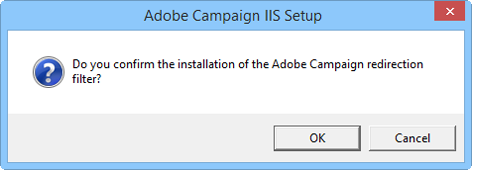
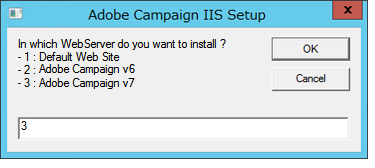
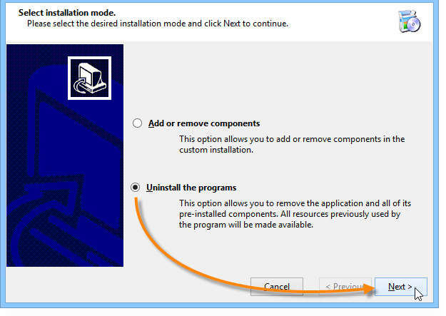

# Migreren in Windows voor Adobe-campagne 7{#migrating-in-windows-for-adobe-campaign}

## Algemene procedure {#general-procedure}

Voor Windows zijn de migratiestappen als volgt:

1. Stopservices: verwijzen naar [servicestop](#service-stop);
1. Back-up maken van de database: verwijzen naar [Back-up van de database en de huidige installatie](#back-up-the-database-and-the-current-installation);
1. Het platform migreren: raadpleeg [Adobe Campagne v7](#deploying-adobe-campaign-v7)implementeren.
1. Migreer de omleidingsserver (IIS): verwijs naar het [Migreren van de redirection server (IIS)](#migrating-the-redirection-server--iis-),
1. Herstart service: verwijzen naar het [opnieuw opstarten van de diensten](#re-starting-the-services);
1. Vorige versie van Adobe Campagne verwijderen en verwijderen: raadpleeg de vorige versie [](#deleting-and-cleansing-adobe-campaign-previous-version)van Adobe Campagne verwijderen en opschonen.

## Servicestop {#service-stop}

In de eerste plaats moeten alle processen met toegang tot de database op alle betrokken machines worden stopgezet.

1. Alle servers die gebruikmaken van de omleidingsmodule (**webmdl** -service) moeten worden gestopt. Voer voor IIS de volgende opdracht uit:

   ```
   iisreset /stop
   ```

1. De **mta** module en zijn kindmodules (**mtachild**) moeten worden tegengehouden gebruikend de volgende bevelen:

   ```
   nlserver stop mta@<instance name>
   nlserver stop mtachild@<instance name>
   ```

1. Stop de Adobe Campagne-services op alle servers. Meld u aan met beheerdersrechten en voer de volgende opdracht uit:

   ```
   net stop nlserver6
   ```

   Als u migreert op basis van versie 5.11, voert u de volgende opdracht uit:

   ```
   net stop nlserver5
   ```

1. Controleer voor elke server of Adobe Campagne-services correct is gestopt. Meld u aan met beheerdersrechten en voer de volgende opdracht uit:

   ```
   tasklist /FI "IMAGENAME eq nlserver*"
   ```

   De lijst met actieve processen wordt samen met hun id (PID) weergegeven.

   ```
   Image Name                     PID Session Name        Session#    Mem Usage
   ========================= ======== ================ =========== ============
   nlserver.exe                  3192 Console                    1     13,108 K
   ```

1. Als een of meer Adobe Campagne-processen na een paar minuten nog actief zijn of geblokkeerd zijn, kunt u ze doden. Meld u aan met beheerdersrechten en voer de volgende opdracht uit:

   ```
   taskkill /IM nlserver* /T
   ```

1. Als sommige processen na een paar minuten nog actief zijn, kunt u ze dwingen te sluiten met de opdracht:

   ```
   taskkill /F /IM nlserver* /T
   ```

## Maak een back-up van de database en de huidige installatie {#back-up-the-database-and-the-current-installation}

De procedure is afhankelijk van de vorige versie van uw Adobe-campagne.

### Migreren van Adobe Campaign v5.11 {#migrating-from-adobe-campaign-v5-11}

1. Maak een back-up van de Adobe Campaign-database.
1. Maak een back-up van de **Neolane v5** -map met de volgende opdracht:

   ```
   ren "Neolane v5" "Neolane v5.back"
   ```

   >[!CAUTION]
   >
   >We raden u uit voorzorg aan de map **Neolane v5.back** te comprimeren en op een andere veilige locatie dan de server op te slaan.

1. Schakel in de beheerconsole voor Windows-services het automatisch opstarten van de 5.11-service van de toepassingsserver uit. U kunt ook de volgende opdracht gebruiken:

   ```
   sc config nlserver5 start= disabled
   ```

1. Bewerk het bestand **config-`<instance name>`.xml** (in **Neolane v5. back** folder) om **mta**, **wfserver**, **staat**, enz. te verhinderen. services worden automatisch gestart. Vervang bijvoorbeeld **autoStart** door **_autoStart**.

   ```
   <?xml version='1.0'?>
   <serverconf>
     <shared>
       <dataStore hosts="myServer*" lang="en_US">
         <dataSource name="default">
           <dbcnx encrypted="1" login="myLogin" password="myPassword"  provider="postgresql" server="myServer"/>
         </dataSource>
       </dataStore>
     </shared>
   
     <mta _autoStart="true" statServerAddress="myStatServer"/>
     <stat _autoStart="true"/>
     <wfserver _autoStart="true"/>
     <inMail _autoStart="true"/>
     <sms _autoStart="false"/>
   </serverconf>
   ```

### Migreren van Adobe Campaign v6.02 {#migrating-from-adobe-campaign-v6-02}

1. Maak een back-up van de Adobe Campaign-database.
1. Maak een back-up van de map **Neolane v6** met de volgende opdracht:

   ```
   ren "Neolane v6" "Neolane v6.back"
   ```

   >[!CAUTION]
   >
   >We raden u uit voorzorg aan de map **Neolane v6.back** te comprimeren en op een andere veilige locatie dan de server op te slaan.

1. In de de dienstmanager van Vensters, deactiveer het automatische opstarten van de 6.02 toepassingsserver. U kunt ook de volgende opdracht gebruiken:

   ```
   sc config nlserver6 start= disabled
   ```

1. Bewerk het bestand **config-`<instance name>`.xml** (in **Neolane v6. back** folder) om **mta**, **wfserver**, **staat**, enz. te verhinderen. services worden automatisch gestart. Vervang bijvoorbeeld **autoStart** door **_autoStart**.

   ```
   <?xml version='1.0'?>
   <serverconf>
     <shared>
       <dataStore hosts="myServer*" lang="en_US">
         <dataSource name="default">
           <dbcnx encrypted="1" login="myLogin" password="myPassword" provider="postgresql" server="myServer"/>
         </dataSource>
       </dataStore>
     </shared>
   
     <mta _autoStart="true" statServerAddress="myStatServer"/>
     <stat _autoStart="true"/>
     <wfserver _autoStart="true"/>
     <inMail _autoStart="true"/>
     <sms _autoStart="false"/>
   </serverconf>
   ```

### Migreren van Adobe-campagne v6.1 {#migrating-from-adobe-campaign-v6-1}

1. Maak een back-up van de Adobe Campaign-database.
1. Maak een back-up van de map **Adobe Campaign v6** met de volgende opdracht:

   ```
   ren "Adobe Campaign v6" "Adobe Campaign v6.back"
   ```

   >[!CAUTION]
   >
   >We raden u uit voorzorg aan de map **Adobe Campaign v6.back** te comprimeren en deze op een andere veilige locatie dan de server op te slaan.

1. Schakel in de beheerconsole voor Windows-services het automatisch opstarten van de 6.11-service van de toepassingsserver uit. U kunt ook de volgende opdracht gebruiken:

   ```
   sc config nlserver6 start= disabled
   ```

## Adobe Campagne v7 implementeren {#deploying-adobe-campaign-v7}

Het implementeren van Adobe Campaign bestaat uit twee fasen:

* Build v7 installeren: deze bewerking moet op elke server worden uitgevoerd.
* De postupgrade: deze opdracht moet voor elke instantie worden gestart.

Voer de volgende stappen uit om Adobe Campaign te implementeren:

1. Installeer de meest recente Adobe Campagne v7-build door het installatiebestand **setup.exe** uit te voeren. Raadpleeg [deze sectie](../../installation/using/installing-the-server.md)voor meer informatie over het installeren van de Adobe-campagneserver in Windows.

   

   >[!NOTE]
   >
   >Adobe Campagne v7 wordt standaard geïnstalleerd in de map **C:\Program Files\Adobe\Adobe Campaign v7** .

1. Als u het installatieprogramma voor de clientconsole beschikbaar wilt maken, kopieert u het bestand **setup-client-7.0.XXXX.exe** naar de installatiemap van Adobe Campagne: **C:\Program Files\Adobe\Adobe Campaign v7\datakit\nl\eng\jsp**.

   >[!NOTE]
   >
   >Raadpleeg [deze sectie](../../installation/using/installing-the-server.md)voor meer informatie over het installeren van Adobe Campaign in Windows.

1. Start de instantie voor het eerste gebruik met de volgende opdrachten:

   ```
   net start nlserver6-v7
   net stop nlserver6-v7
   ```

   >[!NOTE]
   >
   >Met deze opdrachten kunt u het interne bestandssysteem van Adobe Campagne v7 maken: **conf** directory (met de bestanden **config-default.xml** en **serverConf.xml** ), **var** directory, enz.

1. Kopieer en plak (overschrijf) de configuratiebestanden en submappen van elke instantie via het back-upbestand van **Neolane v5.back**, **Neolane v6.back** of **Adobe Campaign v6.back** (afhankelijk van de versie waaruit u migreert - zie [deze sectie](#back-up-the-database-and-the-current-installation)).
1. Afhankelijk van de versie waaruit u migreert, voert u de volgende opdrachten uit:

   ```
   copy "Neolane v5.back"/conf/config-<instance name>.xml "Adobe Campaign v7"/conf/
   copy "Neolane v5.back"/customers/* "Adobe Campaign v7"/customers/
   copy "Neolane v5.back"/var/* "Adobe Campaign v7"/var/
   ```

   ```
   copy "Neolane v6.back"/conf/config-<instance name>.xml "Adobe Campaign v7"/conf/
   copy "Neolane v6.back"/customers/* "Adobe Campaign v7"/customers/
   copy "Neolane v6.back"/var/* "Adobe Campaign v7"/var/
   ```

   ```
   copy "Adobe Campaign v6.back"/conf/config-<instance name>.xml "Adobe Campaign v7"/conf/
   copy "Adobe Campaign v6.back"/customers/* "Adobe Campaign v7"/customers/
   copy "Adobe Campaign v6.back"/var/* "Adobe Campaign v7"/var/
   ```

   >[!CAUTION]
   >
   >Kopieer voor de eerste opdracht hierboven het bestand **config-default.xml** niet.

1. Pas in de bestanden **serverConf.xml** en **config-default.xml** van Adobe Campaign v7 de specifieke configuraties toe die u in de vorige versie van Adobe Campagne had. Voor het bestand **serverConf.xml** gebruikt u het bestand **Neolane v5/conf/serverConf.xml.diff**, **Neolane v6/conf/serverConf.xml.diff** of **Adobe Campaign v6/conf/serverConf.xml.diff** .

   >[!NOTE]
   >
   >Wanneer u configuraties van de vorige versie van Adobe Campagne meldt aan Adobe Campaign v7, moet u ervoor zorgen dat de paden naar de fysieke mappen leiden tot Adobe Campaign v7 (en niet tot Neolane v5, Neolane v6 of Adobe Campaign v6).

1. Laad de configuratie van Adobe Campagne v7 opnieuw gebruikend het volgende bevel:

   ```
   nlserver config -reload
   ```

1. Begin het postupgrade proces gebruikend het volgende bevel:

   ```
   nlserver config -postupgrade -instance:<instance name>
   ```

>[!CAUTION]
>
>Start Adobe Campagne-services nog niet: op IIS moeten enkele wijzigingen worden aangebracht.

## De omleidingsserver (IIS) migreren {#migrating-the-redirection-server--iis-}

In dit stadium, moet de server IIS worden tegengehouden. Raadpleeg de [servicestop](#service-stop).

1. Open de **beheerconsole van de Manager** van de Informatie van Internet (IIS).
1. Wijzig de bindingen (listen-poorten) van de site die wordt gebruikt voor de vorige versie van Adobe Campagne:

   * Klik met de rechtermuisknop op de site die is gebruikt voor de vorige versie van Adobe Campagne en selecteer **[!UICONTROL Edit bindings]**.
   * Voor elk type van luisterhaven (**[!UICONTROL http]** en/of **[!UICONTROL https]**), selecteer de aangewezen lijn en klik **[!UICONTROL Edit]**.
   * Voer een andere poort in. Standaard is de listen-poort 80 voor http en 443 voor https. Controleer of de nieuwe poort beschikbaar is.

      

      >[!NOTE]
      >
      >Als uw IIS-server meerdere websites voor Adobe Campaign bevat met een geavanceerde configuratie (gedeelde poort en verschillende IP-adressen), neemt u contact op met de beheerder.

1. Maak een nieuwe website voor Adobe Campaign v7:

   * Klik met de rechtermuisknop op de **[!UICONTROL Sites]** map en selecteer **[!UICONTROL Add Web Site...]**.

      

   * Voer de naam van de site in, bijvoorbeeld **Adobe Campaign v7** .
   * Het toegangspad naar de basismap van de website wordt niet gebruikt, maar het **[!UICONTROL Physical access path]** veld moet worden ingevoerd. Voer het standaard IIS-toegangspad in: **C:\inetpub\wwwroot**.
   * Klik op de knop **[!UICONTROL Connect as...]** Als en controleer of de **[!UICONTROL Application user]** optie is geselecteerd.
   * U kunt de standaardwaarden in de velden **[!UICONTROL IP address]** en in de **[!UICONTROL Port]** velden handhaven. Als u andere waarden wilt gebruiken, zorg ervoor het IP adres en/of de haven beschikbaar zijn.
   * Schakel het **[!UICONTROL Start Web site immediately]** selectievakje in.

      

1. Voer het script **is_neolane_setup.vbs** uit om de bronnen die door de Adobe-campagneserver worden gebruikt, automatisch te configureren in de eerder gemaakte virtuele map.

   * Dit bestand staat op **`[Adobe Campaign v7]`\tomcat-7\conf file ****`[Adobe Campaign v7]`**, het toegangspad naar de installatiemap van Adobe Campaign. De opdracht voor het uitvoeren van het script is als volgt (voor beheerders):

      ```
      cd C:\Program Files (x86)\Adobe Campaign\Adobe Campaign v7\tomcat-7\conf
      cscript iis_neolane_setup.vbs
      ```

   * Klik **[!UICONTROL OK]** om de uitvoering van het script te bevestigen.

      

   * Voer het nummer in van de website die u eerder voor Adobe Campagne v7 hebt gemaakt en klik op **[!UICONTROL OK]**.

      

   * Er moet een bevestigingsbericht verschijnen:

      

   * Controleer in het **[!UICONTROL Content view]** tabblad of de configuratie van de website correct is geconfigureerd met de Adobe-campagnebronnen:

      

      >[!NOTE]
      >
      >Als de boomstructuur niet wordt getoond, begin IIS opnieuw.
      >
      >De volgende IIS configuratiestappen zijn gedetailleerd in [deze sectie](../../installation/using/integration-into-a-web-server-for-windows.md#configuring-the-iis-web-server).

## Beveiligingszones {#security-zones}

Als u vanaf v6.02 of eerder migreert, moet u uw veiligheidsstreken vormen alvorens de diensten te beginnen. Raadpleeg [Beveiliging](../../migration/using/general-configurations.md#security)voor meer informatie.

## De services opnieuw starten {#re-starting-the-services}

Start IIS en Adobe Campagne op elk van de volgende servers:

1. Tracking and redirection server.
1. Midden-sourcingserver.
1. Marketingsserver.

Voordat u verdergaat met de volgende stap, voert u een volledige test van de nieuwe installatie uit. Zorg ervoor dat er geen regressies zijn en dat alles werkt door alle aanbevelingen in de sectie [Algemene configuraties](../../migration/using/general-configurations.md) op te volgen.

## Verwijderen en opschonen van de vorige versie van Adobe Campagne {#deleting-and-cleansing-adobe-campaign-previous-version}

De procedure is afhankelijk van de vorige versie van uw Adobe-campagne.

### Adobe Campagne v5 {#adobe-campaign-v5}

Voordat u de installatie van Adobe Campagne v5 verwijdert en wist, moet u de volgende aanbevelingen uitvoeren:

* Krijg de functionele teams om een volledige controle van de nieuwe installatie in werking te stellen.
* Verwijder Adobe Campagne v5 alleen als u zeker weet dat u het programma niet hoeft terug te draaien.

1. Verwijder in IIS de **Neolane v5** -website en daarna de toepassingspool **Neolane v5** .
1. Wijzig de naam van de map **Neolane v5.back** in **Neolane v5**.
1. Verwijder Adobe Campagne v5 met de wizard Componenten toevoegen/verwijderen.

   

1. Verwijder de service **nlserver5** Windows met de volgende opdracht:

   ```
   sc delete nlserver5
   ```

1. Start de server opnieuw.

### Adobe-campagne v6.02 {#adobe-campaign-v6-02}

Voordat u de installatie van Adobe Campagne versie 6.02 verwijdert en wist, moet u de volgende aanbevelingen uitvoeren:

* Krijg de functionele teams om een volledige controle van de nieuwe installatie in werking te stellen.
* Verwijder Adobe Campagne v6.02 alleen als u zeker weet dat u het programma niet hoeft terug te draaien.

1. Verwijder in IIS de **Neolane v6** -website en daarna de toepassingspool **Neolane v6** .
1. Wijzig de naam van de map **Neolane v6.back** in **Neolane v6**.
1. Verwijder Adobe Campagne v6.02 met de wizard Componenten toevoegen/verwijderen.

   

1. Start de server opnieuw.

### Adobe-campagne v6.1 {#adobe-campaign-v6-1}

Voordat u de installatie van Adobe Campaign v6 verwijdert en wist, moet u de volgende aanbevelingen uitvoeren:

* Krijg de functionele teams om een volledige controle van de nieuwe installatie in werking te stellen.
* Verwijder Adobe Campagne v6 alleen als u zeker weet dat u het programma niet hoeft terug te draaien.

1. Verwijder in IIS de website **Adobe Campaign v6** en daarna de toepassingspool van **Adobe Campaign v6** .
1. Wijzig de naam van de map **Adobe Campaign v6.back** in **Adobe Campaign v6**.
1. Verwijder Adobe Campagne v6 met de wizard Componenten toevoegen/verwijderen.

   

1. Start de server opnieuw.

