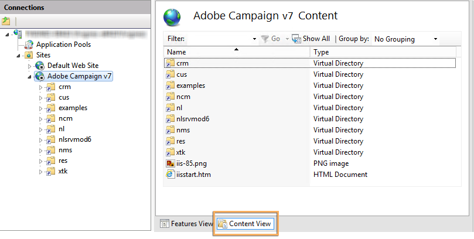

# Een Microsoft Windows-platform migreren naar Campagne v7{#migrating-in-windows-for-adobe-campaign}


Voor een Microsoft Windows-omgeving zijn de migratiestappen als volgt:

1. Stop alle services - [Meer informatie](#service-stop).
1. Maak een back-up van uw database - [Meer informatie](#back-up-the-database).
1. Het platform migreren - [Meer informatie](#deploying-adobe-campaign-v7).
1. De omleidingsserver (IIS) migreren - [Meer informatie](#migrating-the-redirection-server--iis-).
1. Service opnieuw starten - [Meer informatie](#re-starting-the-services).
1. Vorige Adobe Campaign-versie verwijderen en opschonen - [Meer informatie](#deleting-and-cleansing-adobe-campaign-previous-version).

## Servicestop {#service-stop}

In de eerste plaats moeten alle processen met toegang tot de database op alle betrokken machines worden stopgezet.

1. Alle servers die de omleidingsmodule gebruiken (**webmdl** service) moet worden gestopt. Voer voor IIS de volgende opdracht uit:

   ```
   iisreset /stop
   ```

1. De **mta** de module en zijn kindmodules (**mtachild**) moet worden gestopt met behulp van de volgende opdrachten:

   ```
   nlserver stop mta@<instance name>
   nlserver stop mtachild@<instance name>
   ```

1. Stop Adobe Campaign services op alle servers. Meld u aan met beheerdersrechten en voer de volgende opdracht uit:

   ```
   net stop nlserver6
   ```

<!--

   If you are migrating from v5.11, run the following command:

   ```
   net stop nlserver5
   ```

-->

1. Controleer voor elke server of de Adobe Campaign-services correct zijn gestopt. Meld u aan met beheerdersrechten en voer de volgende opdracht uit:

   ```
   tasklist /FI "IMAGENAME eq nlserver*"
   ```

   De lijst met actieve processen wordt samen met hun id (PID) weergegeven.

   ```
   Image Name                     PID Session Name        Session#    Mem Usage
   ========================= ======== ================ =========== ============
   nlserver.exe                  3192 Console                    1     13,108 K
   ```

1. Als een of meer Adobe Campaign-processen na een paar minuten nog actief zijn of geblokkeerd zijn, moet u ze doden. Meld u aan met beheerdersrechten en voer de volgende opdracht uit:

   ```
   taskkill /IM nlserver* /T
   ```

1. Als sommige processen na een paar minuten nog actief zijn, kunt u ze dwingen te sluiten met de opdracht:

   ```
   taskkill /F /IM nlserver* /T
   ```

## Back-ups maken van uw Campagne-database {#back-up-the-database}

Hier volgt de procedure voor het maken van back-ups van Adobe Campaign v6.1.

<!--

### For Adobe Campaign v5.11 {#migrating-from-adobe-campaign-v5-11}

1. Make a backup of the Adobe Campaign database.
1. Make a backup of the **Neolane v5** directory using the following command:

   ```
   ren "Neolane v5" "Neolane v5.back"
   ```

   >[!IMPORTANT]
   >
   >As a precaution, we recommend that you zip the **Neolane v5.back** folder and save it elsewhere in a safe location other than the server.

1. In the windows service management console, disable the automatic startup of the 5.11 application server service. You can also use the following command:

   ```
   sc config nlserver5 start= disabled
   ```

1. Edit the **config-`<instance name>`.xml** (in the **Neolane v5. back** folder) to prevent the **mta**, **wfserver**, **stat**, etc. services from starting automatically. For instance, replace **autoStart** with **_autoStart**.

   ```
   <?xml version='1.0'?>
   <serverconf>
     <shared>
       <dataStore hosts="myServer*" lang="en_US">
         <dataSource name="default">
           <dbcnx encrypted="1" login="myLogin" password="myPassword"  provider="postgresql" server="myServer"/>
         </dataSource>
       </dataStore>
     </shared>
   
     <mta _autoStart="true" statServerAddress="myStatServer"/>
     <stat _autoStart="true"/>
     <wfserver _autoStart="true"/>
     <inMail _autoStart="true"/>
     <sms _autoStart="false"/>
   </serverconf>
   ```

-->

<!--
### For Adobe Campaign v6.02 {#migrating-from-adobe-campaign-v6-02}

1. Make a backup of the Adobe Campaign database.
1. Make a backup of the **Neolane v6** directory using the following command:

   ```
   ren "Neolane v6" "Neolane v6.back"
   ```

   >[!IMPORTANT]
   >
   >As a precaution, we recommend that you zip the **Neolane v6.back** folder and save it elsewhere in a safe location other than the server.

1. In the Windows service manager, deactivate the 6.02 application server automatic startup. You can also use the following command:

   ```
   sc config nlserver6 start= disabled
   ```

1. Edit the **config-`<instance name>`.xml** (in the **Neolane v6. back** folder) to prevent the **mta**, **wfserver**, **stat**, etc. services from starting automatically. For instance, replace **autoStart** with **_autoStart**.

   ```
   <?xml version='1.0'?>
   <serverconf>
     <shared>
       <dataStore hosts="myServer*" lang="en_US">
         <dataSource name="default">
           <dbcnx encrypted="1" login="myLogin" password="myPassword" provider="postgresql" server="myServer"/>
         </dataSource>
       </dataStore>
     </shared>
   
     <mta _autoStart="true" statServerAddress="myStatServer"/>
     <stat _autoStart="true"/>
     <wfserver _autoStart="true"/>
     <inMail _autoStart="true"/>
     <sms _autoStart="false"/>
   </serverconf>
   ```

-->

1. Maak een back-up van de Adobe Campaign-database.
1. Maak een back-up van de **Adobe Campaign v6** map met de volgende opdracht:

   ```
   ren "Adobe Campaign v6" "Adobe Campaign v6.back"
   ```

   >[!IMPORTANT]
   >
   >Als voorzorgsmaatregel raden we u aan het **Adobe Campaign v6.back** en sla deze elders op een andere veilige locatie dan de server op.

1. Schakel in de beheerconsole voor Windows-services het automatisch opstarten van de 6.11-service van de toepassingsserver uit. U kunt ook de volgende opdracht gebruiken:

   ```
   sc config nlserver6 start= disabled
   ```

## Adobe Campaign v7 implementeren {#deploying-adobe-campaign-v7}

Bij het implementeren van Adobe Campaign worden twee stappen uitgevoerd:

* Installing build v7: deze bewerking moet op elke server worden uitgevoerd.
* De postupgrade: deze opdracht moet op elk exemplaar worden gestart.

Voer de volgende stappen uit om Adobe Campaign te implementeren:

1. Installeer de meest recente Adobe Campaign v7-build met behulp van de **setup.exe** installatiebestand. Raadpleeg voor meer informatie over het installeren van de Adobe Campaign-server in Windows [deze sectie](../../installation/using/installing-the-server.md).

   

   >[!NOTE]
   >
   >Adobe Campaign v7 wordt standaard geïnstalleerd in het dialoogvenster **C:\Program Files\Adobe\Adobe Campagne v7** directory.

1. Als u het installatieprogramma van de clientconsole beschikbaar wilt maken, kopieert u de **setup-client-7.0.XXXX.exe** bestand in de installatiemap van Adobe Campaign: **C:\Program Files\Adobe\Adobe Campagne v7\datakit\nl\eng\jsp**.

   >[!NOTE]
   >
   >Voor meer informatie over het installeren van Adobe Campaign in Windows raadpleegt u [deze sectie](../../installation/using/installing-the-server.md).

1. Start de instantie voor het eerste gebruik met de volgende opdrachten:

   ```
   net start nlserver6-v7
   net stop nlserver6-v7
   ```

   >[!NOTE]
   >
   >Met deze opdrachten kunt u het interne bestandssysteem van Adobe Campaign v7 maken: **conf** directory (met de **config-default.xml** en **serverConf.xml** bestanden), **var** map, enz.

1. Kopieer en plak (overschrijf) de configuratiebestanden en submappen van elke instantie via de **Neolane v5.back**, **Neolane v6.back** of **Adobe Campaign v6.back** back-upbestand (afhankelijk van de versie waaruit u migreert - zie [deze sectie](#back-up-the-database-and-the-current-installation)).
1. Afhankelijk van de versie waaruit u migreert, voert u de volgende opdrachten uit:

   ```
   copy "Neolane v5.back"/conf/config-<instance name>.xml "Adobe Campaign v7"/conf/
   copy "Neolane v5.back"/customers/* "Adobe Campaign v7"/customers/
   copy "Neolane v5.back"/var/* "Adobe Campaign v7"/var/
   ```

   ```
   copy "Neolane v6.back"/conf/config-<instance name>.xml "Adobe Campaign v7"/conf/
   copy "Neolane v6.back"/customers/* "Adobe Campaign v7"/customers/
   copy "Neolane v6.back"/var/* "Adobe Campaign v7"/var/
   ```

   ```
   copy "Adobe Campaign v6.back"/conf/config-<instance name>.xml "Adobe Campaign v7"/conf/
   copy "Adobe Campaign v6.back"/customers/* "Adobe Campaign v7"/customers/
   copy "Adobe Campaign v6.back"/var/* "Adobe Campaign v7"/var/
   ```

   >[!IMPORTANT]
   >
   >Voor de eerste bovenstaande opdracht kopieert u de opdracht **config-default.xml** bestand.

1. In de **serverConf.xml** en **config-default.xml** bestanden van Adobe Campaign v7, past u de specifieke configuraties toe die u in de vorige versie van Adobe Campaign had. Voor de **serverConf.xml** bestand gebruiken **v5/conf/serverConf.xml.diff**, **v6/conf/serverConf.xml.diff** of **Adobe Campaign v6/conf/serverConf.xml.diff** bestand.

   >[!NOTE]
   >
   >Wanneer u configuraties van vorige versie van Adobe Campaign naar Adobe Campaign v7 rapporteert, moet u ervoor zorgen dat de paden naar de fysieke mappen leiden naar Adobe Campaign v7 (en niet naar Neolane v5, Neolane v6 of Adobe Campaign v6).

1. Laad de Adobe Campaign v7 configuratie opnieuw gebruikend het volgende bevel:

   ```
   nlserver config -reload
   ```

1. Begin het postupgrade proces gebruikend het volgende bevel:

   ```
   nlserver config -postupgrade -instance:<instance name>
   ```

>[!IMPORTANT]
>
>Start de Adobe Campaign-services nog niet: er moeten wijzigingen worden aangebracht in IIS.

## De omleidingsserver migreren {#migrating-the-redirection-server--iis-}

In dit stadium, moet de server IIS worden tegengehouden. Zie [Servicestop](#service-stop).

1. Open de **Internet Information Services (IIS) Manager** console.
1. Wijzig de bindingen (listen ports) van de site die voor de vorige versie van Adobe Campaign wordt gebruikt:

   * Klik met de rechtermuisknop op de site die wordt gebruikt voor de vorige versie van Adobe Campaign en selecteer **[!UICONTROL Edit bindings]**.
   * Voor elk type van luisterhaven (**[!UICONTROL http]** en/of **[!UICONTROL https]**), selecteert u de gewenste regel en klikt u op **[!UICONTROL Edit]**.
   * Voer een andere poort in. Standaard is de listen-poort 80 voor http en 443 voor https. Controleer of de nieuwe poort beschikbaar is.

     

     >[!NOTE]
     >
     >Als uw IIS-server meerdere websites voor Adobe Campaign met een geavanceerde configuratie (gedeelde poort en verschillende IP-adressen) bevat, neemt u contact op met de beheerder.

1. Een nieuwe website maken voor Adobe Campaign v7:

   * Klik met de rechtermuisknop op de knop **[!UICONTROL Sites]** map en selecteer **[!UICONTROL Add Web Site...]**.

     

   * Voer de naam van de site in, **Adobe Campaign v7** bijvoorbeeld.
   * Het toegangspad naar de basismap van de website wordt niet gebruikt, maar wel **[!UICONTROL Physical access path]** veld moet worden ingevoerd. Voer het standaard IIS-toegangspad in: **C:\inetpub\wwwroot**.
   * Klik op de knop **[!UICONTROL Connect as...]** als en zorg ervoor **[!UICONTROL Application user]** is geselecteerd.
   * U kunt de standaardwaarden in de **[!UICONTROL IP address]** en **[!UICONTROL Port]** velden. Als u andere waarden wilt gebruiken, zorg ervoor het IP adres en/of de haven beschikbaar zijn.
   * Controleer de **[!UICONTROL Start Web site immediately]** doos.

     

1. Voer de **iis_neolane_setup.vbs** om automatisch de bronnen te configureren die door de Adobe Campaign-server worden gebruikt in de eerder gemaakte virtuele map.

   * Dit bestand is gevonden in het dialoogvenster **`[Adobe Campaign v7]`\conf** map, waarin **`[Adobe Campaign v7]`** is het toegangspad naar de installatiemap van Adobe Campaign. De opdracht voor het uitvoeren van het script is als volgt (voor beheerders):

     ```
     cd C:\Program Files (x86)\Adobe Campaign\Adobe Campaign v7\conf
     cscript iis_neolane_setup.vbs
     ```

   * Klikken **[!UICONTROL OK]** om de uitvoering van het script te bevestigen.

     

   * Voer het nummer in van de website die u eerder voor Adobe Campaign v7 hebt gemaakt en klik op **[!UICONTROL OK]**.

     

   * Er moet een bevestigingsbericht verschijnen:

     

   * In de **[!UICONTROL Content view]** zorgt u ervoor dat de configuratie van de website correct is geconfigureerd met Adobe Campaign-bronnen:

     

     >[!NOTE]
     >
     >Als de boomstructuur niet wordt getoond, begin IIS opnieuw.
     >
     >De volgende IIS configuratiestappen zijn gedetailleerd in [deze sectie](../../installation/using/integration-into-a-web-server-for-windows.md#configuring-the-iis-web-server).

<!--
## Security zones {#security-zones}

If you are migrating from v6.02 or earlier, you must configure your security zones before starting services. [Learn more](../../migration/using/general-configurations.md#security)
-->

## Herstart {#re-starting-the-services}

Start IIS- en Adobe Campaign-services op elk van de volgende servers:

1. Tracking and redirection server.
1. Midden-sourcingserver.
1. Marketingsserver.

Voordat u verdergaat met de volgende stap, voert u een volledige test van de nieuwe installatie uit, controleert u of er geen regressies zijn en of alles werkt.

## De vorige versie verwijderen {#deleting-and-cleansing-adobe-campaign-previous-version}

Hier volgt de procedure voor het verwijderen van Adobe Campaign v6.1.

<!--

### For Adobe Campaign v5 {#adobe-campaign-v5}

Before you delete and cleanse the Adobe Campaign v5 installation, you must apply the following recommendations:

* Get the functional teams to run a full check of the new installation.
* Only uninstall Adobe Campaign v5 once you are certain that no rollback is necessary.

1. In IIS, delete the **Neolane v5** website, then the **Neolane v5** application pool. 
1. Rename the **Neolane v5.back** folder as **Neolane v5**.
1. Uninstall Adobe Campaign v5 using the Add/remove components wizard. 

   

1. Delete the **nlserver5** Windows service using the following command:

   ```
   sc delete nlserver5
   ```

1. Re-start the server.

### For Adobe Campaign v6.02 {#adobe-campaign-v6-02}

Before you delete and cleanse the Adobe Campaign v6.02 installation, you must apply the following recommendations:

* Get the functional teams to run a full check of the new installation.
* Only uninstall Adobe Campaign v6.02 once you are certain that no rollback is necessary.

1. In IIS, delete the **Neolane v6** website, then the **Neolane v6** application pool. 
1. Rename the **Neolane v6.back** folder as **Neolane v6**.
1. Uninstall Adobe Campaign v6.02 using the Add/remove components wizard. 

   

1. Re-start the server.

-->

Voordat u de Adobe Campaign v6-installatie verwijdert en wist, moet u de volgende aanbevelingen uitvoeren:

* Krijg de functionele teams om een volledige controle van de nieuwe installatie in werking te stellen.
* Verwijder Adobe Campaign v6 alleen als u er zeker van bent dat terugdraaien niet nodig is.

1. Verwijder in IIS de **Adobe Campaign v6** website, dan de **Adobe Campaign v6** toepassingspool.
1. De naam van de **Adobe Campaign v6.back** map als **Adobe Campaign v6**.
1. Verwijder Adobe Campaign v6 met de wizard Componenten toevoegen/verwijderen.

   

1. Start de server opnieuw.
