# Taken maken en beheren{#creating-and-managing-tasks}

Met Adobe Campaign kunt u taken maken en de volledige levenscyclus ervan rechtstreeks binnen de toepassing beheren. De uitvoering van programma&#39;s en campagnes kan worden onderverdeeld in taken die worden toegewezen aan Adobe Campaign-exploitanten of externe dienstverleners. In deze modus kunt u een open samenwerkingsomgeving maken waarin alle deelnemers aan het programma en externe deelnemers zijn opgenomen.

Taken kunnen worden gemaakt, weergegeven en gecontroleerd vanuit de takenlijst of het campagnemdashboard. Zij kunnen ook worden bekeken en bijgehouden in de schema&#39;s van het marketingplan, de programma&#39;s en de campagnes.

Taken worden aan de campagne gekoppeld en kunnen afhankelijkheden, d.w.z. bijbehorende taken, hebben. Elke taak heeft een status, prioriteit, geschatte belasting en bijbehorende kosten.

Alle taken worden gegroepeerd in een lijst toegankelijk via **Campagnes** tabel. Voor meer op dit, verwijs naar [ taken van de Toegang ](#accessing-tasks).

Ze kunnen worden weergegeven in het programma waartoe ze behoren.

## Toegangstaken {#accessing-tasks}

### Taken weergeven {#displaying-tasks}

De taken worden weergegeven in de takenlijst die toegankelijk is via het tabblad **[!UICONTROL Campaigns]** .

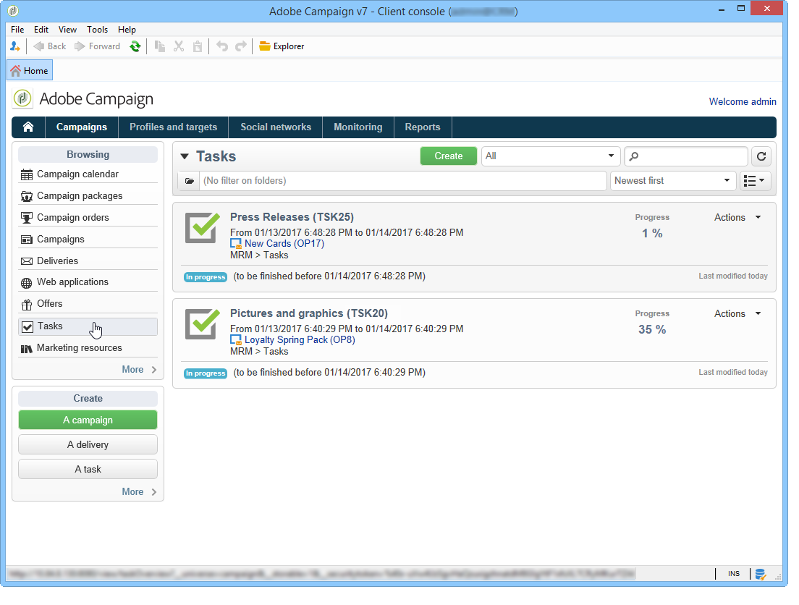

U kunt alle taken van de verbonden exploitant daar bekijken.

Voor meer op dit, verwijs naar [ status van de Uitvoering van een taak ](#execution-status-of-a-task) en [ status van de Voortgang van een taak ](#progress-status-of-a-task).

### Filtertaken {#filtering-tasks}

Wanneer u deze weergave weergeeft, wordt deze automatisch gefilterd om alleen **[!UICONTROL operator tasks]** weer te geven. U kunt de taken ook filteren met de velden in de bovenste sectie van het venster.

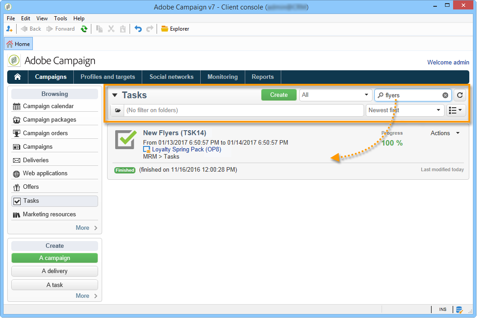

### Taken bewerken {#editing-tasks}

Klik op een taak om deze te bewerken.

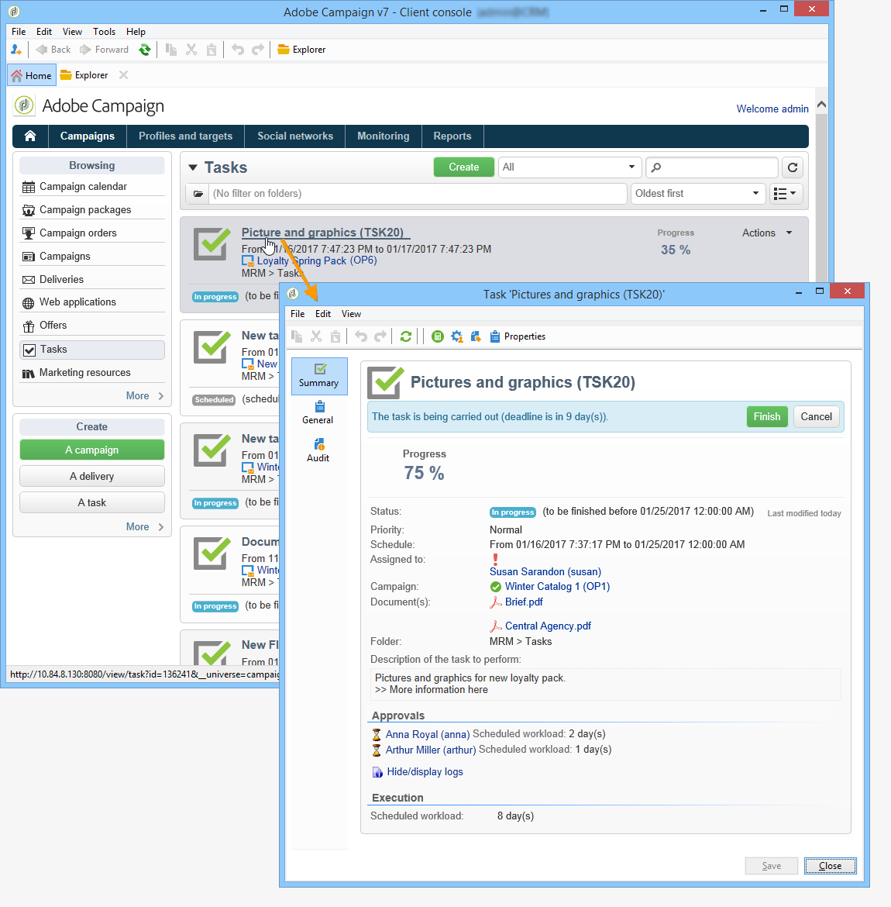

## Nieuwe taak maken {#creating-a-new-task}

Als u een taak wilt maken, klikt u op de koppeling **[!UICONTROL Tasks]** op het tabblad **[!UICONTROL Campaigns]** en selecteert u **[!UICONTROL Create]** .

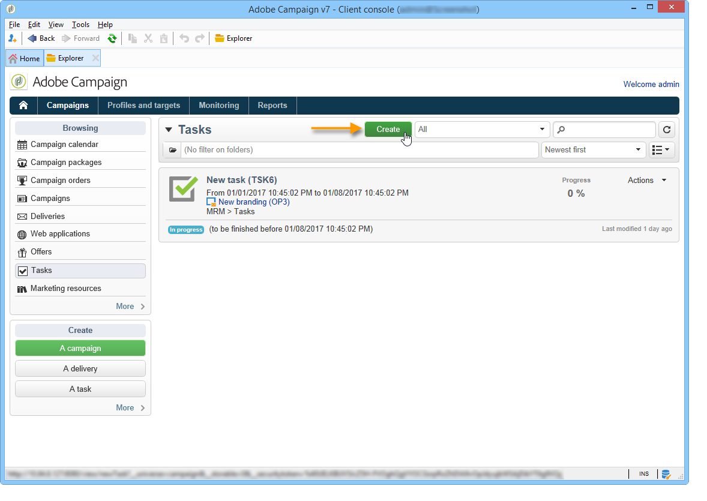

Voer ten minste de naam van de taak in en selecteer de campagne waaraan de taak is gekoppeld. U moet ook de begin- en einddatum opgeven. Deze drie gegevens zijn verplicht.

Klik op **[!UICONTROL Save]** om de taak te maken.

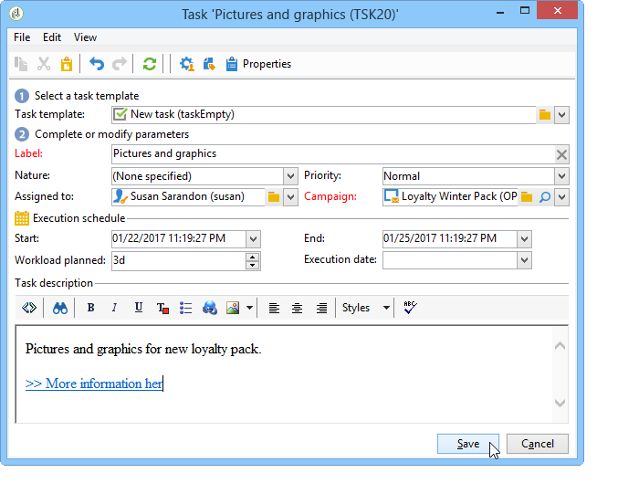

U kunt ook een taak maken via het dashboard van een campagne: in dit geval wordt de taak automatisch gekoppeld aan de campagne waarvan deze is gemaakt.

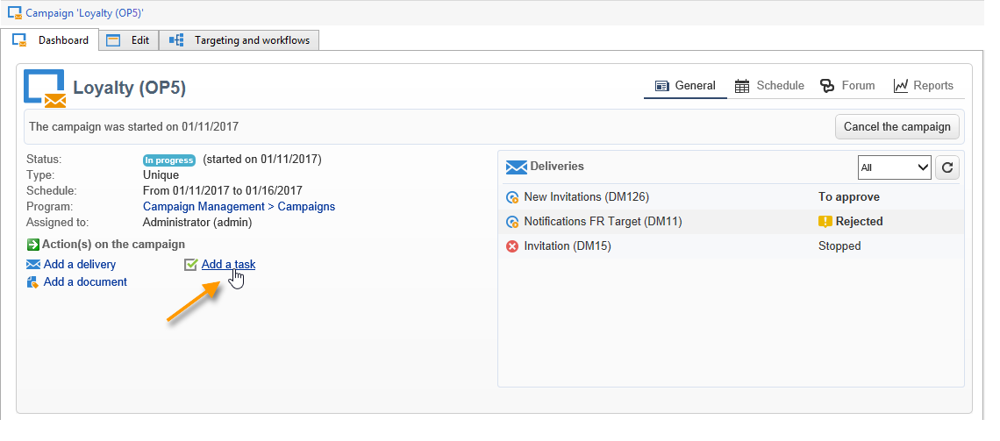

Nadat een taak wordt gecreeerd, wordt het toegevoegd aan het campagneprogramma en de lijst van taken. Als u een taak wilt bewerken, selecteert u de taak in de planning of klikt u op de naam in het taakoverzicht en klikt u op de koppeling **[!UICONTROL Open]** .

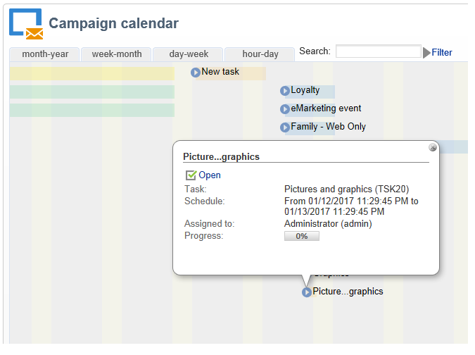

Om het te vormen, moet u wijzen:

* De manager en de deelnemers: verwijs naar [ Manager en deelnemers ](#manager-and-participants).
* Het creatieprogramma: verwijs naar [ programma van de Uitvoering ](#execution-schedule).
* De vastgelegde kosten: verwijs naar [ Uitgaven en opbrengsten ](#expenses-and-revenues).

Het is ook mogelijk om recensenten toe te voegen (verwijs naar [ Recensenten ](#reviewers)) en van verwijzingen voorzien documenten (verwijs naar [ Verwezen Documenten ](#documents-referenced)).

De het levenscyclus van de taak wordt voorgesteld in [ cyclus van het Leven ](#life-cycle).

### Manager en deelnemers {#manager-and-participants}

Alleen de exploitant die met een taak is belast, mag deze sluiten.

Wanneer een Adobe Campaign-operator een taak maakt, wordt deze standaard automatisch toegewezen aan deze beheerders. Gebruik het veld **[!UICONTROL Assigned to]** om een andere operator te selecteren.

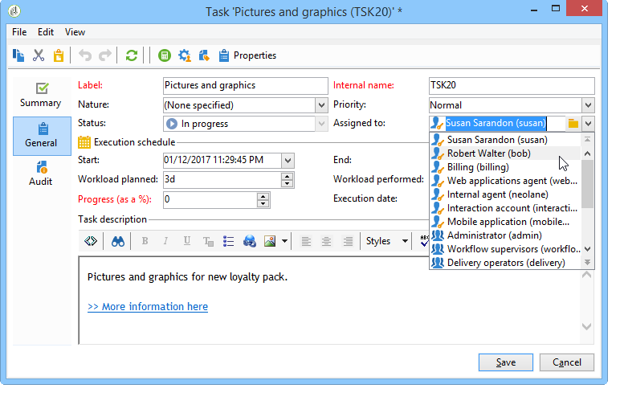

>[!NOTE]
>
>Het beheer van de exploitant wordt voorgesteld in [ deze sectie ](../../platform/using/access-management.md).

U kunt aangeven welke operatoren bij de uitvoering van de taak betrokken zijn. Deze operatoren zijn niet geautoriseerd om de taak te sluiten. Zij mogen alleen de hun toegewezen taak goedkeuren.

Ze worden geselecteerd met het pictogram **[!UICONTROL Resources]** op de taakwerkbalk. Klik op **[!UICONTROL Add]** en selecteer de desbetreffende operatoren.

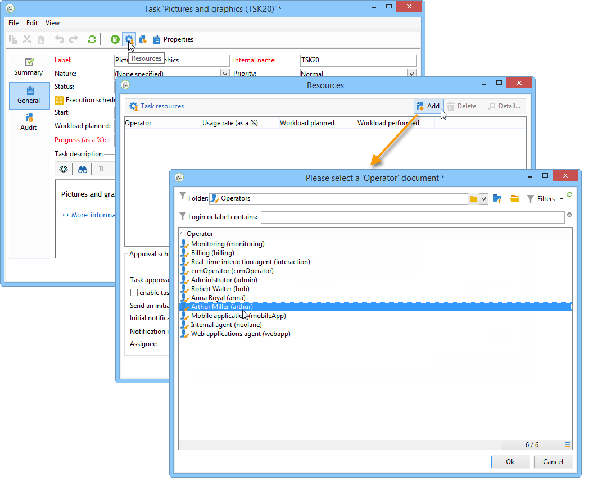

Klik op **[!UICONTROL Ok]** en voer vervolgens de gebruiksfrequentie in: dit geeft de belasting weer die aan de operator is toegewezen voor de duur van de uitvoering van de taak. Dit percentage is slechts een indicatie en wordt uitgedrukt als een percentage.

Voor een taak waarvan het uitvoeringsschema bijvoorbeeld op 10 dagen is vastgesteld, zal een exploitant met een gebruiksfrequentie van 50% op deze taak voor de helft van zijn werktijd voor de tien dagen worden gemobiliseerd.

Voor elke operator kunt u een geplande werkbelasting en een werkelijke werkbelasting invoeren. Deze tijdsduur is ook uitsluitend ter informatie.

Het is mogelijk om een herinnering te vormen, die automatisch zal worden verzonden naar alle exploitanten betrokken bij de taak vóór zijn einddatum.

U kunt het Adobe Campaign-operatorprofiel weergeven via het pictogram **[!UICONTROL Edit link]** .

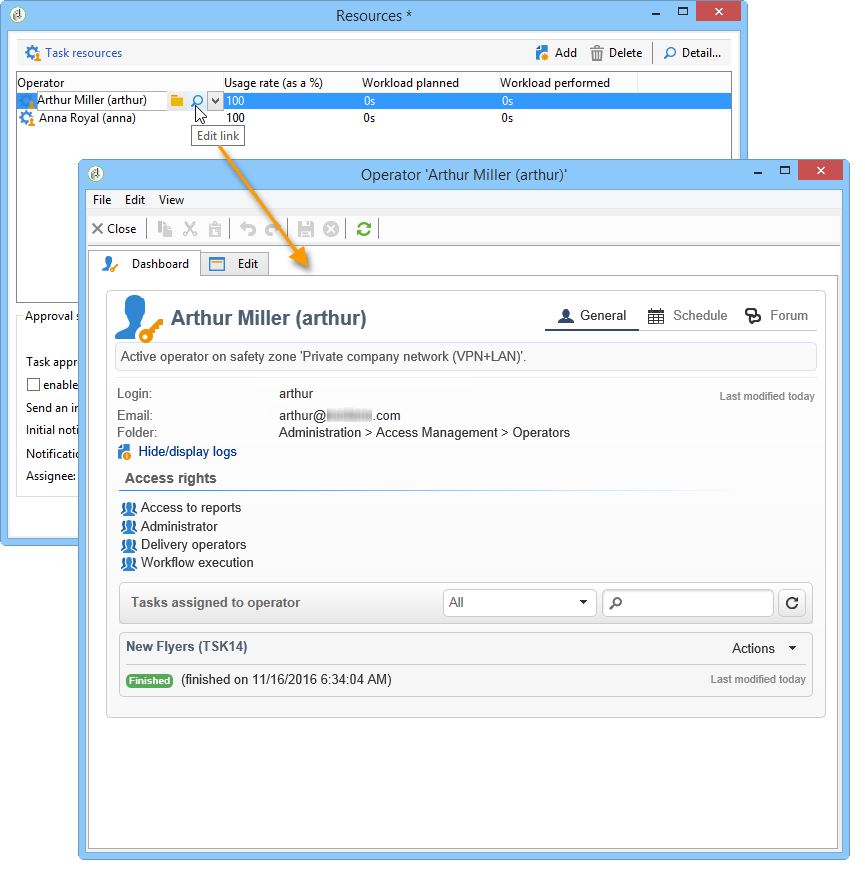

Met het operatordashboard kunt u de werkbelasting controleren (andere lopende taken).

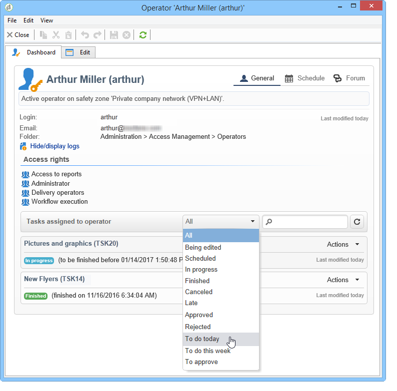

### Revisoren {#reviewers}

Naast de deelnemers kunt u ook operatoren definiëren die de taak evalueren wanneer deze is gesloten door de verantwoordelijke persoon. Klik hiertoe op de optie **[!UICONTROL Enable task approval]** in het gedeelte linksonder van het **[!UICONTROL Resources]** -venster. Dit kan een individuele exploitant, een groep exploitanten of een lijst van exploitanten zijn.

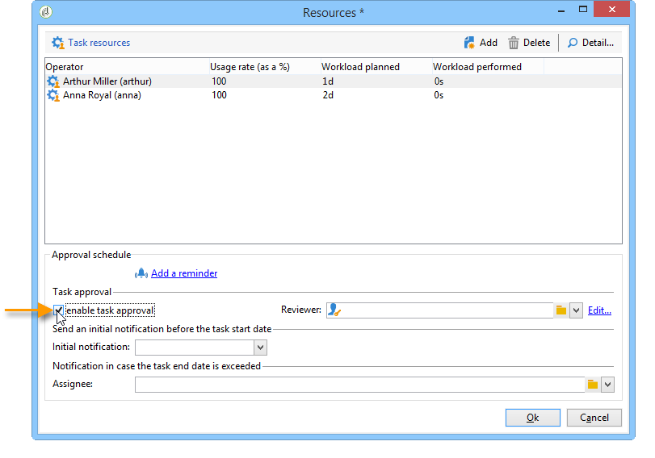

Als u een lijst met operatoren wilt opgeven, klikt u op de koppeling **[!UICONTROL Edit...]** rechts van de eerste controleur en voegt u zoveel operatoren toe als nodig is, zoals hieronder wordt getoond:

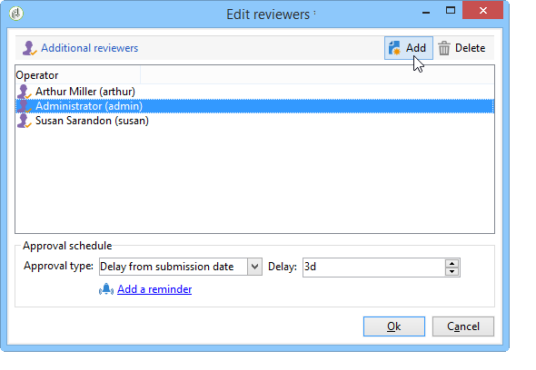

U kunt een goedkeuringsschema voor de taak definiëren in de onderste sectie van het configuratievenster voor de controleur. Standaard hebben revisoren drie dagen vanaf de verzenddatum om de taak goed te keuren. Het is mogelijk om een herinnering te vormen, die automatisch aan de betrokken exploitanten vóór de goedkeuringstermijn zal worden verzonden.

De persoon die met de taak is belast, kan zichzelf de taak toevertrouwen om de taak goed te keuren, ook al zijn hiervoor al andere exploitanten aangewezen. Als er geen controleur is gedefinieerd, worden de meldingen verzonden naar de persoon die verantwoordelijk is voor de taak. Alle andere Adobe Campaign-operatoren met **[!UICONTROL Administrator]** -rechten kunnen de taak ook goedkeuren. Ze ontvangen echter geen meldingen.

### Documenten waarnaar wordt verwezen {#documents-referenced}

Het is mogelijk om documenten en marketing middelen aan een taak toe te voegen (voor meer op dit, verwijs naar [ beheer marketing middelen ](../../mrm/using/managing-marketing-resources.md)). Open hiertoe de taak en klik op het pictogram **[!UICONTROL Documents]** op de taakwerkbalk.

Klik op **[!UICONTROL Add]** en selecteer het document dat u aan de taak wilt toevoegen. Hetzelfde proces toepassen voor marketingbronnen.

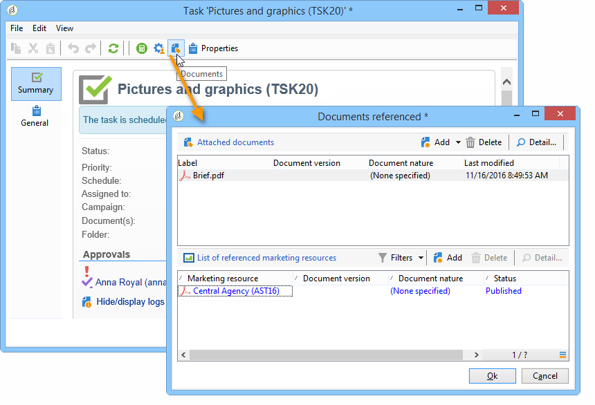

Documenten waarnaar wordt verwezen, worden weergegeven in de meldingen die worden verzonden naar de bij de taak betrokken exploitanten en op het taakdashboard.

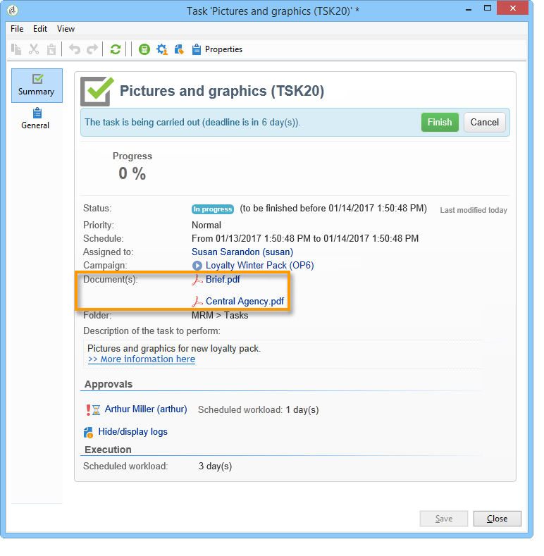

### Uitvoeringsschema {#execution-schedule}

De geldigheidsperiode van een taak wordt aangegeven in de velden **[!UICONTROL Start]** en **[!UICONTROL End]** . De geplande belasting geeft de werklast weer die gedurende de periode moet worden uitgevoerd. Het wordt uitgedrukt in dagen of uren.

>[!NOTE]
>
>De levenscyclus van een taak wordt voorgesteld in [ cyclus van het Leven ](#life-cycle).

Met het veld **[!UICONTROL Workload performed]** kunt u de voortgang van de taak met betrekking tot de geplande werkbelasting handmatig bijwerken. Dit wordt ook uitgedrukt in dagen en uren.

De **[!UICONTROL Progress status]** van de taak, uitgedrukt als een percentage, wordt automatisch bijgewerkt op basis van de taken die door de betrokken exploitanten worden uitgevoerd. U kunt de gegevens handmatig invoeren.

Deze informatie kan in het taakdashboard worden bekeken.

Het is ook zichtbaar in het campagnelusje.

Als de einddatum van het schema voor de uitvoering van de taak is bereikt maar de taak niet is voltooid, is de taak **[!UICONTROL Late]** . Er wordt ook een waarschuwingsbericht weergegeven voor waarschuwingsoperatoren.

Voor meer op dit, verwijs naar [ status van de Voortgang van een taak ](#progress-status-of-a-task).

### Uitgaven en ontvangsten {#expenses-and-revenues}

U kunt gerelateerde uitgaven en verwachte inkomsten voor elke taak definiëren. Deze worden berekend en vervolgens geconsolideerd voor de campagne waaraan de taak is gekoppeld.

Klik op het pictogram **[!UICONTROL Expenses and revenue]** op de taakwerkbalk om deze informatie op te geven.

De begroting die standaard in rekening wordt gebracht, is de begroting van de campagne waaraan de taak is gekoppeld. Deze wordt weergegeven in de taakdetails.

>[!NOTE]
>
>Voor verdere informatie over uitgaven en begrotingen, zie [ de verplichting van de Kosten, berekening en het in rekening brengen ](../../mrm/using/controlling-costs.md#cost-commitment--calculation-and-charging).

In dit venster kunt u ook de te bereiken doelstellingen definiëren. De doelstellingen worden uitgedrukt in de geraamde ontvangsten voor de taak.

### Serviceproviders {#service-providers}

Een externe dienstverlener kan bij het beheer van een taak worden betrokken.

Hiervoor bewerkt u de taakeigenschappen en selecteert u de betreffende serviceprovider. De kostencategorieën verbonden aan de dienstverlener worden automatisch vermeld in de centrale sectie van het venster.

Voor meer op dit, verwijs naar [ creeer een dienstverlener en zijn kostencategorieën ](../../campaign/using/providers-stocks-and-budgets.md#creating-a-service-provider-and-its-cost-categories).

Selecteer de kostencategorieën met betrekking tot de uitvoering van de taak. Hiervoor selecteert u het type kosten en voegt u, indien nodig, een toeslag toe.

>[!NOTE]
>
>De methode om begrotingen en kosten te beheren wordt voorgesteld in [ de kosten van de Controle ](../../mrm/using/controlling-costs.md).

Wanneer een dienstverlener wordt geselecteerd, wordt het getoond in het taakdashboard:

### Te late taken {#late-tasks}

Een taak is te laat als de einddatum is bereikt zonder dat de status wordt gewijzigd in **[!UICONTROL Finished]** . Door gebrek, wordt geen exploitant gewaarschuwd wanneer een taak te laat is. U kunt de levering van een bericht-e-mail configureren: alle operatoren kunnen op de hoogte worden gesteld, zelfs als ze niet bij de taak zijn betrokken.

Ga naar het vak **[!UICONTROL Resources]** en voeg de operator toe aan het veld **[!UICONTROL Assignation]** . Selecteer een groep operatoren om meerdere personen op de hoogte te stellen.

### Eerste meldingen {#initial-notifications}

Wanneer u een taak maakt of wijzigt met een begindatum in de toekomst, biedt Adobe Campaign aan een e-mail te sturen naar de persoon die verantwoordelijk is voor de taak om hem te laten weten wanneer deze wordt gestart.

Nochtans, als de taak u creeert ver weg is, kan het verkieslijk zijn om het bericht te plannen dat moet worden verzonden alvorens de taak begint. Als de taak bijvoorbeeld binnen een maand begint, kunt u de verantwoordelijke persoon één week voordat deze begint op de hoogte stellen.

Als u een melding wilt plannen, gaat u naar het vak **[!UICONTROL Resources]** en gebruikt u het veld **[!UICONTROL Initial notification]** .

* Voor taken binnen campagnes, selecteer een specifieke datum en een tijd.
* Voor taken binnen campagnemalplaatjes, wordt de berichttijd uitgedrukt als resterende tijd alvorens de taak begint (bijvoorbeeld, als u 2d op het **[!UICONTROL Initial notification]** gebied ingaat, zal e-mail 2 dagen vóór de datum van de taakaanvang worden verzonden).

Als u een melding hebt gepland, biedt Adobe Campaign tijdens het opslaan van de taak nog steeds aan om onmiddellijk een melding te verzenden. U kunt besluiten om het te verzenden en dit zal niet het geplande bericht vervangen.

### Aan een programma gekoppelde taak {#task-linked-to-a-program}

U kunt taken rechtstreeks in een programma maken om acties te beheren die betrekking hebben op de algehele organisatie en niet op een specifieke campagne (bijvoorbeeld een vergadering om het thema van komende campagnes binnen het programma te bespreken). De taak wordt weergegeven in het programma.

Een taak maken die rechtstreeks aan een programma is gekoppeld:

1. Open het programma schema: ga op de homepage naar **[!UICONTROL Campaigns > Browse > Other choices > Programs]** . Het algemene programma wordt geopend in het rechtergedeelte van het venster.
1. Klik in het programma op het gewenste programma: er verschijnt een venster met het programma.
1. Klik in dit venster op **[!UICONTROL Open]** . Het programma wordt geopend.
1. Klik rechts op de knop **[!UICONTROL Add]** boven het schema en klik vervolgens op **[!UICONTROL Add a task]** .

### Beschikbaarheid van bedieners {#operator-availability}

In het taakdashboard, wijst een pictogram naast de naam van de exploitant erop dat zij reeds aan een andere taak of een gebeurtenis tijdens de periode werken die door de taak wordt behandeld. De taak die de operator beheert of waarbij deze is betrokken, wordt weergegeven in het veld **[!UICONTROL Assigned to]** of in het vak **[!UICONTROL Resources]** voor taken.

### Taak in een werkstroom {#task-in-a-workflow}

Als u een **[!UICONTROL Task]** -element in een campagneworkflow gebruikt, kunt u twee scenario&#39;s definiëren, afhankelijk van het feit of de taak is goedgekeurd of niet.

In de campagneworkflows vindt u de activiteit **[!UICONTROL Task]** op het tabblad **[!UICONTROL Flow control]** .

## Typen taken {#types-of-task}

Wanneer u taken maakt via een campagne, kunt u specifieke taken maken. Het taaktype wordt gedefinieerd in de geselecteerde sjabloon.

De volgende taken kunnen worden gepland:

* [ de taken van de Controle ](#control-tasks),
* [ Groeperende taak ](#grouping-task),
* [ Groeperende taak ](#grouping-task),
* [ taak van het Bericht ](#notification-task).

>[!NOTE]
>
>**[!UICONTROL Control task]** en **[!UICONTROL Grouping]** de taken kunnen **slechts** via het campagnedashboard worden gecreeerd.\
>Zij worden getoond in de taakkaart van de exploitant waaraan zij worden toegewezen. Zie [ de taken van de Toegang ](#accessing-tasks).

### Taken beheren {#control-tasks}

Een **[!UICONTROL Control task]** is gekoppeld aan de goedkeuring van de levering: goedkeuring voor doelwitten, inhoud, extractiebestand, budget of proefdrukken.

Zodra het wordt gecreeerd, wordt de taak toegevoegd aan het campagnesdashboard.

U kunt het vervolgens bewerken en de parameters ervan opgeven.

### Taak voor het maken van marketingmiddelen {#marketing-resource-creation-task}

Een marketing middelaanmaaktaak kan worden gebruikt om de verwezenlijking en de publicatie van een marketing middel te beheren. Als u een bron beheert via een taak en niet via de bron zelf, kunt u:

* Beheer het proces voor het maken van bronnen via een campagne.
* Bekijk het proces van de middelverwezenlijking in een programma.
* Het maken van bronnen beheren (herinneringen, meldingen).
* Berekenen en controleren van de kosten in verband met het creëren van bronnen.
* De bron goedkeuren en publiceren via de taak (als de relevante optie is ingeschakeld).

#### Interactie tussen de taak en de daaraan gekoppelde bron {#interaction-between-the-task-and-its-linked-resource}

De het creëren van marketingmiddelen taak staat in wisselwerking met het middel verbonden aan het. Dit betekent:

* Het programma voor het aanmaken van bronnen en de bijbehorende kosten worden via de taak beheerd.
* Operatoren kunnen aan de bron werken zoals normaal (downloaden of uploaden, vergrendelen en ontgrendelen): dit heeft geen invloed op de taak.
* De goedkeuring en publicatie van bronnen kunnen worden uitgevoerd via de taak: als de optie **[!UICONTROL Publish the marketing resource]** is ingeschakeld, wordt de bron automatisch goedgekeurd en gepubliceerd zodra de taak is voltooid. Als de optie niet wordt toegelaten, zullen de taak en het middel niet in wisselwerking staan: handelend op één zal niet andere beïnvloeden.

  U kunt een reeks gekoppelde taken gebruiken om een volledige goedkeuringscyclus te definiëren. Controleer de optie **[!UICONTROL Publish the marketing resource]** alleen voor de laatste taak: alle taken moeten zijn voltooid voordat de bron kan worden gepubliceerd. Bovendien wanneer u een kind marketing middeltaak creeert, zal het middel automatisch in de kindtaak worden geselecteerd.

   * **Via het middel**: als u het middel voor goedkeuring voorlegt of het goedkeurt, zullen deze acties niet de taak beïnvloeden.
   * **via de taak**: als de **[!UICONTROL Publish the marketing resource]** optie in de taak wordt gecontroleerd, wordt het middel goedgekeurd en automatisch gepubliceerd zodra de taak (zie hierboven) wordt gebeëindigd. Als de optie niet wordt gecontroleerd, zullen de taak en het middel niet in wisselwerking staan: handelend op één zal niet andere beïnvloeden.

#### Een taak voor het maken van marketingbronnen configureren {#configuring-a-marketing-resource-creation-task}

De persoon die de taak controleert is niet noodzakelijk de zelfde persoon die de inhoud controleert die in het middel wordt bepaald. Als de optie **[!UICONTROL Publish the marketing resource]** echter is ingeschakeld (zie verderop), is de taakcontroleur gemachtigd om de inhoud van de bron goed te keuren, omdat bij het voltooien van de taak de bron automatisch wordt goedgekeurd (of, als er geen controleur is gedefinieerd, de taakmanager).

Definieer in het veld **[!UICONTROL Marketing resource]** de bron die u via deze taak wilt beheren. U kunt:

* Selecteer een bestaande bron: de vervolgkeuzelijst biedt alle bronnen met de status **[!UICONTROL Being edited]** .
* Een bron maken: klik op het pictogram **[!UICONTROL Select the link]** en klik vervolgens op het pictogram **[!UICONTROL Create]** .

Met de optie **[!UICONTROL Publish the marketing resource]** kunt u het publiceren van bronnen automatiseren: als de taak **[!UICONTROL Finished]** is, schakelt de status van de bron automatisch over naar **[!UICONTROL Published]** , zelfs als deze niet ter goedkeuring of goedkeuring is ingediend, ook als de controleur die de taak voltooit, niet de inhoudrevisor is die in de bron is gedefinieerd.

De knop **[!UICONTROL Publish the resource]** wordt beschikbaar gesteld en de revisor van de publicatie-resource ontvangt een e-mailbericht waarin deze aangeeft dat de knop gereed is voor publicatie. Op het tabblad **[!UICONTROL Edit > Tracking]** worden het reviseren en publiceren door de taakcontroleur zichtbaar. Als er een workflow voor de naverwerking van bronnen is gedefinieerd, wordt deze nu uitgevoerd.

### Groepstaken {#grouping-task}

Met de **[!UICONTROL Grouping task]** -typetaak kunt u verschillende taken groeperen en het beheer van de voortgang en de goedkeuring ervan synchroniseren.

Groeperingstaken hebben geen gekoppelde uitgaven of middelen.

Alle taken die aan een groeperingstaak worden gegroepeerd, kunnen op zijn eigen dashboard worden gezien. Hiermee kunt u de lijst met taken filteren en alleen de taken weergeven die u interesseren.

Groeperingstaken hebben een koppeling waarmee u eenvoudig een gegroepeerde taak kunt maken.

Als u een gegroepeerde taak wilt maken op basis van een groeperingstaak, gaat u naar het campagnemashboard en klikt u op de naam van de groeperingstaak om de beschrijving weer te geven. Klik vervolgens op **[!UICONTROL Add a task]** .

Als u echter al een taak hebt gemaakt die u aan een groeperingstaak wilt koppelen, kunt u deze taak uitvoeren via het veld **[!UICONTROL Linked to]** van het vak **[!UICONTROL Properties]** .

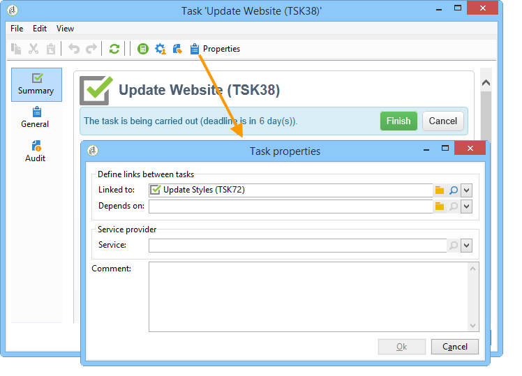

### Meldingstaak {#notification-task}

Met behulp van meldingstaken kunt u e-mailleveringen plannen (aan een operator, een groep operatoren, een serviceprovider, enzovoort). Hiermee kunt u herinneringen plannen, bijvoorbeeld om iemand te laten weten dat een campagne binnenkort wordt voltooid, of om documenten te verzenden voordat een campagne wordt gestart, zodat exploitanten deze kunnen voorbereiden. Dit betekent dat u uw communicatie binnen uw campagne of programma kunt bijhouden en de uitgevoerde acties beter in het oog kunt houden.

#### Levenscyclus {#life-cycle}

De taken van het bericht vereisen geen goedkeuring. Dit betekent dat hun levenscyclus eenvoudiger is dan die van een standaardtaak:

Een meldingstaak kan de volgende statussen hebben:

* **[!UICONTROL Scheduled]** totdat het e-mailbericht is verzonden
* **[!UICONTROL In progress]** zodra het e-mailbericht is verzonden en tot de einddatum is bereikt
* **[!UICONTROL Finished]** zodra de einddatum is bereikt.

#### Configuratie {#configuration}

Tijdens het creëren, moeten de volgende elementen in de taak zijn ingegaan:

* **[!UICONTROL Assigned to]** : de operator of de groep operatoren die de e-mail ontvangen. Als u de taak opnieuw toewijst nadat de e-mail is verzonden, wordt de e-mail niet verzonden naar de nieuwe operator (hiervoor moet u de taak opnieuw initialiseren en de begindatum wijzigen).
* **de begindatum van de Taak**: datum die het bericht e-mail zal worden verzonden. Deze datum moet in de toekomst plaatsvinden op het moment van de registratie van de taak.
* **einddatum van de Taak**: datum waarop de taakstatus in **[!UICONTROL Finished]** verandert. Standaard is de einddatum gelijk aan de begindatum. Nochtans, laat het toewijzen van een duur aan de taak u de hoeveelheid tijd symboliseren die de exploitant in het programma moet handelen, indien nodig.
* **[!UICONTROL Description]** : de hier ingevoerde tekst wordt in de tekst van de e-mail met meldingen weergegeven.

  

U kunt een bijlage aan de taak en aan het bericht e-mail toevoegen. Klik hiertoe op het pictogram **[!UICONTROL Documents]** op de werkbalk in de rechterbovenhoek.

## Levenscyclus {#life-cycle-1}

### Koppelingen tussen taken {#links-between-tasks}

Met de knop **[!UICONTROL Properties]** in elke taak kunt u de koppelingen tussen taken in een campagne definiëren. U kunt taken in subtaken verdelen gebruikend een groeperende taak (zie [ Gekoppelde taken ](#linked-tasks)), of gebiedsdelen tussen de taken (zie [ Groeperende taken ](#grouping-tasks)) bepalen.

#### Gekoppelde taken {#linked-tasks}

Gebruik het veld **[!UICONTROL Linked task]** om taken te koppelen aan een groeperingstaak. Zie [ Types van taak ](#types-of-task).

In het volgende voorbeeld wordt de goedkeuring van het richten opgesplitst in vier subtaken.

Elke subtaak is een standaardtaak die is gekoppeld aan de hoofdtaak.

#### Groepstaken {#grouping-tasks}

Gebruik het veld **[!UICONTROL Grouped to]** om te zorgen dat het uitvoeren van een taak afhankelijk is van het uitvoeren van een andere taak.

De afhankelijkheid tussen taken wordt vertegenwoordigd door pijlen in het campagnedashboard.

In het geval van gegroepeerde taken, wijst Adobe Campaign automatisch de einddatum van de oudertaak aan de kindtaak als begindatum toe. Bijvoorbeeld als a **uitnodigings** taak creeert eindigt op 15 oktober bij 3:30PM, zal **uitnodigingsE-mail** kindtaak op 15 oktober bij 3:30PM beginnen.

Bovendien als u het einde van een bovenliggende taak uitstelt, kunnen sommige onderliggende taken worden beïnvloed: dit zijn de onderliggende taken waarvan de status **[!UICONTROL Scheduled]** is en waarvan de begindatum eerder is dan de nieuwe einddatum van de bovenliggende taak. De duur van de taak blijft ongewijzigd. Als de begindatum van een kindtaak later dan de nieuwe einddatum van de oudertaak is, wordt de kindtaak niet beïnvloed.

**Voorbeeld**

Een oudertaak die op 9 Oktober om 5 PM wordt gepland te beëindigen heeft twee kindtaken, taak A en taak B. Taak A is gepland om op 10 Oktober te beginnen om 2 PM en taak B is gepland om op 12 oktober om 8.00 te beginnen.

Laten we de bovenliggende taak uitstellen: deze loopt nu af op 11 oktober om 13.00 uur. Alleen taak A wordt uitgesteld en begint op 11 oktober om 13.00 uur.

### Uitvoerstatus van een taak {#execution-status-of-a-task}

De status van de taak kan in de taakkaart worden bekeken. De uitvoeringsstatus van een taak wordt automatisch bijgewerkt op basis van de acties van de operator.

Een taak kan: **[!UICONTROL Scheduled]**, **[!UICONTROL In progress]**, **[!UICONTROL Finished]**, **[!UICONTROL Canceled]**, **[!UICONTROL Pending approval]** of **[!UICONTROL Rejected]** zijn.

* Wanneer een taak wordt gecreeerd, is het **[!UICONTROL Scheduled]** of zijn begindatum in de toekomst is. Deze status blijft behouden totdat de begindatum is bereikt.
* Zodra het is begonnen, is de taak **[!UICONTROL In progress]**. Wanneer de persoon die verantwoordelijk is voor de taak de taak sluit, verandert deze in **[!UICONTROL Finished]** .
* Als een controleur is gedefinieerd, wordt de taak **[!UICONTROL Pending approval]** uitgevoerd zodra de persoon die verantwoordelijk is voor het sluiten van de controleur deze taak en totdat de controleur deze goedkeurt. Als de controleur het weigert, wordt de taak **[!UICONTROL Rejected]**.
* Een taak kan door de verantwoordelijke persoon via het dashboard of **[!UICONTROL Task map]** worden geannuleerd door op de knop **[!UICONTROL Cancel]** te klikken.
* Als u een taak wilt plannen, voert u in de toekomst een begindatum in. Vervolgens kunt u een eerste melding verzenden aan de Adobe Campaign-operatoren die bij de uitvoering van de taak zijn betrokken. Zie [ Volledige cyclus van het taakleven ](#complete-task-life-cycle).

>[!NOTE]
>
>* De taakstatus wordt automatisch bijgewerkt.
>* Zelfs als de geldigheidsperiode is voltooid, worden taken die niet zijn afgesloten, nog steeds opgenomen in de lijst met actieve taken. Een waarschuwing waarschuwt exploitanten dat de taak laat is.
>

### Voortgangsstatus van een taak {#progress-status-of-a-task}

Naast de uitvoeringsstatus kan een taak worden gekoppeld aan een vorderingsstatus: **[!UICONTROL Late]**, **[!UICONTROL To approve]**, **[!UICONTROL To do today]** of **[!UICONTROL To do this week]** . Deze informatie wordt automatisch ingevoerd volgens het taakprogramma.

U kunt de lijst met taken filteren op processtatus of voortgangsstatus.

Voor meer op dit, verwijs naar [ Toegang hebbend tot taken ](#accessing-tasks).

### Volledige levenscyclus van taken {#complete-task-life-cycle}

Hieronder staan de fasen van een volledige taaklevenscyclus waarvoor de verantwoordelijke persoon deelnemers en revisoren heeft gedefinieerd.

1. De verantwoordelijke persoon creëert de taak en voert de verschillende velden in. Voor meer op dit, verwijs naar [ creeer een nieuwe taak ](#creating-a-new-task).

   Wanneer het creëren van en het uitgeven van een taak **die in de toekomst** wordt gepland (zolang de datum van het taakbegin niet wordt bereikt), is het mogelijk om een bericht naar deelnemers en managers te verzenden om hen te laten weten dat een nieuwe taak is gepland.

   

   Klik op **[!UICONTROL Yes]** om deze eerste melding te verzenden. Deze melding geeft uitleg over de volgende taak en bevat informatie over de inhoud en het aantal dagen dat resteert tot de deadline.

   Wanneer een taak wordt gecreeerd en voor de toekomst gepland, is zijn status **[!UICONTROL Scheduled]**.

1. Op de datum van de taakaanvang, ontvangen de verantwoordelijke persoon en de deelnemers een bericht om hen te vertellen dat de taak is begonnen. De status verandert in **[!UICONTROL In progress]** .
1. Na de voltooiing van de sectie die aan hen wordt toegewezen, kunnen de deelnemers de taak goedkeuren, of:

   * via het e-mailbericht.
   * via de console of de webinterface, in het taakdashboard.

     

1. Telkens wanneer een deelnemer een taak goedkeurt, wordt de voortgangsstatus van de taak bijgewerkt.

   

1. De controleur ontvangt een e-mailbericht met de kennisgeving dat de operator de aan hem toegewezen sectie heeft voltooid.

   Zij kunnen de vooruitgang op het taakdashboard volgen.

   

1. Zodra de persoon die verantwoordelijk is voor de taak besluit dat het wordt gebeëindigd, kunnen zij het sluiten, gebruikend of de verbinding in het bericht e-mail die werd verzonden toen de taak werd begonnen, de console, of de interface.

   

   >[!NOTE]
   >
   >De persoon die verantwoordelijk is voor een taak kan deze op elk moment sluiten, zelfs als er geen goedkeuringen zijn. De vorderingsstatus wordt automatisch gewijzigd in 100%.

1. De taakstatus verandert in **[!UICONTROL To approve]** en er wordt een melding verzonden naar de revisor.

   Ze keuren de taak goed via de e-mail met meldingen, de console of de webinterface.

   Ze kunnen actie ondernemen via het campagnedashboard:

   

   Zij kunnen de knoop van de taakgoedkeuring ook gebruiken:

   

   >[!NOTE]
   >
   >De taakstatus verandert alleen in **[!UICONTROL To approve]** als u de optie **[!UICONTROL Enable task validation]** hebt ingeschakeld in het venster **[!UICONTROL Resources]** van de taak.\
   >Als de controleur de taak weigert, verandert de status in **[!UICONTROL Rejected]** en wordt de levenscyclus van de taak automatisch hervat.

1. De taakstatus verandert in **[!UICONTROL Finished]** . Aan alle betrokkenen wordt een kennisgeving gezonden.

   >[!NOTE]
   >
   >Als een taak is voltooid, kan de levenscyclus ervan opnieuw worden geïnitialiseerd door de verantwoordelijke persoon. U doet dit door de taak te openen en op de koppeling **[!UICONTROL Reset task to execute it again...]** onder aan het dashboard te klikken.
