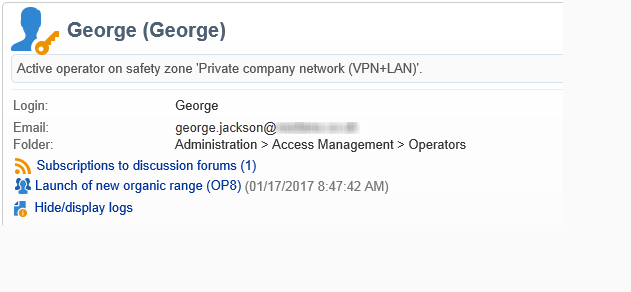

# Discussieforums{#discussion-forums}

Adobe Campaign-operatoren kunnen discussieforums gebruiken om informatie te delen. De volgende elementen hebben elk hun eigen forum: plannen, programma&#39;s, campagnes, middelen, simulaties, voorraden. Elke exploitant heeft ook een persoonlijk forum. Alle discussies zijn openbaar, zelfs op persoonlijke forums.

Operatoren kunnen zich op een forum abonneren om elke keer dat een bericht wordt gepost, een e-mailbericht te ontvangen.

## Toegang tot een forum {#accessing-a-forum}

Als u het forum van een campagne wilt bezoeken, gaat een operator, enz. naar het dashboard en klikt u op de koppeling **[!UICONTROL Forum]** in de rechterbovenhoek. Deze verbinding geeft u ook het totale aantal berichten in het forum.

## Een forum gebruiken {#using-a-forum}

Berichten en de reacties worden in chronologische volgorde weergegeven (van Nieuwst naar Oudst).

Als u de inhoud van een bericht wilt weergeven, klikt u op de koptekst van het bericht.

**Begin een nieuwe bespreking**

Als u een nieuwe discussie wilt starten, klikt u op de knop **[!UICONTROL Add a discussion]** in de rechterbovenhoek. Het vak **[!UICONTROL Discussion forum]** wordt weergegeven (zie verderop).

**post een bericht aan een bestaande bespreking**

Als u een bericht wilt plaatsen naar een bestaande discussie, opent u het bericht dat u wilt beantwoorden en klikt u op de koppeling **[!UICONTROL Reply]** in de linkerbovenhoek. Het vak **[!UICONTROL Discussion forum]** wordt weergegeven (zie verderop).

Wanneer u op een bericht antwoordt, zal de persoon die het originele bericht plaatste een bericht ontvangen.

**schrijf een bericht**

In het vak **[!UICONTROL Discussion forum]** :

1. Typ uw tekst in het veld **[!UICONTROL Message]** en voer een titel voor de beschrijving in het veld **[!UICONTROL Subject]** in.

   

1. Indien nodig:

   * Gebruik het veld **[!UICONTROL Operator to notify]** als u wilt dat iemand deelneemt aan de discussie die niet is geabonneerd op het forum. De exploitant zal een kennisgevingsmail voor dit specifieke bericht ontvangen (zij zullen niet op het forum worden geabonneerd). Selecteer een groep operatoren als u meerdere operatoren wilt melden.
   * Als u een bijlage aan het bericht wilt toevoegen, klikt u op **[!UICONTROL Browse]** . De bijlage wordt ook opgenomen in de e-mail met het bericht. Bijlagen kunnen alleen afzonderlijk worden verzonden: als u meerdere bestanden wilt verzenden, moet u deze zip uitvoeren.

1. Klik op **[!UICONTROL Create the message]** om deze naar het forum te posten.

>[!NOTE]
>
>Zodra een bericht aan het forum is gepost, kan het niet meer worden veranderd of worden geschrapt.

## Plaatsen op het persoonlijke forum van een exploitant {#posting-to-the-personal-forum-of-an-operator}

U kunt een bericht aan het forum van een exploitant posten als, bijvoorbeeld, uw bericht geen specifieke campagne aangaat maar u wilt het gesprek in Adobe Campaign nog volgen. Persoonlijke forums zijn openbaar en alle operatoren zien uw bericht. De exploitant ontvangt telkens een bericht wanneer iemand aan zijn persoonlijk forum post.

Toegang tot het forum van een exploitant:

* Als u de benodigde rechten hebt om toegang te krijgen tot het knooppunt **[!UICONTROL Administration > Access management > Operators]** van de verkenner, opent u het dashboard van de gewenste operator en klikt u op de koppeling **[!UICONTROL Forum]** rechtsboven in de hoek.
* Zo niet, zoek dan de naam van de exploitant in Adobe Campaign (via een bericht dat door deze operator aan het forum is gepost, een taak die aan hen wordt toegewezen) en klik erop om hun dashboard te openen. U kunt de beheerder ook vragen om een weergave van de map met operatoren te maken.

## Abonneren op een forum {#subscribing-to-a-forum}

Als u zich abonneert op een forum, kunt u discussies volgen. Elke keer dat een bericht naar het forum wordt gepost, ontvangt u een e-mailbericht. Deze e-mail bevat de berichttekst en eventuele bijlagen. Als u een bericht wilt beantwoorden, klikt u in de hoofdtekst van de e-mail en meldt u zich vervolgens aan bij de Adobe Campaign-webinterface. Wanneer u zich abonneert op een forum, is deze informatie zichtbaar voor iedereen.

* Als u zich wilt abonneren op een forum, klikt u op de knop **[!UICONTROL Follow discussions]** in de rechterbovensectie boven de lijst met berichten.

  

  De sectie gaat blauw en toont aan dat u aan het forum wordt geabonneerd.

* Klik op de knop **[!UICONTROL Unsubscribe]** als u het abonnement op een forum wilt opzeggen.

  

* Het persoonlijke dashboard bevat de forums waarop u zich hebt geabonneerd. Klik op de koppeling **[!UICONTROL Subscription to discussion forums]** om de lijst weer te geven en klik vervolgens op het gewenste item voor toegang tot het forum.

  

  Voor meer op persoonlijke dashboards, verwijs naar [ deze sectie ](../../platform/using/access-management-operators.md).

* Als u wilt zien wie op een forum is geabonneerd, klikt u op de koppeling **[!UICONTROL List of subscribers to this discussion forum]** boven de lijst met berichten.

  

## Melding verzenden {#checking-notification-delivery}

Als operatoren die zijn geabonneerd op een forum geen meldingen ontvangen zoals u had verwacht:

* Controleer of de e-mailadressen zijn ingevoerd in de profielen van de operator.
* Ga naar het knooppunt **[!UICONTROL Administration > Production > Technical workflows > Campaign processes]** en controleer of de **[!UICONTROL Jobs in discussion forums]** -workflow is gestart en of er geen fouten optreden.
* De leveringslogboeken weergeven:

   * Ga op de startpagina van Adobe Campaign naar **[!UICONTROL Campaigns > Navigation > Deliveries]** en open vervolgens de levering **[!UICONTROL Discussion forum notification]** .
   * Ga in de verkenner naar **[!UICONTROL Administration > Production > Objects created automatically > Technical deliveries > Workflow notifications]** en klik op **[!UICONTROL Discussion forum notifications]** .

  In het vak **[!UICONTROL Discussion forum notifications]** vindt u de leveringslogboeken op het tabblad **[!UICONTROL Edit > Delivery]** . U kunt ook de tabbladen **[!UICONTROL Tracking > Log]** en **[!UICONTROL Exclusion causes]** weergeven.
