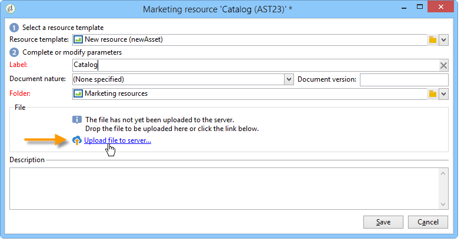
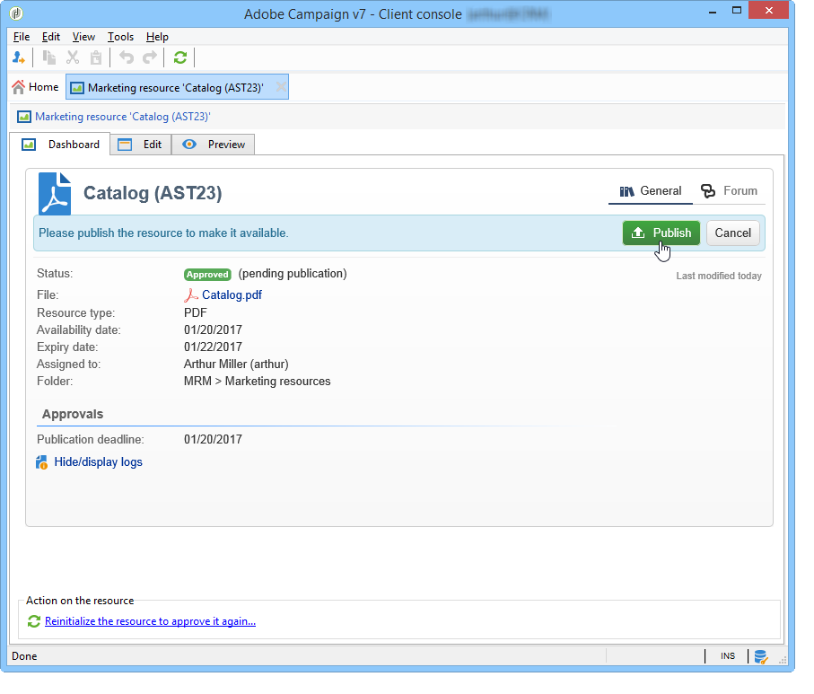

# Marketingbronnen beheren{#managing-marketing-resources}

Met Adobe Campaign kunt u de marketingbronnen beheren en bijhouden die zijn betrokken bij de levenscyclus van de campagne. Deze marketingmiddelen kunnen een brochure, een visuele ondersteuning of een ander communicatiemiddel zijn waarbij verschillende marktdeelnemers zijn betrokken.

Voor elke marketingbron die via Adobe Campaign wordt beheerd, kunt u de status en geschiedenis van de bron op elk gewenst moment bijhouden en de huidige versie bekijken.

## Een marketingbron toevoegen {#adding-a-marketing-resource}

Marketingbronnen zijn toegankelijk via het tabblad **[!UICONTROL Campaigns]** .

Als u een bron wilt toevoegen, klikt u op de knop **[!UICONTROL Create]** .

Als u een resource beschikbaar wilt maken op de Adobe Campaign-server, moet u de gewenste resource toevoegen door deze in het midden van de editor te slepen. U kunt ook op de koppeling **[!UICONTROL Upload file to server...]** klikken.

Met een bevestigingsbericht kunt u het uploaden starten.

Wanneer het uploaden is voltooid, wordt de bron toegevoegd aan de lijst met beschikbare bronnen. Het is toegankelijk voor Adobe Campaign-operatoren. Ze kunnen het bestand weergeven (via het tabblad **[!UICONTROL Preview]** ), een kopie maken om het te wijzigen of het bestand op de server bijwerken (met het tabblad **[!UICONTROL Edit]** ).

Klik op het tabblad **[!UICONTROL General]** om de operatoren of groepen operatoren te selecteren die verantwoordelijk zijn voor het controleren, bijhouden en goedkeuren van deze resource. De controleur wordt geselecteerd via de koppeling **[!UICONTROL Advanced parameters]** .

* De exploitant aan wie de bron wordt toegewezen is verantwoordelijk voor het volgen van het.
* De goedkeuringsexploitant is verantwoordelijk voor de goedkeuring van de marketingbron. Ze worden op de hoogte gesteld wanneer het validatieproces van de bron wordt gestart.

  Als er geen controleur is geselecteerd, moet de resource **[!UICONTROL cannot be]** worden goedgekeurd.

* Indien nodig kunt u ook een proxy opgeven.

U kunt een (indicatieve) beschikbaarheidsdatum voor het middel specificeren. Na deze datum wordt deze weergegeven met de status **[!UICONTROL Late]** .

## Samenwerken aan bronnen {#collaborative-work-on-resources}

U kunt een marketingbron wijzigen en bijwerken en, indien nodig, andere Adobe Campaign-operatoren hiervan op de hoogte stellen. U kunt:

* Download de bron lokaal om deze te wijzigen.
* Het bestand op de server bijwerken en toegankelijk maken voor andere operatoren.
* Vergrendel een bron om de wijziging ervan door andere operatoren te verbieden.

>[!NOTE]
>
>Het tabblad **[!UICONTROL History]** bevat het download- en updatelogbestand voor de bron. Met de knop **[!UICONTROL Details]** kunt u de geselecteerde versie weergeven.

### Een bron vergrendelen/ontgrendelen {#locking-unlocking-a-resource}

Zodra gecreeerd, zijn de middelen beschikbaar in het marketing middeldashboard, en de exploitanten kunnen hen uitgeven en wijzigen.

Wanneer een exploitant aan een middel wil werken, is het verkieslijk om het te sluiten alvorens met het werk te beginnen, om andere exploitanten te verhinderen het tezelfdertijd te wijzigen. De bron is vervolgens gereserveerd; deze blijft toegankelijk, maar kan niet door een andere operator worden gepubliceerd of bijgewerkt op de server.

Een speciaal bericht geeft een melding aan alle operatoren die toegang proberen te krijgen tot het bericht:

Het tabblad **[!UICONTROL Tracking]** geeft de naam aan van de operator die de bron heeft vergrendeld en de geplande updatedatum.

Als u een bron wilt vergrendelen, klikt u op de bron gevolgd door de knop **[!UICONTROL Lock]** in het dashboard voor de bron.

U kunt de geplande retourdatum aangeven op het tabblad **[!UICONTROL Tracking]** van de bron.

Met deze informatie kunt u andere Adobe Campaign-operatoren op de hoogte stellen van de datum waarop de resource wordt ontgrendeld.

Wanneer de bron is bijgewerkt, wordt deze automatisch ontgrendeld en opnieuw beschikbaar gesteld aan alle operatoren.

Indien nodig, kunt u het van het dashboard ook manueel ontgrendelen.

>[!NOTE]
>
>Alleen de operator die de resource heeft vergrendeld en de operators met beheerdersrechten zijn gemachtigd om een resource te ontgrendelen.

### Discussieforums {#discussion-forums}

Voor elke bron kunt u op het tabblad **[!UICONTROL Forum]** informatie uitwisselen tussen deelnemers.

[ de forums van de Bespreking ](../../mrm/using/discussion-forums.md) verklaart hoe de besprekingsforums in Adobe Campaign werken.

## Levenscyclus van een marketingmiddel {#life-cycle-of-a-marketing-resource}

Wanneer de bron wordt gemaakt, worden Adobe Campaign-operatoren aangesteld om de bron te ontwerpen, te controleren, goed te keuren en te publiceren. Voor deze campagnes kan een duur worden bepaald.

Op het tabblad **[!UICONTROL Tracking]** kunt u alle acties controleren die op de bron worden uitgevoerd: goedkeuringen, weigeringen van goedkeuring, verwante opmerkingen of publicaties.

Op het tabblad **[!UICONTROL History]** worden bestandsoverdrachten weergegeven die zijn uitgevoerd voor deze bron.

### Goedkeuringsproces {#approval-process}

De verwachte beschikbaarheidsdatum wordt getoond in de middeldetails, als het in **[!UICONTROL Tracking]** tabel werd gespecificeerd. Zodra deze datum is bereikt, kunt u het goedkeuringsproces uitvoeren gebruikend de knoop **[!UICONTROL Submit for approval]** in het middeldashboard. De status van de bron verandert vervolgens in **[!UICONTROL Approval in progress]** .

Een bron kan worden goedgekeurd via de knop **[!UICONTROL Approve resource]** op het dashboard.

Geautoriseerde marktdeelnemers kunnen vervolgens de goedkeuring accepteren of afwijzen. Deze actie is mogelijk: via het verzonden e-mailbericht (door op de koppeling in het meldingsbericht te klikken) of via de console (door op de knop **[!UICONTROL Approve]** te klikken).

In het goedkeuringsvenster kunt u een opmerking invoeren.

Op het tabblad **[!UICONTROL Tracking]** kunnen alle operatoren de verschillende fasen van het goedkeuringsproces volgen.

>[!NOTE]
>
>Naast de recensent die voor elke marketing middel wordt gespecificeerd, zijn de exploitanten met beheerderrechten en middelmanager gemachtigd om een marketing middel goed te keuren.

### Een bron publiceren {#publishing-a-resource}

Wanneer deze is goedgekeurd, moet de marketingbron worden gepubliceerd. Het publicatieproces moet afhankelijk worden gesteld van een specifieke tenuitvoerlegging overeenkomstig de eisen van de onderneming. Dit betekent dat de middelen op een Extranet of een andere server kunnen worden gepubliceerd, kan de specifieke informatie naar een externe dienstverlener, enz. worden verzonden.

Als u een resource wilt publiceren, klikt u op de knop **[!UICONTROL Publish]** in de bewerkingszone van het dashboard voor marketingbronnen.

U kunt het publiceren van een bron ook automatiseren via een workflow.

Het publiceren van een middel betekent het ter beschikking stellen voor gebruik (door een andere taak, bijvoorbeeld). Publicatie als zodanig varieert afhankelijk van de aard van uw bron: voor een flyer kan publiceren betekenen dat het bestand naar een printer wordt gestuurd, voor een webagentschap kan het betekenen dat het naar een website wordt gepubliceerd, enzovoort.

Adobe Campaign kan alleen publiceren als u een geschikte workflow maakt en deze aan de bron koppelt. Hiertoe opent u het vak **[!UICONTROL Advanced settings]** van de bron en selecteert u de gewenste workflow in het veld **[!UICONTROL Post-processing]** .

De workflow wordt uitgevoerd:

* Wanneer de controleur op de koppeling **[!UICONTROL Publish resource]** klikt (of, als er geen controleur is gedefinieerd, op de persoon die de bron beheert).
* Als het middel via een marketing middelaanmaaktaak wordt beheerd, zal het worden uitgevoerd wanneer de taak aan **[!UICONTROL Finished]** wordt geplaatst, zolang **[!UICONTROL Publish the marketing resource]** doos in de taak wordt gecontroleerd (verwijs naar [ het middelaanmaaktaak van de Marketing ](../../mrm/using/creating-and-managing-tasks.md#marketing-resource-creation-task))

Als een werkstroom niet onmiddellijk wordt gestart (als de werkstroom bijvoorbeeld wordt gestopt), verandert de status van de bron in **[!UICONTROL Pending publication]** . Zodra de werkstroom is gestart, verandert de status van de bron in **[!UICONTROL Published]** . Deze status houdt geen rekening met mogelijke fouten in het publicatieproces. Controleer de status van uw workflow om er zeker van te zijn dat deze correct is uitgevoerd.

## Een bron koppelen aan een campagne {#linking-a-resource-to-a-campaign}

### Verwijzen naar een marketingbron {#referencing-a-marketing-resource}

Marketingbronnen kunnen aan campagnes worden gekoppeld, op voorwaarde dat deze functie in de campagnemalplaatje is geselecteerd.

>[!NOTE]
>
>Voor details op om campagnemalplaatjes tot stand te brengen en te vormen, verwijs naar [ malplaatjes van de Campagne ](../../campaign/using/marketing-campaign-templates.md#campaign-templates).

Klik op het tabblad **[!UICONTROL Documents > Resources]** in het campagnedashboard en klik vervolgens op **[!UICONTROL Add]** om de betreffende bron te selecteren.

U kunt bronnen filteren op status, aard of type of een gepersonaliseerd filter toepassen.

Klik op **[!UICONTROL OK]** om de bron toe te voegen aan de lijst met marketingbronnen waarnaar voor deze campagne wordt verwezen.

Met de knop **[!UICONTROL Details]** kunt u deze bewerken en weergeven.

De toegevoegde bronnen worden weergegeven in het dashboard. Ze kunnen daar ook worden bewerkt.

### Een marketingbron toevoegen aan een leveringsoverzicht {#adding-a-marketing-resource-to-a-delivery-outline}

Marketingbronnen kunnen worden gekoppeld aan leveringen via leveringscontouren.

>[!NOTE]
>
>Voor meer informatie over leveringsoverzichten, verwijs naar [ het Associeren en het structureren van middelen verbonden via een leveringsoverzicht ](../../campaign/using/marketing-campaign-deliveries.md#associating-and-structuring-resources-linked-via-a-delivery-outline).

## Voorraadbeheer {#stock-management}

U kunt een marketingbron koppelen aan een of meer voorraden om uw voorraad te beheren en een waarschuwing op het dashboard weer te geven als er onvoldoende voorraad is.

>[!NOTE]
>
>Voor meer informatie over voorraadbeheer in Adobe Campaign, verwijs naar [ beheer van de Voorraad ](../../campaign/using/providers-stocks-and-budgets.md#stock-management).

Als u een marketingbron aan een voorraad wilt koppelen, bewerkt u de aandelenkaart en bewerkt of maakt u een voorraad. Voeg een voorraadlijn toe en selecteer de overeenkomstige marketing middel.

Indien nodig kunt u de geselecteerde bron bewerken via het pictogram **[!UICONTROL Edit the link]** (vergrootglas) rechts van de bron nadat deze is geselecteerd.

Geef de eerste voorraad en het waarschuwingsbestand op en sla deze op.

Het bestand wordt aangegeven in de brongegevens.

Wanneer het bestand ontoereikend is, wordt een waarschuwing aan de betrokken marktdeelnemers gezonden.

## Geavanceerde functies {#advanced-functions}

Met het dashboard met marketingbronnen kunt u de gebruikelijke typen bewerkingen uitvoeren: toevoegen, bewerken, vergrendelen/ontgrendelen, goedkeuren, publiceren. Via de Adobe Campaign-structuur kunt u andere typen marketingbronnen maken en toegang krijgen tot geavanceerde functionaliteit. Klik hiertoe op **[!UICONTROL Explorer]** op de startpagina van Adobe Campaign.

Marketingbronnen worden standaard opgeslagen in het knooppunt **[!UICONTROL MRM > Marketing resources]** van de boomstructuur.

U kunt de volgende bronnen vanuit deze weergave toevoegen:

* Bestand
* HTML
* Tekst
* URL
