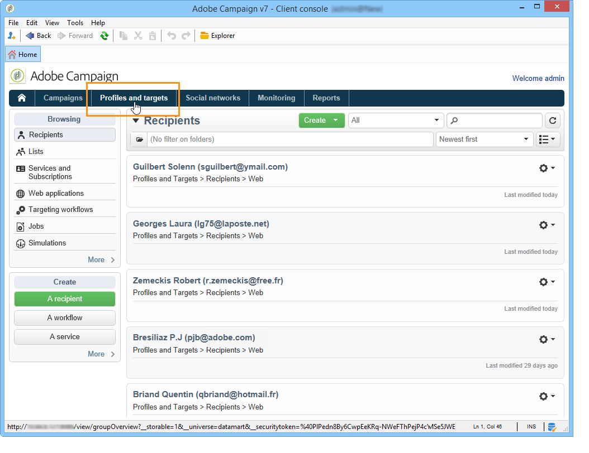

# Profielen{#about-profiles}

## Profieltypen {#profile-types}

Met Adobe Campaign kunt u profielen gedurende de volledige levenscyclus beheren: maken, importeren, aanwijzen, handelingen bijhouden, bijwerken, enz.

Elk profiel komt overeen met een database-item. Zij bevatten alle informatie die vereist is voor het richten, kwalificeren en volgen van personen.

Profielen kunnen worden geïdentificeerd op basis van opslagruimte. Dit betekent dat een profiel kan overeenkomen met: een ontvanger, een bezoeker, een exploitant, een abonnee, een vooruitzicht, enz.

## Ontvangerprofielen {#recipient-profiles}

Ontvangers van de levering worden in de database opgeslagen als profielen die de aan hen gekoppelde informatie bevatten: achternaam, voornaam, adres, abonnementen, leveringen, enz. Wanneer u campagnes creeert, kunt u het doel van de leveringen aan een selectie van de profielen in de basis volgens eenvoudige of geavanceerde criteria bepalen.

U kunt ook campagnes maken voor ontvangers waarvan de profielen niet in de database maar in bestanden worden opgeslagen. Deze worden &quot;externe&quot; leveringen genoemd. Raadpleeg [deze pagina](../../delivery/using/steps-defining-the-target-population.md#selecting-external-recipients)voor meer informatie over dit type levering.

De belangrijkste methoden voor het maken van profielen voor ontvangers zijn:

* directe invoer in de grafische interfaceschermen,
* lijsten met ontvangers importeren,
* online verzameling via webformulieren.

>[!NOTE]
>
>Als u wilt weten hoe bestanden en webformulieren worden geïmporteerd, raadpleegt u [Algemene import en export](../../platform/using/generic-imports-and-exports.md).

## Profielen en doelen {#profiles-and-targets}

Met de **[!UICONTROL Profiles and targets]** koppeling kunt u ontvangers weergeven die zijn opgeslagen in de Adobe Campaign-database. U kunt een nieuwe ontvanger maken, een bestaande ontvanger bewerken en het bijbehorende profiel openen. Raadpleeg [deze pagina](../../platform/using/editing-a-profile.md)voor meer informatie.

Het geeft u ook toegang tot:

* lijsten; zie [Lijsten](../../platform/using/creating-and-managing-lists.md)maken en beheren,
* abonnementsdiensten; verwijzen naar [deze pagina](../../delivery/using/managing-subscriptions.md),
* webtoepassingen; verwijzen naar [deze pagina](../../web/using/about-web-applications.md),
* invoer en uitvoer ( werkgelegenheid ) ; verwijzen naar [algemene invoer en uitvoer](../../platform/using/generic-imports-and-exports.md);
* doelgerichte werkstromen; verwijzen naar [deze pagina](../../workflow/using/building-a-workflow.md#implementation-steps-).

Op de pagina met ontvangers kunt u veelvuldige bewerkingen uitvoeren op profielen: bewerkingen, updates, toevoegingen, verwijderingen, sorteren.

Voor geavanceerdere profielmanipulaties moet u de Adobe Campagnestructuur bewerken. Klik hiertoe op de **[!UICONTROL Explorer]** koppeling op de startpagina van Adobe Campagne.

Door gebrek, worden de ontvangers opgeslagen in de **[!UICONTROL Profiles and Targets > Recipients]** knoop van de boom. U kunt ontvangers maken vanuit deze weergave en ook:

* de profielen van de database sorteren en filteren; zie [Filteropties](../../platform/using/filtering-options.md);
* profielen uit de database verplaatsen, kopiëren of verwijderen; zie [Profielen](../../platform/using/managing-profiles.md)beheren;
* updateprofielen; zie Gegevens [bijwerken](../../platform/using/updating-data.md),
* ontvangers van uitvoer; zie Profielen exporteren en importeren;
* groepen ontvangers creëren; zie Lijsten [maken en beheren](../../platform/using/creating-and-managing-lists.md).

Voor toegang tot geavanceerde functies en configuraties moet u op het **[!UICONTROL Explorer]** pictogram klikken.

De algemene lay-out van de Adobe Campaign Explorer wordt weergegeven in de [Adobe Campaign-verkenner](../../platform/using/adobe-campaign-workspace.md#using-adobe-campaign-explorer)gebruiken.

>[!NOTE]
>
>U kunt een geavanceerde weergave van deze lijst ook weergeven vanuit de Adobe Campagne-structuur door op de **[!UICONTROL Profiles and targets > Recipients]** koppeling te klikken. De lijstvertoning kan aan uw behoeften worden gevormd. U kunt kolommen toevoegen of verwijderen, de kolomvolgorde, de sorteergegevens enzovoort definiëren. De weergaveconfiguratie voor lijsten wordt beschreven in [Adobe Campagneverkenner](../../platform/using/adobe-campaign-workspace.md#using-adobe-campaign-explorer)gebruiken.
>
>U kunt ook de weergave voor ontvangers definiëren. Zie [Mappen en weergaven](../../platform/using/access-management.md#folders-and-views)voor meer informatie over deze functionaliteit.

## Actieve profielen {#active-profiles}

Actieve profielen zijn de profielen die voor factureringsdoeleinden worden geteld.

&quot;**Profiel**&quot;: een informatiedossier (bv.: een record in de nmsRecipient-tabel of een externe tabel met een cookie-id, de klant-id, de mobiele id of andere informatie die relevant is voor een bepaald kanaal) die een eindklant, perspectief of lead vertegenwoordigt.

Facturering heeft alleen betrekking op profielen die **actief** zijn. Een profiel wordt als actief beschouwd als het profiel de afgelopen twaalf maanden via een kanaal als doel is aangewezen of met het profiel is gecommuniceerd.

>[!NOTE]
>
>Er wordt geen rekening gehouden met de kanalen Facebook en Twitter.

U kunt een overzicht van **[!UICONTROL Number of active profiles]** van het **[!UICONTROL Administration > Campaign Management > Customer metrics]** menu hebben.

Het daadwerkelijke aantal wordt uitgevoerd door het **[!UICONTROL Number of active billing profiles]** (**[!UICONTROL billingActiveContactCount]**) [technische werkschema](../../workflow/using/delivery.md), dat elke dag loopt en de nieuwe gegevens aan het bestaande rapport voor de huidige periode in het **[!UICONTROL Customer metrics]** menu toevoegt. Elke periode duurt 12 maanden.

Er wordt geen rekening gehouden met de profielen die tijdens de voorbereiding van de levering zijn uitgesloten (typologische regels, quarantaine). Een profiel dat voor meerdere leveringen is bestemd, wordt slechts eenmaal meegeteld.
