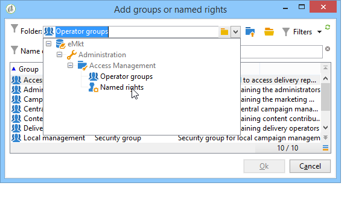

# Operatoren maken en beheren {#operators}

## Aan de slag met campagneoperatoren {#about-operators}

Een operator is een Adobe Campaign-gebruiker die gemachtigd is om zich aan te melden en handelingen uit te voeren.

Operatoren worden standaard opgeslagen in het knooppunt **[!UICONTROL Administration > Access management > Operators]**.

Operatoren kunnen handmatig worden gemaakt of toegewezen aan een bestaande LDAP-directory.

De volledige procedure voor het maken van een operator wordt beschreven in [deze pagina](#creating-an-operator).

Raadpleeg [deze pagina](../../installation/using/connecting-through-ldap.md) voor meer informatie over de integratie met Adobe Campaign en LDAP.

>[!IMPORTANT]
>
>Operatoren moeten zijn gekoppeld aan een beveiligingszone om zich aan te melden bij een instantie. Raadpleeg [deze pagina](../../installation/using/security-zones.md) voor meer informatie over beveiligingszones in Adobe Campaign.

Gebruikers kunnen ook rechtstreeks verbinding maken met Adobe Campaign via hun Adobe ID. Raadpleeg [deze pagina](../../integrations/using/about-adobe-id.md) voor meer informatie.

## Een operator {#creating-an-operator} maken

Voer de volgende stappen uit om een nieuwe operator te maken en machtigingen te verlenen:

1. Klik op de knop **[!UICONTROL New]** boven de lijst met operatoren en voer de details van de nieuwe operator in.

   

1. Geef de **[!UICONTROL Identification parameters]** van de gebruiker op: zijn aanmelding, wachtwoord en naam. De aanmeldingsnaam en het wachtwoord worden door de operator gebruikt om u aan te melden bij Adobe Campaign. Zodra de gebruiker het programma wordt geopend, kunnen zij hun wachtwoord via het **[!UICONTROL Tools > Change password]** menu veranderen. Het e-mailadres van de exploitant is essentieel omdat het de exploitant in staat stelt meldingen te ontvangen, bijvoorbeeld bij de verwerking van goedkeuringen.

   In deze sectie kunt u ook een operator koppelen aan een organisatie-entiteit. Raadpleeg voor meer informatie de [deze pagina](../../campaign/using/about-distributed-marketing.md).

1. Selecteer de toestemmingen die aan de exploitant in **[!UICONTROL Operator access rights]** sectie worden verleend.

   Als u rechten wilt toewijzen aan de operator, klikt u op de knop **[!UICONTROL Add]** boven de lijst met rechten en selecteert u vervolgens een groep operatoren in de lijst met beschikbare groepen:

   

   U kunt ook een of meer benoemde rechten selecteren (zie [Benoemde rechten](#named-rights)). Klik hiertoe op de pijl rechts van het veld **[!UICONTROL Folder]** en selecteer **[!UICONTROL Named rights]**:

   

   Selecteer groepen en/of benoemde rechten die u wilt toewijzen en klik op **[!UICONTROL OK]** om te valideren.

1. Klik **[!UICONTROL Ok]** om de exploitant tot stand te brengen: het profiel wordt toegevoegd aan de lijst met bestaande operatoren.

   

>[!NOTE]
>
>U kunt de operatoren naar wens ordenen door nieuwe operatormappen te maken. Klik hiertoe met de rechtermuisknop op de operatormap en selecteer **[!UICONTROL Add an 'Operators' folder]**.

Nadat het profiel van de operator is gemaakt, kunt u de gegevens ervan toevoegen of bijwerken. Klik hiertoe op het tabblad **[!UICONTROL Edit]**.

>[!NOTE]
>
>Met het veld **[!UICONTROL Session timeout]** kunt u de vertraging vóór de FDA-sessietime-out aanpassen. Raadpleeg [Informatie over Federated Data Access](../../installation/using/about-fda.md) voor meer informatie.

## De tijdzone van de operator {#time-zone-of-the-operator} definiëren

Op het tabblad **[!UICONTROL General]** kunt u de tijdzone van de operator selecteren. Operatoren werken standaard in de tijdzone van de server. Het is echter mogelijk een andere tijdzone te selecteren met de vervolgkeuzelijst.

De configuratie van tijdzones wordt beschreven in [deze pagina](../../installation/using/time-zone-management.md).

>[!NOTE]
>
>Voor samenwerkingsverbanden binnen verschillende tijdzones moeten datums in UTC worden opgeslagen. Datums worden in de juiste tijdzone geconverteerd in de volgende context: wanneer een datum in de gebruikerstijdzone wordt getoond, wanneer de dossiers worden ingevoerd en uitgevoerd, wanneer een e-maillevering gepland is, wanneer de activiteiten in een werkschema (planner, wacht, tijdbeperking, enz.) worden gepland
>
>Restricties en aanbevelingen in verband met deze contexten worden weergegeven in verwante secties van de documentatie van Adobe Campaign.

Daarnaast kunt u in de vervolgkeuzelijst **[!UICONTROL Regional settings]** de notatie selecteren voor het weergeven van datums en getallen.

## Machtigingen toevoegen {#access-rights-options}

Gebruik het tabblad **[!UICONTROL Access rights]** om de groepen en benoemde rechten bij te werken die aan de operator zijn gekoppeld.

Met de koppeling **[!UICONTROL Edit the access parameters...]** hebt u toegang tot de volgende opties:

* Met de optie **[!UICONTROL Disable account]** kunt u de account van de operator uitschakelen: Hij heeft geen toegang meer tot Adobe Campaign.

   >[!NOTE]
   >
   >Zelfs als zijn account is uitgeschakeld, kan de operator nog steeds waarschuwingen of meldingen ontvangen van Campagne. Adobe raadt u aan het e-mailadres uit zijn profiel te verwijderen om te stoppen met het verzenden van campagnemeldingen naar deze operator.

* Met de optie **[!UICONTROL Forbid access from the rich client]** kunt u het gebruik van Adobe Campaign beperken tot [Webtoegang](../../platform/using/adobe-campaign-workspace.md#console-and-web-access) of via API&#39;s: toegang tot de Adobe Campaign-clientconsole is niet meer beschikbaar.
* Het is mogelijk om een veiligheidszone aan de exploitant te verbinden. Raadpleeg [deze pagina](../../installation/using/security-zones.md) voor meer informatie.
* U kunt een vertrouwd IP masker ook bepalen gebruikend de aangewezen verbinding.

   De operator kan verbinding maken met Adobe Campaign zonder het wachtwoord in te voeren als het IP-adres in deze lijst staat.

   U kunt ook een set IP-adressen opgeven die zonder wachtwoord verbinding mogen maken, zoals in het volgende voorbeeld:

   

   >[!NOTE]
   >
   >Om toegang tot uw platform veilig te houden, moet deze optie met zorg worden gebruikt.

* Met de optie **[!UICONTROL Restrict to information found in sub-folders of:]** kunt u de rechten beperken die aan de operator van een map worden toegewezen. Alleen de submappen van het knooppunt dat in deze optie is opgegeven, zijn zichtbaar voor de gebruiker:

   

   >[!IMPORTANT]
   >
   >Dit is een zeer strenge beperking en het moet met voorzichtigheid worden gebruikt. Een exploitant die met dit type van rechten het programma wordt geopend kan slechts de inhoud van de gespecificeerde omslag zien, en heeft geen toegang tot een andere knoop van de boom via de ontdekkingsreiziger. Afhankelijk van de functies waartoe hij toegang heeft (bijvoorbeeld: werkstromen), kan hij gegevens tonen die gewoonlijk in knopen worden opgeslagen die hij niet kan zien.

### Instellingen {#check-settings} controleren

Op het tabblad **[!UICONTROL Audit]** kunt u informatie met betrekking tot de operator weergeven. De verschillende tabbladen worden automatisch toegevoegd op basis van de instellingen die zijn gedefinieerd in het interventiegebied van de operator.

U hebt toegang tot:

* De lijst met rechten voor mappen die aan de operator zijn gekoppeld.

   

   >[!NOTE]
   >
   >Raadpleeg [Maptoegangsbeheer](#folder-access-management) voor meer informatie hierover.

* Het erkenningslogboek van de exploitant.

   

* De lijst met discussieforums waarop ze zich hebben geabonneerd.
* Gebeurtenissen in hun kalender.
* De lijst met taken die aan hen zijn toegewezen.

## Standaardoperatoren {#default-operators}

Adobe Campaign gebruikt technische operatoren met profielen die standaard zijn geconfigureerd: Beheerder (&#39;admin&#39;), Facturering (&#39;facturering&#39;), Controle, Web application agent (&#39;webapp&#39;), enz. Sommige hiervan zijn afhankelijk van de toepassingen en opties die op het platform zijn geïnstalleerd: De &quot;centrale&quot;en &quot;lokale&quot;exploitanten, bijvoorbeeld, zijn slechts zichtbaar als de Verdeelde optie van de Marketing wordt geïnstalleerd.

>[!IMPORTANT]
>
>Deze technische operatoren worden standaard op de hoogte gesteld wanneer het platform informatieberichten retourneert. We raden u ten zeerste aan een contactbericht voor hen te verzenden.
>
>Om ervoor te zorgen dat webtoepassingen correct werken, raden we u ook aan geen specifieke regionale instellingen voor de operator &#39;webapp&#39; te definiëren.

De technische operator &#39;webapp&#39; heeft standaard het benoemde BEHEERRECHT, wat tot beveiligingsrisico&#39;s kan leiden. We raden u aan dit recht te verwijderen om dit probleem op te lossen. Dit doet u als volgt:

1. Van **[!UICONTROL Administration > Access management > Named rights]** knoop, klik **[!UICONTROL New]** om een recht tot stand te brengen en het WEBAPP te noemen.

   

   Benoemde rechten worden beschreven in de sectie [Benoemde rechten](#named-rights).

1. Selecteer in het knooppunt **[!UICONTROL Administration > Access management > Operators]** de webapplicatieagent (&#39;webapp&#39;).

   Selecteer de tab **[!UICONTROL Edit]**, dan de tab **[!UICONTROL Access rights]** en verwijder de rechts genoemde BEHEERDER uit de lijst.

   

   Klik **[!UICONTROL Add]** en selecteer het recht WEBAPP dat u net hebt gecreeerd, dan sparen uw veranderingen.

   

1. Wijs de operator &#39;webapp&#39; toegangsrechten toe voor het lezen en schrijven van gegevens voor de mappen die betrekking hebben op deze operator, in de eerste plaats de mappen &#39;Ontvanger&#39;.

   

   Het wijzigen van rechten voor boommappen wordt beschreven in de sectie [Maptoegangsbeheer](#folder-access-management).

>[!NOTE]
>
>Raadpleeg [Controlelijst voor Adobe Campaign-beveiligingsconfiguratie](https://helpx.adobe.com/nl/campaign/kb/acc-security.html) voor meer informatie over beveiligingsrichtlijnen.
