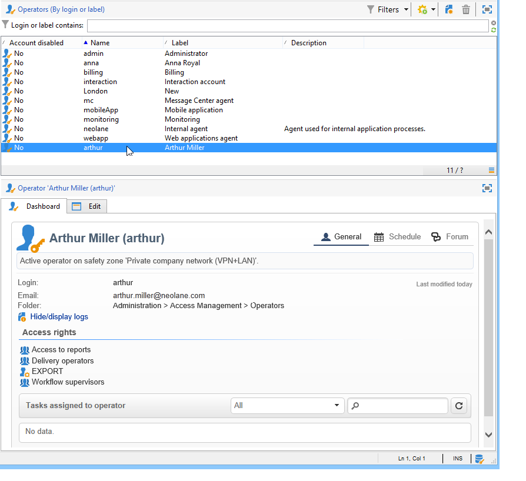
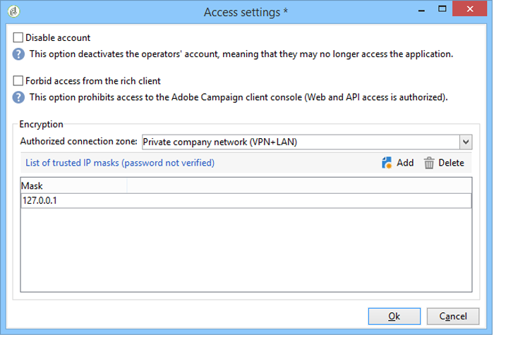
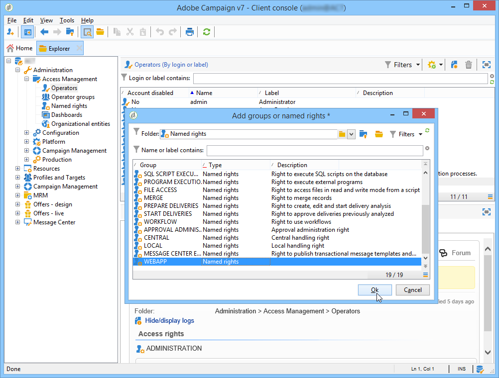
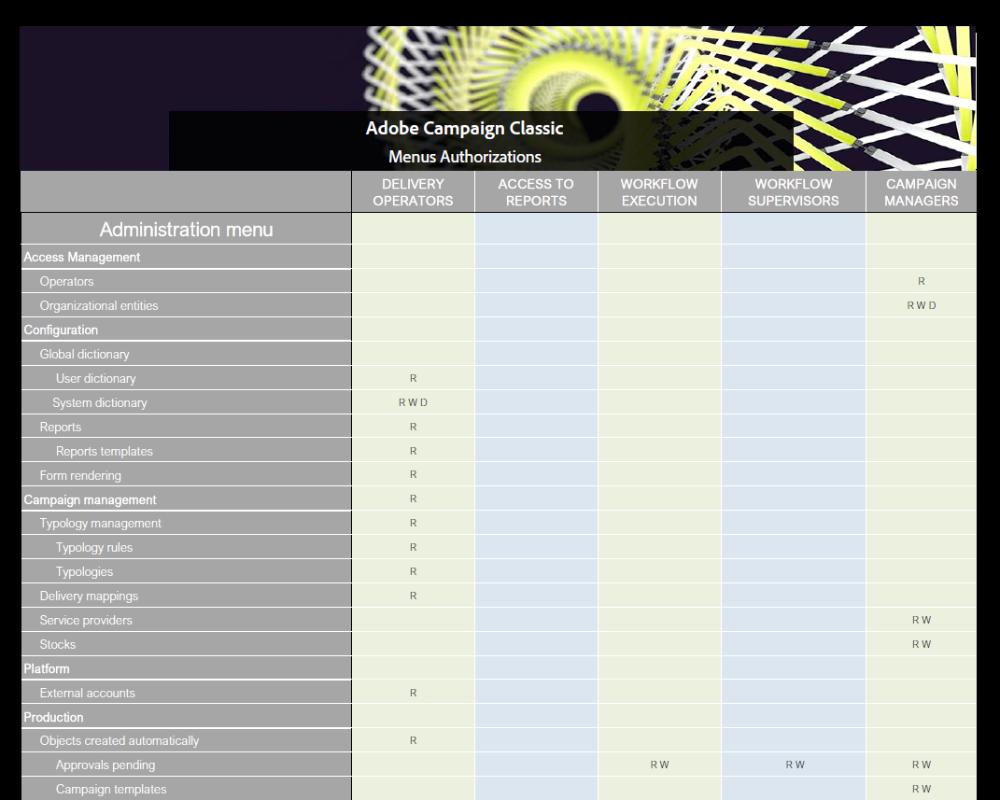
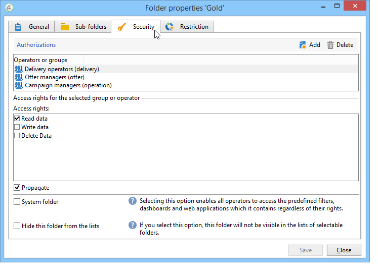
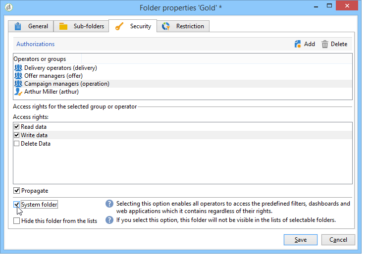

# Toegangscontrole{#access-management}

## Informatie over machtigingen {#about-permissions}

Met Adobe Campaign kunt u de rechten definiëren en beheren die aan de verschillende operatoren zijn toegewezen. Dit zijn een reeks rechten en beperkingen die autoriseren of weigeren:

* Toegang tot bepaalde functies (via genoemde rechten);
* Toegang tot bepaalde registers,
* Opstellen, wijzigen en/of verwijderen van registers (acties, contacten, campagnes, groepen, enz.).

De machtigingen zijn van toepassing op operatorprofielen of groepen operatoren.

Zij worden aangevuld met veiligheidsparameters die gekoppeld zijn aan de verbindingsmodus van de exploitant met Adobe Campaign. Raadpleeg [deze pagina](../../installation/using/configuring-campaign-server.md#defining-security-zones) voor meer informatie.

Er zijn twee soorten toestemmingen u aan een gebruiker kunt verlenen:

* U kunt groepen operatoren definiëren waaraan u rechten toewijst en de operatoren vervolgens koppelen aan een of meer groepen. Op deze manier kunt u rechten opnieuw gebruiken en de consistentie van operatorprofielen verhogen. Het vergemakkelijkt ook het beheer en het onderhoud van profielen. Het creëren en het beheer van de groep worden voorgesteld in [groepen van Exploitanten](#operator-groups).
* U kunt benoemde rechten rechtstreeks toewijzen aan gebruikers, in sommige gevallen om de rechten die via groepen zijn toegewezen, te overladen. Deze rechten worden gepresenteerd in [Benoemde rechten](#named-rights).

>[!NOTE]
>
>Voordat u begint met het definiëren van machtigingen, raadt Adobe u aan de [checklist voor beveiligingsconfiguratie](https://helpx.adobe.com/nl/campaign/kb/acc-security.html) te lezen.

## Operatoren {#operators}

### Informatie over operatoren {#about-operators}

Een operator is een Adobe Campaign-gebruiker die gemachtigd is om zich aan te melden en handelingen uit te voeren.

Operatoren worden standaard opgeslagen in het knooppunt **[!UICONTROL Administration > Access management > Operators]**.

Operatoren kunnen handmatig worden gemaakt of toegewezen aan een bestaande LDAP-directory.

De volledige procedure voor het maken van een operator wordt beschreven in [deze pagina](#creating-an-operator).

Raadpleeg [deze pagina](../../installation/using/connecting-through-ldap.md) voor meer informatie over de integratie met Adobe Campaign en LDAP.

>[!IMPORTANT]
>
>Operatoren moeten zijn gekoppeld aan een beveiligingszone om zich aan te melden bij een instantie. Raadpleeg [deze pagina](../../installation/using/configuring-campaign-server.md#defining-security-zones) voor meer informatie over beveiligingszones in Adobe Campaign.

Gebruikers kunnen ook rechtstreeks verbinding maken met Adobe Campaign via hun Adobe ID. Raadpleeg [deze pagina](../../integrations/using/about-adobe-id.md) voor meer informatie.

### Een operator {#creating-an-operator} maken

Voer de volgende stappen uit om een nieuwe operator te maken en machtigingen te verlenen:

1. Klik op de knop **[!UICONTROL New]** boven de lijst met operatoren en voer de details van de nieuwe operator in.

   

1. Geef de **[!UICONTROL Identification parameters]** van de gebruiker op: zijn aanmelding, wachtwoord en naam. De aanmeldingsnaam en het wachtwoord worden door de operator gebruikt om u aan te melden bij Adobe Campaign. Zodra de gebruiker het programma wordt geopend, kunnen zij hun wachtwoord via het **[!UICONTROL Tools > Change password]** menu veranderen. Het e-mailadres van de exploitant is essentieel omdat het de exploitant in staat stelt meldingen te ontvangen, bijvoorbeeld bij de verwerking van goedkeuringen.

   In deze sectie kunt u ook een operator koppelen aan een organisatie-entiteit. Raadpleeg voor meer informatie de [deze pagina](../../campaign/using/about-distributed-marketing.md).

1. Selecteer de toestemmingen die aan de exploitant in **[!UICONTROL Operator access rights]** sectie worden verleend.

   Als u rechten wilt toewijzen aan de operator, klikt u op de knop **[!UICONTROL Add]** boven de lijst met rechten en selecteert u vervolgens een groep operatoren in de lijst met beschikbare groepen:

   

   U kunt ook een of meer benoemde rechten selecteren (zie [Benoemde rechten](#named-rights)). Klik hiertoe op de pijl rechts van het veld **[!UICONTROL Folder]** en selecteer **[!UICONTROL Named rights]**:

   

   Selecteer groepen en/of benoemde rechten die u wilt toewijzen en klik op **[!UICONTROL OK]** om te valideren.

1. Klik **[!UICONTROL Ok]** om de exploitant tot stand te brengen: het profiel wordt toegevoegd aan de lijst met bestaande operatoren.

   

>[!NOTE]
>
>U kunt de operatoren naar wens ordenen door nieuwe operatormappen te maken. Klik hiertoe met de rechtermuisknop op de operatormap en selecteer **[!UICONTROL Add an 'Operators' folder]**.

Nadat het profiel van de operator is gemaakt, kunt u de gegevens ervan toevoegen of bijwerken. Klik hiertoe op het tabblad **[!UICONTROL Edit]**.

>[!NOTE]
>
>Met het veld **[!UICONTROL Session timeout]** kunt u de vertraging vóór de FDA-sessietime-out aanpassen. Raadpleeg [Informatie over Federated Data Access](../../installation/using/about-fda.md) voor meer informatie.

### Tijdzone van de operator {#time-zone-of-the-operator}

Op het tabblad **[!UICONTROL General]** kunt u de tijdzone van de operator selecteren. Operatoren werken standaard in de tijdzone van de server. Het is echter mogelijk een andere tijdzone te selecteren met de vervolgkeuzelijst.

De configuratie van tijdzones wordt beschreven in [deze pagina](../../installation/using/time-zone-management.md).

>[!NOTE]
>
>Voor samenwerkingsverbanden binnen verschillende tijdzones moeten datums in UTC worden opgeslagen. Datums worden in de juiste tijdzone geconverteerd in de volgende context: wanneer een datum in de gebruikerstijdzone wordt getoond, wanneer de dossiers worden ingevoerd en uitgevoerd, wanneer een e-maillevering gepland is, wanneer de activiteiten in een werkschema (planner, wacht, tijdbeperking, enz.) worden gepland
>
>Restricties en aanbevelingen in verband met deze contexten worden weergegeven in verwante secties van de documentatie van Adobe Campaign.

Daarnaast kunt u in de vervolgkeuzelijst **[!UICONTROL Regional settings]** de notatie selecteren voor het weergeven van datums en getallen.

### Opties voor toegangsrechten {#access-rights-options}

Gebruik het tabblad **[!UICONTROL Access rights]** om de groepen en benoemde rechten bij te werken die aan de operator zijn gekoppeld.

Met de koppeling **[!UICONTROL Edit the access parameters...]** hebt u toegang tot de volgende opties:

* Met de optie **[!UICONTROL Disable account]** kunt u de account van de operator uitschakelen: Hij heeft geen toegang meer tot Adobe Campaign.
* Met de optie **[!UICONTROL Forbid access from the rich client]** kunt u het gebruik van Adobe Campaign beperken tot [Webtoegang](../../platform/using/adobe-campaign-workspace.md#console-and-web-access) of via API&#39;s: toegang tot de Adobe Campaign-clientconsole is niet meer beschikbaar.
* Het is mogelijk om een veiligheidszone aan de exploitant te verbinden. Raadpleeg [deze pagina](../../installation/using/configuring-campaign-server.md#defining-security-zones) voor meer informatie.
* U kunt een vertrouwd IP masker ook bepalen gebruikend de aangewezen verbinding.

   De operator kan verbinding maken met Adobe Campaign zonder het wachtwoord in te voeren als het IP-adres in deze lijst staat.

   U kunt ook een set IP-adressen opgeven die zonder wachtwoord verbinding mogen maken, zoals in het volgende voorbeeld:

   

   >[!NOTE]
   >
   >Om toegang tot uw platform veilig te houden, moet deze optie met zorg worden gebruikt.

* Met de optie **[!UICONTROL Restrict to information found in sub-folders of:]** kunt u de rechten beperken die aan de operator van een map worden toegewezen. Alleen de submappen van het knooppunt dat in deze optie is opgegeven, zijn zichtbaar voor de gebruiker:

   

   >[!IMPORTANT]
   >
   >Dit is een zeer strenge beperking en het moet met voorzichtigheid worden gebruikt. Een exploitant die met dit type van rechten het programma wordt geopend kan slechts de inhoud van de gespecificeerde omslag zien, en heeft geen toegang tot een andere knoop van de boom via de ontdekkingsreiziger. Afhankelijk van de functies waartoe hij toegang heeft (bijvoorbeeld: werkstromen), kan hij gegevens tonen die gewoonlijk in knopen worden opgeslagen die hij niet kan zien.

### Mappen, goedkeuring en taken van een exploitant {#folders--approval-and-tasks-of-an-operator}

Op het tabblad **[!UICONTROL Audit]** kunt u informatie met betrekking tot de operator weergeven. De verschillende tabbladen worden automatisch toegevoegd op basis van de instellingen die zijn gedefinieerd in het interventiegebied van de operator.

U hebt toegang tot:

* De lijst met rechten voor mappen die aan de operator zijn gekoppeld.

   

   >[!NOTE]
   >
   >Raadpleeg [Maptoegangsbeheer](#folder-access-management) voor meer informatie hierover.

* Het erkenningslogboek van de exploitant.

   

* De lijst met discussieforums waarop ze zich hebben geabonneerd.
* Gebeurtenissen in hun kalender.
* De lijst met taken die aan hen zijn toegewezen.

### Standaardoperatoren {#default-operators}

Adobe Campaign gebruikt technische operatoren met profielen die standaard zijn geconfigureerd: Beheerder (&#39;admin&#39;), Facturering (&#39;facturering&#39;), Controle, Web application agent (&#39;webapp&#39;), enz. Sommige hiervan zijn afhankelijk van de toepassingen en opties die op het platform zijn geïnstalleerd: De &quot;centrale&quot;en &quot;lokale&quot;exploitanten, bijvoorbeeld, zijn slechts zichtbaar als de Verdeelde optie van de Marketing wordt geïnstalleerd.

>[!IMPORTANT]
>
>Deze technische operatoren worden standaard op de hoogte gesteld wanneer het platform informatieberichten retourneert. We raden u ten zeerste aan een contactbericht voor hen te verzenden.
>
>Om ervoor te zorgen dat webtoepassingen correct werken, raden we u ook aan geen specifieke regionale instellingen voor de operator &#39;webapp&#39; te definiëren.

De technische operator &#39;webapp&#39; heeft standaard het benoemde BEHEERRECHT, wat tot beveiligingsrisico&#39;s kan leiden. We raden u aan dit recht te verwijderen om dit probleem op te lossen. Dit doet u als volgt:

1. Van **[!UICONTROL Administration > Access management > Named rights]** knoop, klik **[!UICONTROL New]** om een recht tot stand te brengen en het WEBAPP te noemen.

   

   Benoemde rechten worden beschreven in de sectie [Benoemde rechten](#named-rights).

1. Selecteer in het knooppunt **[!UICONTROL Administration > Access management > Operators]** de webapplicatieagent (&#39;webapp&#39;).

   Selecteer de tab **[!UICONTROL Edit]**, dan de tab **[!UICONTROL Access rights]** en verwijder de rechts genoemde BEHEERDER uit de lijst.

   

   Klik **[!UICONTROL Add]** en selecteer het recht WEBAPP dat u net hebt gecreeerd, dan sparen uw veranderingen.

   

1. Wijs de operator &#39;webapp&#39; toegangsrechten toe voor het lezen en schrijven van gegevens voor de mappen die betrekking hebben op deze operator, in de eerste plaats de mappen &#39;Ontvanger&#39;.

   

   Het wijzigen van rechten voor boommappen wordt beschreven in de sectie [Maptoegangsbeheer](#folder-access-management).

>[!NOTE]
>
>Raadpleeg [Controlelijst voor Adobe Campaign-beveiligingsconfiguratie](https://helpx.adobe.com/campaign/kb/acc-security.html) voor meer informatie over beveiligingsrichtlijnen.

## Exploitantgroepen {#operator-groups}

Operatorgroepen worden gemaakt via het knooppunt **[!UICONTROL Administration > Access management > Operator groups]** in de structuur.

### Nieuwe operatorgroep maken {#creating-a-new-operator-group}

Voer de volgende stappen uit om een nieuwe operatorgroep te maken:

1. Klik op de knop **[!UICONTROL New]** rechts van de lijst met groepen of klik met de rechtermuisknop op de lijst en kies **[!UICONTROL New]**.
1. Voer in het onderste venster van de sectie op het tabblad **[!UICONTROL General]** de naam en een beschrijving voor deze groep in de desbetreffende velden in.

   

1. Klik op het tabblad **[!UICONTROL Content]** om machtigingen voor deze groep te definiëren.
1. Klik op de knop **[!UICONTROL Add]** om een toegewezen recht of een operator te selecteren die aan de groep moet worden gekoppeld.
1. Klik op de vervolgkeuzelijst of op de map rechts van het veld **[!UICONTROL Folder]** om de toegewezen rechten of operatoren te zoeken die aan deze groep moeten worden gekoppeld.
1. Selecteer de rechten of operatoren die u wilt toevoegen en klik op **[!UICONTROL OK]** om te valideren.

   

   Herhaal deze bewerking om andere rechten of operatoren toe te voegen.

1. Klik op de knop **[!UICONTROL Save]** om de groep aan de lijst toe te voegen.

### Standaardgroepen {#default-groups}

De standaardgroepen met operatoren zijn:

1. **[!UICONTROL Administrator]**

   De operatoren in deze groep hebben volledige toegang tot het exemplaar. Beheerders zijn gebruikers die toegang hebben tot de meest technische onderdelen van de interface. Zij houden de **[!UICONTROL Administration]** rol en zorgen ervoor dat het platform allen opstelling is.

   Deze groep bevat het volgende benoemde recht:

   * **[!UICONTROL ADMINISTRATION]**: het recht om objecten zoals workflow, levering, scripts, enz. uit te voeren, te maken, te bewerken/te verwijderen.

1. **[!UICONTROL Delivery operators]**

   De exploitanten in deze groep zijn verantwoordelijk voor het beheer van de leveringen: zij verlenen toegang tot de belangrijkste middelen die voor het creëren van en het voorbereiden van levering worden vereist (campagneretypologieën, leveringsafbeeldingen, standaardmalplaatjes, verpersoonlijkingsblokken, enz.).

   Deze groep bevat de volgende benoemde rechten:

   * **[!UICONTROL PREPARE DELIVERIES]**: het recht om de leveringsanalyse te maken, te bewerken en te starten;
   * **[!UICONTROL START DELIVERIES]**: het recht om eerder geanalyseerde leveringen goed te keuren.

1. **[!UICONTROL Campaign managers]**

   De exploitanten in deze groep kunnen marketingcampagnes beheren: hiermee hebt u toegang tot de objecten die aan campagnes zijn gekoppeld (plannen, programma&#39;s, workflows, budgetten, enz.) binnen het kader van **[!UICONTROL Campaign]** (optionele Adobe Campaign-module).

   Deze groep bevat de volgende benoemde rechten:

   * **[!UICONTROL INSERT FOLDERS]**: het recht om mappen in te voegen in de Adobe Campaign-structuur (op voorwaarde dat u bewerkingsrechten hebt voor de betrokken vertakkingen);
   * **[!UICONTROL WORKFLOW]**: recht om werkstromen te gebruiken.

   >[!NOTE]
   >
   >Met deze groep kunnen operatoren geen leveringen starten.

1. **[!UICONTROL Content contributors]**

   De operatoren in deze groep hebben toegang tot de mappen Inhoud binnen het kader van **[!UICONTROL Content management]** (optionele Adobe Campaign-module). Deze groep verleent geen aanvullende rechten.

1. **[!UICONTROL Access to reports]**

   Deze groep is gereserveerd voor externe operatoren, voor toegang tot de leveringsrapporten via een webtoegang.

1. **[!UICONTROL Workflow execution]**

   Met deze groep kunt u operatoren het recht geven om workflows te beheren die geen verband houden met campagnes.

1. **[!UICONTROL Workflow supervisors]**

   De operatoren in deze groep ontvangen een e-mailkennisgeving in geval van waarschuwingen over workflows voor campagnes.

1. Lokaal/centraal beheer

   Met deze groepen kunt u **[!UICONTROL Distributed marketing]** (optionele Adobe Campaign-module) gebruiken.

1. **[!UICONTROL Offer managers]**

   De operatoren in deze groep kunnen aanbiedingen maken en onderhouden. Raadpleeg deze [pagina](../../interaction/using/operator-profiles.md) voor meer informatie hierover.
Deze groep bevat de volgende benoemde rechten:

   * **[!UICONTROL INSERT FOLDERS]**: Recht om mappen in te voegen in de Adobe Campaign-structuur (op voorwaarde dat u bewerkrechten hebt voor de betrokken vertakkingen).
   * **[!UICONTROL EDIT FOLDERS]**: Recht om omslageigenschappen zoals interne naam, etiket, bijbehorende beeld, subomslagorde te veranderen, etc.

## Benoemde rechten {#named-rights}

Adobe Campaign stelt standaard een reeks benoemde rechten voor waarmee u de machtigingen kunt definiëren die aan operatoren en groepen operatoren zijn toegewezen. Deze rechten kunnen worden bewerkt vanaf het knooppunt **[!UICONTROL Administration > Access management > Named rights]** van de boomstructuur.

Deze rechten zijn als volgt:

* **[!UICONTROL ADMINISTRATION]**: Operatoren met  **[!UICONTROL ADMINISTRATION]** recht hebben volledige toegang tot het exemplaar. Beheerders kunnen elk object, zoals workflow, levering, scripts, enzovoort, uitvoeren, maken, bewerken of verwijderen.

* **[!UICONTROL APPROVAL ADMINISTRATION]**: U kunt meerdere goedkeuringsstappen instellen in workflows en leveringen om ervoor te zorgen dat de huidige status is goedgekeurd door een toegewezen operator of groep. Gebruikers met het recht **[!UICONTROL APPROVAL ADMINISTRATION]** kunnen goedkeuringsstappen instellen en ook een operator of groep van operatoren toewijzen die deze stappen moeten goedkeuren.

* **[!UICONTROL CENTRAL]**: Recht op centraal beheer (Distributed Marketing).

* **[!UICONTROL DELETE FOLDER]**: Rechts om mappen te verwijderen. Met dit recht kunnen gebruikers mappen verwijderen uit de verkennerweergave.

* **[!UICONTROL EDIT FOLDERS]**: Recht om omslageigenschappen zoals interne naam, etiket, bijbehorende beeld, subomslagorde te veranderen, etc.

* **[!UICONTROL EXPORT]**: Gebruikers kunnen gegevens uit hun Adobe Campaign-instanties naar een bestand op een server of lokale computer exporteren met behulp van de  **[!UICONTROL EXPORT]** workflowactiviteit.

* **[!UICONTROL FILES ACCESS]**: Recht om toegang voor dossiers te lezen en te schrijven via een manuscript dat in de  **[!UICONTROL JavaScript]** werkschemaactiviteit kan worden geschreven om dossiers op een server te lezen/te schrijven.

* **[!UICONTROL IMPORT]**: Recht op het importeren van generieke gegevens. **[!UICONTROL IMPORT]** kunt u gegevens in een andere tabel importeren, terwijl u  **[!UICONTROL RECIPIENT IMPORT]** rechts alleen in de tabel voor ontvangers kunt importeren.

* **[!UICONTROL INSERT FOLDERS]**: Recht om omslagen op te nemen. Gebruikers met de rechtermuisknop **[!UICONTROL INSERT FOLDERS]** kunnen nieuwe mappen maken in de mappenstructuur in de weergave Verkenner.

* **[!UICONTROL LOCAL]**: Recht op lokaal beheer (Distributed Marketing).

* **[!UICONTROL MERGE]**: Rechts om de geselecteerde records samen te voegen tot één record. Als ontvangers bestaan als duplicaten, staat het **[!UICONTROL MERGE]** recht gebruiker toe om de duplicaten te selecteren en hen samen te voegen in een primaire ontvanger.

* **[!UICONTROL PREPARE DELIVERIES]**: Recht om een levering te maken, te bewerken en op te slaan. Gebruikers met de juiste **[!UICONTROL PREPARE DELIVERIES]** kunnen ook het analyseproces voor de levering starten.

* **[!UICONTROL PRIVACY DATA RIGHT]**: Recht om privacygegevens te verzamelen en te schrappen. Raadpleeg [deze pagina](https://helpx.adobe.com/nl/campaign/kb/acc-privacy.html) voor meer informatie.

* **[!UICONTROL PROGRAM EXECUTION]**: Recht om bevelen in diverse programmeertalen uit te voeren.

* **[!UICONTROL RECIPIENT IMPORT]**: Recht om ontvangers in te voeren. Gebruikers met het recht **[!UICONTROL RECIPIENT IMPORT]** kunnen een lokaal bestand importeren in de ontvangende tabel.

* **[!UICONTROL SQL SCRIPT EXECUTION]** Recht om het even welk SQL bevel direct op het gegevensbestand uit te voeren.

* **[!UICONTROL START DELIVERIES]**: Recht om eerder geanalyseerde leveringen goed te keuren. Na de afleveringsanalyse wordt de levering onderbroken in verschillende goedkeuringsstappen en moet deze worden goedgekeurd om te worden hervat. Gebruikers met de rechteroptie **[!UICONTROL START DELIVERIES]** mogen leveringen goedkeuren.

* **[!UICONTROL USE SQL DATA MANAGEMENT ACTIVITY]**: Recht om uw eigen SQL manuscripten te schrijven gebruikend de SQL activiteit van het Beheer van Gegevens, om het werklijsten tot stand te brengen en te bevolken (zie  [deze sectie](../../workflow/using/sql-data-management.md)).

* **[!UICONTROL WORKFLOW]**: Recht om werkstromen uit te voeren. Zonder dit recht kunnen gebruikers geen workflows starten, stoppen of opnieuw starten.

* **[!UICONTROL WEBAPP]**: Recht om Webtoepassingen te gebruiken.

>[!NOTE]
>
>Deze lijst kan verschillen, afhankelijk van de invoegtoepassingen die op het platform zijn geïnstalleerd.

## Matrix met toegangsrechten {#access-rights-matrix}

Met standaardgroepen en benoemde rechten hebben operatoren toegang tot bepaalde mappen in de navigatiehiërarchie en kunnen ze lees-, schrijf- en verwijdermachtigingen verlenen.

De Adobe Campaign toegangsrechtenmatrix is [hier](/help/platform/using/assets/access-rights-matrix.pdf) beschikbaar.

## Beheer van maptoegang {#folder-access-management}

Elke map van de structuur bevat toegangsrechten voor lezen, schrijven en verwijderen. Om toegang te krijgen tot een bestand, moet een operator of groep operatoren ten minste lees-toegang hebben.

### Machtigingen bewerken voor een map {#edit-permissions-on-a-folder}

Voer de volgende stappen uit als u machtigingen voor een specifieke map in de structuur wilt bewerken:

1. Klik met de rechtermuisknop op de map en selecteer **[!UICONTROL Properties...]**.

   

1. Klik op het tabblad **[!UICONTROL Security]** om machtigingen voor deze map weer te geven.

   

### Machtigingen wijzigen {#modify-permissions}

Als u machtigingen wilt wijzigen, kunt u:

* **Een groep of operator** vervangen. Klik hiertoe op een van de groepen (of operatoren) met rechten voor de map en selecteer een nieuwe groep (of een nieuwe operator) in de vervolgkeuzelijst:

   

* **Een groep of operator** autoriseren. Klik hiertoe op de knop **[!UICONTROL Add]** en selecteer de groep of operator waaraan u machtigingen voor deze map wilt toewijzen.
* **Verbod een groep of een operator**. Om dit te doen, klik **[!UICONTROL Delete]** en selecteer de groep of de exploitant waarvan u vergunning voor deze omslag wilt verwijderen.
* **Selecteer de rechten die aan een groep of een operator** zijn toegewezen. Klik hiertoe op de betrokken groep of operator, selecteer vervolgens de toegangsrechten die u wilt verlenen en hef de selectie van de andere rechten op.

   

### Machtigingen {#propagate-permissions} doorgeven

U kunt machtigingen en toegangsrechten doorgeven. Selecteer hiertoe de optie **[!UICONTROL Propagate]** in de mapeigenschappen.

De in dit venster gedefinieerde autorisaties worden vervolgens toegepast op alle submappen van het huidige knooppunt. Vervolgens kunt u deze machtigingen voor elke submap te veel laden.

>[!NOTE]
>
>Als u deze optie voor een map wist, wordt deze niet automatisch gewist voor de submappen. U moet dit expliciet wissen voor elk van de submappen.

### Toegang verlenen aan alle operatoren {#grant-access-to-all-operators}

Als op het tabblad **[!UICONTROL Security]** de optie **[!UICONTROL System folder]** is geselecteerd, hebben alle operatoren toegang tot deze gegevens, ongeacht hun rechten. Als deze optie wordt ontruimd, moet u de exploitant (of hun groep) aan de lijst van toestemmingen uitdrukkelijk toevoegen om hen toegang te hebben.

## Mappen en weergaven {#folders-and-views}

### Informatie over mappen {#about-folders}

Mappen zijn knooppunten in Adobe Campaign-structuur. Deze knooppunten worden gemaakt door met de rechtermuisknop op de structuur te klikken via het menu **[!UICONTROL Add new folder]**. Standaard kunt u in het eerste menu de map toevoegen die overeenkomt met de huidige context.

U kunt machtigingen voor deze mappen verlenen, net als voor alle andere mappen in de structuur. Zie [Beheer van maptoegang](#folder-access-management).

### Informatie over weergaven {#about-views}

Daarnaast kunt u weergaven maken om de toegang tot gegevens te beperken en de inhoud van de structuur aan uw wensen aan te passen. U kunt vervolgens rechten toewijzen aan de weergaven.

Een weergave is een map waarin records worden weergegeven die fysiek zijn opgeslagen in een of meer andere mappen van hetzelfde type. Als u bijvoorbeeld een map Campagne maakt die een weergave is, worden standaard alle campagnes in de database weergegeven, ongeacht de oorsprong ervan. Deze gegevens kunnen vervolgens worden gefilterd.

Wanneer u een map naar een weergave converteert, worden alle gegevens die overeenkomen met het maptype dat in de database aanwezig is, weergegeven in de weergave, ongeacht de map waarin deze is opgeslagen. Vervolgens kunt u het filter filteren om de lijst met weergegeven gegevens te beperken.

>[!IMPORTANT]
>
>De weergaven bevatten gegevens en bieden toegang tot deze gegevens, maar de gegevens worden niet fysiek opgeslagen in de weergavemap. De exploitant moet de aangewezen rechten voor de gewenste actie in de omslagen van de gegevensbron (lees minstens toegang) hebben.
>
>Als u toegang tot een weergave wilt geven zonder toegang tot de bronmap, geeft u geen leestoegang op het bovenliggende knooppunt van de bronmap.

Om weergaven van mappen te onderscheiden, wordt de naam van elke weergave weergegeven in een andere kleur (donkercyaan).

### Mappen toevoegen en weergaven maken {#adding-folders-and-creating-views}

In het onderstaande voorbeeld maken we nieuwe mappen waarin specifieke gegevens worden weergegeven:

1. Maak een nieuwe **[!UICONTROL Deliveries]**-typemap en noem deze **Deliveries France**.
1. Klik met de rechtermuisknop op deze map en selecteer **[!UICONTROL Properties...]**.

   

1. Selecteer op het tabblad **[!UICONTROL Restriction]** de optie **[!UICONTROL This folder is a view]**. Alle leveringen in het gegevensbestand zullen dan worden getoond.

   

1. Bepaal de criteria van de leveringsfilter van de vraagredacteur in het middelste gedeelte van het venster: de campagnes die overeenkomen met het gedefinieerde filter worden dan weergegeven.

   >[!NOTE]
   >
   >De vraagredacteur wordt voorgesteld in [deze sectie](../../platform/using/about-queries-in-campaign.md).

   Met de volgende filtervoorwaarden:

De volgende leveringen worden weergegeven in de weergave:

>[!NOTE]
>
>Bij het beheren van [transactioneel overseinen](../../message-center/using/about-transactional-messaging.md) gebeurtenissen, moeten **[!UICONTROL Real time events]** of **[!UICONTROL Batch events]** omslagen niet als meningen op de uitvoeringsinstanties worden geplaatst, aangezien dit tot toegangsjuiste kwesties zou kunnen leiden. Zie [deze sectie](../../message-center/using/event-collection.md) voor meer informatie over het verzamelen van gebeurtenissen.