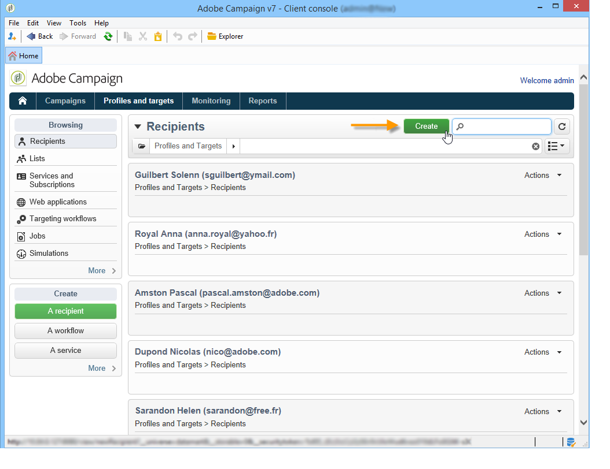

# Profielen toevoegen{#adding-profiles}

In de meeste gevallen worden profielen via een workflow [naar Campagne](../../workflow/using/importing-data.md)geïmporteerd. U kunt echter een of meer profielen rechtstreeks vanuit de interface toevoegen door op de **[!UICONTROL Create]** knop te klikken. Zij zullen dan aan het gegevensbestand worden toegevoegd.

Voer de informatie voor dit profiel in. De tabbladen en velden die moeten worden ingevuld, worden beschreven in [Een profiel](../../platform/using/editing-a-profile.md)bewerken.

Klik **[!UICONTROL Save]** om het maken van profielen te valideren. Het profiel wordt vervolgens toegevoegd aan de Adobe Campagne-database.
