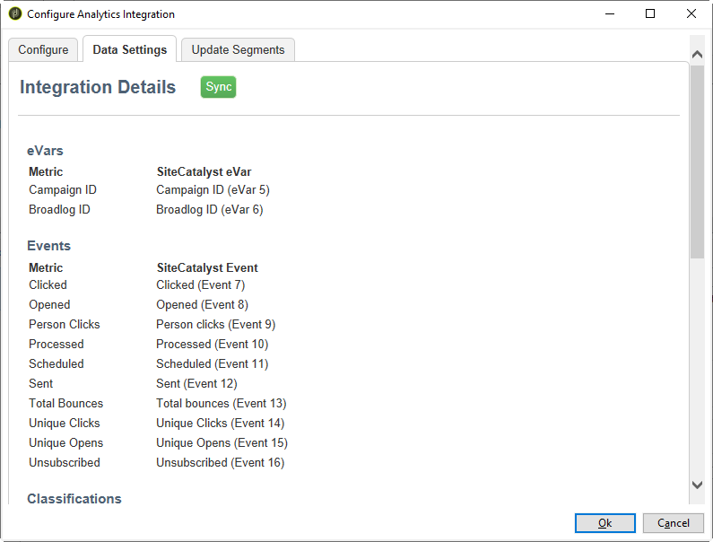

# Adobe Analytics Connector{#adobe-analytics-connector}

## De integratie van Adobe Analytics Connector {#about-analytics-connector-integration}

Met Adobe Analytics Connector kunnen Adobe Campaign en Adobe Analytics communiceren via het pakket **[!UICONTROL Web Analytics connectors]**. Het programma stuurt gegevens door naar Adobe Campaign in de vorm van segmenten over gebruikersgedrag na een e-mailcampagne. Omgekeerd verzendt het programma indicatoren en kenmerken van e-mailcampagnes die door Adobe Campaign aan Adobe Analytics worden geleverd.

>[!CAUTION]
>
>* Adobe Analytics Connector is niet compatibel met Transactional Messaging (Message Center).
>
>* Voordat u begint, moet u controleren of het Adobe Identity Management System (IMS) is geïmplementeerd in Campaign. [Meer informatie vindt u op deze pagina](../../integrations/using/about-adobe-id.md).

Met Adobe Analytics Connector kan Adobe Campaign de internetdoelgroep meten (Web Analytics). Dankzij deze integratie kan Adobe Campaign na een marketingcampagne gegevens over het gedrag van bezoekers van een of meer sites herstellen en (na analyse) remarketingcampagnes uitvoeren om deze in kopers om te zetten. Omgekeerd kan Adobe Campaign dankzij de webanalyticstools indicatoren en campagneattributen aan hun platforms doorsturen.

De actievelden voor elke tool zijn als volgt:

* De rol van webanalytics:

   1. markeert de e-mailcampagnes die met Adobe Campaign zijn gestart
   1. slaat het gedrag op dat ontvangers vertonen op de site die ze hebben verkend nadat ze op de campagne-e-mail hebben geklikt, in de vorm van segmenten. Segmenten hebben betrekking op verlaten producten (bekeken, maar niet toegevoegd aan de winkelwagen of gekocht), aankopen of verlaten winkelwagens.

* Rol van Adobe Campaign:

   1. verzendt de indicatoren en campagnekenmerken naar de connector, die ze weer naar de webanalyticstool doorstuurt,
   1. herstelt en analyseert segmenten
   1. activeert een remarketingcampagne.

## Integratie instellen {#setting-up-the-integration}

Als u de Data Connector wilt instellen, moet u verbinding maken met uw Adobe Campaign-instantie en de volgende bewerkingen uitvoeren:

1. [Uw rapportsuite maken in Adobe Analytics](#report-suite-analytics)
1. [Conversievariabelen en succesgebeurtenissen configureren](#configure-conversion-success)
1. [Uw externe account configureren in Adobe Campaign Classic](#external-account-classic)

### Rapportsuite maken in Adobe Analytics {#report-suite-analytics}

Als u de integratie tussen Adobe Analytics en Adobe Campaign Classic wilt instellen, moet u verbinding maken met uw [!DNL Adobe Analytics]-instantie en de volgende bewerkingen uitvoeren:

1. Selecteer vanuit [!DNL Adobe Analytics] het **[!UICONTROL Admin tab]** en klik vervolgens op **[!UICONTROL All admin]**.

   

1. Klik op **[!UICONTROL Report suites]**.

   

1. Klik op de pagina **[!UICONTROL Report suite manager]** op **[!UICONTROL Create new]** en vervolgens op **[!UICONTROL Report suite]**.

   Raadpleeg voor de gedetailleerde procedure over het maken van **[!UICONTROL Report suite]** deze [sectie](https://experienceleague.adobe.com/docs/analytics/admin/manage-report-suites/new-report-suite/t-create-a-report-suite.html?lang=nl#prerequisites).

   

1. Selecteer een sjabloon.

1. Configureer uw nieuwe rapportsuite met de volgende informatie:

   * **[!UICONTROL Report Suite ID]**
   * **[!UICONTROL Site Title]**
   * **[!UICONTROL Time Zone]**
   * **[!UICONTROL Go Live Date]**
   * **[!UICONTROL Estimated Page Views Per Day]**

   

1. Klik na de configuratie op **[!UICONTROL Create report suite]**.

### Conversievariabelen en succesgebeurtenissen configureren {#configure-conversion-success}

Nadat u uw **[!UICONTROL Report suite]** hebt gemaakt, moet u de **[!UICONTROL Conversion variables]** en **[!UICONTROL Success events]** als volgt configureren:

1. Selecteer de eerder geconfigureerde **[!UICONTROL Report suite]**.

1. Selecteer via de knop **[!UICONTROL Edit settings]** de optie  **[!UICONTROL Conversion]** >  **[!UICONTROL Conversion variables]**.

   

1. Klik op **[!UICONTROL Add new]** om de id&#39;s te maken die nodig zijn voor het meten van de impact van de e-mailcampagne, dat wil zeggen de interne naam van de campagne (cid) en de tabel-id van de iNmsBroadlog (bid).

   Voor informatie over de bewerking van **[!UICONTROL Conversion variables]** raadpleegt u deze [sectie](https://experienceleague.adobe.com/docs/analytics/admin/admin-tools/conversion-variables/t-conversion-variables-admin.html?lang=nl#admin-tools).

   

1. Klik op **[!UICONTROL Save]** wanneer u klaar bent met de configuratie.

1. Als u vervolgens uw **[!UICONTROL Success events]** wilt maken, selecteert u **[!UICONTROL Conversion]** > **[!UICONTROL Success events]** via de knop **[!UICONTROL Edit settings]**.

   

1. Klik op **[!UICONTROL Add new]** om de volgende **[!UICONTROL Success events]** te configureren:

   * **[!UICONTROL Clicked]**
   * **[!UICONTROL Opened]**
   * **[!UICONTROL Person clicks]**
   * **[!UICONTROL Processed]**
   * **[!UICONTROL Scheduled]**
   * **[!UICONTROL Sent]**
   * **[!UICONTROL Total bounces]**
   * **[!UICONTROL Unique Clicks]**
   * **[!UICONTROL Unique Opens]**
   * **[!UICONTROL Unsubscribed]**

   Voor meer informatie over de configuratie van **[!UICONTROL Success events]** raadpleegt u deze [sectie](https://experienceleague.adobe.com/docs/analytics/admin/admin-tools/success-events/t-success-events.html?lang=nl#admin-tools)

   

1. Klik op **[!UICONTROL Save]** wanneer u klaar bent.

Wanneer uw rapportsuite is geconfigureerd, zult u **[!UICONTROL External accounts]** in Adobe Campaign Classic moeten configureren.

### Externe account configureren in Adobe Campaign Classic {#external-account-classic}

>[!IMPORTANT]
>
> Deze integratie werkt alleen als u het pakket **[!UICONTROL Web Analytics connectors]** in Adobe Campaign installeert.
>
>Raadpleeg deze [pagina](../../installation/using/installing-campaign-standard-packages.md) voor meer informatie over het installeren van pakketten.

U moet nu uw **[!UICONTROL Web Analytics]** externe account in Adobe Campaign configureren om de synchronisatie tussen de twee oplossingen in te schakelen.

Als een van uw **[!UICONTROL Report suite]**, **[!UICONTROL Conversion variables]** of **[!UICONTROL Success events]** niet zichtbaar is tijdens het configureren van uw externe account, betekent dit dat u geen toestemming hebt voor deze nieuwe gemaakte component in het **[!UICONTROL Product profile]** dat aan de gebruiker is gekoppeld.

Raadpleeg voor meer informatie hierover de pagina [Productprofielen voor Adobe Analytics](https://experienceleague.adobe.com/docs/analytics/admin/admin-console/permissions/product-profile.html?lang=nl#product-profile-admins).

1. Ga naar de map **[!UICONTROL Administration]** > **[!UICONTROL Platform]** > **[!UICONTROL External accounts]** in de Adobe Campaign-structuur en klik op **[!UICONTROL New]**.

   

1. Gebruik de vervolgkeuzelijst om het type **[!UICONTROL Web Analytics]** en **[!UICONTROL Adobe Analytics]** in de vervolgkeuzelijst **[!UICONTROL Integration]** te selecteren.

   

1. Klik op **[!UICONTROL Configure]** naast de vervolgkeuzelijst **[!UICONTROL Integration]**.

1. Wijs in het venster **[!UICONTROL Configure Analytics integration]** uw externe account toe met de eerder gemaakte rapportsuite en geef de volgende informatie op:

   * **[!UICONTROL E-Mail]**
   * **[!UICONTROL IMS Org]**
   * **[!UICONTROL Analytics Company]**
   * **[!UICONTROL Report Suite]**

1. Wijs in de categorie **[!UICONTROL eVars]** de twee **[!UICONTROL Conversion variables]** toe die zijn geconfigureerd in [!DNL Adobe Analytics].

   

1. Wijs in de categorie **[!UICONTROL Events]** de tien **[!UICONTROL Success events]** toe die zijn geconfigureerd in [!DNL Adobe Analytics].

1. Klik op **[!UICONTROL Submit]** wanneer u gereed bent. Adobe Campaign maakt een **[!UICONTROL Data source]**, **[!UICONTROL Calculated metrics]**, **[!UICONTROL Remarketing segments]** en **[!UICONTROL Classifications]** in de toegewezen Analytics **[!UICONTROL Report Suite]**.

   Als deze synchronisatie tussen [!DNL Adobe Analytics] en Adobe Campaign is voltooid, kunt u het venster sluiten.

1. De instellingen kunnen worden weergegeven via het abblad **[!UICONTROL Data Settings]** in het venster **[!UICONTROL Configure Analytics integration]**.

   Met de knop **[!UICONTROL Sync]** synchroniseert [!DNL Adobe Campaign] de naamswijzigingen die zijn uitgevoerd in [!DNL Adobe Analytics]. Als de component is verwijderd is in [!DNL Adobe Analytics], zal de component worden doorgehaald in [!DNL Adobe Campaign] of worden weergegeven met het bericht **niet gevonden**.

   

1. Indien nodig kunt u segmenten toevoegen of verwijderen van het tabblad **[!UICONTROL Update Segments]**.

1. Vanaf uw **[!UICONTROL External account]** klikt u op de koppeling **[!UICONTROL Enrich the formula...]** om de URL-berekeningsformule te wijzigen en de integratiegegevens van de webanalyticstool (campagne-id&#39;s) en de domeinen van de sites op te geven waarvan de activiteit moet worden bijgehouden.

   

1. Geef de domeinnaam of -namen van de sites op.

   

1. Klik op **[!UICONTROL Next]** en zorg ervoor dat de domeinnamen zijn opgeslagen.

   

1. Indien nodig kunt u de berekeningsformule overladen. U doet dit door het selectievakje in te schakelen en de formule rechtstreeks in het venster te bewerken.

   >[!IMPORTANT]
   >
   >Deze configuratiemodus is voorbehouden aan ervaren gebruikers: elke fout in deze formule kan ertoe leiden dat e-mailleveringen worden stopgezet.

1. Met het tabblad **[!UICONTROL Advanced]** kunt u meer technische instellingen configureren of wijzigen.

   * **[!UICONTROL Lifespan]**: hiermee kunt u de vertraging opgeven (in dagen_) waarna de webgebeurtenissen worden hersteld in Adobe Campaign door technische workflows. Standaard: 180 dagen.
   * **[!UICONTROL Persistence]**: hiermee wordt de periode weergegeven waarin alle webgebeurtenissen (bijvoorbeeld een aankoop) kunnen worden toegewezen aan een remarketingcampagne, Standaard: 7 dagen.

>[!NOTE]
>
>Als u verschillende metingstools voor doelgroepen gebruikt, kunt u **[!UICONTROL Other]** selecteren in de vervolgkeuzelijst **[!UICONTROL Partners]** wanneer u een extern account maakt. U mag slechts naar één externe account verwijzen in de leveringseigenschappen: u moet daarom de formule van bijgehouden URL&#39;s aanpassen door de parameters toe te voegen die door Adobe-tools en alle andere gebruikte meettools worden verwacht.

### Technische workflows van webanalyticsprocessen {#technical-workflows-of-web-analytics-processes}

De gegevensuitwisseling tussen Adobe Campaign en Adobe Analytics wordt afgehandeld door vier technische workflows die als achtergrondtaak worden uitgevoerd.

Ze zijn beschikbaar in de Adobe Campaign-structuur, onder de map **[!UICONTROL Administration]** > **[!UICONTROL Production]** > **[!UICONTROL Technical workflows]** > **[!UICONTROL Web analytics process]**.

* **[!UICONTROL Recovering of web events]**: eenmaal per uur downloadt deze workflow segmenten over het gedrag van gebruikers op een bepaalde site, neemt ze op in de Adobe Campaign-database en start de remarketingworkflow.
* **[!UICONTROL Event purge]**: met deze workflow kunt u alle gebeurtenissen uit de database verwijderen, afhankelijk van de periode die is geconfigureerd in het veld **[!UICONTROL Lifespan]**. Raadpleeg voor meer informatie hierover [Uw externe account configureren in Adobe Campaign Classic](#external-account-classic).
* **[!UICONTROL Identification of converted contacts]**: directory van de bezoekers die een aankoop hebben gedaan na een remarketingcampagne. De gegevens die door deze workflow worden verzameld, zijn toegankelijk in het rapport **[!UICONTROL Re-marketing efficiency]**. Raadpleeg deze[pagina](#creating-a-re-marketing-campaign).
* **[!UICONTROL Sending of indicators and campaign attributes]**: hiermee kunt u e-mailcampagne-indicators via Adobe Campaign naar de Adobe Experience Cloud verzenden via Adobe Analytics Connector. Deze workflow wordt elke dag om 04.00 uur gestart en het kan 24 uur duren voordat de gegevens naar Analytics worden verzonden.

   Deze workflow moet niet opnieuw worden gestart, anders worden alle eerdere gegevens opnieuw verzonden, waardoor de resultaten van Analytics kunnen worden scheefgetrokken.

   De betreffende indicatoren zijn:

   * **[!UICONTROL Messages to deliver]** (@toDeliver)
   * **[!UICONTROL Processed]** (@processed)
   * **[!UICONTROL Success]** (@success)
   * **[!UICONTROL Total count of opens]** (@totalRecipientOpen)
   * **[!UICONTROL Recipients who have opened]** (@recipientOpen)
   * **[!UICONTROL Total number of recipients who clicked]** (@totalRecipientClick)
   * **[!UICONTROL People who clicked]** (@personClick)
   * **[!UICONTROL Number of distinct clicks]** (@recipientClick)
   * **[!UICONTROL Opt-Out]** (@optOut)
   * **[!UICONTROL Errors]** (@error)

   >[!NOTE]
   >
   >De verzonden gegevens zijn de delta die op de laatste momentopname wordt gebaseerd, wat tot negatieve waarde in de metrische gegevens kan leiden.

   De verzonden kenmerken zijn als volgt:

   * **[!UICONTROL Internal name]** (@internalName)
   * **[!UICONTROL Label]** (@label)
   * **[!UICONTROL Label]** (operation/@label): alleen als het pakket **Campaign** is geïnstalleerd
   * **[!UICONTROL Nature]** (operation/@nature): alleen als het pakket **Campaign** is geïnstalleerd
   * **[!UICONTROL Tag 1]** (webAnalytics/@tag1)
   * **[!UICONTROL Tag 2]** (webAnalytics/@tag2)
   * **[!UICONTROL Tag 3]** (webAnalytics/@tag3)
   * **[!UICONTROL Contact date]** (scheduling/@contactDate)

## Leveringen bijhouden in Adobe Campaign {#tracking-deliveries-in-adobe-campaign}

Als u wilt dat de Adobe Experience Cloud de activiteit op de sites kan volgen wanneer de levering door Adobe Campaign wordt verzonden, moet u in de leveringseigenschappen verwijzen naar de bijbehorende connector. Hiervoor voert u de volgende stappen uit:

1. Open de levering van de campagne die u wilt bijhouden.

   

1. Open de leveringseigenschappen.
1. Ga naar het tabblad **[!UICONTROL Web Analytics]** en selecteer het eerder gemaakte externe account. Raadpleeg [Uw externe account configureren in Adobe Campaign Classic](#external-account-classic).

   

1. U kunt nu uw levering verzenden en uw rapport bekijken in Adobe Analytics.

## Een remarketingcampagne maken {#creating-a-re-marketing-campaign}

Om uw remarketingcampagne voor te bereiden maakt u eenvoudig leveringssjablonen die voor remarketingcampagnes worden gebruikt. Configureer vervolgens uw remarketingcampagne en koppel deze aan een segment. Elk segment moet een andere remarketingcampagne voeren.

Remarketingcampagnes worden automatisch gestart zodra Adobe Campaign de segmenten heeft hersteld waarin het gedrag wordt geanalyseerd van de mensen die voor de eerste campagne zijn geselecteerd. Als een winkelwagentje wordt verlaten of een product wordt bekeken zonder een aankoop, wordt een levering verzonden naar de betrokken ontvangers zodat hun site eindigt met een aankoop.

Adobe Campaign biedt persoonlijke leveringssjablonen die u kunt gebruiken of zelf in een database kunt zetten om campagnes voor te bereiden.

1. Ga in **[!UICONTROL Explorer]** naar de map **[!UICONTROL Resources]** > **[!UICONTROL Templates]** > **[!UICONTROL Delivery templates]** van de Adobe Campaign-structuur.

1. Dupliceer de sjabloon **[!UICONTROL Email delivery (re-marketing)]** of de voorbeelden van remarketingsjablonen die door Adobe Campaign worden aangeboden.

   

1. Personaliseer de sjabloon naar wens en sla deze op.

1. Maak een nieuwe campagne en selecteer de sjabloon **[!UICONTROL Re-marketing campaign]** in de vervolgkeuzelijst.

   

1. Klik op de koppeling **[!UICONTROL Configure...]** om het segment en de leveringssjabloon op te geven die aan de campagne zijn gekoppeld.

1. Selecteer het eerder geconfigureerde externe account.

   

1. Selecteer het desbetreffende segment.

   

1. Selecteer de leveringsjabloon die voor deze remarketingcampagne moet worden gebruikt en klik vervolgens op **[!UICONTROL Finish]** om het venster te sluiten.

   

1. Klik op **[!UICONTROL OK]** om het campagnevenster te sluiten.

Het rapport **[!UICONTROL Re-marketing efficiency]** is toegankelijk via de globale rapportpagina. Hiermee kunt u het aantal geconverteerde contacten bekijken (d.w.z. die iets hebben gekocht) in relatie tot het aantal verlaten winkelwagens na de Adobe Campaign-remarketingcampagne. Het conversiepercentage wordt berekend per week, maand of vanaf het begin van de synchronisatie tussen Adobe Campaign- en webanalytics-tools.

