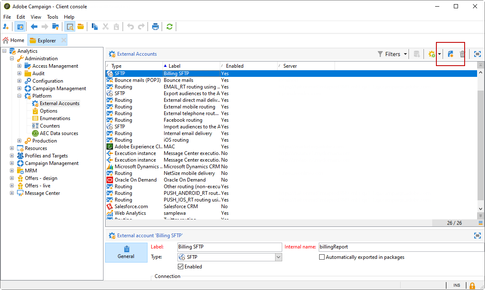
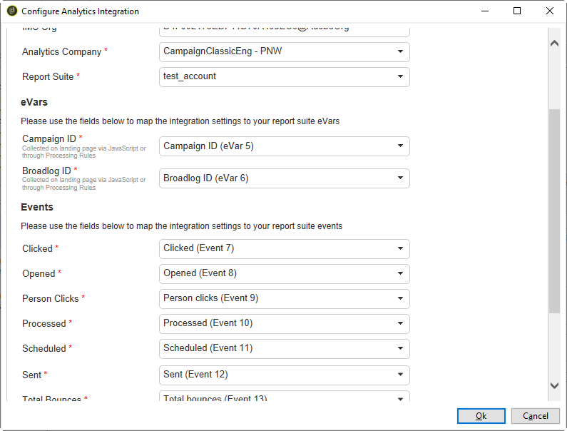
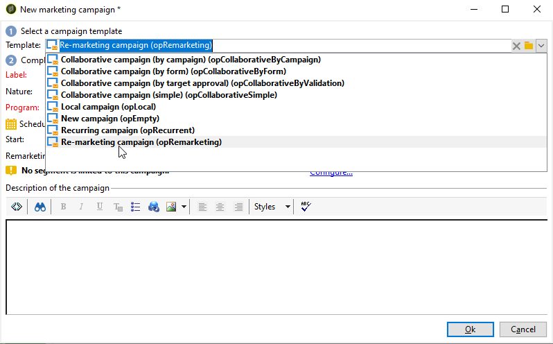

# Adobe Analytics Connector{#adobe-analytics-connector}

## Info over integratie van Adobe Analytics Connector {#about-analytics-connector-integration}

>[!CAUTION]
>
>Adobe Analytics Connector is niet compatibel met Transaction messaging (Message Center).

Met Adobe Analytics Connector kunnen Adobe Campaign en Adobe Analytics communiceren via het **[!UICONTROL Web Analytics connectors]**-pakket. Het stuurt gegevens door naar Adobe Campaign in de vorm van segmenten met betrekking tot gebruikersgedrag na een e-mailcampagne. Omgekeerd verzendt het programma indicatoren en kenmerken van e-mailcampagnes die door Adobe Campaign aan Adobe Analytics worden geleverd.

Met Adobe Analytics Connector kan Adobe Campaign het internetpubliek meten (Web Analytics). Dankzij deze integratie kan Adobe Campaign na een marketingcampagne gegevens over het gedrag van bezoekers van een of meer sites herstellen en (na analyse) hermarketingcampagnes voeren om deze in kopers om te zetten. Omgekeerd, laten de analytische hulpmiddelen van het Web Adobe Campaign toe om indicatoren en campagneattributen aan hun platforms door te sturen.

De actievelden voor elk gereedschap zijn als volgt:

* De rol van de webanalyse:

   1. markeert de e-mailcampagnes die met Adobe Campaign zijn gestart;
   1. bespaart ontvankelijk gedrag, op de plaats zij na het klikken van campagne e-mail, in de vorm van segmenten doorbladeden. Segmenten hebben betrekking op verlaten producten (bekeken, maar niet aan de kar toegevoegd of aangekocht), op aankopen of het verlaten van de kar.

* Adobe Campaign-rol:

   1. verzendt de indicatoren en campagneattributen naar de schakelaar, die hen op zijn beurt aan het analytische hulpmiddel van het Web doorstuurt;
   1. segmenten terugwinnen en analyseren;
   1. leidt tot een hermarketing campagne.

## Integratie instellen {#setting-up-the-integration}

Als u de gegevensconnector wilt instellen, moet u verbinding maken met uw Adobe Campaign-instantie en de volgende bewerkingen uitvoeren:

1. [Uw rapportsuite maken in Adobe Analytics](#report-suite-analytics)
1. [Conversievariabelen en Succesgebeurtenissen configureren](#configure-conversion-success)
1. [Uw externe account configureren in Adobe Campaign Classic](#external-account-classic)

### Uw rapportsuite maken in Adobe Analytics {#report-suite-analytics}

Als u de integratie tussen Adobe Analytics en Adobe Campaign Classic wilt instellen, moet u verbinding maken met uw [!DNL Adobe Analytics]-exemplaar en de volgende bewerkingen uitvoeren:

1. Selecteer [!DNL Adobe Analytics] en klik vervolgens **[!UICONTROL All admin]**.**[!UICONTROL Admin tab]**

   

1. Klik op **[!UICONTROL Report suites]**.

   

1. Klik op **[!UICONTROL Report suite manager]** op **[!UICONTROL Create new]** en **[!UICONTROL Report suite]**.

   Raadpleeg deze [sectie](https://experienceleague.adobe.com/docs/analytics/admin/manage-report-suites/new-report-suite/t-create-a-report-suite.html?lang=en#prerequisites) voor de gedetailleerde procedure voor het maken van **[!UICONTROL Report suite]**.

   

1. Selecteer een sjabloon.

1. Vorm uw nieuwe rapportreeks met de volgende informatie:

   * **[!UICONTROL Report Suite ID]**
   * **[!UICONTROL Site Title]**
   * **[!UICONTROL Time Zone]**
   * **[!UICONTROL Go Live Date]**
   * **[!UICONTROL Estimated Page Views Per Day]**

   

1. Wanneer gevormd, klik **[!UICONTROL Create report suite]**.

### Configureer uw conversievariabelen en Succesgebeurtenissen {#configure-conversion-success}

Nadat u uw **[!UICONTROL Report suite]** hebt gemaakt, moet u de **[!UICONTROL Conversion variables]** en **[!UICONTROL Success events]** als volgt configureren:

1. Selecteer de eerder geconfigureerde **[!UICONTROL Report suite]**.

1. Selecteer **[!UICONTROL Conversion]** > **[!UICONTROL Conversion variables]** op de knop **[!UICONTROL Edit settings]**.

   

1. Klik op **[!UICONTROL Add new]** om de id&#39;s te maken die nodig zijn voor het meten van de impact van de e-mailcampagne, dat wil zeggen de interne naam van de campagne (cid) en de tabel-id NmsBroadlog (bid).

   Als u wilt leren hoe u **[!UICONTROL Conversion variables]** kunt bewerken, raadpleegt u deze [sectie](https://experienceleague.adobe.com/docs/analytics/admin/admin-tools/conversion-variables/t-conversion-variables-admin.html?lang=en#admin-tools).

   

1. Klik **[!UICONTROL Save]** wanneer gereed.

1. Als u vervolgens uw **[!UICONTROL Success events]** wilt maken, selecteert u **[!UICONTROL Conversion]** > **[!UICONTROL Success events]** op de knop **[!UICONTROL Edit settings]**.

   

1. Klik **[!UICONTROL Add new]** om het volgende **[!UICONTROL Success events]** te vormen:

   * **[!UICONTROL Clicked]**
   * **[!UICONTROL Opened]**
   * **[!UICONTROL Person clicks]**
   * **[!UICONTROL Processed]**
   * **[!UICONTROL Scheduled]**
   * **[!UICONTROL Sent]**
   * **[!UICONTROL Total bounces]**
   * **[!UICONTROL Unique Clicks]**
   * **[!UICONTROL Unique Opens]**
   * **[!UICONTROL Unsubscribed]**

   Als u wilt leren hoe u **[!UICONTROL Success events]** configureert, raadpleegt u deze [sectie](https://experienceleague.adobe.com/docs/analytics/admin/admin-tools/success-events/t-success-events.html?lang=en#admin-tools)

   

1. Klik **[!UICONTROL Save]** wanneer gereed.

Wanneer uw rapportreeks wordt gevormd, zult u **[!UICONTROL External accounts]** in Adobe Campaign Classic moeten vormen.

### Uw externe account configureren in Adobe Campaign Classic {#external-account-classic}

>[!IMPORTANT]
>
> Deze integratie werkt alleen als u het **[!UICONTROL Web Analytics connectors]**-pakket in Adobe Campaign installeert.
>
>Raadpleeg deze [pagina](../../installation/using/installing-campaign-standard-packages.md) voor meer informatie over de installatie van pakketten.

U moet nu uw **[!UICONTROL Web Analytics]** externe rekening in Adobe Campaign vormen om de synchronisatie tussen de twee oplossingen toe te laten.

Als een van uw **[!UICONTROL Report suite]**, **[!UICONTROL Conversion variables]** of **[!UICONTROL Success events]** niet zichtbaar is tijdens het configureren van uw externe account, betekent dit dat u een machtiging voor deze nieuwe component mist in de **[!UICONTROL Product profile]** die aan de gebruiker is gekoppeld.

Raadpleeg voor meer informatie hierover de pagina [Productprofielen voor Adobe Analytics](https://experienceleague.adobe.com/docs/analytics/admin/admin-console/permissions/product-profile.html?lang=en#product-profile-admins).

1. Ga naar **[!UICONTROL Administration]** > **[!UICONTROL Platform]** > **[!UICONTROL External accounts]** omslag van de boom van Adobe Campaign en klik **[!UICONTROL New]**.

   

1. Gebruik de vervolgkeuzelijst om het type **[!UICONTROL Web Analytics]** en **[!UICONTROL Adobe Analytics]** in de vervolgkeuzelijst **[!UICONTROL Integration]** te selecteren.

   

1. Klik **[!UICONTROL Configure]** naast **[!UICONTROL Integration]** drop-down.

1. Wijs in het venster **[!UICONTROL Configure Analytics integration]** uw externe account toe met de eerder gemaakte rapportsuite die de volgende informatie bevat:

   * **[!UICONTROL E-Mail]**
   * **[!UICONTROL IMS Org]**
   * **[!UICONTROL Analytics Company]**
   * **[!UICONTROL Report Suite]**

1. Wijs in de categorie **[!UICONTROL eVars]** de twee **[!UICONTROL Conversion variables]** die zijn geconfigureerd in [!DNL Adobe Analytics] toe.

   

1. Wijs in de categorie **[!UICONTROL Events]** de tien **[!UICONTROL Success events]** toe die zijn geconfigureerd in [!DNL Adobe Analytics].

1. Klik **[!UICONTROL Submit]** wanneer gereed. Adobe Campaign maakt een **[!UICONTROL Data source]**, **[!UICONTROL Calculated metrics]**, **[!UICONTROL Remarketing segments]** en **[!UICONTROL Classifications]** in de toegewezen Analytics **[!UICONTROL Report Suite]**.

   Als deze synchronisatie tussen [!DNL Adobe Analytics] en Adobe Campaign is voltooid, kunt u het venster sluiten.

1. De instellingen kunnen worden weergegeven via het tabblad **[!UICONTROL Data Settings]** in het venster **[!UICONTROL Configure Analytics integration]**.

   Met de knop **[!UICONTROL Sync]** synchroniseert [!DNL Adobe Campaign] de wijzigingen in de naam die in [!DNL Adobe Analytics] zijn doorgevoerd. Als de component in [!DNL Adobe Analytics] wordt geschrapt, zal de component in [!DNL Adobe Campaign] worden doorgehaald of met een **niet gevonden** bericht worden getoond.

   

1. Indien nodig, kunt u segmenten toevoegen of verwijderen uit **[!UICONTROL Update Segments]** Lusje.

1. Klik in uw **[!UICONTROL External account]** op de koppeling **[!UICONTROL Enrich the formula...]** om de URL-berekeningsformule te wijzigen en de integratiegegevens van het hulpprogramma Webanalyse (campagne-id&#39;s) en de domeinen van de sites op te geven waarvan de activiteit moet worden bijgehouden.

   

1. Geef de domeinnaam of -namen van de sites op.

   

1. Klik **[!UICONTROL Next]** en zorg ervoor de domeinnamen zijn bewaard.

   

1. Indien nodig, kunt u de berekeningsformule te veel laden. U doet dit door het selectievakje in te schakelen en de formule rechtstreeks in het venster te bewerken.

   >[!IMPORTANT]
   >
   >Deze configuratiewijze is gereserveerd voor deskundige gebruikers: Als deze formule een fout bevat, kunnen e-mailleveringen gestopt worden.

1. Met het tabblad **[!UICONTROL Advanced]** kunt u meer technische instellingen configureren of wijzigen.

   * **[!UICONTROL Lifespan]**: Hiermee kunt u de vertraging opgeven (in dagen_ waarna de webgebeurtenissen in Adobe Campaign zijn hersteld door technische workflows. Standaard: 180 dagen.
   * **[!UICONTROL Persistence]**: Hiermee kunt u de periode opgeven gedurende welke alle webgebeurtenissen (bijvoorbeeld een aankoop) kunnen worden toegewezen aan een campagne voor het opnieuw op de markt brengen, Standaard: 7 dagen.

>[!NOTE]
>
>Als u verschillende publiekmeetgereedschappen gebruikt, kunt u **[!UICONTROL Other]** in de vervolgkeuzelijst **[!UICONTROL Partners]** selecteren wanneer u de externe account maakt. U mag slechts naar één externe account verwijzen in de leveringseigenschappen: u moet daarom de formule van bijgehouden URL&#39;s aanpassen door de parameters toe te voegen die door de Adobe en alle andere gebruikte meetinstrumenten worden verwacht.

### Technische workflows van webanalyseprocessen {#technical-workflows-of-web-analytics-processes}

De gegevensuitwisseling tussen Adobe Campaign en Adobe Analytics wordt afgehandeld door vier technische workflows die als achtergrondtaak worden uitgevoerd.

Ze zijn beschikbaar in de Adobe Campaign-structuur, onder **[!UICONTROL Administration]** > **[!UICONTROL Production]** > **[!UICONTROL Technical workflows]** > **[!UICONTROL Web analytics process]**.

* **[!UICONTROL Recovering of web events]**: eenmaal per uur downloadt deze workflow segmenten over het gedrag van gebruikers op een bepaalde site, neemt deze op in de Adobe Campaign-database en start de workflow voor het opnieuw in de handel brengen.
* **[!UICONTROL Event purge]**: met deze workflow kunt u alle gebeurtenissen uit de database verwijderen, afhankelijk van de periode die in het  **[!UICONTROL Lifespan]** veld is geconfigureerd. Raadpleeg [Uw externe account configureren in Adobe Campaign Classic](#external-account-classic) voor meer informatie hierover.
* **[!UICONTROL Identification of converted contacts]**: directory van de bezoekers die een aankoop hebben gedaan na een hermarketingcampagne. De gegevens die door deze workflow worden verzameld, zijn toegankelijk in het **[!UICONTROL Re-marketing efficiency]**-rapport. Raadpleeg deze [pagina](#creating-a-re-marketing-campaign).
* **[!UICONTROL Sending of indicators and campaign attributes]**: Hiermee kunt u e-mailcampagnemarameters via Adobe Campaign naar de Adobe Experience Cloud verzenden via Adobe Analytics Connector. Deze workflow wordt elke dag om 4 uur gestart en het kan 24 uur duren voordat de gegevens naar Analytics worden verzonden.

   Deze workflow moet niet opnieuw worden gestart, anders worden alle eerdere gegevens opnieuw verzonden, waardoor de resultaten van Analytics kunnen worden scheefgetrokken.

   Het gaat om indicatoren die:

   * **[!UICONTROL Messages to deliver]** (@toDeliver)
   * **[!UICONTROL Processed]** (@processing)
   * **[!UICONTROL Success]** (@geslaagd)
   * **[!UICONTROL Total count of opens]** (@totalRecipientOpen)
   * **[!UICONTROL Recipients who have opened]** (@ontvangerOpen)
   * **[!UICONTROL Total number of recipients who clicked]** (@totalRecipientClick)
   * **[!UICONTROL People who clicked]** (@personClick)
   * **[!UICONTROL Number of distinct clicks]** (@receivingClick)
   * **[!UICONTROL Opt-Out]** (@optOut)
   * **[!UICONTROL Errors]** (@fout)

   >[!NOTE]
   >
   >De verzonden gegevens zijn de delta die op de laatste momentopname wordt gebaseerd die tot negatieve waarde in de metrische gegevens kan leiden.

   De verzonden kenmerken zijn als volgt:

   * **[!UICONTROL Internal name]** (@internalName)
   * **[!UICONTROL Label]** (@label)
   * **[!UICONTROL Label]** (operation/@label): alleen als het  **** Campaignpackage is geïnstalleerd
   * **[!UICONTROL Nature]** (operation/@nature): alleen als het  **** Campaignpackage is geïnstalleerd
   * **[!UICONTROL Tag 1]** (webAnalytics/@tag1)
   * **[!UICONTROL Tag 2]** (webAnalytics/@tag2)
   * **[!UICONTROL Tag 3]** (webAnalytics/@tag3)
   * **[!UICONTROL Contact date]** (planning/@contactDate)

## Leveringen bijhouden in Adobe Campaign {#tracking-deliveries-in-adobe-campaign}

Als u wilt dat de Adobe Experience Cloud de activiteit op de sites kan volgen wanneer de levering door Adobe Campaign wordt verzonden, moet u in de leveringseigenschappen verwijzen naar de bijbehorende connector. Hiervoor voert u de volgende stappen uit:

1. Open de levering van de campagne die u wilt bijhouden.

   

1. Open de leveringseigenschappen.
1. Ga naar het tabblad **[!UICONTROL Web Analytics]** en selecteer de eerder gemaakte externe account. Raadpleeg [Uw externe account configureren in Adobe Campaign Classic](#external-account-classic).

   

1. Je kunt nu je levering verzenden en je rapport bekijken in Adobe Analytics.

## Nieuwe marketingcampagne maken {#creating-a-re-marketing-campaign}

Om uw re-marketing campagne voor te bereiden, creeer eenvoudig leveringsmalplaatjes die voor re-marketing typecampagnes worden gebruikt. Dan vorm uw re-marketing campagne en verbind het met een segment. Elk segment moet een andere hermarketingcampagne voeren.

Nieuwe marketingcampagnes worden automatisch gestart zodra Adobe Campaign de segmenten heeft hersteld waarin het gedrag wordt geanalyseerd van de mensen die voor de eerste campagne zijn geselecteerd. In het geval van het verlaten van het winkelwagentje of het bekijken van een product zonder een aankoop, wordt een levering verzonden naar de betrokken ontvangers zodat hun site eindigt met een aankoop.

Adobe Campaign biedt persoonlijke leveringssjablonen die u kunt gebruiken of zelf kunt databaseren om campagnes voor te bereiden.

1. Ga in **[!UICONTROL Explorer]** naar **[!UICONTROL Resources]** > **[!UICONTROL Templates]** > **[!UICONTROL Delivery templates]** in de Adobe Campaign-structuur.

1. Dupliceer de **[!UICONTROL Email delivery (re-marketing)]** malplaatje of de re-marketing malplaatjevoorbeelden die door Adobe Campaign worden aangeboden.

   

1. Pas de sjabloon aan uw wensen aan en sla deze op.

1. Maak een nieuwe campagne en selecteer de sjabloon **[!UICONTROL Re-marketing campaign]** in de vervolgkeuzelijst.

   

1. Klik op de koppeling **[!UICONTROL Configure...]** om het segment en de leveringssjabloon op te geven die aan de campagne zijn gekoppeld.

1. Selecteer de eerder geconfigureerde externe account.

   

1. Selecteer het desbetreffende segment.

   

1. Selecteer het leveringsmalplaatje voor deze re-marketing campagne moet worden gebruikt, dan klik **[!UICONTROL Finish]** om het venster te sluiten.

   

1. Klik **[!UICONTROL OK]** om het campagnevenster te sluiten.

Het **[!UICONTROL Re-marketing efficiency]** rapport wordt betreden via de globale rapportpagina. Het laat u het aantal geconverteerde contacten (d.w.z. het hebben van iets gekocht) met betrekking tot het aantal kartverlaten na de Adobe Campaign hermarketing campagne bekijken. De conversiesnelheid wordt berekend per week, maand of sinds het begin van de synchronisatie tussen Adobe Campaign- en Web-analyseprogramma&#39;s.

