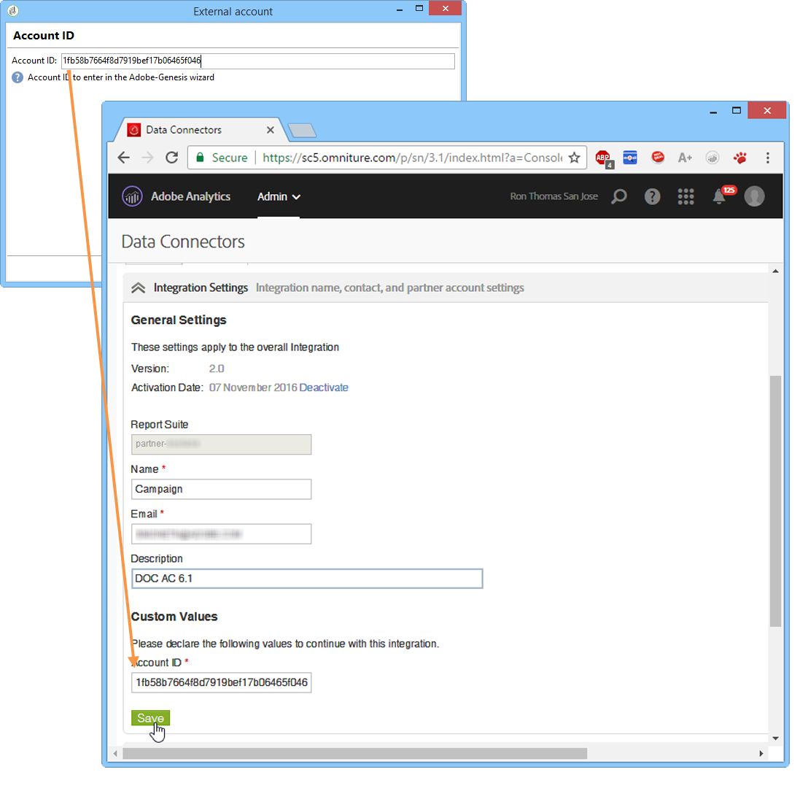

# Adobe Analytics-gegevensconnector{#adobe-analytics-data-connector-legacy}

>[!IMPORTANT]
>
>Adobe Analytics-gegevensconnector is nu afgeschaft. Afgeschafte mogelijkheden zijn nog steeds beschikbaar, maar ze zullen niet verder worden verbeterd of ondersteund. Meer informatie vindt u [op deze pagina](../../rn/using/deprecated-features.md).

## Data Connector-integratie {#about-data-connector-integration}

>[!IMPORTANT]
>
>Adobe Analytics-gegevensconnector is niet compatibel met Transactional Messaging (Message Center).

Data Connector (voorheen Adobe Genesis) maakt interactie tussen Adobe Campaign en Adobe Analytics mogelijk via het **webanalyticsconnectorpakket**. Het programma stuurt gegevens door naar Adobe Campaign in de vorm van segmenten over gebruikersgedrag na een e-mailcampagne. Omgekeerd verzendt het programma indicatoren en kenmerken van e-mailcampagnes die door Adobe Campaign worden geleverd, naar Adobe Analytics - Dataconnector.

Met Data Connector biedt Adobe Campaign een manier om de internetdoelgroep te meten (Web Analytics). Dankzij deze integratie kan Adobe Campaign na een marketingcampagne gegevens over het gedrag van bezoekers van een of meer sites herstellen en (na analyse) remarketingcampagnes uitvoeren om deze in kopers om te zetten. Omgekeerd kan Adobe Campaign dankzij de webanalyticstools indicatoren en campagneattributen aan hun platforms doorsturen.

Raadpleeg de volgende [documentatie](https://helpx.adobe.com/nl/marketing-cloud/how-to/analytics-ac.html) voor meer informatie over de implementatie van de integratie van Adobe Analytics met Adobe Campaign.

De actievelden voor elke tool zijn als volgt:

* De rol van webanalytics:

   1. markeert de e-mailcampagnes die met Adobe Campaign zijn gestart
   1. slaat het gedrag op dat ontvangers vertonen op de site die ze hebben verkend nadat ze op de campagne-e-mail hebben geklikt, in de vorm van segmenten. Segmenten hebben betrekking op verlaten producten (bekeken, maar niet toegevoegd aan de winkelwagen of gekocht), aankopen of verlaten winkelwagens.

* Rol van Adobe Campaign:

   1. verzendt de indicatoren en campagnekenmerken naar de connector, die ze weer naar de webanalyticstool doorstuurt,
   1. herstelt en analyseert segmenten
   1. activeert een remarketingcampagne.

## Integratie instellen {#setting-up-the-integration}

Als u de Data Connector wilt instellen, moet u verbinding maken met uw Adobe Campaign-instantie en de volgende bewerkingen uitvoeren:

* [Stap 1: Integratie in Analytics configureren](#step-1--configure-integration-in-analytics)
* [Stap 2: Externe account maken in Campaign](#step-2--create-the-external-account-in-campaign)
* [Stap 3: Adobe Campaign en Adobe Analytics synchroniseren](#step-3--synchronize-adobe-campaign-and-adobe-analytics)

### Stap 1: Integratie in Analytics configureren {#step-1--configure-integration-in-analytics}

In de volgende stappen wordt de configuratie van Data Connector beschreven met behulp van een wizard.

1. Meld u aan bij de Adobe Experience Cloud met een Adobe ID of Enterprise ID.

   

1. Selecteer **[!UICONTROL Analytics]** in de lijst met Experience Cloud-oplossingen.

   

1. Selecteer op het tabblad **[!UICONTROL Admin]** de optie **[!UICONTROL Data Connectors]**.

   U hebt de volgende de Analytics-tooltoestemmingen nodig voor toegang tot het menu **[!UICONTROL Data Connectors]**. Raadpleeg deze [pagina](https://experienceleague.adobe.com/docs/analytics/admin/admin-console/permissions/analytics-tools.html) voor meer informatie
   * Integraties (maken)
   * Integraties (bijwerken)
   * Integraties (verwijderen)

   

1. Selecteer **[!UICONTROL Adobe Campaign Classic]** in de lijst met partners.

   

1. Klik in het dialoogvenster **[!UICONTROL Add integration]** op **[!UICONTROL Activate]**.
1. Selecteer **[!UICONTROL I accept these terms and conditions]** en vervolgens **[!UICONTROL Report suite]** dat is gekoppeld aan deze integratie, en voer het connectorlabel in.

   Klik op **[!UICONTROL Create and configure this integration]** als u klaar bent.

   

1. Voer het e-mailadres in dat de meldingen namens de connector zal ontvangen en kopieer vervolgens de **[!UICONTROL Account ID]** zoals het wordt weergegeven in het externe Adobe Campaign-account (zie voor meer informatie de [Stap 2: Maak het externe account in Campaign aan](#step-2--create-the-external-account-in-campaign)).

   

1. Specifieer de identificators die nodig zijn om de impact van de e-mailcampagne te meten, d.w.z. de interne campagnenaam (cid) en de tabel-ID voor iNmsBroadlog (bid). Geef ook de indicatoren op voor gebeurtenissen die moeten worden verzameld.
Zorg ervoor dat uw **[!UICONTROL Events]** van het numerieke type zijn, anders zullen ze niet in het vervolgkeuzemenu verschijnen.

   

1. Geef indien nodig de gepersonaliseerde segmenten op.

   

1. Selecteer in **[!UICONTROL Data collection]** een methode voor het herstellen van gegevens, in dit geval de **[!UICONTROL cid]**- en **[!UICONTROL bid]**-id&#39;s die in stap 6 zijn opgegeven.

   

1. Selecteer de informatie die u op het dashboard wilt weergeven.

   

1. Controleer de configuratie op de pagina die de vorige stappen samenvat.

   

1. Klik op **[!UICONTROL Activate Now]** om de configuratie goed te keuren en de connector te activeren.

   

   De Gegevensconnector is nu geconfigureerd.

### Stap 2: Externe account maken in Campaign {#step-2--create-the-external-account-in-campaign}

De integratie van Adobe Campaign in de Analytics-platforms vindt plaats via een connector. Voor synchronisatie van de toepassingen past u het volgende proces toe:

1. Installeer het **webanalyticsconnector**-pakket in Adobe Campaign.
1. Ga naar de **[!UICONTROL Administration > Platform > External accounts]**-map van de Adobe Campaign-structuur.
1. Klik met de rechtermuisknop op de lijst met externe accounts en selecteer **[!UICONTROL New]** in de vervolgkeuzelijst (of klik op de knop **[!UICONTROL New]** boven de lijst met externe accounts).
1. Gebruik de vervolgkeuzelijst om het type **[!UICONTROL Web Analytics]** te selecteren.
1. Selecteer de provider voor de connector, dit wil zeggen **[!UICONTROL Adobe Analytics - Data Connector]** in dit geval.

   

1. Klik op de koppeling **[!UICONTROL Enrich the formula...]** om de URL-berekeningsformule te wijzigen om de integratie-informatie (campagne-id&#39;s) van de Webanalytics-tool op te geven en de domeinen van de sites waarvan de activiteit moet worden getraceerd.
1. Geef de domeinnaam of -namen van de sites op.

   

1. Klik op **[!UICONTROL Next]** en zorg ervoor dat de domeinnamen werden opgeslagen.

   

1. Indien nodig moet u de berekeningsformule overladen. U doet dit door het selectievakje in te schakelen en de formule rechtstreeks in het venster te bewerken.

   

   >[!IMPORTANT]
   >
   >Deze configuratiemodus is voorbehouden aan deskundige gebruikers: als deze formule een fout bevat, kunnen e-mailleveringen worden gestopt.

1. Met het tabblad **[!UICONTROL Advanced]** kunt u meer technische instellingen configureren of wijzigen.

   * **[!UICONTROL Lifespan]**: hiermee kunt u de vertraging opgeven (in dagen_) waarna de webgebeurtenissen worden hersteld in Adobe Campaign door technische workflows. Standaard: 180 dagen.
   * **[!UICONTROL Persistence]**: hiermee wordt de periode weergegeven waarin alle webgebeurtenissen (bijvoorbeeld een aankoop) kunnen worden toegewezen aan een remarketingcampagne, Standaard: 7 dagen.

>[!NOTE]
>
>Als u verschillende metingstools voor doelgroepen gebruikt, kunt u **[!UICONTROL Other]** selecteren in de vervolgkeuzelijst **[!UICONTROL Partners]** wanneer u een extern account maakt. U mag slechts naar één externe account verwijzen in de leveringseigenschappen: u moet daarom de formule van bijgehouden URL&#39;s aanpassen door de parameters toe te voegen die door Adobe-tools en alle andere gebruikte meettools worden verwacht.

### Stap 3: Adobe Campaign en Adobe Analytics synchroniseren {#step-3--synchronize-adobe-campaign-and-adobe-analytics}

Nadat u de externe account hebt gemaakt, moet u beide toepassingen synchroniseren.

1. Ga naar uw eerder gemaakte externe account.
1. Wijzig desgewenst het account **[!UICONTROL Label]**.
1. Wijzig de **[!UICONTROL Internal name]** zodat deze overeenkomt met de **[!UICONTROL Name]** die is gekozen tijdens het configureren van de Data Connector.

   

1. Klik op de koppeling **[!UICONTROL Approve connection]**.

   

   Zorg ervoor dat de **[!UICONTROL Internal name]** overeenkomt met de **[!UICONTROL Name]** die is gespecificeerd in de configuratiewizard van de Data Connector.

1. Voer de **[!UICONTROL Account ID]** in de configuratiewizard van de Data Connector in.

   

1. Volg de stappen volgens de gids van de wizard Data Connector en ga vervolgens terug naar het externe account in Adobe Campaign.
1. Klik op **[!UICONTROL Next]** om de gegevensuitwisseling tussen Adobe Campaign en Adobe Analytics - Data Connector te laten plaatsvinden.

   De segmentlijst wordt weergegeven zodra de synchronisatie is voltooid.

   

Wanneer de synchronisatie van gegevens tussen Adobe Campaign en Adobe Analytics - Data Connector effectief is, worden de drie standaardsegmenten die gedefinieerd zijn in de wizard Data Connector, hersteld door Adobe Campaign en worden ze toegankelijk op het tabblad **[!UICONTROL Segments]** van de externe Adobe Campaign-account.

Als er extra segmenten in de wizard Data Connector zijn geconfigureerd, kunt u deze toevoegen aan Adobe Campaign. Klik hiervoor op de koppeling **[!UICONTROL Update segment list]** en volg de stappen die worden beschreven in de externe accountwizard. Zodra de bewerking is uitgevoerd, worden de nieuwe segmenten weergegeven in de lijst.

### Technische workflows van webanalyticsprocessen {#technical-workflows-of-web-analytics-processes}

Gegevensuitwisseling tussen Adobe Campaign en Adobe Analytics - Data Connector wordt afgehandeld door vier technische workflows die als achtergrondtaak worden uitgevoerd.

Ze zijn beschikbaar in de Adobe Campaign-structuur in de map **[!UICONTROL Administration > Production > Technical workflows > Web analytics process]**.

* **[!UICONTROL Recovering of web events]**: eenmaal per uur downloadt deze workflow segmenten over het gedrag van gebruikers op een bepaalde site, neemt deze op in de Adobe Campaign-database en start de remarketingworkflow.
* **[!UICONTROL Event purge]**: met deze workflow kunt u alle gebeurtenissen uit de database verwijderen, afhankelijk van de periode die in het veld **[!UICONTROL Lifespan]** is geconfigureerd. Raadpleeg voor meer informatie hierover [Stap 2: Maak de externe account in Campaign](#step-2--create-the-external-account-in-campaign).
* **[!UICONTROL Identification of converted contacts]**: directory van de bezoekers die een aankoop hebben gedaan na een remarketingcampagne. De gegevens die door deze workflow worden verzameld, zijn toegankelijk in het rapport **[!UICONTROL Re-marketing efficiency]**. Raadpleeg deze [pagina](#creating-a-re-marketing-campaign).
* **[!UICONTROL Sending of indicators and campaign attributes]**: hiermee kunt u e-mailcampagne-indicators via Adobe Campaign naar de Adobe Experience Cloud verzenden via Adobe Analytics - Data Connector. Deze workflow wordt elke dag om 04.00 uur gestart en het kan 24 uur duren voordat de gegevens naar Analytics worden verzonden.

   Deze workflow moet niet opnieuw worden gestart, anders worden alle eerdere gegevens opnieuw verzonden, waardoor de resultaten van Analytics kunnen worden scheefgetrokken.

   De betreffende indicatoren zijn:

   * **[!UICONTROL Messages to deliver]** (@toDeliver)
   * **[!UICONTROL Processed]** (@processed)
   * **[!UICONTROL Success]** (@success)
   * **[!UICONTROL Total count of opens]** (@totalRecipientOpen)
   * **[!UICONTROL Recipients who have opened]** (@recipientOpen)
   * **[!UICONTROL Total number of recipients who clicked]** (@totalRecipientClick)
   * **[!UICONTROL People who clicked]** (@personClick)
   * **[!UICONTROL Number of distinct clicks]** (@recipientClick)
   * **[!UICONTROL Opt-Out]** (@optOut)
   * **[!UICONTROL Errors]** (@error)

   >[!NOTE]
   >
   >De verzonden gegevens zijn de delta die op de laatste momentopname wordt gebaseerd, wat tot negatieve waarde in de metrische gegevens kan leiden.

   De verzonden kenmerken zijn als volgt:

   * **[!UICONTROL Internal name]** (@internalName)
   * **[!UICONTROL Label]** (@label)
   * **[!UICONTROL Label]** (operation/@label): alleen als het pakket **Campaign** is geïnstalleerd
   * **[!UICONTROL Nature]** (operation/@nature): alleen als het pakket **Campaign** is geïnstalleerd
   * **[!UICONTROL Tag 1]** (webAnalytics/@tag1)
   * **[!UICONTROL Tag 2]** (webAnalytics/@tag2)
   * **[!UICONTROL Tag 3]** (webAnalytics/@tag3)
   * **[!UICONTROL Contact date]** (scheduling/@contactDate)

## Leveringen bijhouden in Adobe Campaign {#tracking-deliveries-in-adobe-campaign}

Als u wilt dat de Adobe Experience Cloud de activiteit op de sites kan volgen wanneer de levering door Adobe Campaign wordt verzonden, moet u in de leveringseigenschappen verwijzen naar de bijbehorende connector. Hiervoor voert u de volgende stappen uit:

1. Open de levering van de campagne die u wilt bijhouden.

   

1. Open de leveringseigenschappen.
1. Ga naar het tabblad **[!UICONTROL Web Analytics]** en selecteer het eerder gemaakte externe account. Zie [Stap 2: Maak het externe account in Campaign](#step-2--create-the-external-account-in-campaign).

   

1. U kunt nu uw levering verzenden en uw rapport bekijken in Adobe Analytics.

## Een remarketingcampagne maken {#creating-a-re-marketing-campaign}

Om uw remarketingcampagne voor te bereiden maakt u eenvoudig leveringssjablonen die voor remarketingcampagnes worden gebruikt. Configureer vervolgens uw remarketingcampagne en koppel deze aan een segment. Elk segment moet een andere remarketingcampagne voeren.

Remarketingcampagnes worden automatisch gestart zodra Adobe Campaign de segmenten heeft hersteld waarin het gedrag wordt geanalyseerd van de mensen die voor de eerste campagne zijn geselecteerd. Als een winkelwagentje wordt verlaten of een product wordt bekeken zonder een aankoop, wordt een levering verzonden naar de betrokken ontvangers zodat hun site eindigt met een aankoop.

Adobe Campaign biedt persoonlijke leveringssjablonen die u kunt gebruiken of zelf in een database kunt zetten om campagnes voor te bereiden.

1. Ga van **[!UICONTROL Explorer]** naar de map **[!UICONTROL Resources > Templates > Delivery templates]** in de Adobe Campaign-structuur.
1. Dupliceer de sjabloon **[!UICONTROL Email delivery (re-marketing)]** of de remarketingsjabloonvoorbeelden die door Adobe Campaign worden aangeboden.
1. Personaliseer de sjabloon naar wens en sla deze op.

   

1. Maak een nieuwe campagne en selecteer de sjabloon **[!UICONTROL Re-marketing campaign]** in de vervolgkeuzelijst.

   

1. Klik op de koppeling **[!UICONTROL Configure...]** om het segment en de leveringssjabloon op te geven die aan de campagne zijn gekoppeld.
1. Selecteer het eerder geconfigureerde externe account.

   

1. Selecteer het desbetreffende segment.

   

1. Selecteer de leveringsjabloon die voor deze remarketingcampagne moet worden gebruikt en klik vervolgens op **[!UICONTROL Finish]** om het venster te sluiten.

   

1. Klik op **[!UICONTROL OK]** om het campagnevenster te sluiten.

Het rapport **[!UICONTROL Re-marketing efficiency]** is toegankelijk via de globale rapportpagina. Hiermee kunt u het aantal geconverteerde contacten bekijken (d.w.z. die iets hebben gekocht) in relatie tot het aantal verlaten winkelwagens na de Adobe Campaign-remarketingcampagne. Het conversiepercentage wordt berekend per week, maand of vanaf het begin van de synchronisatie tussen Adobe Campaign- en webanalytics-tools.

