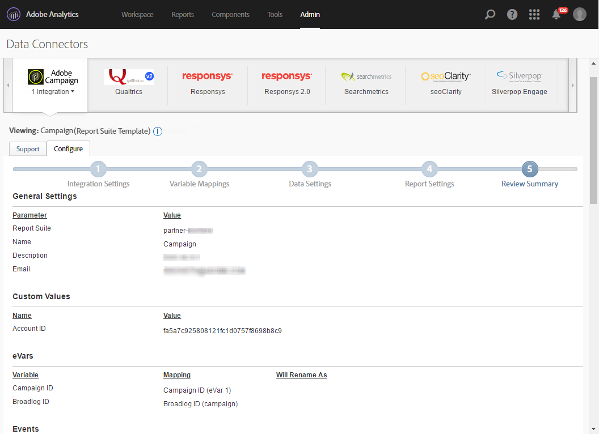

# Adobe Analytics Data Connector{#adobe-analytics-data-connector}

## Over de integratie van gegevensconnectors {#about-data-connector-integration}

>[!CAUTION]
>
>Adobe Analytics Data Connector is niet compatibel met Transaction messaging (Message Center).

Dankzij de gegevensconnector (voorheen Adobe Genesis genoemd) kunnen Adobe Campaign en Adobe Analytics communiceren via het connectorpakket **Web Analytics** . Gegevens worden naar Adobe Campaign verzonden in de vorm van segmenten met betrekking tot gebruikersgedrag na een e-mailcampagne. Omgekeerd verzendt het programma indicatoren en kenmerken van e-mailcampagnes die door Adobe Campaign worden geleverd naar Adobe Analytics - Data connector.

Met de gegevensconnector biedt Adobe Campaign een manier om het internetpubliek te meten (Web Analytics). Dankzij deze integratie kan Adobe Campaign na een marketingcampagne gegevens herstellen over het gedrag van bezoekers voor een of meer sites en (na analyse) opnieuw marketingcampagnes voeren om deze te converteren naar kopers. Omgekeerd kunnen met de hulpprogramma&#39;s voor webanalyse Adobe Campaign indicatoren en campagnerekenmerken doorsturen naar hun platforms.

Raadpleeg deze [documentatie voor meer informatie over de implementatie van de integratie van Adobe Analytics met Adobe Campaign](https://helpx.adobe.com/marketing-cloud/how-to/analytics-ac.html).

De actievelden voor elk gereedschap zijn als volgt:

* De rol van de webanalyse:

   1. markeert de e-mailcampagnes die met de Campagne van Adobe worden gelanceerd,
   1. bespaart ontvankelijk gedrag, op de plaats zij na het klikken van campagne e-mail, in de vorm van segmenten doorbladeden. Segmenten hebben betrekking op verlaten producten (bekeken, maar niet aan de kar toegevoegd of aangekocht), op aankopen of het verlaten van de kar.

* De rol van Adobe Campaign:

   1. verzendt de indicatoren en campagneattributen naar de schakelaar, die hen op zijn beurt aan het analytische hulpmiddel van het Web doorstuurt;
   1. segmenten terugwinnen en analyseren;
   1. leidt tot een hermarketing campagne.

## Integratie instellen {#setting-up-the-integration}

Als u de gegevensconnector wilt instellen, moet u verbinding maken met uw Adobe Campagne-instantie en de volgende bewerkingen uitvoeren:

* [Stap 1: Integratie in Analytics configureren](#step-1--configure-integration-in-analytics)
* [Stap 2: Externe account maken in campagne](#step-2--create-the-external-account-in-campaign)
* [Stap 3: Adobe Campagne en Adobe Analytics synchroniseren](#step-3--synchronize-adobe-campaign-and-adobe-analytics)

### Stap 1: Integratie in Analytics configureren {#step-1--configure-integration-in-analytics}

In de volgende stappen wordt de configuratie van de gegevensconnector beschreven met een wizard.

1. Meld u aan bij Adobe Experience Cloud met een Adobe-id of een Enterprise-id.

   

1. Selecteer in de lijst met Experience Cloud-oplossingen **[!UICONTROL Analytics]**.

   

1. From the **[!UICONTROL Admin]** tab, select **[!UICONTROL Data Connectors]**.

   U hebt de volgende bevoegdheden voor Analytics-hulpprogramma&#39;s nodig om toegang te krijgen tot het **[!UICONTROL Data Connectors]** menu. Raadpleeg deze [pagina voor meer informatie](https://docs.adobe.com/content/help/en/analytics/admin/admin-console/permissions/analytics-tools.html)
   * Integraties (maken)
   * Integraties (update)
   * Integraties (verwijderen)
   

1. Selecteer in de lijst met partners **[!UICONTROL Adobe Campaign Classic]**.

   

1. In the **[!UICONTROL Add integration]** dialog, click **[!UICONTROL Activate]**.
1. Controleer **[!UICONTROL I accept these terms and conditions]** en selecteer **[!UICONTROL Report suite]** verbonden aan deze integratie en ga het schakelaaretiket in.

   Klik wanneer u klaar bent **[!UICONTROL Create and configure this integration]**.

   

1. Voer het e-mailadres in dat de meldingen namens de connector ontvangt en kopieer het adres **[!UICONTROL Account ID]** zoals het wordt weergegeven in de externe Adobe Campagne-account (raadpleeg voor meer informatie [Stap 2: Het externe account maken in Campagne](#step-2--create-the-external-account-in-campaign)).

   

1. Geef de id&#39;s op die nodig zijn om de impact van de e-mailcampagne te meten, d.w.z. de interne naam van de campagne (cid) en de tabel-id voor iNmsBroadlog (bid). Geef ook de indicatoren op voor gebeurtenissen die moeten worden verzameld.
Zorg ervoor dat de foto&#39;s van het type Numeriek **[!UICONTROL Events]** zijn, anders verschijnen ze niet in het keuzemenu.

   

1. Geef indien nodig de gepersonaliseerde segmenten op.

   

1. Selecteer in **[!UICONTROL Data collection]** dit geval de methode voor het herstellen van gegevens **[!UICONTROL cid]** en de **[!UICONTROL bid]** id&#39;s die in stap 6 zijn opgegeven.

   

1. Selecteer de informatie die u op het dashboard wilt weergeven.

   

1. Controleer de configuratie in de pagina die de vorige stappen samenvat.

   

1. Klik **[!UICONTROL Activate Now]** om configuratie goed te keuren en de schakelaar te activeren.

   

   De gegevensconnector is nu geconfigureerd.

### Stap 2: Externe account maken in campagne {#step-2--create-the-external-account-in-campaign}

De integratie van Adobe Campaign in de analyseplatforms wordt uitgevoerd door middel van een connector. U synchroniseert de toepassingen door het volgende proces toe te passen:

1. Installeer het pakket **Webanalytische connectors** in Adobe Campaign.
1. Ga naar de **[!UICONTROL Administration > Platform > External accounts]** map van de Adobe Campaign-structuur.
1. Klik met de rechtermuisknop op de lijst met externe accounts en selecteer **[!UICONTROL New]** deze in de vervolgkeuzelijst (of klik op de **[!UICONTROL New]** knop boven de lijst met externe accounts).
1. Selecteer het **[!UICONTROL Web Analytics]** type in de vervolgkeuzelijst.
1. Selecteer de provider voor de aansluiting, in dit geval dus **[!UICONTROL Adobe Analytics - Data Connector]** .

   

1. Klik op de **[!UICONTROL Enrich the formula...]** koppeling om de URL-berekeningsformule te wijzigen en de integratie-informatie (campagne-id&#39;s) voor het hulpprogramma Web Analytics op te geven voor de websites waarvan de activiteit moet worden bijgehouden.
1. Geef de domeinnaam of -namen van de sites op.

   

1. Klik **[!UICONTROL Next]** en zorg ervoor de domeinnamen zijn bewaard.

   

1. Indien nodig moet u de berekeningsformule te veel laden. U doet dit door het selectievakje in te schakelen en de formule rechtstreeks in het venster te bewerken.

   

   >[!CAUTION]
   >
   >Deze configuratiewijze is gereserveerd voor deskundige gebruikers: Als deze formule een fout bevat, kunnen e-mailleveringen worden gestopt.

1. Op het **[!UICONTROL Advanced]** tabblad kunt u meer technische instellingen configureren of wijzigen.

   * **[!UICONTROL Lifespan]**: Hiermee kunt u de vertraging opgeven (in dagen_ waarna de webgebeurtenissen zijn hersteld in Adobe Campaign door technische workflows. Standaard: 180 dagen.
   * **[!UICONTROL Persistence]**: Hiermee kunt u de periode opgeven gedurende welke alle webgebeurtenissen (bijvoorbeeld een aankoop) kunnen worden toegewezen aan een campagne voor het opnieuw op de markt brengen, Standaard: 7 dagen.

>[!NOTE]
>
>Als u verschillende publiek meetgereedschappen gebruikt, kunt u **[!UICONTROL Other]** in de **[!UICONTROL Partners]** vervolgkeuzelijst selecteren wanneer u een externe account maakt. U mag slechts naar één externe account verwijzen in de leveringseigenschappen: U moet daarom de formule van bijgehouden URL&#39;s aanpassen door de parameters toe te voegen die door Adobe en alle andere gebruikte meetgereedschappen worden verwacht.

### Stap 3: Adobe Campagne en Adobe Analytics synchroniseren {#step-3--synchronize-adobe-campaign-and-adobe-analytics}

Nadat u de externe account hebt gemaakt, moet u beide toepassingen synchroniseren.

1. Ga naar uw eerder gemaakte externe account.
1. Wijzig de account **[!UICONTROL Label]** naar wens.
1. Verander **[!UICONTROL Internal name]** zodat het de **[!UICONTROL Name]** gekozen aanpast terwijl het vormen van de Verbinding van Gegevens.

   

1. Klik op de **[!UICONTROL Approve connection]** koppeling.

   

   Zorg ervoor de **[!UICONTROL Internal name]** gelijken **[!UICONTROL Name]** in de de configuratietovenaar van de Verbinding van Gegevens worden gespecificeerd.

1. Ga de **[!UICONTROL Account ID]** in de configuratietovenaar van de Verbinding van Gegevens in.

   

1. Voer de stappen uit volgens de wizard Gegevensverbinding en ga vervolgens terug naar de externe account in Adobe Campagne.
1. Klik hierop **[!UICONTROL Next]** om de gegevensuitwisseling tussen Adobe Campaign en Adobe Analytics - Data connector te laten plaatsvinden.

   De segmentlijst wordt weergegeven wanneer de synchronisatie is voltooid.

   

Wanneer de synchronisatie van gegevens tussen Adobe Campaign en Adobe Analytics - de schakelaar van Gegevens efficiënt is, worden de drie standaardsegmenten die in de tovenaar van de Verbinding van Gegevens worden bepaald teruggekregen door de Campagne van Adobe en worden toegankelijk op het **[!UICONTROL Segments]** lusje van de externe rekening van de Campagne van Adobe.

Als er extra segmenten zijn geconfigureerd in de wizard Gegevensverbinding, kunt u deze toevoegen aan Adobe Campagne. Klik hiertoe op de **[!UICONTROL Update segment list]** koppeling en volg de stappen die worden beschreven in de wizard Externe account. Nadat de bewerking is uitgevoerd, worden de nieuwe segmenten weergegeven in de lijst.

### Technische workflows van webanalyseprocessen {#technical-workflows-of-web-analytics-processes}

Gegevensuitwisseling tussen Adobe Campagne en Adobe Analytics - Gegevensaansluiting wordt afgehandeld door vier technische workflows die als achtergrondtaak worden uitgevoerd.

Deze bestanden zijn beschikbaar in de Adobe Campagne-structuur, onder de **[!UICONTROL Administration > Production > Technical workflows > Web analytics process]** map.

* **[!UICONTROL Recovering of web events]**: Deze workflow downloadt eenmaal per uur segmenten over het gedrag van gebruikers op een bepaalde site, neemt deze op in de Adobe Campagne-database en start de workflow voor het opnieuw in de handel brengen.
* **[!UICONTROL Event purge]**: met deze workflow kunt u alle gebeurtenissen uit de database verwijderen, afhankelijk van de periode die in het **[!UICONTROL Lifespan]** veld is geconfigureerd. Raadpleeg [Stap 2 voor meer informatie: Maak het externe account in Campagne](#step-2--create-the-external-account-in-campaign).
* **[!UICONTROL Identification of converted contacts]**: directory van de bezoekers die een aankoop hebben gedaan na een hermarketingcampagne. De gegevens die door deze workflow worden verzameld, zijn toegankelijk in het **[!UICONTROL Re-marketing efficiency]** rapport. Raadpleeg deze [pagina](#creating-a-re-marketing-campaign).* **[!UICONTROL Sending of indicators and campaign attributes]**: Hiermee kunt u via Adobe Campaign e-mailcampagne-indicatoren verzenden naar de Adobe Experience Cloud via de gegevensconnector Adobe Analytics -. Deze workflow wordt elke dag om 4 uur gestart en het kan 24 uur duren voordat de gegevens naar Analytics worden verzonden.

   Deze workflow moet niet opnieuw worden gestart, anders worden alle eerdere gegevens opnieuw verzonden, waardoor de resultaten van Analytics kunnen worden scheefgetrokken.

   Het gaat om indicatoren die:

   * **[!UICONTROL Messages to deliver]** (@toDeliver)
   * **[!UICONTROL Processed]** (@processing)
   * **[!UICONTROL Success]** (@geslaagd)
   * **[!UICONTROL Total count of opens]** (@totalRecipientOpen)
   * **[!UICONTROL Recipients who have opened]** (@ontvangerOpen)
   * **[!UICONTROL Total number of recipients who clicked]** (@totalRecipientClick)
   * **[!UICONTROL People who clicked]** (@personClick)
   * **[!UICONTROL Number of distinct clicks]** (@receivingClick)
   * **[!UICONTROL Opt-Out]** (@optOut)
   * **[!UICONTROL Errors]** (@fout)
   >[!NOTE]
   >
   >De verzonden gegevens zijn de delta die op de laatste momentopname wordt gebaseerd die tot negatieve waarde in de metrische gegevens kan leiden.

   De verzonden kenmerken zijn als volgt:

   * **[!UICONTROL Internal name]** (@internalName)
   * **[!UICONTROL Label]** (@label)
   * **[!UICONTROL Label]** (operation/@label): alleen als het **campagnepakket** is geïnstalleerd
   * **[!UICONTROL Nature]** (operation/@nature): alleen als het **campagnepakket** is geïnstalleerd
   * **[!UICONTROL Tag 1]** (webAnalytics/@tag1)
   * **[!UICONTROL Tag 2]** (webAnalytics/@tag2)
   * **[!UICONTROL Tag 3]** (webAnalytics/@tag3)
   * **[!UICONTROL Contact date]** (planning/@contactDate)

* **Identificatie van omgezette contactpersonen**: directory van de bezoekers die een aankoop hebben gedaan na een hermarketingcampagne. De gegevens die door deze workflow worden verzameld, zijn toegankelijk in het **[!UICONTROL Re-marketing efficiency]** rapport (zie deze [pagina](../../platform/using/adobe-analytics-data-connector.md#creating-a-re-marketing-campaign)).

## Leveringen bijhouden in Adobe Campagne {#tracking-deliveries-in-adobe-campaign}

Als u wilt dat de Adobe Experience Cloud de activiteiten op de sites kan bijhouden nadat de levering is verzonden door Adobe Campaign, moet u in de leveringseigenschappen naar de bijbehorende connector verwijzen. Hiervoor voert u de volgende stappen uit:

1. Open de levering van de campagne die u wilt bijhouden.

   

1. Open de leveringseigenschappen.
1. Ga naar het **[!UICONTROL Web Analytics]** tabblad en selecteer de eerder gemaakte externe account. Zie [stap 2: Het externe account maken in Campagne](#step-2--create-the-external-account-in-campaign)).

   

1. U kunt uw levering nu verzenden en uw rapport voor het openen in de Analyse van Adobe.

## Nieuwe marketingcampagne maken {#creating-a-re-marketing-campaign}

Om uw re-marketing campagne voor te bereiden, creeer eenvoudig leveringsmalplaatjes die voor re-marketing typecampagnes worden gebruikt. Dan vorm uw re-marketing campagne en verbind het met een segment. Elk segment moet een andere hermarketingcampagne voeren.

Er worden automatisch opnieuw marketingcampagnes gestart zodra Adobe Campagne de segmenten heeft hersteld waarin het gedrag wordt geanalyseerd van de mensen voor wie de eerste campagne is bedoeld. In het geval van het verlaten van het winkelwagentje of het bekijken van een product zonder een aankoop, wordt een levering verzonden naar de betrokken ontvangers zodat hun site eindigt met een aankoop.

De Campagne van Adobe verstrekt gepersonaliseerde leveringsmalplaatjes die u kunt gebruiken of zich registreren om campagnes voor te bereiden.

1. Ga vanuit de **[!UICONTROL Explorer]** map naar de **[!UICONTROL Resources > Templates > Delivery templates]** map van de Adobe Campaign-structuur.
1. Dupliceer de **[!UICONTROL Email delivery (re-marketing)]** sjabloon of de voorbeelden van de sjabloon voor opnieuw in de handel brengen die door Adobe Campaign worden aangeboden.
1. Pas de sjabloon aan uw wensen aan en sla deze op.

   

1. Maak een nieuwe campagne en selecteer de **[!UICONTROL Re-marketing campaign]** sjabloon in de vervolgkeuzelijst.

   

1. Klik op de **[!UICONTROL Configure...]** koppeling om het segment en de leveringssjabloon op te geven die aan de campagne zijn gekoppeld.
1. Selecteer de eerder geconfigureerde externe account.

   

1. Selecteer het desbetreffende segment.

   

1. Selecteer het leveringsmalplaatje voor deze re-marketing campagne moet worden gebruikt, dan klik **[!UICONTROL Finish]** om het venster te sluiten.

   

1. Klik **[!UICONTROL OK]** om het campagnevenster te sluiten.

Het **[!UICONTROL Re-marketing efficiency]** rapport is toegankelijk via de algemene pagina Rapporten. Hiermee kunt u het aantal geconverteerde contactpersonen (dat wil zeggen wanneer u iets hebt aangeschaft) bekijken in verhouding tot het aantal afgedankte winkels na de Adobe Campagne-marketingcampagne. De conversiesnelheid wordt berekend per week, maand of sinds het begin van de synchronisatie tussen de hulpprogramma&#39;s Adobe Campagne en Web Analytics.

