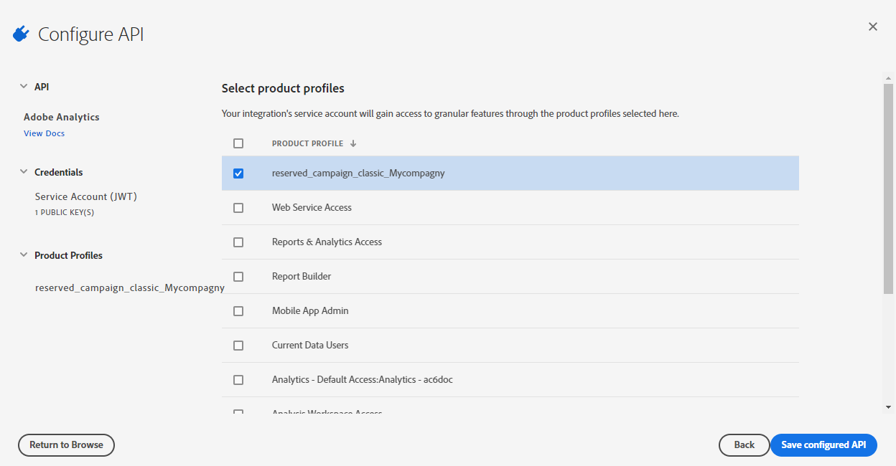

# Adobe Analytics-connector provisioning {#adobe-analytics-connector-provisioning}

>[!CAUTION]
>
> Deze stappen mogen alleen worden uitgevoerd door Hybride en On-Premise implementaties.
>
>Neem voor de gehoste en Campagne Managed Services-implementaties contact op met [Klantenservice Adoben](https://helpx.adobe.com/nl/enterprise/admin-guide.html/enterprise/using/support-for-experience-cloud.ug.html) team.

De integratie tussen Adobe Campaign Classic en Adobe Analytics-verificatie ondersteunt Adobe Identity Management Service (IMS):

* Als u een gemigreerde externe account beheert, moet u Adobe IMS implementeren en verbinding maken met Adobe Campaign via een Adobe ID.

  Houd er rekening mee dat de gebruiker die via Adobe ID IMS is aangemeld, eigenaar moet zijn van de **Gegevensconnector** -account in Adobe Analytics en beschikken over de juiste machtigingen voor de **Productprofiel** genoemd [onder](#analytics-product-profile).

Het probleem was dat de eigenaar van de gegevensconnector een andere gebruiker was dan de gebruiker die was aangemeld bij Campagne en die de integratie met Analytics probeerde uit te voeren.

* Als u een nieuwe aansluiting implementeert, is de implementatie van Adobe IMS optioneel. Zonder Adobe ID-gebruiker gebruikt Adobe Campaign een technische gebruiker voor synchronisatie met Adobe Analytics.

Deze integratie werkt alleen als u een Adobe Analytics-productprofiel maakt dat uitsluitend voor de Analytics-connector wordt gebruikt. Vervolgens moet u een Adobe I/O-project maken.

>[!AVAILABILITY]
>
> JWT (JSON Web Tokens) wordt momenteel uitgefaseerd en wordt vervangen door OAuth. De overgang wordt geleidelijk uitgevoerd binnen komende releases van Campaign en de documentatie zal worden aangepast voor deze updates.

## Een Adobe Analytics-productprofiel maken {#analytics-product-profile}

Het Profiel van het product bepaalt het niveau van toegang een gebruiker op uw verschillende Componenten van Analytics heeft.

Als u al een productprofiel voor Analytics hebt, moet u nog steeds een nieuw Adobe Analytics-productprofiel maken dat uitsluitend wordt gebruikt voor de Analytics-connector. Zo zorgt u ervoor dat uw productprofiel is ingesteld met de juiste machtigingen voor deze integratie.

Raadpleeg voor meer informatie over productprofielen de [Documentatie voor beheerconsole](https://helpx.adobe.com/mt/enterprise/admin-guide.html).

1. Van de [Admin Console](https://adminconsole.adobe.com/), selecteer je Adobe Analytics **[!UICONTROL Product]**.

   

1. Klik op **[!UICONTROL New Profile]**.

   

1. Voeg een **[!UICONTROL Product profile name]** We raden u aan de volgende syntaxis te gebruiken: `reserved_campaign_classic_<Company Name>`. Klik vervolgens op **[!UICONTROL Next]**.

   Dit **[!UICONTROL Product profile]** uitsluitend gebruiken voor de Analytics Connector om fouten in de configuratie te voorkomen.

1. Open uw nieuw gemaakte **[!UICONTROL Product profile]** en selecteert u de **[!UICONTROL Permissions]** tab.

   

1. De verschillende mogelijkheden configureren door te klikken **[!UICONTROL Edit]** en selecteer de machtigingen die aan uw **[!UICONTROL Product profile]** door op de plusknop (+) te klikken.

   Raadpleeg voor meer informatie over het beheren van machtigingen de [Documentatie voor beheerconsole](https://helpx.adobe.com/mt/enterprise/using/manage-permissions-and-roles.html).

1. Voor de **[!UICONTROL Report Suites]** mogelijkheden, voegt de **[!UICONTROL Report Suites]** moet u later gebruiken.

   Als u geen rapportsuites hebt, kunt u het volgende creëren [deze stappen](../../platform/using/gs-aa.md).

   

1. Voor de **[!UICONTROL Metrics]** mogelijkheden, voegt de **[!UICONTROL Metrics]** u zult later moeten vormen.

   Indien nodig, kunt u de auto-omvat optie inschakelen die elk toestemmingenpunt in de inbegrepen lijst zal toevoegen en automatisch nieuwe toestemmingspunten zal toevoegen.

   

1. Voor de **[!UICONTROL Dimensions]** mogelijkheden, voegt de **[!UICONTROL Dimensions]** nodig voor toekomstige configuratie.

   Zorg ervoor dat de gekozen Dimensionen overeenkomen met de instellingen die in de externe account moeten worden geconfigureerd en lijn deze uit met het corresponderende eVars-nummer van Adobe Analytics.

1. Voor de **[!UICONTROL Report Suite Tools]** kunt u de volgende machtigingen toevoegen:

   * **[!UICONTROL Report suite Mgmt]**
   * **[!UICONTROL Conversion variables]**
   * **[!UICONTROL Success events]**
   * **[!UICONTROL Custom data Warehouse report]**
   * **[!UICONTROL Data sources manager]**
   * **[!UICONTROL Classifications]**

1. Voor de **[!UICONTROL Analytics Tools]** kunt u de volgende machtigingen toevoegen:

   * **[!UICONTROL Code Manager - Web services]**
   * **[!UICONTROL Logs - Web services]**
   * **[!UICONTROL Web services]**
   * **[!UICONTROL Web service access]**
   * **[!UICONTROL Calculated metric creation]**
   * **[!UICONTROL Segment creation]**

Uw productprofiel is nu geconfigureerd. Vervolgens moet u het Adobe I/O-project maken.

## Adobe I/O-project maken {#create-adobe-io}

1. Adobe I/O benaderen en aanmelden als **Systeembeheerder** van uw organisatie.

   Raadpleeg deze voor meer informatie over beheerdersrollen [page](https://helpx.adobe.com/enterprise/using/admin-roles.html).

1. Klik op **[!UICONTROL Create a new project]**.

   

1. Klikken **[!UICONTROL Add to Project]** en selecteert u **[!UICONTROL API]**.

   

1. Selecteer [!DNL Adobe Analytics] en klik op **[!UICONTROL Next]**.

   

1. Kies **[!UICONTROL Service Account (JWT)]** als verificatietype en klik op **[!UICONTROL Next]**.

   

1. Selecteer de **[!UICONTROL Option 1: Generate a Key-Pair]** en klik op **[!UICONTROL Generate a Key-Pair]**.

   Het bestand config.zip wordt dan automatisch gedownload.

   

1. Klik op **[!UICONTROL Next]**.

   

1. Selecteer de **[!UICONTROL Product profile]** gemaakt in de vorige stappen die in dit [sectie](#analytics-product-profile).

1. Klik vervolgens op **[!UICONTROL Save Configured API]**.

   

1. Van uw project, selecteer [!DNL Adobe Analytics] en kopieert u de volgende informatie onder **[!UICONTROL Service Account (JWT)]**:

   * **[!UICONTROL Client ID]**
   * **[!UICONTROL Client Secret]**
   * **[!UICONTROL Technical account ID]**
   * **[!UICONTROL Organization ID]**

   

1. Gebruik de in stap 6 gegenereerde persoonlijke sleutel.

   Als u reeds opstellingsTriggers gebruikend deze geloofsbrieven, uw privé sleutel voor deze schakelaarconfiguratie het zelfde moet zijn.

1. Codeer de persoonlijke sleutel met behulp van de volgende opdracht: `base64 ./private.key > private.key.base64`. Hierdoor wordt de base64-inhoud opgeslagen in een nieuw bestand `private.key.base64`.

   >[!NOTE]
   >
   >Soms kunnen extra regels automatisch worden toegevoegd wanneer u de persoonlijke sleutel kopieert/plakt. Vergeet niet deze te verwijderen voordat u uw persoonlijke sleutel gaat coderen.

1. De inhoud van het bestand kopiëren `private.key.base64`.

1. Meld u via SSH aan bij elke container waarin de Adobe Campaign-instantie is geïnstalleerd en voeg de projectgegevens toe in Adobe Campaign door de volgende opdracht uit te voeren als `neolane` gebruiker. Hiermee voegt u de **[!UICONTROL Technical Account]** referenties in het configuratiebestand van de instantie.

   ```
   nlserver config -instance:<instance name> -setimsjwtauth:Organization_Id/Client_Id/Technical_Account_ID/<Client_Secret>/<Base64_encoded_Private_Key>
   ```

U kunt nu de Analytics-connector gebruiken en uw klantgedrag volgen.
