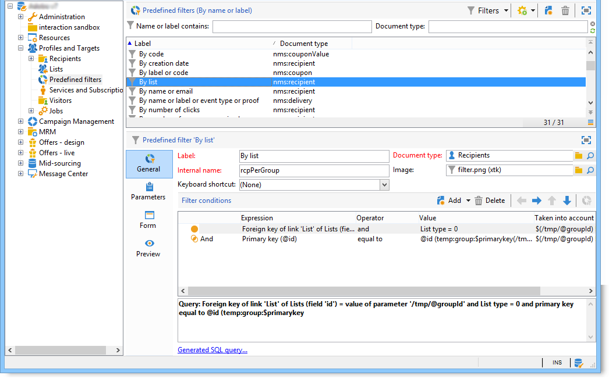

# Adobe Campaign-verkenner gebruiken {#using-adobe-campaign-explorer}

De Adobe Campaign-verkenner is toegankelijk via het werkbalkpictogram. Hiermee hebt u toegang tot de Adobe Campaign, alle Adobe Campaign-mogelijkheden, configuratieschermen en een gedetailleerdere weergave van enkele platformelementen.

De **[!UICONTROL Explorer]** De werkruimte bestaat uit drie zones:

**1 - boom**: u kunt de inhoud van de structuur aanpassen (knooppunten toevoegen, verplaatsen of verwijderen). Deze procedure is alleen bedoeld voor professionele gebruikers. Raadpleeg voor meer informatie hierover  [deze sectie](#about-navigation-hierarchy).).

**2 - Lijst**: u kunt deze lijst filteren, zoekopdrachten uitvoeren, informatie toevoegen of gegevens sorteren. [Meer informatie](adobe-campaign-ui-lists.md).

**3 - Details**: u kunt de details van het geselecteerde element weergeven. Met het pictogram in de rechterbovensectie kunt u deze informatie op volledig scherm weergeven.

## Mappen en navigatiestructuur{#about-navigation-hierarchy}

De navigatiestructuur werkt als een bestandsbrowser (bijvoorbeeld Windows Verkenner). Mappen kunnen submappen bevatten. Als u een knooppunt selecteert, wordt de weergave weergegeven die overeenkomt met het knooppunt.

De weergegeven weergave is een lijst die is gekoppeld aan een schema en een invoerformulier voor het bewerken van de geselecteerde regel.

Als u een nieuwe map aan de structuur wilt toevoegen, klikt u met de rechtermuisknop op de map in de vertakking waar u een map wilt invoegen en selecteert u **[!UICONTROL Add new folder]** . Selecteer in het snelmenu het type bestand dat u wilt maken.

Leer hoe u de boomstructuur voor cameranavigatie configureert [in deze sectie](../../configuration/using/configuration.md).

Leer hoe u machtigingen voor mappen instelt [in deze sectie](access-management-folders.md).

## Aanbevolen werkwijzen voor mapconfiguratie

* **Ingebouwde mappen gebruiken**

  Door de ingebouwde mappen te gebruiken, kunt u de toepassing eenvoudiger gebruiken, onderhouden en problemen oplossen voor personen die niet bij het project zijn betrokken. U moet geen aangepaste mapstructuren maken voor ontvangers, lijsten, leveringen, enzovoort, maar u moet wel de standaardmappen gebruiken, zoals Beheer, Profielen en doelen, Campagnebeheer.

* **Submappen maken**

  Plaats technische workflows onder de standaardmap: Beheer / Productie / Technische workflows en maak submappen per workflowtype.

* **Een naamgevingsconventie instellen**

  U kunt de werkstromen bijvoorbeeld in alfabetische volgorde benoemen, zodat ze in de volgorde van uitvoering gesorteerd worden weergegeven.

  Bijvoorbeeld:

   * A1 - ontvangers van de invoer, begint om 10:00;
   * A2 - Importopdrachten beginnen om 11.00 uur.

* **Sjablonen maken waarmee gebruikers kunnen beginnen**

  Leveringssjablonen, workflowsjablonen en campagnemalplaatjes maken die specifiek zijn voor gebruikers. Deze structuur kan tijd besparen en ervoor zorgen dat de juiste leveringstoewijzing en typologieën voor elke gebruiker worden gebruikt.

## Schermresolutie {#screen-resolution}

Voor optimale navigatie en bruikbaarheid raadt de Adobe aan een minimale schermresolutie van 1600 x 900 pixels te gebruiken.

>[!CAUTION]
>
>Resoluties van minder dan 1600 x 900 pixels worden niet ondersteund door Adobe Campaign.

In de **[!UICONTROL Explorer]** werkruimte, als sommige delen van de **[!UICONTROL Details]** zone lijkt te zijn afgekapt, uitgevouwen met de pijl boven de zone of klik op de knop **[!UICONTROL Enlarge]** knop.

## Lijsten verkennen en aanpassen {#browsing-lists}

Leer hoe u lijsten kunt bladeren, beheren en aanpassen [in deze sectie](adobe-campaign-ui-lists.md).
