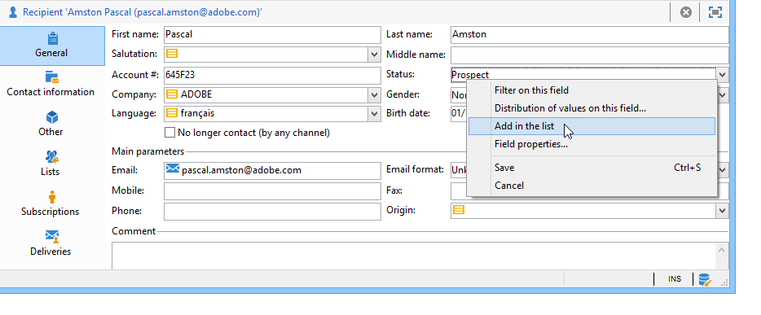

# Lijsten beheren en aanpassen{#manage-and-customize-lists}

U kunt tot de lijsten van verslagen in het gegevensbestand van de Campagne toegang hebben gebruikend de Ontdekkingsreiziger. U kunt deze lijsten filteren, zoekopdrachten uitvoeren, informatie toevoegen, filteren en sorteren.

## Records tellen {#counting-records}

Standaard laadt Adobe Campaign de eerste 200 records van een lijst. Dit betekent dat niet noodzakelijkerwijs alle records van de tabel worden weergegeven die u bekijkt. U kunt een telling van het aantal verslagen in de lijst in werking stellen en meer verslagen laden.

In het onderste rechtergedeelte van het lijstscherm, toont **[!UICONTROL counter]** hoeveel verslagen zijn geladen en het totale aantal verslagen in het gegevensbestand (na het toepassen van om het even welke filters):

Als een &quot;**?**&quot; wordt weergegeven in plaats van het nummer aan de rechterkant, klikt u op de teller om de berekening te starten.

### Meer records {#loading-more-records} laden

Als u aanvullende records (standaard 200 regels) wilt laden (en dus wilt weergeven), klikt u op **[!UICONTROL Continue loading]**.

Als u alle records wilt laden, klikt u met de rechtermuisknop op de lijst en selecteert u **[!UICONTROL Load all]**.

>[!CAUTION]
>
>Afhankelijk van het aantal records kan de tijd voor het laden van de volledige lijst lang zijn.

### Standaardaantal records wijzigen {#change-default-number-of-records}

Als u het standaardaantal geladen records wilt wijzigen, klikt u op **[!UICONTROL Configure list]** rechtsonder in de lijst.

Klik in het lijstconfiguratievenster op **[!UICONTROL Advanced parameters]** (linksonder) en wijzig het aantal regels dat moet worden opgehaald.

## Lijsten {#configuring-lists} configureren

### Kolommen {#add-columns} toevoegen

Er zijn twee manieren om een kolom in een lijst toe te voegen.

U kunt snel een kolom aan een lijst van het detail van een verslag toevoegen. Dit doet u als volgt:

1. Klik in een detailscherm met de rechtermuisknop op het veld dat u in een kolom wilt weergeven.
1. Selecteer **[!UICONTROL Add in the list]**.

   De kolom wordt rechts van de bestaande kolommen toegevoegd.

Een andere manier om kolommen toe te voegen, bijvoorbeeld als u gegevens wilt tonen die niet op het detailscherm worden getoond, is het venster van de lijstconfiguratie te gebruiken. Dit doet u als volgt:

1. Klik op **[!UICONTROL Configure list]** hieronder en rechts van de lijst.

   

1. Dubbelklik in het lijstconfiguratievenster op het veld dat u wilt toevoegen in de lijst **[!UICONTROL Available fields]** om het veld toe te voegen aan **[!UICONTROL Output columns]**.

   

   >[!NOTE]
   >
   >Geavanceerde velden worden standaard niet weergegeven. Klik **Geavanceerde velden weergeven** hieronder en rechts van de lijst met beschikbare velden om deze weer te geven.
   >
   >De labels worden weergegeven als een tabel en vervolgens in alfabetische volgorde.
   >
   >Gebruik het veld **Zoeken** om een zoekopdracht uit te voeren in de beschikbare velden. Zie [deze sectie](#sorting-a-list) voor meer informatie.
   >
   >Velden worden aangegeven met specifieke pictogrammen: SQL-velden, gekoppelde tabellen, berekende velden, enzovoort. Voor elk geselecteerd veld wordt de beschrijving weergegeven onder de lijst met beschikbare velden. [Meer informatie](#configuring-lists).
   >
   >U kunt gegevens ook sorteren en filteren. Zie [deze sectie](../../platform/using/filtering-options.md).

1. Herhaal deze bewerking voor elke kolom die u wilt weergeven.
1. Gebruik de pijlen om de **weergavevolgorde** te wijzigen. De hoogste kolom zal op de linkerzijde in de lijst van verslagen zijn.

   

1. Indien nodig, kunt u **[!UICONTROL Distribution of values]** klikken om de verdeling van waarden voor het geselecteerde gebied in de huidige omslag te bekijken.

   

1. Klik **[!UICONTROL OK]** om de configuratie te bevestigen en het resultaat te tonen.

### Nieuwe kolom maken {#create-a-new-column}

U kunt nieuwe kolommen maken om extra velden in de lijst weer te geven. Dit doet u als volgt:

1. Klik op **[!UICONTROL Configure the list]** hieronder en rechts van de lijst.
1. Klik **[!UICONTROL Add]** om een nieuw gebied in de lijst te tonen.

### Een kolom {#remove-a-column} verwijderen

U kunt een of meer kolommen in een lijst met records maskeren met behulp van **[!UICONTROL Configure list]** die zich onder en rechts van de lijst bevindt.

Selecteer in het lijstconfiguratievenster de kolom die u wilt maskeren in de zone **[!UICONTROL Output columns]** en klik op de knop Verwijderen.

Herhaal deze bewerking voor elke kolom die u wilt maskeren. Klik **[!UICONTROL OK]** om de configuratie te bevestigen en het resultaat te tonen.

### Kolombreedte {#adjust-column-width} aanpassen

Wanneer een lijst actief is, d.w.z. minstens één lijn wordt geselecteerd, kunt u F9 gebruiken om de breedte van de kolommen aan te passen zodat alle kolommen op het scherm kunnen worden getoond.

### Gegevens weergeven in submappen {#display-sub-folders-records}

Lijsten kunnen worden weergegeven:

* Alleen de records in de geselecteerde map,
* Of de records in de geselecteerde map EN de bijbehorende submappen.

Als u van de ene weergavemodus naar de andere wilt schakelen, klikt u op **[!UICONTROL Display sub-levels]** in de werkbalk.

## Een lijstconfiguratie opslaan {#saving-a-list-configuration}

De lijstconfiguraties worden bepaald plaatselijk op het werkstationniveau. Wanneer de lokale cache wordt gewist, worden lokale configuraties uitgeschakeld.

Standaard zijn de gedefinieerde weergaveparameters van toepassing op alle lijsten met het overeenkomende maptype. Wanneer u dus wijzigt hoe de lijst met ontvangers wordt weergegeven vanuit een map, wordt deze configuratie toegepast op alle andere mappen voor ontvangers.

Het is echter mogelijk meerdere configuraties op te slaan die op verschillende mappen van hetzelfde type moeten worden toegepast. De configuratie wordt opgeslagen met de eigenschappen van de map die de gegevens bevat en kan opnieuw worden toegepast.

Bijvoorbeeld, voor een leveringsomslag, is het mogelijk om de volgende vertoning te vormen:

Volg onderstaande stappen om deze lijstconfiguratie op te slaan zodat deze opnieuw kan worden gebruikt:

1. Klik met de rechtermuisknop op de map met de weergegeven gegevens.
1. Selecteer **[!UICONTROL Properties]**.
1. Klik op **[!UICONTROL Advanced settings]** en geef een naam op in het veld **[!UICONTROL Configuration]**.

   

1. Klik **[!UICONTROL OK]** en klik dan **[!UICONTROL Save]**.

U kunt deze configuratie dan toepassen op een andere **Delivery** omslag:

Klik **[!UICONTROL Save]** in het venster van omslageigenschappen. De lijstweergave wordt aangepast aan de opgegeven configuratie:

## Een lijst {#exporting-a-list} exporteren

Als u gegevens uit een lijst wilt exporteren, moet u een wizard voor exporteren gebruiken. Als u deze wilt openen, selecteert u de elementen die u wilt exporteren in de lijst, klikt u met de rechtermuisknop en selecteert u **[!UICONTROL Export...]**.

Het gebruik van de invoer- en uitvoerfuncties wordt uitgelegd in [Algemene invoer en uitvoer](../../platform/using/about-generic-imports-exports.md).

>[!CAUTION]
>
>Elementen uit een lijst mogen niet worden geëxporteerd met de functie Kopiëren/Plakken.

## Een lijst {#sorting-a-list} sorteren

Lijsten kunnen een grote hoeveelheid gegevens bevatten. U kunt deze gegevens sorteren of eenvoudige of geavanceerde filters toepassen. Door te sorteren kunt u gegevens in oplopende of aflopende volgorde weergeven. Met filters kunt u alleen geselecteerde gegevens definiëren en combineren.

Klik op de kolomkop om een oplopende of aflopende sortering toe te passen of om het sorteren van gegevens te annuleren. De actieve sorteerstatus en sorteervolgorde worden aangegeven met een blauwe pijl vóór het kolomlabel. Een rood streepje vóór het kolomlabel betekent dat de sortering wordt toegepast op gegevens die uit de database zijn geïndexeerd. Deze sorteermethode wordt gebruikt om sorteertaken te optimaliseren.

U kunt ook sorteren configureren of sorteercriteria combineren. Volg de onderstaande stappen om dit te doen:

1. **[!UICONTROL Configure list]** en rechts van de lijst.

   

1. Klik in het lijstconfiguratievenster op het tabblad **[!UICONTROL Sorting]**.
1. Selecteer de velden die u wilt sorteren en de sorteerrichting (oplopend of aflopend).

   

1. De sorteerprioriteit wordt gedefinieerd door de volgorde van de sorteerkolommen. Als u de prioriteit wilt wijzigen, gebruikt u de juiste pictogrammen om de volgorde van de kolommen te wijzigen.

   

   De sorteerprioriteit heeft geen invloed op de weergave van de kolommen in de lijst.

1. Klik **[!UICONTROL Ok]** om deze configuratie te bevestigen en het resultaat in de lijst te tonen.

### Elementen zoeken {#running-a-search}

U kunt een onderzoek van de beschikbare gebieden in een redacteur in werking stellen gebruikend het **[!UICONTROL Search]** gebied boven de lijst van gebieden wordt gevestigd die. Druk op **Enter** op het toetsenbord of blader door de lijst. De velden die overeenkomen met uw zoekopdracht, hebben vette labels.

>[!NOTE]
>
>U kunt filters maken om slechts enkele gegevens in een lijst weer te geven. [Meer informatie](../../platform/using/creating-filters.md).
