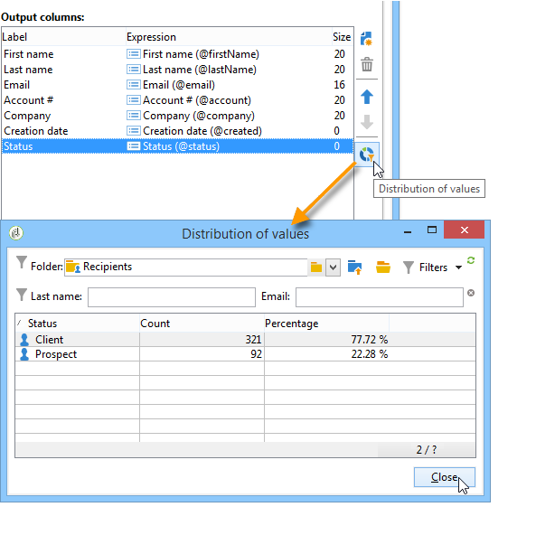

# De werkruimte Adobe Campagne{#adobe-campaign-workspace}

## Informatie over de Adobe Campagne-interface {#about-adobe-campaign-interface}

Zodra u met het gegevensbestand wordt verbonden, zult u tot de homepage van de Campagne van Adobe toegang hebben, die een dashboard is: het bestaat uit verbindingen en kortere weg die u tot mogelijkheden, afhankelijk van uw installatie en algemene platformconfiguraties kunnen toegang hebben.

Vanuit het centrale gedeelte van de homepage kunt u koppelingen gebruiken om toegang te krijgen tot het online documentatieportaal, -forum en de ondersteuningswebsite van Campagne.

De bovenstaande schermafbeelding is een voorbeeld van de startpagina voor een Adobe Campagnegebruiker. Bekijk de overzichtsvideo [van de](https://docs.adobe.com/content/help/en/campaign-learn/campaign-classic-tutorials/getting-started/interface-overview.html)Adobe Campagne Interface voor meer informatie.

>[!NOTE]
>
>De beschikbare Adobe Campagne-mogelijkheden voor uw instantie zijn afhankelijk van geïnstalleerde modules en invoegtoepassingen. Sommige zijn mogelijk ook niet beschikbaar, afhankelijk van uw machtigingen en specifieke configuraties.
>
>Voordat u een module of add-on installeert, moet u de licentieovereenkomst controleren of contact opnemen met de manager van uw Adobe-account.

### Console en webtoegang {#console-and-web-access}

Het Adobe Campagne-platform is toegankelijk via een console of via een internetbrowser.

De toegang van het Web verstrekt een interface die aan de console maar met een verminderde reeks functionaliteiten gelijkaardig is.

Bijvoorbeeld, voor een bepaalde exploitant, zal een campagne met de volgende opties in de console verschijnen:

Terwijl met de toegang van het Web, de opties hoofdzakelijk het bekijken zullen toelaten:

### Talen {#languages}

De taal wordt geselecteerd bij de installatie van uw Adobe Campagne Classic-exemplaar en kan daarna niet worden gewijzigd. Raadpleeg deze [pagina](../../installation/using/creating-an-instance-and-logging-on.md)voor meer informatie over het maken van een instantie.

U kunt kiezen uit vijf verschillende talen:

* Engels (VS)
* Engels (EN)
* Frans
* Duits
* Japans

De taal die u kiest voor uw Adobe Campagne Classic-instantie kan van invloed zijn op datum- en tijdnotaties. For more on this, refer to this [section](../../platform/using/adobe-campaign-workspace.md#date-and-time).

## Basisbeginselen van navigatie {#navigation-basics}

### Bladeren door pagina&#39;s {#browsing-pages}

De verschillende functies van het platform zijn onderverdeeld in kernmogelijkheden: gebruik de verbindingen die u in de hoogste sectie van de interface ziet om tot hen toegang te hebben.

De lijst met kernmogelijkheden waartoe u toegang hebt, is afhankelijk van de pakketten en invoegtoepassingen die u hebt geïnstalleerd en van uw toegangsrechten.

Elk vermogen omvat een reeks functionaliteiten die op taak betrekking hebbende behoeften en gebruikscontext worden gebaseerd. Met de **[!UICONTROL Profiles and targets]** koppeling wordt u bijvoorbeeld naar de lijsten met ontvangers, abonnementsservices, bestaande workflows voor activering en de sneltoetsen voor het maken van deze elementen.

De lijsten zijn beschikbaar via de **[!UICONTROL Lists]** verbinding in de linkersectie van de **[!UICONTROL Profiles and Targets]** interface.

### Tabs gebruiken {#using-tabs}

* Wanneer u op een kernfunctie of een koppeling klikt, wordt de huidige pagina vervangen door de relevante pagina. Klik op de **[!UICONTROL Back]** knop op de werkbalk om terug te gaan naar de vorige pagina. Klik op de **[!UICONTROL Home]** knop om terug te keren naar de startpagina.

   

* In het geval van een menu of een snelkoppeling naar een scherm (zoals een webtoepassing, programma, levering, rapport, enz.), wordt de bijbehorende pagina weergegeven op een ander tabblad. Op deze manier kunt u van de ene pagina naar de andere bladeren met de tabbladen.

   

### Een element maken {#creating-an-element}

In elke sectie met kernmogelijkheden kunt u bladeren door de beschikbare elementen. Hiervoor gebruikt u de sneltoetsen in de **[!UICONTROL Browsing]** sectie. Met de **[!UICONTROL Other choices]** koppeling hebt u toegang tot alle andere pagina&#39;s, ongeacht de omgeving.

U kunt een nieuw element maken (levering, webtoepassing, workflow, enz.) met de sneltoetsen in de **[!UICONTROL Create]** sectie links van het scherm. Gebruik de **[!UICONTROL Create]** knop boven de lijst om nieuwe elementen aan de lijst toe te voegen.

Gebruik bijvoorbeeld op de leveringspagina de **[!UICONTROL Create]** knop om een nieuwe levering te maken.

## Adobe Campagneverkenner gebruiken {#using-adobe-campaign-explorer}

### Informatie over Adobe Campagneverkenner {#about-adobe-campaign-explorer}

De Adobe Campagneverkenner is toegankelijk via het werkbalkpictogram. Hiermee hebt u toegang tot de Adobe-campagne voor alle mogelijkheden, configuratieschermen en een gedetailleerdere weergave van enkele platformelementen.

De **[!UICONTROL Explorer]** werkruimte bestaat uit drie zones:

**1 - Boom**: U kunt de inhoud van de structuur aanpassen (knooppunten toevoegen, verplaatsen of verwijderen). Deze procedure is alleen bedoeld voor professionele gebruikers. For more on this, refer to [this page](../../configuration/using/about-navigation-hierarchy.md).

**2 - Lijst**: u kunt deze lijst filteren, zoekopdrachten uitvoeren, informatie toevoegen of gegevens sorteren.

**3 - Details**: u kunt de details van het geselecteerde element weergeven. Met het pictogram in de rechterbovensectie kunt u deze informatie op volledig scherm weergeven.

### Schermresolutie {#screen-resolution}

Voor optimale navigatie en bruikbaarheid raadt Adobe aan een minimale schermresolutie van 1600 x 900 pixels te gebruiken.

>[!CAUTION]
>
>Resoluties van minder dan 1600 x 900 pixels worden mogelijk niet ondersteund door Adobe Campagne.

Als bepaalde delen van de **[!UICONTROL Explorer]** zone in de **[!UICONTROL Details]** werkruimte zijn afgekapt, vouwt u deze uit met de pijl boven de zone of klikt u op de **[!UICONTROL Enlarge]** knop.

### Bladeren door lijsten {#browsing-lists}

Als u door een lijst wilt bladeren, kunt u **de schuifbalken** (horizontaal en verticaal) gebruiken om er doorheen te schuiven zonder de recordselectie, **het muiswiel** of **de pijltoetsen** te wijzigen.

>[!NOTE]
>
>De configuratie en de verpersoonlijking van lijstinhoud worden voorgesteld in het [Vormen lijsten](#configuring-lists).
>
>U kunt gegevens ook sorteren en filteren. Zie [Filteropties](../../platform/using/filtering-options.md).

### Records tellen {#counting-records}

Standaard worden in Adobe Campagne de eerste 200 records van een lijst geladen. Dit betekent dat niet noodzakelijkerwijs alle records van de tabel worden weergegeven die u bekijkt. U kunt een telling van het aantal verslagen in de lijst in werking stellen en meer verslagen laden.

In het onderste rechtergedeelte van het lijstscherm, **[!UICONTROL counter]** toont een hoeveel verslagen zijn geladen en het totale aantal verslagen in het gegevensbestand (na het toepassen van om het even welke filters):

Als een &quot;**?**&quot; wordt weergegeven in plaats van het nummer aan de rechterkant, klikt u op de teller om de berekening te starten.

### Meer records laden {#loading-more-records}

Als u aanvullende records wilt laden (en dus wilt weergeven) (standaard 200 regels) klikt u **[!UICONTROL Continue loading]**.

Als u alle records wilt laden, klikt u met de rechtermuisknop op de lijst en selecteert u **[!UICONTROL Load all]**.

>[!CAUTION]
>
>Afhankelijk van het aantal records kan de tijd voor het laden van de volledige lijst lang zijn.

### Standaardaantal records wijzigen {#change-default-number-of-records}

Als u het standaardaantal geladen records wilt wijzigen, klikt u **[!UICONTROL Configure list]** in de rechteronderhoek van de lijst.

Klik in het lijstconfiguratievenster op Geavanceerde parameters (linksonder) en wijzig het aantal regels dat moet worden opgehaald.

### Lijsten configureren {#configuring-lists}

#### Kolommen toevoegen {#add-columns}

Er zijn twee manieren om een kolom in een lijst toe te voegen.

U kunt snel een kolom aan een lijst van het detail van een verslag toevoegen. Dit doet u als volgt:

1. Klik in een detailscherm met de rechtermuisknop op het veld dat u in een kolom wilt weergeven.
1. Selecteer **[!UICONTROL Add in the list]**.

   De kolom wordt rechts van de bestaande kolommen toegevoegd.

Een andere manier om kolommen toe te voegen, bijvoorbeeld als u gegevens wilt tonen die niet op het detailscherm worden getoond, is het venster van de lijstconfiguratie te gebruiken. Dit doet u als volgt:

1. Klik **[!UICONTROL Configure list]** hieronder en rechts van de lijst.

   

1. Dubbelklik in het configuratievenster van de lijst op het veld dat u wilt toevoegen aan de **[!UICONTROL Available fields]** lijst om deze toe te voegen aan de lijst **[!UICONTROL Output columns]**.

   

   >[!NOTE]
   >
   >Geavanceerde velden worden standaard niet weergegeven. Klik hieronder op Geavanceerde velden **** weergeven en rechts van de lijst met beschikbare velden om deze weer te geven.
   >
   >De labels worden weergegeven als een tabel en vervolgens in alfabetische volgorde.
   >
   >Gebruik het veld **Zoeken** om een zoekopdracht uit te voeren in de beschikbare velden. Zie Een lijst sorteren voor meer informatie.
   >
   >Velden worden aangegeven met specifieke pictogrammen: SQL-velden, gekoppelde tabellen, berekende velden, enzovoort. Voor elk geselecteerd veld wordt de beschrijving weergegeven onder de lijst met beschikbare velden.
   [Lijsten](#configuring-lists)configureren.
   >
   >U kunt gegevens ook sorteren en filteren. Zie [Filteropties](../../platform/using/filtering-options.md).

1. Herhaal deze bewerking voor elke kolom die moet worden weergegeven.
1. Gebruik de pijlen om de **weergavevolgorde** te wijzigen. De hoogste kolom zal op de linkerzijde in de lijst van verslagen zijn.

   

1. Indien nodig, kunt u klikken **[!UICONTROL Distribution of values]** om de verdeling van waarden voor het geselecteerde veld in de huidige map weer te geven.

   

1. Klik **[!UICONTROL OK]** om de configuratie te bevestigen en het resultaat te tonen.

#### Een nieuwe kolom maken {#create-a-new-column}

U kunt nieuwe kolommen maken om extra velden in de lijst weer te geven. Dit doet u als volgt:

1. Klik **[!UICONTROL Configure the list]** bij hieronder en rechts van de lijst.
1. Klik **[!UICONTROL Add]** om een nieuw veld in de lijst weer te geven.

#### Een kolom verwijderen {#remove-a-column}

U kunt een of meer kolommen in een lijst met records maskeren aan de hand van de kolommen onder en rechts van de lijst. **[!UICONTROL Configure list]**

In het venster van de lijstconfiguratie, selecteer de kolom die van de **[!UICONTROL Output columns]** streek moet worden gemaskeerd, en klik de schrappingsknoop.

Herhaal deze bewerking voor elke kolom die u wilt maskeren. Klik **[!UICONTROL OK]** om de configuratie te bevestigen en het resultaat te tonen.

#### Kolombreedte aanpassen {#adjust-column-width}

Wanneer een lijst actief is, d.w.z. minstens één lijn wordt geselecteerd, kunt u F9 gebruiken om de breedte van de kolommen aan te passen zodat alle kolommen op het scherm kunnen worden getoond.

#### Submappen weergeven {#display-sub-folders-records}

Lijsten kunnen worden weergegeven:

* Alleen de records in de geselecteerde map,
* Of de records in de geselecteerde map EN de bijbehorende submappen.

Als u van de ene weergavemodus naar de andere wilt schakelen, klikt u op **[!UICONTROL Display sub-levels]** de werkbalk.

### Een lijstconfiguratie opslaan {#saving-a-list-configuration}

De lijstconfiguraties worden bepaald plaatselijk op het werkstationniveau. Wanneer de lokale cache wordt gewist, worden lokale configuraties uitgeschakeld.

Standaard zijn de gedefinieerde weergaveparameters van toepassing op alle lijsten met het overeenkomende maptype. Wanneer u dus wijzigt hoe de lijst met ontvangers wordt weergegeven vanuit een map, wordt deze configuratie toegepast op alle andere mappen voor ontvangers.

Het is echter mogelijk meerdere configuraties op te slaan die op verschillende mappen van hetzelfde type moeten worden toegepast. De configuratie wordt opgeslagen met de eigenschappen van de map die de gegevens bevat en kan opnieuw worden toegepast.

Bijvoorbeeld, voor een leveringsomslag, is het mogelijk om de volgende vertoning te vormen:

Volg onderstaande stappen om deze lijstconfiguratie op te slaan zodat deze opnieuw kan worden gebruikt:

1. Klik met de rechtermuisknop op de map met de weergegeven gegevens.
1. Selecteer **[!UICONTROL Properties]**.
1. Klik **[!UICONTROL Advanced settings]** en geef een naam op in het **[!UICONTROL Configuration]** veld.

   

1. Click **[!UICONTROL OK]** and then click **[!UICONTROL Save]**.

U kunt deze configuratie vervolgens toepassen op een andere **leveringsmap** :

Klik **[!UICONTROL Save]** in het venster met de mapeigenschappen. De lijstweergave wordt aangepast aan de opgegeven configuratie:

### Een lijst exporteren {#exporting-a-list}

Als u gegevens uit een lijst wilt exporteren, moet u een wizard voor exporteren gebruiken. Als u het wilt openen, selecteert u de elementen die u wilt exporteren in de lijst, klikt u met de rechtermuisknop en selecteert u **[!UICONTROL Export...]**.

Het gebruik van de invoer- en uitvoerfuncties wordt toegelicht in [Algemene invoer en uitvoer](../../platform/using/generic-imports-and-exports.md).

>[!CAUTION]
>
>Elementen uit een lijst mogen niet worden geëxporteerd met de functie Kopiëren/Plakken.

### Een lijst sorteren {#sorting-a-list}

Lijsten kunnen een grote hoeveelheid gegevens bevatten. U kunt deze gegevens sorteren of eenvoudige of geavanceerde filters toepassen. Door te sorteren kunt u gegevens in oplopende of aflopende volgorde weergeven. Met filters kunt u alleen geselecteerde gegevens definiëren en combineren.

Klik op de kolomkop om een oplopende of aflopende sortering toe te passen of om het sorteren van gegevens te annuleren. De actieve sorteerstatus en sorteervolgorde worden aangegeven met een blauwe pijl vóór het kolomlabel. Een rood streepje vóór het kolomlabel betekent dat de sortering wordt toegepast op gegevens die uit de database zijn geïndexeerd. Deze sorteermethode wordt gebruikt om sorteertaken te optimaliseren.

U kunt ook sorteren configureren of sorteercriteria combineren. Hiervoor voert u de volgende stappen uit:

1. **[!UICONTROL Configure list]** en rechts van de lijst.

   

1. Klik in het lijstconfiguratievenster op het **[!UICONTROL Sorting]** tabblad.
1. Selecteer de velden die u wilt sorteren en de sorteerrichting (oplopend of aflopend).

   

1. De sorteerprioriteit wordt gedefinieerd door de volgorde van de sorteerkolommen. Als u de prioriteit wilt wijzigen, gebruikt u de juiste pictogrammen om de volgorde van de kolommen te wijzigen.

   

   De sorteerprioriteit heeft geen invloed op de weergave van de kolommen in de lijst.

1. Klik **[!UICONTROL Ok]** om deze configuratie te bevestigen en het resultaat in de lijst te tonen.

### Een zoekopdracht uitvoeren {#running-a-search}

U kunt een onderzoek van de beschikbare gebieden in een redacteur in werking stellen gebruikend het **[!UICONTROL Search]** gebied boven de lijst van gebieden wordt gevestigd die. Druk op **Enter** op het toetsenbord of blader door de lijst. De velden die overeenkomen met uw zoekopdracht, hebben vette labels.

>[!NOTE]
>
>U kunt filters maken om slechts enkele gegevens in een lijst weer te geven. Zie [Filters](../../platform/using/creating-filters.md)maken.

## Indelingen en eenheden {#formats-and-units}

### Datum en tijd {#date-and-time}

De taal van uw Klassieke Adobe Campagne instantie beïnvloedt datum en tijdformaten.

Taal wordt geselecteerd tijdens de installatie van Campagne en kan achteraf niet worden gewijzigd. U kunt selecteren: Engels (VS), Engels (EN), Frans, Duits of Japans. For more on this, refer to [this page](../../installation/using/creating-an-instance-and-logging-on.md).

De belangrijkste verschillen tussen het Engels van de VS en het Engels van het Verenigd Koninkrijk zijn:

<table> 
 <thead> 
  <tr> 
   <th> Indelingen  </th> 
   <th> Engels (VS)  </th> 
   <th> Engels (EN)  </th> 
  </tr> 
 </thead> 
 <tbody> 
  <tr> 
   <td> Datum  </td> 
   <td> Week begint op zondag  </td> 
   <td> Week begint op maandag  </td> 
  </tr> 
  <tr> 
   <td> Korte datum  </td> 
   <td> 
%2M/%2D/%4Y

<strong>ex: 25-09-2018</strong>
 </td> 
   <td> 
%2D/%2M/%4Y

<strong>ex: 09-25-2018</strong>
 </td> 
  </tr> 
  <tr> 
   <td> Korte datum met tijd  </td> 
   <td> 
%2M/%2D/%4Y %I:%2N:%2S %P

<strong>ex: 25-09-2018 10:47:25 PM</strong>
 </td> 
   <td> 
%2D/%2M/%4Y %2H:%2N:%2S

<strong>ex: 25/09/2018 22:47:25</strong>
 </td> 
  </tr> 
 </tbody> 
</table>

### Waarden toevoegen aan een opsomming {#add-values-in-an-enumeration}

Met de invoervelden in een vervolgkeuzelijst kunt u een opsommingswaarde invoeren die u kunt opslaan en vervolgens als optie kunt aanbieden in de vervolgkeuzelijst. U kunt bijvoorbeeld in het **[!UICONTROL City]** veld op het **[!UICONTROL General]** tabblad van een ontvangend profiel Londen invoeren. Wanneer u op Enter drukt om deze waarde te bevestigen, wordt u gevraagd of u deze waarde wilt opslaan voor de opsomming die aan het veld is gekoppeld.

Als u klikt, **[!UICONTROL Yes]** is deze waarde beschikbaar in de keuzelijst met invoervak van het desbetreffende veld (in dit geval: **[!UICONTROL London]**).

>[!NOTE]
>
>Opsommingen (ook wel &#39;gespecificeerde lijsten&#39; genoemd) worden beheerd door de beheerder via de **[!UICONTROL Administration > Platform > Enumerations]** sectie. Raadpleeg [Opsommingen](../../platform/using/managing-enumerations.md)beheren voor meer informatie hierover.

### Standaardeenheden {#default-units}

Op de velden die een duur uitdrukken (bv. geldigheidsperiode van de middelen van een levering, goedkeuringstermijn voor een taak enz.), kan de waarde worden uitgedrukt in de volgende **eenheden**:

* **[!UICONTROL s]** gedurende seconden,
* **[!UICONTROL mn]** gedurende minuten,
* **[!UICONTROL h]** gedurende uren,
* **[!UICONTROL d]** dagen.

