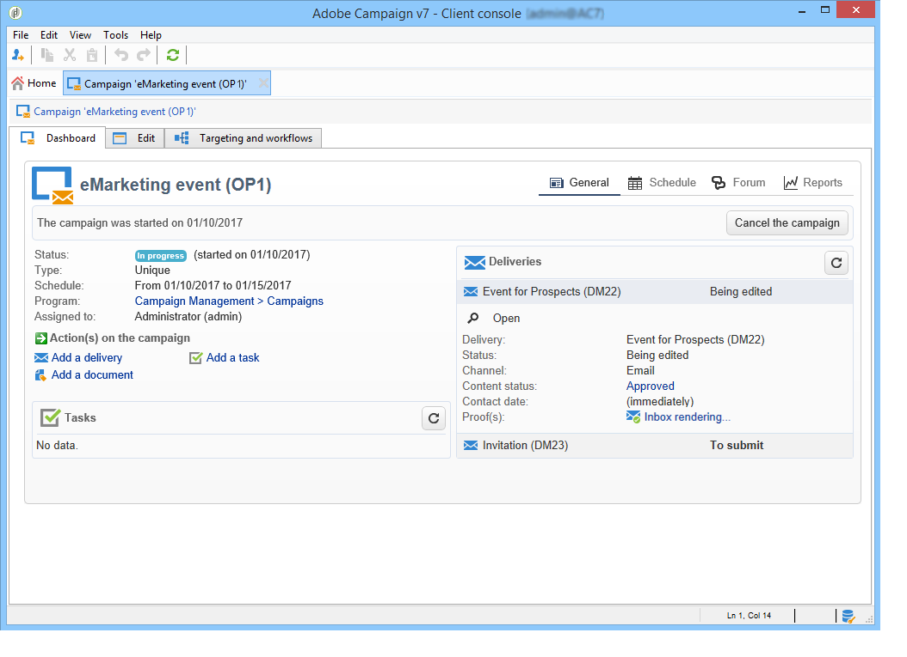

# Adobe Campaign-werkruimte{#adobe-campaign-workspace}

## De Adobe Campaign-interface verkennen {#about-adobe-campaign-interface}

Zodra u met het gegevensbestand wordt verbonden, zult u tot de homepage van Adobe Campaign toegang hebben, die een dashboard is: het bestaat uit verbindingen en kortere weg die u tot mogelijkheden, afhankelijk van uw installatie en algemene platformconfiguraties laten toegang hebben.

Vanuit het centrale gedeelte van de homepage kunt u koppelingen gebruiken om toegang te krijgen tot het online documentatieportaal, -forum en de ondersteuningswebsite van Campagne.

 Campagne ontdekken in [video](#video)

>[!NOTE]
>
>De Adobe Campaign-mogelijkheden die voor uw instantie beschikbaar zijn, zijn afhankelijk van de geïnstalleerde modules en invoegtoepassingen. Sommige zijn mogelijk ook niet beschikbaar, afhankelijk van uw machtigingen en specifieke configuraties.
>
>Voordat u een module of add-on installeert, moet u de licentieovereenkomst controleren of contact opnemen met de manager van de Adobe-account.

### Console en webtoegang {#console-and-web-access}

Het Adobe Campaign-platform is toegankelijk via een console of via een internetbrowser. Zie de compatibele browsers in de [compatibiliteitsmatrix](../../rn/using/compatibility-matrix.md#Browsers).

De interface van de Webtoegang is gelijkaardig aan de consoleinterface. Vanuit een browser kunt u dezelfde navigatie- en weergavefuncties gebruiken als in de console, maar u kunt slechts een beperkte set acties op campagnes uitvoeren. U kunt bijvoorbeeld campagnes weergeven en annuleren, maar u kunt geen campagnes wijzigen. Voor een bepaalde exploitant, zal een campagne met de volgende opties in de console verschijnen:

Terwijl de opties bij toegang tot het web vooral het weergeven van:

Meer informatie over [de webinterface gebruiken](../../campaign/using/accessing-marketing-campaigns.md#using-the-web-interface-).

### Talen {#languages}

De taal wordt geselecteerd wanneer u uw Adobe Campaign Classic-exemplaar installeert.

U kunt kiezen uit vijf verschillende talen:

* Engels (VK)
* Engels (VS)
* Frans
* Duits
* Japans

De taal die u voor uw Adobe Campaign Classic-exemplaar hebt gekozen, kan van invloed zijn op de datum- en tijdnotatie. Raadpleeg deze [sectie](../../platform/using/adobe-campaign-workspace.md#date-and-time) voor meer informatie.

Raadpleeg dit voor meer informatie over het maken van een instantie [page](../../installation/using/creating-an-instance-and-logging-on.md).

>[!CAUTION]
>
>De taal kan na het maken van de instantie niet meer worden gewijzigd.

## Basisbeginselen van navigatie {#navigation-basics}

### Bladeren door pagina&#39;s {#browsing-pages}

De verschillende functies van het platform zijn onderverdeeld in kernmogelijkheden: gebruik de verbindingen die u in de hoogste sectie van de interface ziet om tot hen toegang te hebben.

De lijst met kernmogelijkheden waartoe u toegang hebt, is afhankelijk van de pakketten en invoegtoepassingen die u hebt geïnstalleerd en van uw toegangsrechten.

Elk vermogen omvat een reeks functionaliteiten die op taak betrekking hebbende behoeften en gebruikscontext worden gebaseerd. Bijvoorbeeld de **[!UICONTROL Profiles and targets]** via de koppeling kunt u de lijsten met ontvangers, abonnementsservices, bestaande workflows voor activering en de sneltoetsen voor het maken van deze elementen gebruiken.

De lijsten zijn beschikbaar via de **[!UICONTROL Lists]** in het linkergedeelte van het dialoogvenster **[!UICONTROL Profiles and Targets]** interface.

### Tabs gebruiken {#using-tabs}

* Wanneer u op een kernfunctie of een koppeling klikt, wordt de huidige pagina vervangen door de relevante pagina. Als u terug wilt gaan naar de vorige pagina, klikt u op de knop **[!UICONTROL Back]** op de werkbalk. Als u wilt terugkeren naar de startpagina, klikt u op de knop **[!UICONTROL Home]** knop.

  

* In het geval van een menu of een snelkoppeling naar een scherm (zoals een webtoepassing, programma, levering, rapport, enz.), wordt de bijbehorende pagina weergegeven op een ander tabblad. Op deze manier kunt u van de ene pagina naar de andere bladeren met de tabbladen.

  

### Een element maken {#creating-an-element}

In elke sectie met kernmogelijkheden kunt u bladeren door de beschikbare elementen. Hiervoor gebruikt u de sneltoetsen in het dialoogvenster **[!UICONTROL Browsing]** sectie. De **[!UICONTROL Other choices]** Met de koppeling hebt u toegang tot alle andere pagina&#39;s, ongeacht de omgeving.

U kunt een nieuw element maken (levering, webtoepassing, workflow, enz.) met de sneltoetsen in het dialoogvenster **[!UICONTROL Create]** links van het scherm. Gebruik de **[!UICONTROL Create]** boven de lijst om nieuwe elementen aan de lijst toe te voegen.

Gebruik bijvoorbeeld op de leveringspagina de optie **[!UICONTROL Create]** om een nieuwe levering te maken.

## Indelingen en eenheden {#formats-and-units}

### Datum en tijd {#date-and-time}

De taal van uw Adobe Campaign Classic-exemplaar is van invloed op datum- en tijdnotaties.

Taal wordt geselecteerd tijdens de installatie van Campagne en kan achteraf niet worden gewijzigd. U kunt selecteren: Engels (VS), Engels (EN), Frans, Duits of Japans. Raadpleeg [deze pagina](../../installation/using/creating-an-instance-and-logging-on.md) voor meer informatie.

De belangrijkste verschillen tussen het Engels van de VS en het Engels van het Verenigd Koninkrijk zijn:

<table> 
 <thead> 
  <tr> 
   <th> Indelingen  </th> 
   <th> Engels (VS)  </th> 
   <th> Engels (EN)  </th> 
  </tr> 
 </thead> 
 <tbody> 
  <tr> 
   <td> Datum  </td> 
   <td> Week begint op zondag  </td> 
   <td> Week begint op maandag  </td> 
  </tr> 
  <tr> 
   <td> Korte datum  </td> 
   <td> 
%2M/%2D/%4Y

<strong>ex: 25-09-2018</strong>
 </td> 
   <td> 
%2D/%2M/%4Y

<strong>ex: 25-09-2018</strong>
 </td> 
  </tr> 
  <tr> 
   <td> Korte datum met tijd  </td> 
   <td> 
%2M/%2D/%4Y %I:%2N:%2S %P

<strong>ex: 25-09-2018 10:47:25:00</strong>
 </td> 
   <td> 
%2D/%2M/%4Y %2H:%2N:%2S

<strong>ex: 25/09/2018 22:47:25</strong>
 </td> 
  </tr> 
 </tbody> 
</table>

### Waarden toevoegen aan een opsomming {#add-values-in-an-enumeration}

Met de invoervelden in een vervolgkeuzelijst kunt u een opsommingswaarde invoeren die u kunt opslaan en vervolgens als optie kunt aanbieden in de vervolgkeuzelijst. In het dialoogvenster **[!UICONTROL City]** van het **[!UICONTROL General]** kunt u naar Londen gaan. Wanneer u op Enter drukt om deze waarde te bevestigen, wordt u gevraagd of u deze waarde wilt opslaan voor de opsomming die aan het veld is gekoppeld.

Als u op **[!UICONTROL Yes]** Deze waarde is beschikbaar in de keuzelijst met invoervak van het desbetreffende veld (in dit geval: **[!UICONTROL London]**).

>[!NOTE]
>
>Opsommingen (ook wel &#39;gespecificeerde lijsten&#39; genoemd) worden beheerd door de beheerder via de **[!UICONTROL Administration > Platform > Enumerations]** sectie. Raadpleeg voor meer informatie hierover [Opsommingen beheren](../../platform/using/managing-enumerations.md).

### Standaardeenheden {#default-units}

Op de gebieden die een duur uitdrukken (bv. geldigheidsperiode van de middelen van een levering, goedkeuringstermijn voor een taak enz.), kan de waarde als volgt worden uitgedrukt **eenheden**:

* **[!UICONTROL s]** gedurende seconden,
* **[!UICONTROL mn]** gedurende minuten,
* **[!UICONTROL h]** gedurende uren,
* **[!UICONTROL d]** dagen.

## Video over zelfstudie {#video}

In deze video wordt de werkruimte van het Campaign Classic weergegeven.

>[!VIDEO](https://video.tv.adobe.com/v/35130?quality=12)

Er zijn aanvullende Campaign Classic-to-video&#39;s beschikbaar [hier](https://experienceleague.adobe.com/docs/campaign-classic-learn/tutorials/overview.html?lang=nl).
