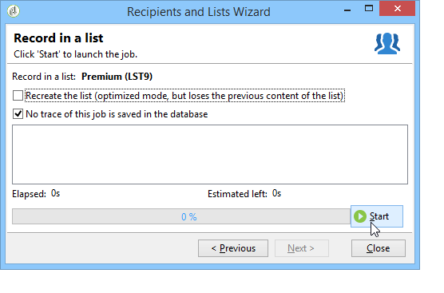

# Lijsten maken en beheren{#creating-and-managing-lists}

## Over lijsten in Adobe Campaign {#about-lists-in-adobe-campaign}

Een lijst is een statische set profielen die kan worden gebruikt voor leveringsacties of die kan worden bijgewerkt tijdens importbewerkingen of tijdens workflowuitvoering. Een populatie die via een query uit de database is geëxtraheerd, kan bijvoorbeeld een lijst leveren.

Lijsten worden gemaakt en beheerd via de **[!UICONTROL Lists]** koppeling op het **[!UICONTROL Profiles and targets]** tabblad.

Er zijn twee typen lijsten beschikbaar in Adobe Campaign:

* **[!UICONTROL Group]** type: De **[!UICONTROL Group]** typelijsten behoren tot een **statische** lijst met personen die op basis van specifieke criteria zijn geselecteerd. De lijst is als een momentopname van een reeks profielen. Houd er rekening mee dat dit niet automatisch wordt bijgewerkt als profielen aan de database worden toegevoegd.

   For more information on how to create a **[!UICONTROL Group]** type list, refer to this [page](#creating-a-profile-list-from-a-group).

* **[!UICONTROL List]** type: Met **[!UICONTROL List]** typelijsten kunt u workflows gebruiken om lijsten te maken en te beheren. Dit zijn specifieke lijsten die het resultaat zijn van gegevensimporten en die kunnen worden bijgewerkt via de specifieke **[!UICONTROL List update]** workflowactiviteit.

   In tegenstelling tot de **[!UICONTROL Group]** typelijst, kan deze typelijst automatisch met een **[!UICONTROL Scheduler]** activiteit worden bijgewerkt. Raadpleeg de pagina **[!UICONTROL List]** voor een voorbeeld van het maken van typelijsten.

 [Deze functie in video detecteren](#create-list-video)

## Een profiellijst maken op basis van een groep {#creating-a-profile-list-from-a-group}

**[!UICONTROL Group]** typelijsten die via de **[!UICONTROL Profiles and targets]** koppeling worden gemaakt, moeten zijn gebaseerd op de standaard Adobe Campaign-profieltabel (nms:ontvanger).

>[!NOTE]
>
>Als u lijsten wilt maken die andere soorten gegevens bevatten, moet u een workflow uitvoeren. Als u bijvoorbeeld een query op de bezoekerslijst gebruikt en de lijst vervolgens bijwerkt, kunt u een bezoekerslijst maken. For more information on workflows, refer to [this section](../../workflow/using/about-workflows.md).

Voer de volgende stappen uit om een nieuwe **[!UICONTROL Group]** typelijst te maken:

1. Click the **[!UICONTROL Create]** button and select **[!UICONTROL New list]**.

   

1. Voer de informatie in op het **[!UICONTROL Edit]** tabblad van het venster voor het maken van de lijst.

   * Voer de naam van de lijst in het **[!UICONTROL Label]** veld in en wijzig indien nodig de interne naam.
   * Voeg een beschrijving voor deze lijst toe.
   * U kunt een vervaldatum opgeven: wanneer deze datum is bereikt, wordt de lijst gewist en automatisch verwijderd.

      

1. Klik op het **[!UICONTROL Content]** tabblad **[!UICONTROL Add]** om de profielen te selecteren die bij de lijst horen.

   

1. Click **[!UICONTROL Save]** to save the list. Het wordt dan toegevoegd aan het overzicht van lijsten.

U kunt nieuwe profielen rechtstreeks maken vanuit het venster Profielen toevoegen door op **[!UICONTROL Create]** te klikken. Het profiel wordt toegevoegd aan de database.

De profiellijst kan net als andere lijsten worden gevormd. Zie Lijsten [configureren](../../platform/using/adobe-campaign-workspace.md#configuring-lists).

## Gegevens koppelen aan een lijst {#linking-data-to-a-list}

>[!NOTE]
>
>Gegevens kunnen alleen met een **[!UICONTROL Group]** typelijst worden gekoppeld aan een lijst.

De profielen van een set profielen kunnen worden gefilterd en gekoppeld aan een lijst. De leveringsacties kunnen dan naar deze lijst, naar doelprofielen worden verzonden. Profielen groeperen:

1. Selecteer profielen en klik met de rechtermuisknop.
1. Selecteer **[!UICONTROL Actions > Associate selection with a list...]**.

   

1. Selecteer de gewenste lijst of maak een nieuwe lijst met de **[!UICONTROL Create]** knop en klik op **[!UICONTROL Next]**.

   

1. Klik op de knop **[!UICONTROL Start]**.

   

Met de **[!UICONTROL Recreate the list]** optie verwijdert u de eerdere inhoud uit de lijst. Deze modus is geoptimaliseerd omdat er geen query nodig is om te controleren of de profielen al aan de lijst zijn gekoppeld.

Als u de **[!UICONTROL No trace of this job is saved in the database]** optie uitschakelt, kunt u de uitvoeringsmap selecteren (of maken) waarin de informatie wordt opgeslagen die aan dit proces is gekoppeld.

In de bovenste sectie van het venster kunt u de uitvoering controleren. Met de **[!UICONTROL Stop]** knop kunt u het proces stoppen. De reeds verwerkte contacten zullen met de lijst worden verbonden.

U kunt het proces controleren via het **[!UICONTROL Lists]** tabblad op de profielen waarop deze bewerking betrekking heeft:

U kunt de lijst ook bewerken via de homepage van Adobe Campaign: Klik op het **[!UICONTROL Profiles and Targets > Lists]** menu en selecteer de desbetreffende lijst. Op het **[!UICONTROL Content]** tabblad ziet u de profielen die aan deze lijst zijn gekoppeld.

## Een profiel uit een lijst verwijderen {#removing-a-profile-from-a-list}

Als u een profiel uit een lijst wilt verwijderen, kunt u:

* Bewerk de lijst, selecteer het profiel op het **[!UICONTROL Content]** tabblad en klik op het **[!UICONTROL Delete]** pictogram.

   

* Bewerk het profiel, klik op het **[!UICONTROL List]** tabblad en klik vervolgens op het **[!UICONTROL Delete]** pictogram.

   

## Een lijst met profielen verwijderen {#deleting-a-list-of-profiles}

U kunt een of meer lijsten verwijderen uit de lijst met groepen in de Adobe Campaign-structuur. Hiervoor bewerkt u de structuur via de **[!UICONTROL Advanced > Explorer]** koppeling op de startpagina van Adobe Campaign. Selecteer de desbetreffende groep(en) en klik met de rechtermuisknop. Selecteer **[!UICONTROL Delete]**. U wordt in een waarschuwingsbericht gevraagd de verwijdering te bevestigen.

>[!NOTE]
>
>Wanneer u een lijst verwijdert, worden de profielen in de lijst niet gewijzigd, maar worden de gegevens in het bijbehorende profiel bijgewerkt.

## Hoe te om een lijst van ontvangers tot stand te brengen {#create-list-video}

Een lijst is een statische reeks ontvangers die doelgericht kan worden benaderd in leveringsacties of die tijdens importbewerkingen of de uitvoering van een workflow kan worden bijgewerkt. Een lijst met ontvangers wordt ook wel een doelgroep genoemd.

Leer hoe te om een publiek tot stand te brengen door een lijst van ontvangers van de Ontdekkingsreiziger te vormen.

>[!VIDEO](https://video.tv.adobe.com/v/25602/quality=12)

## How to create a list of recipients with a workflow {#create-list-in-a-wf-video}

Leer hoe u een workflow maakt om ontvangers als doel in te stellen en hoe u deze terugkeert voordat u de lijst in een e-maildoel gebruikt.

>[!VIDEO](https://video.tv.adobe.com/v/25603?quality=12)

**Zie ook**

* 

* 
