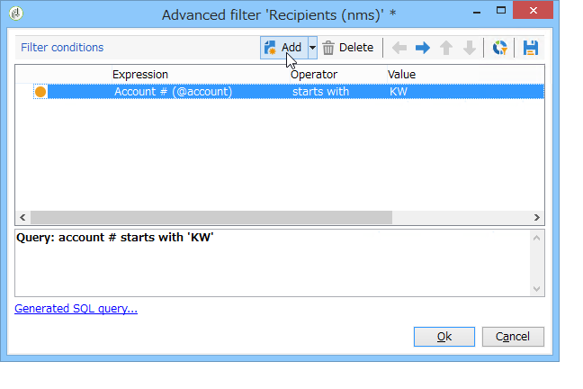

# Filters maken{#creating-filters}

Wanneer u in de boomstructuur van Adobe Campaign (van het **[!UICONTROL Explorer]** menu in de homepage) navigeert, worden de gegevens in het gegevensbestand getoond in lijsten. Deze lijsten kunnen worden gevormd om slechts de gegevens te tonen die door de exploitant worden vereist. De acties kunnen dan op de gefiltreerde gegevens worden gelanceerd. Met filterconfiguratie kunt u gegevens in een lijst selecteren **[!UICONTROL dynamically]** . Als de gegevens worden gewijzigd, worden de gefilterde gegevens bijgewerkt.

>[!NOTE]
>
>De de configuratiemontages van de gebruikersinterface worden plaatselijk bepaald op het apparatenniveau. Soms kan het nodig zijn deze gegevens op te schonen, vooral als zich problemen voordoen bij het vernieuwen van gegevens. Gebruik hiervoor het menu **[!UICONTROL File > Clear the local cache]** .

## Typologie van beschikbare filters {#typology-of-available-filters}

Met Adobe Campaign kunt u filters toepassen op gegevenslijsten.

Deze filters kunnen eenmaal worden gebruikt of u kunt ze opslaan voor toekomstig gebruik. U kunt meerdere filters tegelijk toepassen.

De volgende filtertypen zijn beschikbaar in Adobe Campaign:

* **Standaardfilters**

  Het **standaardfilter** is toegankelijk via de gebieden die boven de lijsten worden gevestigd. Hiermee kunt u filteren op vooraf gedefinieerde velden (dit zijn standaard de naam en het e-mailadres voor ontvangerprofielen). U kunt de velden gebruiken om de tekens in te voeren waarop u wilt filteren of om de filtervoorwaarden in een vervolgkeuzelijst te selecteren.

  
<!--
  >[!NOTE]
  >
  >The **%** character replaces any character string. For example, the string `%@yahoo.com` lets you display all the profiles with an email address in the domain "yahoo.com".
-->
U kunt het standaardfilter van een lijst veranderen. Voor meer op dit, verwijs naar [ Verandering de standaardfilter ](#altering-the-default-filter).

* **Eenvoudige filters**

  **de Eenvoudige filters** zijn éénmalige filters op de kolommen. Ze worden gedefinieerd met een of meer eenvoudige zoekcriteria op de weergegeven kolommen.

  U kunt verschillende eenvoudige filters op dezelfde gegevenslijst combineren om de zoekopdracht te verfijnen. De filtervelden worden onder elkaar weergegeven. Ze kunnen onafhankelijk van elkaar worden verwijderd.

  

  De eenvoudige filters worden gedetailleerd in [ creeer een eenvoudige filter ](#creating-a-simple-filter).

* **Geavanceerde filters**

  **Geavanceerde filters** worden gecreeerd gebruikend een vraag of een combinatie vragen over de gegevens.

  Voor meer bij het creëren van een geavanceerd filter, verwijs naar [ creeer een geavanceerd filter ](#creating-an-advanced-filter).

  U kunt functies gebruiken om de inhoud van het filter te bepalen. Voor meer op dit, verwijs naar [ creeer een geavanceerd filter met functies ](#creating-an-advanced-filter-with-functions).

  >[!NOTE]
  >
  >Voor meer bij het bouwen van vragen in Adobe Campaign, verwijs naar [ deze sectie ](../../platform/using/about-queries-in-campaign.md).

* **filters van de Gebruiker**

  Een **toepassingsfilter** is een geavanceerd filter dat is bewaard, om zijn configuratie met de andere exploitanten te gebruiken en te delen.

  De knop **[!UICONTROL Filters]** boven de lijsten bevat een set toepassingsfilters die kunnen worden gecombineerd om het filteren te verfijnen. De methode om deze filters tot stand te brengen wordt voorgesteld in [ sparen een filter ](#saving-a-filter).

## Het standaardfilter wijzigen {#altering-the-default-filter}

Als u het standaardfilter voor een lijst met ontvangers wilt wijzigen, klikt u op het knooppunt **[!UICONTROL Profiles and Targets > Pre-defined filters]** van de structuur.

Voor alle andere gegevenstypen configureert u het standaardfilter via het knooppunt **[!UICONTROL Administration > Configuration > Predefined filters]** .

Voer de volgende stappen uit:

1. Selecteer het filter dat u standaard wilt gebruiken.
1. Klik op de tab **[!UICONTROL Parameters]** en selecteer **[!UICONTROL Default filter for the associated document type]** .

   

   >[!CAUTION]
   >
   >Als er al een standaardfilter op de lijst is toegepast, moet u dit uitschakelen voordat u een nieuw filter toepast. Klik hiertoe op het rode kruis rechts van de filtervelden.

1. Klik op **[!UICONTROL Save]** om het filter toe te passen.

   >[!NOTE]
   >
   >Het venster van de filterdefinitie is gedetailleerd in [ creeer een geavanceerd filter ](#creating-an-advanced-filter) en [ sparen een filter ](#saving-a-filter).

## Een eenvoudig filter maken {#creating-a-simple-filter}

Om a **eenvoudige filter** tot stand te brengen, pas de volgende stappen toe:

1. Klik met de rechtermuisknop op het veld waarop u wilt filteren en selecteer **[!UICONTROL Filter on this field]** .

   

   De standaardfiltervelden worden boven de lijst weergegeven.

1. Selecteer de filteroptie in de vervolgkeuzelijst of voer de filtercriteria in die u wilt toepassen (de methode voor het selecteren of invoeren van criteria is afhankelijk van het veldtype: tekst, opgesomd, enz.).

   

1. Als u het filter wilt activeren, drukt u op Enter op het toetsenbord of klikt u op de groene pijl rechts van de filtervelden.

Als het veld waarop u de gegevens wilt filteren niet in de vorm van het profiel wordt weergegeven, kunt u het veld toevoegen in de weergegeven kolommen en vervolgens op die kolom filteren. Om dit te doen,

1. Klik op het pictogram **[!UICONTROL Configure the list]** .

   

1. Selecteer de kolom die moet worden weergegeven, bijvoorbeeld de leeftijd van de ontvangers.

   

1. Klik met de rechtermuisknop op de **pagina** -kolom in de lijst met ontvangers en selecteer **[!UICONTROL Filter on this column]** .

   

   Vervolgens kunt u de filteropties voor leeftijd selecteren.

   

## Een geavanceerd filter maken {#creating-an-advanced-filter}

Om een **geavanceerde filter** tot stand te brengen, pas de volgende stappen toe:

1. Klik op **[!UICONTROL Filters]** en selecteer **[!UICONTROL Advanced filter...]** .

   

   U kunt ook met de rechtermuisknop op de lijst met gegevens klikken die u wilt filteren en **[!UICONTROL Advanced filter...]** selecteren.

   Het venster voor filtervoorwaardendefinitie wordt weergegeven.

1. Klik op de kolom **[!UICONTROL Expression]** om de invoerwaarde te definiëren.
1. Klik op **[!UICONTROL Edit expression]** om het veld te selecteren waarop het filter wordt toegepast.

   

1. Selecteer in de lijst het veld waarop de gegevens worden gefilterd. Klik op **[!UICONTROL Finish]** om te bevestigen.
1. Klik op de kolom **[!UICONTROL Operator]** en selecteer de operator die u wilt toepassen in de vervolgkeuzelijst.
1. Selecteer een verwachte waarde in de kolom **[!UICONTROL Value]** . U kunt verschillende filters combineren om de query te verfijnen. Klik op **[!UICONTROL Add]** om een filtervoorwaarde toe te voegen.

   

1. U kunt een hiërarchie aan de uitdrukkingen toewijzen of de orde van de vraaguitdrukkingen veranderen gebruikend de toolbarpijlen.
1. De standaardexploitant tussen uitdrukkingen is **EN**, maar u kunt dit veranderen door het gebied te klikken. U kunt een **of** exploitant selecteren.

   

1. Klik op **[!UICONTROL OK]** om het maken van filters te bevestigen en deze toe te passen op de lijst.

Het toegepaste filter wordt boven de lijst weergegeven.

Als u dit filter wilt bewerken of wijzigen, klikt u op het label ervan.

Als u dit filter wilt annuleren, klikt u op het pictogram **[!UICONTROL Remove this filter]** rechts van het filter.

U kunt een geavanceerd filter opslaan om het voor toekomstig gebruik te houden. Voor verdere informatie over dit type van filter, zie [ sparen een filter ](#saving-a-filter).

### Een geavanceerd filter met functies maken {#creating-an-advanced-filter-with-functions}

De geavanceerde filters kunnen functies gebruiken; **filters met functies** worden gecreeerd via een uitdrukkingsredacteur die u formules laat tot stand brengen gebruikend de gegevensbestandgegevens en geavanceerde functies. Als u een filter met functies wilt maken, herhaalt u de stappen 1, 2 en 3 voor het maken van geavanceerde filters en gaat u als volgt te werk:

1. Klik op **[!UICONTROL Advanced selection]** in het venster Veldselectie.
1. Selecteer het type formule dat moet worden gebruikt: aggregaat, bestaand gebruikersfilter of bestaande expressie.

   

   De volgende opties zijn beschikbaar:

   * **[!UICONTROL Field only]** om een veld te selecteren. Dit is de standaardmodus.
   * **[!UICONTROL Aggregate]** om de te gebruiken samengestelde formule te selecteren (tellingen, som, gemiddelde, maximum, minimum).
   * **[!UICONTROL User filter]** om een van de bestaande gebruikersfilters te selecteren. De filters van de gebruiker zijn gedetailleerd in [ sparen een filter ](#saving-a-filter).
   * **[!UICONTROL Expression]** voor toegang tot de expressies-editor.

     Met de expressieeditor kunt u een geavanceerd filter definiëren. Het ziet er zo uit:

     

     Hiermee kunt u velden in de databasetabellen selecteren en er geavanceerde functies aan koppelen: selecteer de functie die u wilt gebruiken in de **[!UICONTROL List of functions]** . De beschikbare functies zijn gedetailleerd in [ Lijst van functies ](../../platform/using/defining-filter-conditions.md#list-of-functions). Selecteer vervolgens het veld of de velden waarop de functies betrekking hebben en klik op **[!UICONTROL OK]** om de expressie goed te keuren.

     >[!NOTE]
     >
     >Voor een voorbeeld van filterverwezenlijking die op een uitdrukking wordt gebaseerd, verwijs naar [ deze sectie ](../../workflow/using/sending-a-birthday-email.md#identifying-recipients-whose-birthday-it-is).

## Een filter opslaan {#saving-a-filter}

Filters zijn specifiek voor elke operator en worden telkens opnieuw geïnitialiseerd wanneer de operator de cache van de clientconsole wist.

U kunt een **toepassingsfilter** tot stand brengen door een geavanceerd filter op te slaan: het kan door in om het even welke lijst met de rechtermuisknop aan te klikken of via de **[!UICONTROL Filters]** knoop worden opnieuw gebruikt die boven de lijsten wordt gevestigd.

Deze filters kunnen ook direct via de leveringsmedewerker, in het stadium van de doelselectie worden betreden (verwijs naar [ deze sectie ](../../delivery/using/creating-an-email-delivery.md) voor meer bij het creëren van leveringen). Als u het toepassingsfilter wilt maken, kunt u:

* Zet een geavanceerd filter in een toepassingsfilter om. Klik hiertoe op **[!UICONTROL Save]** voordat u de geavanceerde filtereditor sluit.

  

* Maak dit toepassingsfilter via het knooppunt **[!UICONTROL Administration > Configuration > Predefined filters]** (of **[!UICONTROL Profiles and targets > Predefined filters]** voor ontvangers) van de structuur. Klik hiertoe met de rechtermuisknop op de lijst met filters en selecteer **[!UICONTROL New...]** . De procedure is hetzelfde als voor het maken van geavanceerde filters.

  In het veld **[!UICONTROL Label]** kunt u dit filter een naam geven. Deze naam wordt weergegeven in het keuzemenu met invoervak van de knop **[!UICONTROL Filters...]** .

  

U kunt alle filters in de huidige lijst verwijderen door met de rechtermuisknop te klikken en **[!UICONTROL No filter]** te selecteren of door via het pictogram **[!UICONTROL Filters]** boven de lijst te klikken.

U kunt filters combineren door op de knop **[!UICONTROL Filters]** te klikken en het menu **[!UICONTROL And...]** te gebruiken.

## Filterontvangers {#filtering-recipients}

De vooraf bepaalde filters (zie [ sparen een filter ](#saving-a-filter)) laten u toe om de profielen van ontvangers in het gegevensbestand te filtreren. U kunt filters uit het knooppunt **[!UICONTROL Profiles and Targets > Predefined filters]** van de boomstructuur bewerken. De filters worden weergegeven in de bovenste sectie van de werkruimte via de knop **[!UICONTROL Filters]** .

Selecteer een filter om de definitie ervan weer te geven en een voorvertoning van de gefilterde gegevens te openen.

>[!NOTE]
>
>Voor een gedetailleerd voorbeeld van vooraf bepaalde filterverwezenlijking, verwijs naar [ geval van het Gebruik ](../../platform/using/use-case.md).

De vooraf gedefinieerde filters zijn:

<table> 
 <tbody> 
  <tr> 
   <td> <strong>Label</strong>  </td> 
   <td> <strong>Query</strong>  </td> 
  </tr> 
  <tr> 
   <td> Geopend   </td> 
   <td> Selecteert ontvangers die een levering hebben geopend.  </td> 
  </tr> 
  <tr> 
   <td> Geopend maar niet geklikt   </td> 
   <td> Selecteert ontvangers die een levering hebben geopend maar niet op een verbinding geklikt.  </td> 
  </tr> 
  <tr> 
   <td> Inactieve ontvangers   </td> 
   <td> Selecteert ontvangers die geen levering in X maanden hebben geopend.  </td> 
  </tr> 
  <tr> 
   <td> Laatste activiteit door apparatentype   </td> 
   <td> Selecteert ontvangers die of levering Y gebruikend apparaat X in de laatste dagen van Z hebben geklikt geopend.  </td> 
  </tr> 
  <tr> 
   <td> Laatste activiteit door apparatentype (het Volgen)   </td> 
   <td> Selecteert ontvangers die of levering Y gebruikend apparaat X in de laatste dagen van Z hebben geklikt geopend.  </td> 
  </tr> 
  <tr> 
   <td> Niet-doelontvangers   </td> 
   <td> Selecteert ontvangers die nooit via kanaal Y in X maanden zijn gericht.  </td> 
  </tr> 
  <tr> 
   <td> Zeer actieve ontvangers   </td> 
   <td> Selecteert ontvangers die in een levering minstens x keer in de laatste maanden van Y hebben geklikt.  </td> 
  </tr> 
  <tr> 
 <td> Op de lijst met ongewenste personen staan e-mailadres   </td> 
    <td> Selecteert ontvangers de waarvan e-mailadres op de lijst van gewezen personen is.  </td>
  </tr> 
  <tr> 
   <td> Gegarandeerd e-mailadres   </td> 
   <td> Hiermee selecteert u ontvangers waarvan het e-mailadres in quarantaine is geplaatst.  </td> 
  </tr> 
  <tr> 
   <td> E-mailadressen gedupliceerd in de map   </td> 
   <td> Hiermee selecteert u ontvangers waarvan het e-mailadres in de map wordt gedupliceerd.  </td> 
  </tr> 
  <tr> 
   <td> Niet geopend en niet geklikt   </td> 
   <td> Selecteert ontvangers die geen levering hebben geopend, of in een levering geklikt.  </td> 
  </tr> 
  <tr> 
   <td> Nieuwe ontvangers (dagen)   </td> 
   <td> Selecteert ontvangers die in de laatste dagen van X werden gecreeerd.  </td> 
  </tr> 
  <tr> 
   <td> Nieuwe ontvangers (minuten)   </td> 
   <td> Selecteert ontvangers die in de laatste notulen van X werden gecreeerd.  </td> 
  </tr> 
  <tr> 
   <td> Nieuwe ontvangers (maanden)   </td> 
   <td> Selecteert ontvangers die in de laatste maanden van X werden gecreeerd.  </td> 
  </tr> 
  <tr> 
   <td> Op abonnement   </td> 
   <td> Selecteert ontvangers door abonnement.  </td> 
  </tr> 
  <tr> 
   <td> Door op een specifieke verbinding   te klikken </td> 
   <td> Selecteert ontvangers die op bepaalde URL in een levering klikte.  </td> 
  </tr> 
  <tr> 
   <td> Per postbezorgingsgedrag   </td> 
   <td> Selecteert ontvangers volgens hun gedrag na het ontvangen van een levering.  </td> 
  </tr> 
  <tr> 
   <td> Op aanmaakdatum   </td> 
   <td> Hiermee selecteert u ontvangers op aanmaakdatum, over een periode van X maanden (huidige datum min n maanden) tot Y maanden (huidige datum min n maanden).  </td> 
  </tr> 
  <tr> 
   <td> Op lijst   </td> 
   <td> Hiermee selecteert u ontvangers op lijst.  </td> 
  </tr> 
  <tr> 
   <td> Door aantal kliks   </td> 
   <td> Selecteert ontvangers die in een levering in de laatste maanden van X klikte.  </td> 
  </tr> 
  <tr> 
   <td> Door aantal ontvangen berichten   </td> 
   <td> Selecteert ontvangers op het aantal berichten dat zij ontvingen.  </td> 
  </tr> 
  <tr> 
   <td> Door aantal van opent   </td> 
   <td> Selecteert ontvangers die tussen de levering van X en van Y over de hoeveelheid tijd van Z opende.  </td> 
  </tr> 
  <tr> 
   <td> Op naam of e-mail   </td> 
   <td> Hiermee selecteert u ontvangers op basis van hun naam of e-mail.  </td> 
  </tr> 
  <tr> 
   <td> Op leeftijdsbereik   </td> 
   <td> Hiermee selecteert u ontvangers op basis van hun leeftijd.  </td> 
  </tr> 
 </tbody> 
</table>

>[!NOTE]
>
>Alle vergelijkingen met betrekking tot tellingen en termijnen moeten in bredere zin worden geïnterpreteerd (ontvangers die overeenkomen met de querylimieten worden in de vergelijking opgenomen).

Voorbeelden van de wijze waarop de gegevens worden berekend:

* Selecteert ontvangers jonger dan 30 jaar:

  

* Selecteert ontvangers die 18 jaar of ouder zijn:

  

* Selecteert ontvangers tussen 18 en 30 jaar:

  

## Geavanceerde instellingen voor gegevensfilters {#advanced-settings-for-data-filters}

Klik op het tabblad **[!UICONTROL Settings]** voor toegang tot de volgende opties:

* **[!UICONTROL Default filter for the associated document type]** : met deze optie kunt u dit filter standaard voorstellen in de editor van de lijsten waarop de sortering betrekking heeft.

  Het filter **[!UICONTROL By name or login]** wordt bijvoorbeeld toegepast op operatoren. Deze optie is geselecteerd en het filter wordt daarom altijd aangeboden in alle operatorlijsten.

* **[!UICONTROL Filter shared with other operators]** : met deze optie kunt u het filter beschikbaar maken voor alle andere operatoren in de huidige database.
* **[!UICONTROL Use parameter entry form]** : met deze optie kunt u de filtervelden definiëren die boven de lijst worden weergegeven wanneer dit filter wordt geselecteerd. Met deze velden kunt u de filterinstellingen definiëren. Dit formulier moet worden ingevoerd in XML-indeling via de knop **[!UICONTROL Form]** . Het vooraf geconfigureerde filter **[!UICONTROL Recipients who have opened]**, dat bijvoorbeeld beschikbaar is in de lijst met ontvangers, geeft een filterveld weer waarmee u de levering kunt selecteren waarop het filter is gericht.

  De knop **[!UICONTROL Preview]** geeft het resultaat van het geselecteerde filter weer.

* Met de koppeling **[!UICONTROL Advanced parameters]** kunt u aanvullende instellingen definiëren. Met name kunt u een SQL-tabel aan het filter koppelen om deze te gebruiken voor alle editors die de tabel delen.

  Selecteer de optie **[!UICONTROL Do not restrict the filter]** als u wilt voorkomen dat de gebruiker dit filter overschrijft.

  Deze optie is ingeschakeld voor de filters &quot;Ontvangers van een levering&quot; en &quot;Ontvangers van leveringen die tot een map behoren&quot; die in de leveringsassistent worden aangeboden en die niet kunnen worden overgeladen.

  
