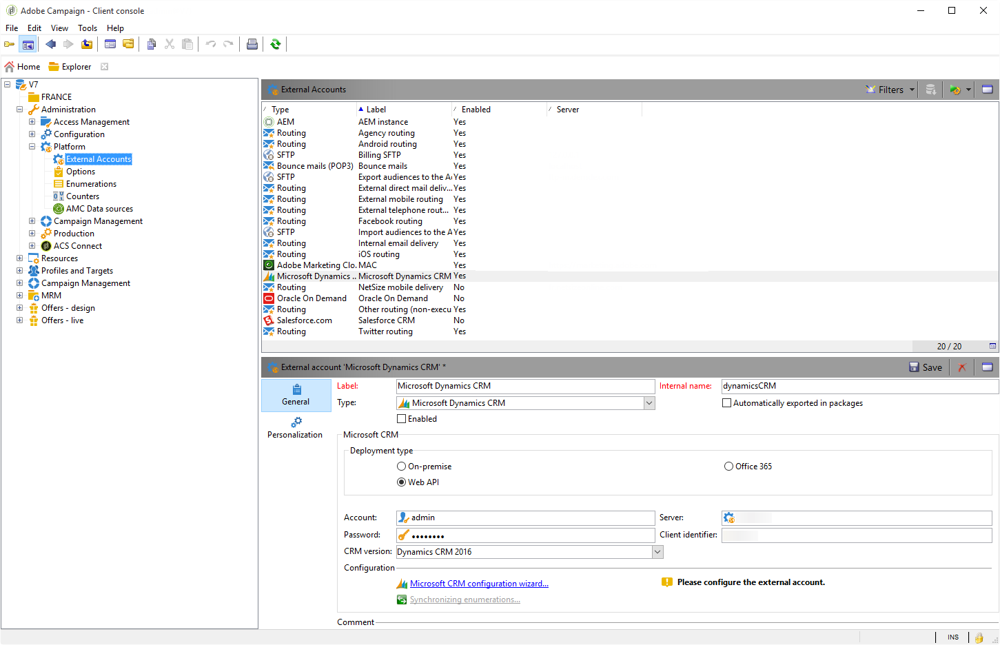
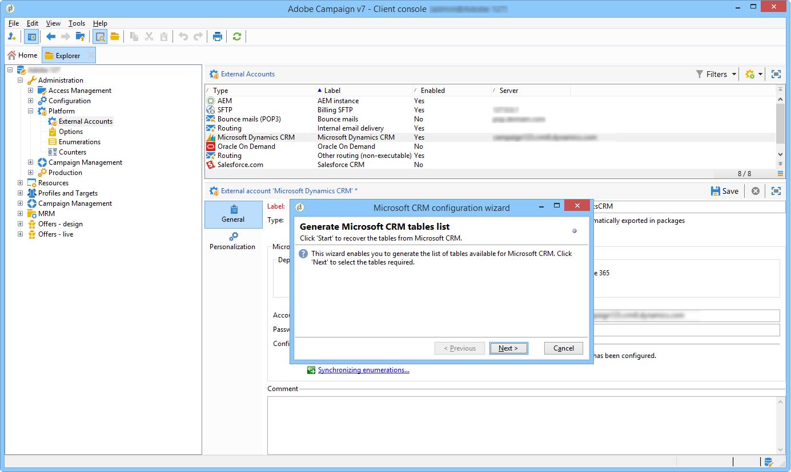
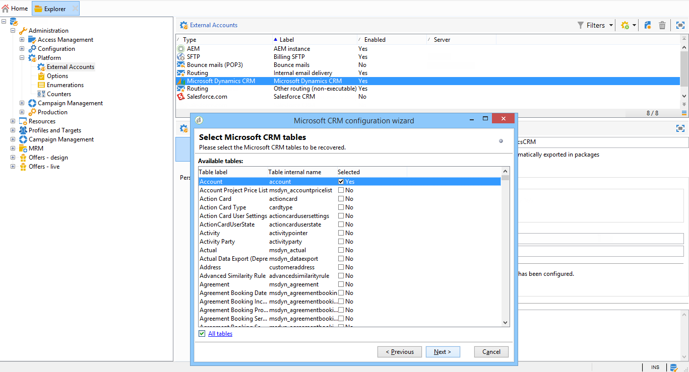
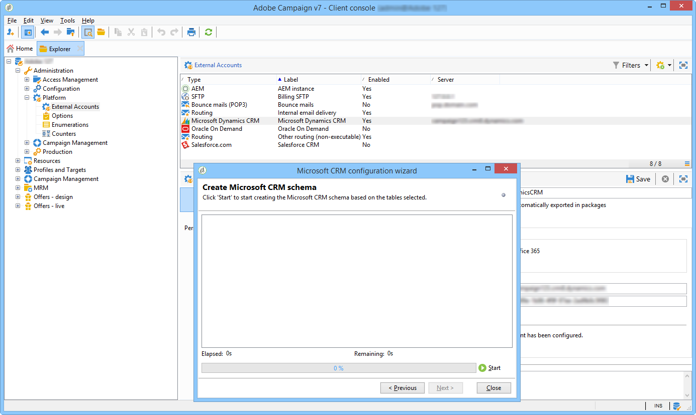
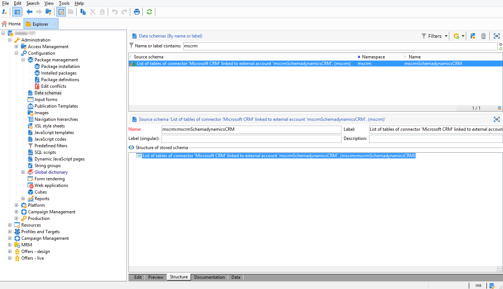
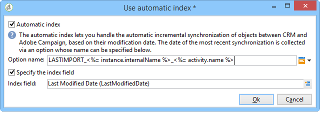
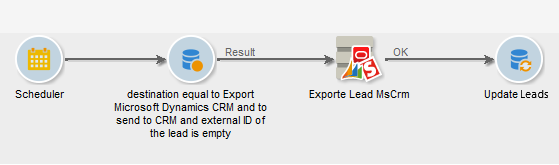
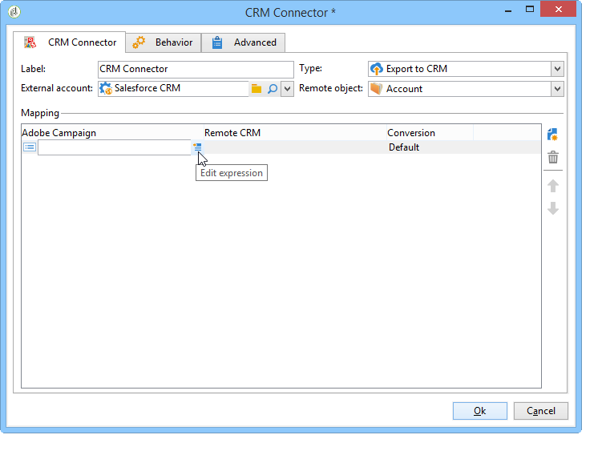
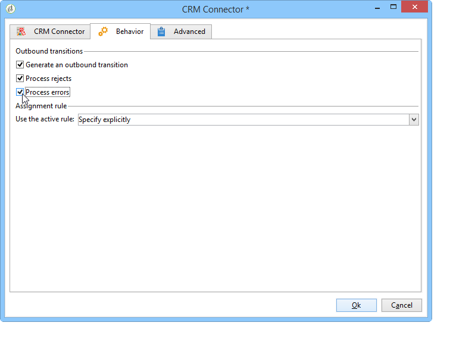
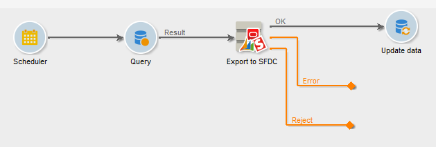

# CRM-connectors{#crm-connectors}

## Over CRM-connectors {#about-crm-connectors}

Adobe Campaign biedt verschillende CRM-connectors waarmee u uw Adobe Campagne-platform kunt koppelen aan systemen van derden. Deze schakelaars van CRM laten u toe om contacten, rekeningen, aankopen, enz. te synchroniseren. Ze zorgen ervoor dat uw toepassing eenvoudig kan worden geïntegreerd met verschillende externe en zakelijke toepassingen.

Deze connectors maken snelle en eenvoudige gegevensintegratie mogelijk: De Campagne van Adobe verstrekt een specifieke tovenaar voor het verzamelen en het selecteren van uit de lijsten beschikbaar in CRM. Dit garandeert tweerichtingssynchronisatie om ervoor te zorgen dat de gegevens altijd up-to-date zijn in alle systemen.

>[!NOTE]
>
>Deze functie is beschikbaar in Adobe Campaign via het speciale pakket voor **CRM-connectors** .

Verbinding maken met de CRM wordt uitgevoerd via specifieke workflowactiviteiten. Deze activiteiten worden beschreven in het hoofdstuk dat in [deze afdeling](../../workflow/using/crm-connector.md)wordt gepresenteerd.

### Compatibele CRM-systemen en -beperkingen {#compatible-crm-systems-and-limitations}

CRM&#39;s die hieronder worden vermeld, kunnen worden geïntegreerd in de Adobe-campagne.

Ondersteunde versies worden gedetailleerd weergegeven in de [compatibiliteitsmatrix](https://helpx.adobe.com/campaign/kb/compatibility-matrix.html).

* **Salesforce.com**

   Raadpleeg [deze sectie](#example-for-salesforce-com) voor meer informatie over het instellen van de verbinding met Salesforce.com.

   >[!CAUTION]
   >
   >Wanneer u Adobe Campagne verbindt met Salesforce.com, gelden de volgende beperkingen:
   >
   >    
   >    
   >    * Testproductieinstanties worden ondersteund.
   >    * Toewijzingsregels worden ondersteund.
   >    * Meerdere selectienumeraties worden niet ondersteund door Adobe Campagne.

* **Oracle On Demand**

   Raadpleeg [deze sectie](#example-for-oracle-on-demand) voor meer informatie over het instellen van de verbinding met Oracle On Demand.

   >[!CAUTION]
   >
   >Wanneer u Adobe Campagne verbindt met Oracle On Demand, gelden de volgende beperkingen:
   >
   >    
   >    
   >    * Met Adobe Campaign kunt u elk object synchroniseren dat beschikbaar is in de standaard Oracle On Demand-sjablonen. Als u persoonlijke tabellen hebt toegevoegd in Oracle On Demand, worden deze niet hersteld in Adobe Campaign.
   >    * Met API-versie v1.0 kunt u gegevens sorteren of filteren tijdens een query, maar niet tegelijkertijd.
   >    * De door Oracle On Demand verzonden data bevatten geen informatie over de tijdzone.
   >    * Meerdere selectienumeraties worden niet ondersteund door Adobe Campagne.

* **MS Dynamics CRM** en **MS Dynamics Online**

   Verwijs naar [deze sectie](#example-for-microsoft-dynamics) om te leren hoe te opstelling de verbinding met de Dynamica van Microsoft.

   In [deze video](https://helpx.adobe.com/campaign/kt/acc/using/acc-integrate-dynamics365-with-acc-feature-video-set-up.html)vindt u meer informatie over het gebruik van Adobe Campaign en Microsoft Dynamics.

   >[!CAUTION]
   >
   >Wanneer u Adobe Campagne verbindt met Microsoft Dynamics, gelden de volgende beperkingen:
   >
   >    
   >    
   >    * Het installeren van plug-ins kan het gedrag van CRM wijzigen. Dit kan leiden tot compatibiliteitsproblemen met Adobe Campaign.
   >    * Meerdere selectienumeraties worden niet ondersteund door Adobe Campagne.

## De verbinding instellen {#setting-up-the-connection}

Voer de volgende stappen uit om CRM-connectors te gebruiken in Adobe Campagne:

1. Een externe account maken
1. Verzamel de lijsten CRM
1. Opsommingen synchroniseren
1. De synchronisatieworkflow maken

>[!NOTE]
>
>De CRM-connectors werken alleen met een beveiligde URL (https).

### Voorbeeld van Salesforce.com {#example-for-salesforce-com}

Volg onderstaande stappen om de **Salesforce.com** -aansluiting te configureren met Adobe Campaign:

1. Maak een nieuw extern account via het **[!UICONTROL Administration > Platform > External accounts]** knooppunt van de Adobe Campagne-structuur.
1. Stel de configuratietovenaar in werking om de beschikbare lijsten van CRM te produceren.

   

   Met de configuratietovenaar kunt u tabellen verzamelen en het bijbehorende schema maken.

   Klik **[!UICONTROL Start]** om de uitvoering uit te voeren.

   

   >[!NOTE]
   >
   >Als u de installatie wilt goedkeuren, moet u zich afmelden en weer aan bij de Adobe Campagne-console.

1. Controleer het schema dat in de Campagne van Adobe in de **[!UICONTROL Administration > Configuration > Data schemas]** knoop wordt geproduceerd.

   

1. Zodra het schema wordt gecreeerd, kunt u opsommingen automatisch via CRM aan de Campagne van Adobe synchroniseren.

   Klik hiertoe op de **[!UICONTROL Synchronizing enumerations...]** koppeling en selecteer de opsomming van Adobe Campagne die overeenkomt met de opsomming CRM.

   U kunt alle waarden van een opsomming van Adobe-campagnes vervangen door die van de CRM: Selecteer **[!UICONTROL Yes]** in de **[!UICONTROL Replace]** kolom om dit te doen.

   

   Klik **[!UICONTROL Next]** en begin dan **[!UICONTROL Start]** het invoeren van de lijst.

1. Controleer de geïmporteerde waarden in het **[!UICONTROL Administration > Platform > Enumerations]** menu.

   

1. Als u Salesforce-gegevens wilt importeren of Adobe Campagne-gegevens wilt exporteren naar Salesforce, moet u een workflow maken en de **[!UICONTROL CRM connector]** activiteit gebruiken.

   

### Voorbeeld voor Oracle On Demand {#example-for-oracle-on-demand}

Voer de volgende stappen uit om de **Oracle On Demand** -aansluiting te configureren voor gebruik met Adobe Campaign:

1. Maak een nieuw extern account via het **[!UICONTROL Administration > Platform > External accounts]** knooppunt van de Adobe Campagne-structuur.

   

1. Open de configuratietovenaar: De Adobe Campagne toont automatisch de lijsten van het de gegevensmodel van Oracle. Selecteer de tabellen die u wilt verzamelen.

   

1. Klik **[!UICONTROL Next]** om het overeenkomende schema te maken.

   Het overeenkomende gegevensschema wordt beschikbaar in Adobe Campaign.

   

1. Synchroniseer opsommingen tussen Adobe Campaign en Oracle On Demand.

   

1. Als u Oracle On Demand-gegevens wilt importeren in Adobe Campagne, maakt u het volgende type workflow:

   

   Deze workflow importeert contactpersonen via Oracle On Demand, synchroniseert deze met de bestaande Adobe Campagne-gegevens, verwijdert dubbele contactpersonen en werkt de Adobe Campagne-database bij.

   De **[!UICONTROL CRM Connector]** activiteit moet worden gevormd zoals hier getoond:

   

1. Als u Adobe Campagne-gegevens wilt exporteren naar Oracle On Demand, maakt u de volgende workflow:

   

   Deze workflow verzamelt de relevante gegevens met behulp van query&#39;s en exporteert deze vervolgens naar de Oracle On Demand-lijst met contactpersonen.

### Voorbeeld voor Microsoft Dynamics {#example-for-microsoft-dynamics}

Voer de volgende stappen uit om de Microsoft Dynamics-connector te configureren voor gebruik met Adobe Campaign:

1. Maak een nieuw extern account via het **[!UICONTROL Administration > Platform > External accounts]** knooppunt van de Adobe Campagne-structuur.

   

1. Selecteer het **implementatietype**: **[!UICONTROL On-premise]**, **[!UICONTROL Office 365]** of **[!UICONTROL Web API]**, afhankelijk van de schakelaar u wilt vormen.

   Adobe Campaign Classic biedt ondersteuning voor de interface Dynamics 365 REST met het OAuth-protocol voor verificatie.

   Als u een **[!UICONTROL WebAPI]** plaatsing selecteert, moet u een app op Azure Folder registreren en **clientId** van de Azure Folder krijgen. Deze registratie wordt beschreven in [deze pagina](https://msdn.microsoft.com/en-us/library/mt622431.aspx).

   >[!NOTE]
   >
   >De parameter redirectURL wordt niet vereist door Adobe Campagne Classic.

   De **clientId** -waarde wordt gebruikt met de gebruikersnaam/het wachtwoord om het token voor toonder op te halen met het wachtwoord voor het type gift. Dit wordt genoemd de Verlening van het Wachtwoord van de Eigenaar van het **Middel**. Raadpleeg [deze pagina](https://blogs.msdn.microsoft.com/wushuai/2016/09/25/resource-owner-password-credentials-grant-in-azure-ad-oauth/)voor meer informatie.

   

   Raadpleeg de [compatibiliteitsmatrix](https://helpx.adobe.com/campaign/kb/compatibility-matrix.html)voor meer informatie over CRM-versiecompatibiliteit.

1. Open de configuratietovenaar. De Campagne van Adobe ontdekt automatisch de lijsten van het de gegevensmalplaatje van de Dynamica van Microsoft.

   

   Selecteer de tabellen die u wilt herstellen.

   

1. Klik en begin het creëren van het overeenkomstige schema. **[!UICONTROL Next]**

   

   >[!NOTE]
   >
   >Als u de configuratie wilt goedkeuren, moet u de verbinding met de Adobe Campaign-console verbreken of opnieuw tot stand brengen.

   Het overeenkomende gegevensschema wordt beschikbaar in Adobe Campaign.

   

1. Synchroniseer opsommingen tussen Adobe Campaign en Microsoft Dynamics.

   

1. Als u de Microsoft Dynamics-gegevens wilt importeren in Adobe Campaign, maakt u het volgende type workflow:

   

   Deze workflow importeert de contactpersonen via Microsoft Dynamics, synchroniseert deze met de bestaande Adobe Campagne-gegevens, verwijdert dubbele contactpersonen en werkt de Adobe Campagne-database bij.

   De **[!UICONTROL CRM Connector]** activiteit moet als volgt worden gevormd:

   

## Gegevenssynchronisatie {#data-synchronization}

Synchronisatie tussen Adobe Campaign en de CRM wordt uitgevoerd via een toegewijde workflowactiviteit: [CRM-connector](../../workflow/using/crm-connector.md).

Met deze activiteit kunt u:

* invoer uit de BCR (zie [Importing from the CRM](#importing-from-the-crm));
* export naar CRM (zie [Exporteren naar CRM](#exporting-to-the-crm));
* Importeren van objecten die zijn verwijderd in de CRM (verwijs naar [Importeren van objecten die zijn verwijderd in de CRM](#importing-objects-deleted-in-the-crm));
* Objecten verwijderen in de CRM (verwijder objecten [verwijderen in de CRM](#deleting-objects-in-the-crm)).

Selecteer de externe rekening die CRM aanpast dat u synchronisatie met wilt vormen, dan het te synchroniseren voorwerp selecteren (rekeningen, kansen, lood, contacten, enz.).

De configuratie van deze activiteit hangt af van het uit te voeren proces. Hieronder worden verschillende configuraties beschreven.

### Importeren vanuit de CRM {#importing-from-the-crm}

Als u gegevens wilt importeren via CRM in Adobe Campaign, moet u het volgende type workflow maken:

Voor een de invoeractiviteit, zijn de de activiteitsconfiguratiestappen van de Verbinding van **CRM** :

1. Selecteer een **[!UICONTROL Import from the CRM]** bewerking.
1. Ga naar de **[!UICONTROL Remote object]** drop-down lijst en selecteer het voorwerp betrokken bij het proces. Dit object valt samen met een van de tabellen die tijdens de verbindingsconfiguratie in Adobe Campaign zijn gemaakt.
1. Ga naar de **[!UICONTROL Remote fields]** sectie en ga de gebieden in om worden ingevoerd.

   Als u een veld wilt toevoegen, klikt u op de **[!UICONTROL Add]** knop op de werkbalk en vervolgens op het **[!UICONTROL Edit expression]** pictogram.

   

   Wijzig zo nodig de gegevensindeling in de vervolgkeuzelijst met de **[!UICONTROL Conversion]** kolommen. Mogelijke conversietypen worden gedetailleerd in [gegevensindeling](#data-format).

   >[!CAUTION]
   >
   >De id van de record in de CRM is verplicht voor het koppelen van objecten in CRM en in Adobe Campaign. Deze wordt automatisch toegevoegd wanneer het vak wordt goedgekeurd.
   >
   >De laatste wijzigingsdatum aan de CRM-zijde is ook verplicht voor de incrementele invoer van gegevens.

1. U kunt de te importeren gegevens ook filteren op basis van uw behoeften. Klik hiertoe op de **[!UICONTROL Edit the filter...]** koppeling.

   In het volgende voorbeeld importeert Adobe Campaign alleen contactpersonen waarvoor enige activiteit is opgenomen sinds 1 november 2012.

   

   >[!CAUTION]
   >
   >De beperkingen die zijn gekoppeld aan de modi voor gegevensfiltering worden gedetailleerd weergegeven in de [gegevensfiltering](#filtering-data).

1. Met deze **[!UICONTROL Use automatic index...]** optie kunt u automatisch incrementele objectsynchronisatie beheren tussen de CRM-campagne en de Adobe-campagne, afhankelijk van de datum en de laatste wijziging.

   Raadpleeg voor meer informatie het [Variabele-beheer](#variable-management).

#### Beheer van variabelen {#variable-management}

Als u de **[!UICONTROL Automatic index]** optie inschakelt, kunt u alleen objecten verzamelen die zijn gewijzigd sinds de laatste importbewerking.

De datum van de laatste synchronisatie wordt opgeslagen in een optie die in het configuratievenster wordt gespecificeerd, door gebrek: **LASTIMPORT_&lt;%=instance.internalName%>_&lt;%=activityName%>**.

>[!NOTE]
>
>Deze noot is alleen van toepassing op de generieke **[!UICONTROL CRM Connector]** activiteit. Voor andere CRM-activiteiten is het proces automatisch.
>
>Deze optie moet u handmatig maken en invullen onder **[!UICONTROL Administration]** > **[!UICONTROL Platform]** > **[!UICONTROL Options]**. Dit moet een tekstoptie zijn en de waarde ervan moet overeenkomen met de volgende indeling: **yyyy/MM/dd hh:mm:ss**.
> 
>U moet deze optie handmatig bijwerken als u wilt doorgaan met importeren.

U kunt het verre gebied van CRM specificeren dat in aanmerking moet worden genomen om de meest recente veranderingen te identificeren.

Standaard worden de volgende velden gebruikt (in de opgegeven volgorde):

* Voor Microsoft Dynamics: **gewijzigd**,
* Voor Oracle On Demand: **LastUpdated**, **ModifiedDate**, **LastLoggedIn**,
* Voor Salesforce.com: **LastModifiedDate**, **SystemModstamp**.

Als u de **[!UICONTROL Automatic index]** optie activeert, worden drie variabelen gegenereerd die in de synchronisatieworkflow kunnen worden gebruikt via een **[!UICONTROL JavaScript code]** type-activiteit. Deze activiteiten zijn:

* **vars.crmOptionName**: geeft de naam aan van de optie die de laatste importdatum bevat.
* **vars.crmStartImport**: staat voor de begindatum (inclusief) van de laatste gegevensherstel.
* **vars.crmEndDate**: de einddatum (exclusief) van de laatste gegevensherstel.

   >[!NOTE]
   >
   >Deze datums worden weergegeven in de volgende notatie: **yyyy/MM/dd hh:mm:ss**.

#### Gegevens filteren {#filtering-data}

Om efficiënte werking met diverse CRMs te verzekeren, moeten de filters worden gecreeerd gebruikend de volgende regels:

* Elk filterniveau mag slechts één type operator gebruiken.
* De operator AND NOT wordt niet ondersteund.
* Vergelijkingen mogen alleen betrekking hebben op null-waarden (&#39;is leeg&#39;/&#39;is geen leeg&#39; type) of getallen. Dit betekent dat de waarde (rechterkolom) wordt beoordeeld en dat het resultaat van deze beoordeling een getal moet zijn. Vergelijking van JOIN-typen wordt daarom niet ondersteund.
* De waarde in de rechterkolom wordt beoordeeld in JavaScript.
* JOIN-vergelijkingen worden niet ondersteund.
* De expressie in de linkerkolom moet een veld zijn. Het kan geen combinatie zijn van verschillende expressies, een getal, enzovoort.

De volgende filtervoorwaarden zijn bijvoorbeeld NIET geldig voor een CRM-import, omdat de OR-operator op hetzelfde niveau wordt geplaatst als de AND-operatoren:

* De operator OR wordt op hetzelfde niveau geplaatst als de AND-operatoren
* Vergelijkingen worden uitgevoerd op tekstreeksen.

#### Volgorde van {#order-by}

In de Dynamica van Microsoft en Salesforce.com, kunt u de verre gebieden sorteren om in stijgende of dalende orde worden ingevoerd.

Klik hiertoe op de **[!UICONTROL Order by]** koppeling en voeg de kolommen toe aan de lijst.

De volgorde van de kolommen in de lijst is de sorteervolgorde:

#### Registeridentificatie {#record-identification}

In plaats van elementen te importeren die in de CRM zijn opgenomen (en mogelijk zijn gefilterd), kunt u een populatie gebruiken die vooraf in de workflow is berekend.

Hiervoor selecteert u de **[!UICONTROL Use the population calculated upstream]** optie en geeft u het veld op dat de externe id bevat.

Selecteer vervolgens de velden van de binnenkomende populatie die u wilt importeren, zoals hieronder wordt weergegeven:

### Exporteren naar de CRM {#exporting-to-the-crm}

Als u Adobe Campaign-gegevens exporteert naar de CRM-database, kunt u de volledige inhoud kopiëren naar een CRM-database.

Als u gegevens naar CRM wilt exporteren, moet u het volgende type workflow maken:

Voor de uitvoer, pas de volgende configuratie op de activiteit van de Schakelaar **van** CRM toe:

1. Selecteer een **[!UICONTROL Export to CRM]** bewerking.
1. Ga naar de **[!UICONTROL Remote object]** drop-down lijst en selecteer het voorwerp betrokken bij het proces. Dit object valt samen met een van de tabellen die tijdens de verbindingsconfiguratie in Adobe Campaign zijn gemaakt.

   >[!CAUTION]
   >
   >De de uitvoerfunctie van de activiteit van de Verbindingen van **CRM** kan gebieden op de kant van CRM opnemen of bijwerken. Om gebiedsupdates in CRM toe te laten, moet u de primaire sleutel van de verre lijst specificeren. Als de sleutel ontbreekt, worden gegevens ingevoegd (in plaats van bijgewerkt).

1. Geef in de **[!UICONTROL Mapping]** sectie de velden op die geëxporteerd moeten worden en de toewijzing ervan in de CRM.

   

   Als u een veld wilt toevoegen, klikt u op de **[!UICONTROL Add]** knop op de werkbalk en vervolgens op het **[!UICONTROL Edit expression]** pictogram.

   >[!NOTE]
   >
   >Als er voor een bepaald veld geen overeenkomst is gedefinieerd aan de CRM-zijde, kunnen de waarden niet worden bijgewerkt: zij worden rechtstreeks in de BCR ingevoegd.

   Wijzig zo nodig de gegevensindeling in de vervolgkeuzelijst met de **[!UICONTROL Conversion]** kolommen. Mogelijke conversietypen worden gedetailleerd in [gegevensindeling](#data-format).

   >[!NOTE]
   >
   >De lijst met te exporteren records en het resultaat van de export worden opgeslagen in een tijdelijk bestand dat toegankelijk blijft totdat de workflow is voltooid of opnieuw is gestart. Hierdoor kunt u het proces opnieuw starten in het geval van fouten zonder dat u het risico loopt dezelfde record meerdere keren te exporteren of gegevens te verliezen.

### Aanvullende configuraties {#additional-configurations}

#### Gegevensindeling {#data-format}

U kunt gegevensindeling direct omzetten wanneer u deze importeert in of vanuit de CRM.

Selecteer hiertoe de conversie die in de overeenkomende kolom moet worden toegepast.

In de **[!UICONTROL Default]** modus worden de gegevens automatisch omgezet. In de meeste gevallen is dit gelijk aan een kopie/plak van de gegevens. Tijdzonebeheer wordt echter toegepast.

Andere mogelijke omzettingen zijn:

* **[!UICONTROL Date only]**: in deze modus worden de velden Datum- en tijdtype verwijderd.
* **[!UICONTROL Without time offset]**: in deze modus wordt het tijdzonebeheer geannuleerd dat in de standaardmodus wordt toegepast.
* **[!UICONTROL Copy/Paste]**: in deze modus worden onbewerkte gegevens gebruikt, zoals tekenreeksen (geen conversie).

#### Fout bij verwerken {#error-processing}

In het kader van de invoer of de uitvoer van gegevens, kunt u een specifiek proces op fouten en verwerpingen toepassen. Selecteer hiertoe de **[!UICONTROL Process rejects]** en **[!UICONTROL Process errors]** opties op het **[!UICONTROL Behavior]** tabblad.

Met deze opties worden de overeenkomende uitvoerovergangen geplaatst.

Plaats vervolgens de activiteiten die relevant zijn voor de processen die u wilt toepassen.

Als u bijvoorbeeld fouten wilt verwerken, kunt u een wachtdoos toevoegen en opnieuw een poging plannen.

Afwijzingen worden verzameld met hun foutcode en het bijbehorende bericht. Dit betekent dat u de registratie van afwijzingen kunt instellen om het synchronisatieproces te optimaliseren.

>[!NOTE]
>
>Zelfs wanneer de **[!UICONTROL Process rejects]** optie niet wordt toegelaten, wordt een waarschuwing geproduceerd voor elke verworpen kolom met een foutencode en een bericht.

Met de **[!UICONTROL Reject]** uitvoerovergang hebt u toegang tot het uitvoerschema dat de specifieke kolommen bevat die relevant zijn voor foutberichten en -codes. Deze kolommen zijn:

* Voor Oracle On Demand: **errorLogFilename** (naam van het logboekdossier op Oracle kant), **errorCode** (foutencode), **errorSymbol** (foutensymbool, verschillend van de foutencode), **errorMessage** (beschrijving van de foutencontext).
* Voor Salesforce.com: **errorSymbol** (foutsymbool, anders dan de foutcode), **errorMessage** (beschrijving van de foutcontext).

### Objecten importeren die zijn verwijderd in de CRM {#importing-objects-deleted-in-the-crm}

Als u het instellen van een uitgebreid proces voor gegevenssynchronisatie wilt inschakelen, kunt u objecten die zijn verwijderd in de CRM-campagne importeren in Adobe-campagne.

Hiervoor voert u de volgende stappen uit:

1. Selecteer een **[!UICONTROL Import objects deleted in the CRM]** bewerking.
1. Ga naar de **[!UICONTROL Remote object]** drop-down lijst en selecteer het voorwerp betrokken bij het proces. Dit object valt samen met een van de tabellen die tijdens de verbindingsconfiguratie in Adobe Campaign zijn gemaakt.
1. Geef de periode op waarmee rekening moet worden gehouden in de velden **[!UICONTROL Start date]** en de **[!UICONTROL End date]** velden. Deze data worden in de periode opgenomen.

   

   >[!CAUTION]
   >
   >De periode voor het verwijderen van elementen moet samenvallen met de specifieke beperkingen van de BCR. Dit betekent dat voor Salesforce.com bijvoorbeeld elementen die meer dan 30 dagen geleden zijn verwijderd, niet kunnen worden hersteld.

### Objecten verwijderen in de CRM {#deleting-objects-in-the-crm}

Om voorwerpen op de kant van CRM te schrappen, moet u de primaire sleutel van de verre te schrappen elementen specificeren.

Op het **[!UICONTROL Behavior]** tabblad kunt u de verwerking van afwijzingen inschakelen. Met deze optie wordt een tweede uitvoerovergang voor de **[!UICONTROL CRM connector]** activiteit gegenereerd. Zie [Fout bij verwerken](#error-processing)voor meer informatie.

>[!NOTE]
>
>Zelfs als de **[!UICONTROL Process rejects]** optie is uitgeschakeld, wordt een waarschuwing gegenereerd voor elke geweigerde kolom.

