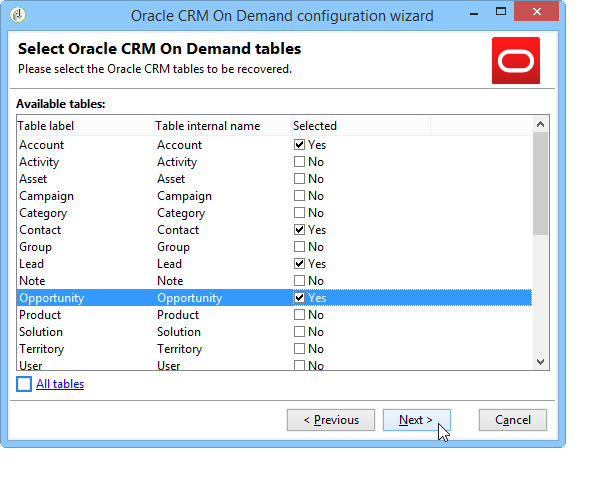
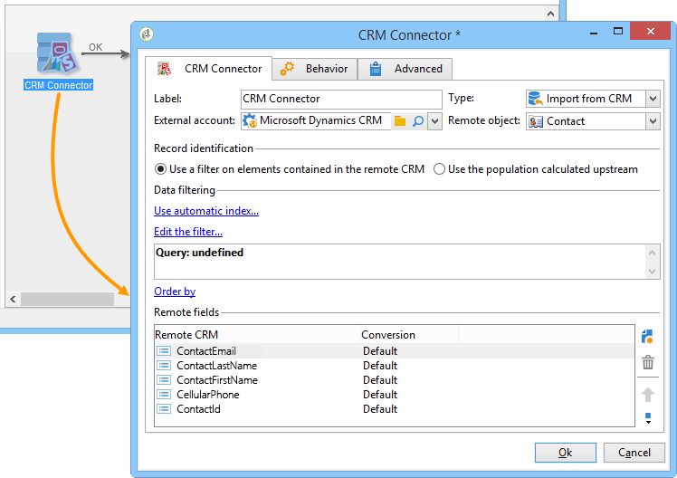

# CRM-connectoren{#crm-connectors}

## Over CRM-connectors {#about-crm-connectors}

Adobe Campaign biedt verschillende CRM-connectoren waarmee u uw Adobe Campaign-platform kunt koppelen aan systemen van derden. Deze CRM-connectoren laten u toe om contactpersonen, accounts, aankopen, enzovoort, te synchroniseren. Ze zorgen ervoor dat uw applicatie eenvoudig kan worden geïntegreerd met verschillende externe en zakelijke applicaties.

Deze connectoren maken snelle en eenvoudige data-integratie mogelijk: Adobe Campaign verstrekt een specifieke wizard voor het verzamelen en selecteren van data uit de lijsten die beschikbaar zijn in het CRM-systeem. Dit garandeert tweerichtingssynchronisatie om ervoor te zorgen dat de data altijd up-to-date zijn in alle systemen.

>[!NOTE]
>
>Deze functie is beschikbaar in Adobe Campaign via het speciale pakket **CRM-connectors**.

Verbinding maken met de CRM wordt uitgevoerd via specifieke workflowactiviteiten. Deze activiteiten worden beschreven in het hoofdstuk dat wordt gepresenteerd in [deze sectie](../../workflow/using/crm-connector.md).

### Compatibele CRM-systemen en -beperkingen {#compatible-crm-systems-and-limitations}

CRM&#39;s die hieronder worden vermeld, kunnen in Adobe Campaign worden geïntegreerd.

Ondersteunde versies worden beschreven in Campagne [Compatibiliteitsmatrix](../../rn/using/compatibility-matrix.md).

* **Salesforce.com**

   Raadpleeg [deze sectie](#example-for-salesforce-com) voor meer informatie over het instellen van de verbinding met Salesforce.com.

   >[!IMPORTANT]
   >
   >Wanneer u Adobe Campaign verbindt met Salesforce.com, gelden de volgende beperkingen:
   >
   >    
   >    
   >    * Testproductieinstanties worden ondersteund.
   >    * Toewijzingsregels worden ondersteund.
   >    * Meerdere selectienumeraties worden niet ondersteund door Adobe Campaign.

* **Oracle On-demand**

   Raadpleeg [deze sectie](#example-for-oracle-on-demand) voor meer informatie over het instellen van de verbinding met Oracle On Demand.

   >[!IMPORTANT]
   >
   >Bij het verbinden van Adobe Campaign met Oracle On Demand gelden de volgende beperkingen:
   >
   >    
   >    
   >    * Adobe Campaign kan elk object dat beschikbaar is in de standaard Oracle On Demand-sjablonen synchroniseren. Als u persoonlijke tabellen hebt toegevoegd in Oracle On Demand, worden deze niet hersteld in Adobe Campaign.
   >    * Met API-versie v1.0 kunt u gegevens sorteren of filteren tijdens een query, maar niet tegelijkertijd.
   >    * De data die door Oracle On Demand worden verzonden, bevatten geen informatie over de tijdzone.
   >    * Meerdere selectienumeraties worden niet ondersteund door Adobe Campaign.

* **MS Dynamics** CRM en  **MS Dynamics Online**

   Verwijs naar [deze sectie](#example-for-microsoft-dynamics) om te leren hoe te opstelling de verbinding met de Dynamica van Microsoft.

    In  [deze video](https://helpx.adobe.com/campaign/kt/acc/using/acc-integrate-dynamics365-with-acc-feature-video-set-up.html) ziet u hoe Adobe Campaign en Microsoft Dynamics elkaar gebruiken.

   >[!IMPORTANT]
   >
   >Bij het verbinden van Adobe Campaign met Microsoft Dynamics gelden de volgende beperkingen:
   >
   >    
   >    
   >    * Het installeren van plug-ins kan het gedrag van CRM wijzigen, wat kan leiden tot compatibiliteitsproblemen met Adobe Campaign.
   >    * Meerdere selectienumeraties worden niet ondersteund door Adobe Campaign.

## De verbinding {#setting-up-the-connection} instellen

Voer de volgende stappen uit om CRM-connectors te gebruiken in Adobe Campaign:

1. Een externe account maken
1. Verzamel de lijsten CRM
1. Opsommingen synchroniseren
1. De synchronisatieworkflow maken

>[!NOTE]
>
>De CRM-connectors werken alleen met een beveiligde URL (https).

### Voorbeeld van Salesforce.com {#example-for-salesforce-com}

Volg onderstaande stappen om de **Salesforce.com**-aansluiting met Adobe Campaign te configureren:

1. Maak een nieuwe externe account via het knooppunt **[!UICONTROL Administration > Platform > External accounts]** van de Adobe Campaign-structuur.
1. Stel de configuratietovenaar in werking om de beschikbare lijsten van CRM te produceren.

   

   Met de configuratietovenaar kunt u tabellen verzamelen en het bijbehorende schema maken.

   Klik **[!UICONTROL Start]** om de uitvoering in werking te stellen.

   

   >[!NOTE]
   >
   >Als u de installatie wilt goedkeuren, moet u zich afmelden en weer terugzetten op de Adobe Campaign-console.

1. Controleer het schema dat in Adobe Campaign in de **[!UICONTROL Administration > Configuration > Data schemas]** knoop wordt geproduceerd.

   

1. Zodra het schema wordt gecreeerd, kunt u opsommingen automatisch via CRM aan Adobe Campaign synchroniseren.

   Om dit te doen, klik **[!UICONTROL Synchronizing enumerations...]** verbinding en selecteer de opsomming van Adobe Campaign die de opsomming van CRM aanpast.

   U kunt alle waarden van een opsomming van Adobe Campaign door die van CRM vervangen: Selecteer **[!UICONTROL Yes]** in de kolom **[!UICONTROL Replace]** om dit te doen.

   

   Klik op **[!UICONTROL Next]** en **[!UICONTROL Start]** om de lijst te importeren.

1. Controleer de geïmporteerde waarden in het menu **[!UICONTROL Administration > Platform > Enumerations]**.

   

1. Als u Salesforce-gegevens wilt importeren of Adobe Campaign-gegevens wilt exporteren naar Salesforce, moet u een workflow maken en de **[!UICONTROL CRM connector]**-activiteit gebruiken.

   

### Voorbeeld voor Oracle On Demand {#example-for-oracle-on-demand}

Als u de **Oracle On Demand**-aansluiting wilt configureren voor gebruik met Adobe Campaign, voert u de volgende stappen uit:

1. Maak een nieuwe externe account via het knooppunt **[!UICONTROL Administration > Platform > External accounts]** van de Adobe Campaign-structuur.

   

1. Open de configuratietovenaar: Adobe Campaign geeft automatisch de tabellen van het Oracle-gegevensmodel weer. Selecteer de tabellen die u wilt verzamelen.

   

1. Klik **[!UICONTROL Next]** beginnen het passende schema tot stand te brengen.

   Het overeenkomende gegevensschema wordt beschikbaar in Adobe Campaign.

   

1. Synchroniseer opsommingen tussen Adobe Campaign en Oracle On Demand.

   

1. Als u Oracle On Demand-gegevens wilt importeren in Adobe Campaign, maakt u het volgende type workflow:

   

   Deze workflow importeert contactpersonen via Oracle On Demand, synchroniseert deze met de bestaande Adobe Campaign-gegevens, verwijdert dubbele contactpersonen en werkt de Adobe Campaign-database bij.

   De **[!UICONTROL CRM Connector]** activiteit moet worden gevormd zoals hier getoond:

   

1. Als u Adobe Campaign-gegevens wilt exporteren naar Oracle On Demand, maakt u de volgende workflow:

   

   Deze workflow verzamelt de relevante gegevens met behulp van query&#39;s en exporteert deze vervolgens naar de tabel met Oracle On Demand-contactpersonen.

### Voorbeeld voor Microsoft Dynamics {#example-for-microsoft-dynamics}

Om de schakelaar van de Dynamiek van Microsoft te vormen om met Adobe Campaign te werken, pas de volgende stappen toe:

1. Maak een nieuwe externe account via het knooppunt **[!UICONTROL Administration > Platform > External accounts]** van de Adobe Campaign-structuur.

   

1. Selecteer **Implementatietype**: **[!UICONTROL On-premise]**, **[!UICONTROL Office 365]** of **[!UICONTROL Web API]**, afhankelijk van de schakelaar u wilt vormen.

   Adobe Campaign Classic steunt de Dynamica 365 REST interface met het protocol OAuth voor authentificatie.

   Als u een **[!UICONTROL WebAPI]** plaatsing selecteert, moet u een app op Azure Folder registreren en **clientId** van de Azure Folder krijgen. Deze registratie wordt beschreven in [deze pagina](https://docs.microsoft.com/en-us/previous-versions/dynamicscrm-2016/developers-guide/mt622431(v=crm.8)?redirectedfrom=MSDN).

   >[!NOTE]
   >
   >Adobe Campaign Classic vereist de parameter redirectURL niet.

   De waarde **clientId** wordt gebruikt met de gebruikersnaam/het wachtwoord om toonder token op te halen met het wachtwoord voor het type gift. Dit wordt genoemd **De Verantwoordelijkheden van het Wachtwoord van de Eigenaar van het Middel Grant**. Raadpleeg [deze pagina](https://blogs.msdn.microsoft.com/wushuai/2016/09/25/resource-owner-password-credentials-grant-in-azure-ad-oauth/) voor meer informatie.

   

   Raadpleeg de [Compatibility matrix](https://helpx.adobe.com/nl/campaign/kb/compatibility-matrix.html) voor meer informatie over de compatibiliteit van CRM-versies.

1. Open de configuratietovenaar. Adobe Campaign ontdekt automatisch de lijsten van het de gegevensmalplaatje van de Dynamica van Microsoft.

   

1. Selecteer de tabellen die u wilt herstellen.

   

1. Klik **[!UICONTROL Next]** en begin het overeenkomstige schema te creëren.

   

   >[!NOTE]
   >
   >Als u de configuratie wilt goedkeuren, moet u de verbinding met de Adobe Campaign-console verbreken of opnieuw tot stand brengen.

   Het overeenkomende gegevensschema wordt beschikbaar in Adobe Campaign.

   

1. Synchroniseer opsommingen tussen Adobe Campaign en Microsoft Dynamics.

   

1. Als u de Microsoft Dynamics-gegevens wilt importeren in Adobe Campaign, maakt u het volgende type workflow:

   

   Deze werkschema voert de contacten via de Dynamica van Microsoft in, synchroniseert hen met de bestaande gegevens van Adobe Campaign, schrapt dubbele contacten, en werkt het gegevensbestand van Adobe Campaign bij.

   De **[!UICONTROL CRM Connector]** activiteit moet als hieronder worden gevormd:

   

## Gegevenssynchronisatie {#data-synchronization}

Synchronisatie tussen Adobe Campaign en de CRM wordt uitgevoerd via een specifieke workflowactiviteit: [CRM-connector](../../workflow/using/crm-connector.md).

Met deze activiteit kunt u:

* Importeren vanuit de CRM (zie [Importeren vanuit de CRM](#importing-from-the-crm));
* Exporteren naar CRM (zie [Exporteren naar de CRM](#exporting-to-the-crm));
* Importeer objecten die zijn verwijderd in de CRM (zie [Objecten importeren die zijn verwijderd in de CRM](#importing-objects-deleted-in-the-crm)).
* Objecten in de CRM verwijderen (zie [Objecten in de CRM](#deleting-objects-in-the-crm) verwijderen).

Selecteer de externe rekening die CRM aanpast dat u synchronisatie met wilt vormen, dan het te synchroniseren voorwerp selecteren (rekeningen, kansen, lood, contacten, enz.).

De configuratie van deze activiteit hangt af van het uit te voeren proces. Hieronder worden verschillende configuraties beschreven.

### Importeren vanuit de CRM {#importing-from-the-crm}

Om gegevens via CRM in Adobe Campaign te importeren, moet u het volgende type workflow maken:

Voor een importactiviteit, zijn de **CRM Connector** stappen van de activiteitenconfiguratie:

1. Selecteer een bewerking **[!UICONTROL Import from the CRM]**.
1. Ga naar **[!UICONTROL Remote object]** drop-down lijst en selecteer het voorwerp betrokken bij het proces. Dit object valt samen met een van de tabellen die in Adobe Campaign worden gemaakt tijdens de verbindingsconfiguratie.
1. Ga naar de sectie **[!UICONTROL Remote fields]** en ga de gebieden in om in te voeren.

   Als u een veld wilt toevoegen, klikt u op de knop **[!UICONTROL Add]** op de werkbalk en vervolgens op het pictogram **[!UICONTROL Edit expression]**.

   

   Wijzig zo nodig de gegevensindeling in de vervolgkeuzelijst met de kolommen **[!UICONTROL Conversion]**. Mogelijke conversietypen worden beschreven in [Gegevensindeling](#data-format).

   >[!IMPORTANT]
   >
   >De identificator van de record in de CRM is verplicht voor het koppelen van objecten in CRM en in Adobe Campaign. Deze wordt automatisch toegevoegd wanneer het vak wordt goedgekeurd.
   >
   >De laatste wijzigingsdatum aan de CRM-zijde is ook verplicht voor de incrementele invoer van gegevens.

1. U kunt de te importeren gegevens ook filteren op basis van uw behoeften. Klik op de koppeling **[!UICONTROL Edit the filter...]** om dit te doen.

   In het volgende voorbeeld importeert Adobe Campaign alleen contactpersonen waarvoor enige activiteit is opgenomen sinds 1 november 2012.

   

   >[!IMPORTANT]
   >
   >De beperkingen verbonden aan gegevens het filtreren wijzen zijn gedetailleerd in [het Filtreren gegevens](#filtering-data).

1. Met de optie **[!UICONTROL Use automatic index...]** kunt u automatisch incrementele objectsynchronisatie tussen de CRM en Adobe Campaign beheren, afhankelijk van de datum en de laatste wijziging.

   Raadpleeg [Variabel beheer](#variable-management) voor meer informatie.

#### Variabelebeheer {#variable-management}

Als u de optie **[!UICONTROL Automatic index]** inschakelt, kunt u alleen objecten verzamelen die zijn gewijzigd sinds de laatste import.

De datum van de laatste synchronisatie wordt opgeslagen in een optie die in het configuratievenster wordt gespecificeerd, door gebrek: **LASTIMPORT_&lt;%=instance.internalName%>_&lt;%=activityName%>**.

>[!NOTE]
>
>Deze noot is slechts op de generische **[!UICONTROL CRM Connector]** activiteit van toepassing. Voor andere CRM-activiteiten is het proces automatisch.
>
>Deze optie moet handmatig worden gemaakt en ingevuld onder **[!UICONTROL Administration]** > **[!UICONTROL Platform]** > **[!UICONTROL Options]**. Dit moet een tekstoptie zijn en de waarde ervan moet overeenkomen met de volgende indeling: **yyyy/MM/dd hh:mm:ss**.
> 
>U moet deze optie handmatig bijwerken als u wilt doorgaan met importeren.

U kunt het verre gebied van CRM specificeren dat in aanmerking moet worden genomen om de meest recente veranderingen te identificeren.

Standaard worden de volgende velden gebruikt (in de opgegeven volgorde):

* Voor Microsoft Dynamics: **gewijzigd op**,
* Voor Oracle On Demand: **LastUpdated**, **ModifiedDate**, **LastLoggedIn**,
* Voor Salesforce.com: **LastModifiedDate**, **SystemModstamp**.

Als u de optie **[!UICONTROL Automatic index]** activeert, worden drie variabelen gegenereerd die in de synchronisatieworkflow kunnen worden gebruikt via een activiteit van het type **[!UICONTROL JavaScript code]**. Deze activiteiten zijn:

* **vars.crmOptionName**: geeft de naam aan van de optie die de laatste importdatum bevat.
* **vars.crmStartImport**: staat voor de begindatum (inclusief) van de laatste gegevensherstel.
* **vars.crmEndDate**: staat voor de einddatum (exclusief) van de laatste gegevensherstel.

   >[!NOTE]
   >
   >Deze datums worden weergegeven in de volgende notatie: **yyyy/MM/dd hh:mm:ss**.

#### Data filteren {#filtering-data}

Om efficiënte werking met diverse CRMs te verzekeren, moeten de filters worden gecreeerd gebruikend de volgende regels:

* Elk filterniveau mag slechts één type operator gebruiken.
* De operator AND NOT wordt niet ondersteund.
* Vergelijkingen mogen alleen betrekking hebben op null-waarden (&#39;is leeg&#39;/&#39;is geen leeg&#39; type) of getallen. Dit betekent dat de waarde (rechterkolom) wordt beoordeeld en dat het resultaat van deze beoordeling een getal moet zijn. Vergelijking van JOIN-typen wordt daarom niet ondersteund.
* De waarde in de rechterkolom wordt beoordeeld in JavaScript.
* JOIN-vergelijkingen worden niet ondersteund.
* De expressie in de linkerkolom moet een veld zijn. Het kan geen combinatie zijn van verschillende expressies, een getal, enzovoort.

De volgende filtervoorwaarden zijn bijvoorbeeld NIET geldig voor een CRM-import, omdat de OR-operator op hetzelfde niveau wordt geplaatst als de AND-operatoren:

* De operator OR wordt op hetzelfde niveau geplaatst als de AND-operatoren
* Vergelijkingen worden uitgevoerd op tekstreeksen.

#### Volgorde van {#order-by}

In de Dynamica van Microsoft en Salesforce.com, kunt u de verre gebieden sorteren om in stijgende of dalende orde worden ingevoerd.

Om dit te doen, klik **[!UICONTROL Order by]** verbinding en voeg de kolommen aan de lijst toe.

De volgorde van de kolommen in de lijst is de sorteervolgorde:

#### Identificatie record {#record-identification}

In plaats van elementen te importeren die in de CRM zijn opgenomen (en mogelijk zijn gefilterd), kunt u een populatie gebruiken die vooraf in de workflow is berekend.

Hiervoor selecteert u de optie **[!UICONTROL Use the population calculated upstream]** en geeft u het veld op dat de externe id bevat.

Selecteer vervolgens de velden van de binnenkomende populatie die u wilt importeren, zoals hieronder wordt weergegeven:

### Exporteren naar de CRM {#exporting-to-the-crm}

Het uitvoeren van de gegevens van Adobe Campaign in CRM laat u volledige inhoud aan een gegevensbestand van CRM kopiëren.

Als u gegevens naar CRM wilt exporteren, moet u het volgende type workflow maken:

Voor de uitvoer, pas de volgende configuratie op **CRM Connector** activiteit toe:

1. Selecteer een bewerking **[!UICONTROL Export to CRM]**.
1. Ga naar **[!UICONTROL Remote object]** drop-down lijst en selecteer het voorwerp betrokken bij het proces. Dit object valt samen met een van de tabellen die in Adobe Campaign worden gemaakt tijdens de verbindingsconfiguratie.

   >[!IMPORTANT]
   >
   >De de uitvoerfunctie van **CRM Connectors** activiteit kan gebieden op de kant van CRM opnemen of bijwerken. Om gebiedsupdates in CRM toe te laten, moet u de primaire sleutel van de verre lijst specificeren. Als de sleutel ontbreekt, worden gegevens ingevoegd (in plaats van bijgewerkt).

1. Geef in de sectie **[!UICONTROL Mapping]** de velden op die u wilt exporteren en de toewijzing ervan in de CRM-toepassing.

   

   Als u een veld wilt toevoegen, klikt u op de knop **[!UICONTROL Add]** op de werkbalk en vervolgens op het pictogram **[!UICONTROL Edit expression]**.

   >[!NOTE]
   >
   >Als er voor een bepaald veld geen overeenkomst is gedefinieerd aan de CRM-zijde, kunnen de waarden niet worden bijgewerkt: zij worden rechtstreeks in de BCR ingevoegd.

   Wijzig zo nodig de gegevensindeling in de vervolgkeuzelijst met de kolommen **[!UICONTROL Conversion]**. Mogelijke conversietypen worden beschreven in [Gegevensindeling](#data-format).

   >[!NOTE]
   >
   >De lijst met te exporteren records en het resultaat van de export worden opgeslagen in een tijdelijk bestand dat toegankelijk blijft totdat de workflow is voltooid of opnieuw is gestart. Hierdoor kunt u het proces opnieuw starten in het geval van fouten zonder dat u het risico loopt dezelfde record meerdere keren te exporteren of gegevens te verliezen.

### Aanvullende configuraties {#additional-configurations}

#### Gegevensindeling {#data-format}

U kunt gegevensindeling direct omzetten wanneer u deze importeert in of vanuit de CRM.

Selecteer hiertoe de conversie die in de overeenkomende kolom moet worden toegepast.

In de modus **[!UICONTROL Default]** worden de gegevens automatisch omgezet. In de meeste gevallen is dit gelijk aan een kopie/plakbewerking van de gegevens. Tijdzonebeheer wordt echter toegepast.

Andere mogelijke omzettingen zijn:

* **[!UICONTROL Date only]**: in deze modus worden de velden Datum- en tijdtype verwijderd.
* **[!UICONTROL Without time offset]**: in deze modus wordt het tijdzonebeheer geannuleerd dat in de standaardmodus wordt toegepast.
* **[!UICONTROL Copy/Paste]**: in deze modus worden onbewerkte gegevens gebruikt, zoals tekenreeksen (geen conversie).

#### Fout bij verwerken {#error-processing}

In het kader van de invoer of de uitvoer van gegevens, kunt u een specifiek proces op fouten en verwerpingen toepassen. Hiervoor selecteert u de opties **[!UICONTROL Process rejects]** en **[!UICONTROL Process errors]** op het tabblad **[!UICONTROL Behavior]**.

Met deze opties worden de overeenkomende uitvoerovergangen geplaatst.

Plaats vervolgens de activiteiten die relevant zijn voor de processen die u wilt toepassen.

Als u bijvoorbeeld fouten wilt verwerken, kunt u een wachtdoos toevoegen en opnieuw een poging plannen.

Afwijzingen worden verzameld met hun foutcode en het bijbehorende bericht. Dit betekent dat u de registratie van afwijzingen kunt instellen om het synchronisatieproces te optimaliseren.

>[!NOTE]
>
>Zelfs wanneer **[!UICONTROL Process rejects]** optie niet wordt toegelaten, wordt een waarschuwing geproduceerd voor elke verworpen kolom met een foutencode en een bericht.

Met de uitvoerovergang **[!UICONTROL Reject]** hebt u toegang tot het uitvoerschema dat de specifieke kolommen bevat die relevant zijn voor foutberichten en -codes. Deze kolommen zijn:

* Voor Oracle On Demand: **errorLogFilename** (naam van het logboekdossier op de kant van Oracle), **errorCode** (foutcode), **errorSymbol** (foutsymbool, anders dan de foutcode), **errorMessage** (beschrijving van de foutcontext).
* Voor Salesforce.com: **errorSymbol** (foutsymbool, anders dan de foutcode), **errorMessage** (beschrijving van de foutcontext).

### Objecten importeren die zijn verwijderd in de CRM {#importing-objects-deleted-in-the-crm}

Om het opzetten van een uitgebreid proces van de gegevenssynchronisatie toe te laten, kunt u voorwerpen invoeren die in CRM worden geschrapt in Adobe Campaign.

Hiervoor voert u de volgende stappen uit:

1. Selecteer een bewerking **[!UICONTROL Import objects deleted in the CRM]**.
1. Ga naar **[!UICONTROL Remote object]** drop-down lijst en selecteer het voorwerp betrokken bij het proces. Dit object valt samen met een van de tabellen die in Adobe Campaign worden gemaakt tijdens de verbindingsconfiguratie.
1. Geef de verwijderingsperiode op die in de velden **[!UICONTROL Start date]** en **[!UICONTROL End date]** in aanmerking moet worden genomen. Deze data worden in de periode opgenomen.

   

   >[!IMPORTANT]
   >
   >De periode voor het verwijderen van elementen moet samenvallen met de specifieke beperkingen van de BCR. Dit betekent dat voor Salesforce.com bijvoorbeeld elementen die meer dan 30 dagen geleden zijn verwijderd, niet kunnen worden hersteld.

### Objecten in de CRM {#deleting-objects-in-the-crm} verwijderen

Om voorwerpen op de kant van CRM te schrappen, moet u de primaire sleutel van de verre te schrappen elementen specificeren.

Met het tabblad **[!UICONTROL Behavior]** kunt u de verwerking van afwijzingen inschakelen. Met deze optie wordt een tweede uitvoerovergang voor de activiteit **[!UICONTROL CRM connector]** gegenereerd. Raadpleeg [Error processing](#error-processing) voor meer informatie.

>[!NOTE]
>
>Zelfs wanneer de optie **[!UICONTROL Process rejects]** is uitgeschakeld, wordt een waarschuwing gegenereerd voor elke geweigerde kolom.

