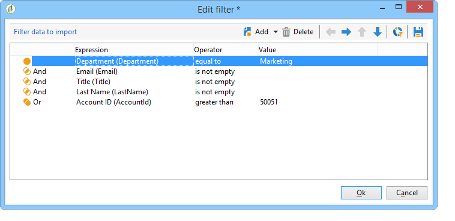
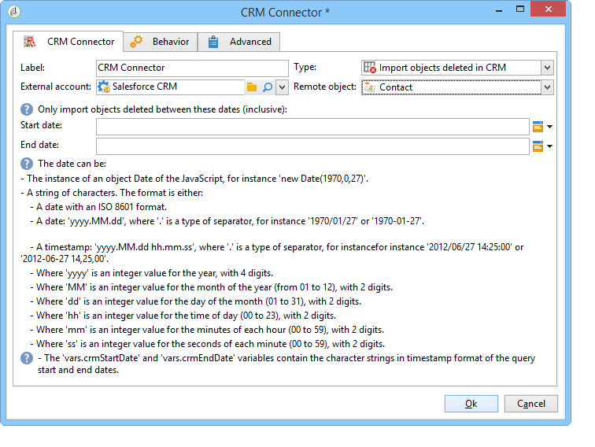

# Gegevens tussen Campagne en CRM synchroniseren {#data-synchronization}

Gegevenssynchronisatie tussen Adobe Campaign en de CRM wordt uitgevoerd via een specifieke workflowactiviteit: [CRM-connector](../../workflow/using/crm-connector.md).

Als u bijvoorbeeld de Microsoft Dynamics-gegevens wilt importeren in Adobe Campaign, maakt u het volgende type workflow:

Deze workflow importeert de contactpersonen via Microsoft Dynamics, synchroniseert deze met de bestaande Adobe Campaign-gegevens, verwijdert dubbele contactpersonen en werkt de Adobe Campaign-database bij.

De **[!UICONTROL CRM Connector]** activiteit moet worden gevormd om gegevens te synchroniseren.

Met deze activiteit kunt u:

* Invoer uit de BCR - [Meer informatie](#importing-from-the-crm)
* Exporteren naar CRM - [Meer informatie](#exporting-to-the-crm)
* Objecten importeren die zijn verwijderd in de CRM - [Meer informatie](#importing-objects-deleted-in-the-crm)
* Objecten verwijderen in de CRM-toepassing - [Meer informatie](#deleting-objects-in-the-crm)

Selecteer de externe rekening die CRM aanpast dat u synchronisatie met wilt vormen, dan het te synchroniseren voorwerp selecteren: rekeningen, kansen, lood, contacten, enz.

De configuratie van deze activiteit hangt af van het uit te voeren proces. Hieronder worden verschillende configuraties beschreven.

## Invoer uit de BCR {#importing-from-the-crm}

Om gegevens via CRM in Adobe Campaign te importeren, moet u het volgende type workflow maken:

Voor een importactiviteit **[!UICONTROL CRM Connector]** de stappen van de activiteitenconfiguratie zijn:

1. Selecteer een **[!UICONTROL Import from the CRM]** -bewerking.
1. Ga naar de **[!UICONTROL Remote object]** vervolgkeuzelijst en selecteer het object waarop het proces betrekking heeft. Dit object valt samen met een van de tabellen die in Adobe Campaign worden gemaakt tijdens de verbindingsconfiguratie.
1. Ga naar de **[!UICONTROL Remote fields]** en voert u de velden in die u wilt importeren.

   Als u een veld wilt toevoegen, klikt u op de knop **[!UICONTROL Add]** klikt u op de werkbalk op de knop **[!UICONTROL Edit expression]** pictogram.

   

   Wijzig zo nodig de gegevensindeling in de vervolgkeuzelijst van het dialoogvenster **[!UICONTROL Conversion]** kolommen. Mogelijke conversietypen worden nader beschreven in [Gegevensindeling](#data-format).

   >[!IMPORTANT]
   >
   >De identificator van de record in de CRM is verplicht voor het koppelen van objecten in CRM en in Adobe Campaign. Deze wordt automatisch toegevoegd wanneer het vak wordt goedgekeurd.
   >
   >De laatste wijzigingsdatum aan de CRM-zijde is ook verplicht voor de incrementele invoer van gegevens.

1. U kunt de te importeren gegevens ook filteren op basis van uw behoeften. Om dit te doen, klik **[!UICONTROL Edit the filter...]** koppeling.

   In het volgende voorbeeld importeert Adobe Campaign alleen contactpersonen waarvoor enige activiteit is opgenomen sinds 1 november 2012.

   

   >[!IMPORTANT]
   >
   >De beperkingen die zijn gekoppeld aan de gegevensfiltermodi worden nader beschreven in [Gegevens filteren](#filtering-data).

1. De **[!UICONTROL Use automatic index...]** Met deze optie kunt u automatisch incrementele objectsynchronisatie tussen de CRM en Adobe Campaign beheren, afhankelijk van de datum en de laatste wijziging.

   Raadpleeg voor meer informatie hierover [Beheer van variabelen](#variable-management).

### Variabelen beheren {#variable-management}

De optie **[!UICONTROL Automatic index]** gebruiken om alleen objecten te verzamelen die zijn gewijzigd sinds de laatste import.

De datum van de laatste synchronisatie wordt opgeslagen in een optie die in het configuratievenster wordt gespecificeerd, door gebrek: **LASTIMPORT_&lt;%=instance.internalName%>_&lt;%=activityName%>**.

>[!NOTE]
>
>Deze opmerking is alleen van toepassing op het generieke **[!UICONTROL CRM Connector]** activiteit. Voor andere CRM-activiteiten is het proces automatisch.
>
>Deze optie moet handmatig worden gemaakt en ingevuld onder **[!UICONTROL Administration]** > **[!UICONTROL Platform]** > **[!UICONTROL Options]**. Dit moet een tekstoptie zijn en de waarde ervan moet overeenkomen met de volgende indeling: **yyyy/MM/dd hh:mm:ss**.
> 
>U moet deze optie handmatig bijwerken als u wilt doorgaan met importeren.

U kunt het verre gebied van CRM specificeren dat in aanmerking moet worden genomen om de meest recente veranderingen te identificeren.

Standaard worden de volgende velden gebruikt (in de opgegeven volgorde):

* Voor Microsoft Dynamics: **gewijzigd**,
* Voor Salesforce.com: **LastModifiedDate**, **SystemModstamp**.

De **[!UICONTROL Automatic index]** Deze optie genereert drie variabelen die in de synchronisatieworkflow kunnen worden gebruikt via een **[!UICONTROL JavaScript code]** type activiteit. Deze activiteiten zijn:

* **vars.crmOptionName**: staat voor de naam van de optie die de laatste importdatum bevat.
* **vars.crmStartImport**: staat voor de begindatum (inclusief) van de laatste gegevensherstel.
* **vars.crmEndDate**: staat voor de einddatum (exclusief) van de laatste gegevensherstel.

  >[!NOTE]
  >
  >Deze datums worden weergegeven in de volgende notatie: **yyyy/MM/dd hh:mm:ss**.

### Gegevens filteren {#filtering-data}

Om efficiënte werking met diverse CRMs te verzekeren, moeten de filters worden gecreeerd gebruikend de volgende regels:

* Elk filterniveau mag slechts één type operator gebruiken.
* De operator AND NOT wordt niet ondersteund.
* Vergelijkingen mogen alleen betrekking hebben op null-waarden (&#39;is leeg&#39;/&#39;is geen leeg&#39; type) of getallen. Dit betekent dat de waarde (rechterkolom) wordt beoordeeld en dat het resultaat van deze beoordeling een getal moet zijn. Vergelijking van JOIN-typen wordt daarom niet ondersteund.
* De waarde in de rechterkolom wordt beoordeeld in JavaScript.
* JOIN-vergelijkingen worden niet ondersteund.
* De expressie in de linkerkolom moet een veld zijn. Het kan geen combinatie zijn van verschillende expressies, een getal, enzovoort.

De volgende filtervoorwaarden zijn bijvoorbeeld NIET geldig voor een CRM-import, omdat de OR-operator op hetzelfde niveau wordt geplaatst als de AND-operatoren:

* De operator OR wordt op hetzelfde niveau geplaatst als de operator AND
* Vergelijkingen worden uitgevoerd op tekenreeksen

### Volgorde van {#order-by}

In Microsoft Dynamics en Salesforce.com kunt u de externe velden die u wilt importeren in oplopende of aflopende volgorde sorteren.

Om dit te doen, klik **[!UICONTROL Order by]** en voeg de kolommen aan de lijst toe.

De volgorde van de kolommen in de lijst is de sorteervolgorde:

### Registeridentificatie {#record-identification}

In plaats van elementen te importeren die in de CRM zijn opgenomen (en mogelijk zijn gefilterd), kunt u een populatie gebruiken die vooraf in de workflow is berekend.

Selecteer de optie **[!UICONTROL Use the population calculated upstream]** en geeft u het veld op dat de externe id bevat.

Selecteer vervolgens de velden van de binnenkomende populatie die u wilt importeren, zoals hieronder wordt weergegeven:

## Exporteren naar de CRM {#exporting-to-the-crm}

Het uitvoeren van de gegevens van Adobe Campaign in CRM laat u volledige inhoud aan een gegevensbestand van CRM kopiëren.

Als u gegevens naar CRM wilt exporteren, moet u het volgende type workflow maken:

Pas voor een exportbewerking de volgende configuratie toe op de **[!UICONTROL CRM Connector]** activiteit:

1. Selecteer een **[!UICONTROL Export to CRM]** -bewerking.
1. Ga naar de **[!UICONTROL Remote object]** vervolgkeuzelijst en selecteer het object waarop het proces betrekking heeft. Dit object valt samen met een van de tabellen die in Adobe Campaign worden gemaakt tijdens de verbindingsconfiguratie.

   >[!IMPORTANT]
   >
   >De exportfunctie van de **[!UICONTROL CRM Connector]** activiteit kan gebieden op de kant van CRM opnemen of bijwerken. Om gebiedsupdates in CRM toe te laten, moet u de primaire sleutel van de verre lijst specificeren. Als de sleutel ontbreekt, worden gegevens ingevoegd (in plaats van bijgewerkt).

1. Controleren **[!UICONTROL Export in Batches]** als u sneller wilt exporteren.

   

1. In de **[!UICONTROL Mapping]** sectie, klikken **[!UICONTROL New]** om de velden te specificeren die geëxporteerd moeten worden en hun toewijzing in de CRM.

   

   Als u een veld wilt toevoegen, klikt u op de knop **[!UICONTROL Add]** klikt u op de werkbalk op de knop **[!UICONTROL Edit expression]** pictogram.

   >[!NOTE]
   >
   >Voor een bepaald veld kunnen de waarden niet worden bijgewerkt als er geen overeenkomst aan de CRM-zijde is gedefinieerd: ze worden rechtstreeks in de CRM ingevoegd.

   Wijzig zo nodig de gegevensindeling in de vervolgkeuzelijst van het dialoogvenster **[!UICONTROL Conversion]** kolommen. Mogelijke conversietypen worden nader beschreven in [Gegevensindeling](#data-format).

   >[!NOTE]
   >
   >De lijst met te exporteren records en het resultaat van de export worden opgeslagen in een tijdelijk bestand dat toegankelijk blijft totdat de workflow is voltooid of opnieuw is gestart. Hierdoor kunt u het proces opnieuw starten in het geval van fouten zonder dat u het risico loopt dezelfde record meerdere keren te exporteren of gegevens te verliezen.

## Aanvullende configuraties {#additional-configurations}

### Gegevensindeling {#data-format}

U kunt gegevensindeling direct omzetten wanneer u deze importeert in of vanuit de CRM.

Selecteer hiertoe de conversie die in de overeenkomende kolom moet worden toegepast.

De **[!UICONTROL Default]** in de modus Automatische gegevensomzetting, die in de meeste gevallen overeenkomt met een kopie/plakken van de gegevens. Tijdzonebeheer wordt echter toegepast.

Andere mogelijke omzettingen zijn:

* **[!UICONTROL Date only]**: in deze modus worden de velden Datum- en tijdtype verwijderd.
* **[!UICONTROL Without time offset]**: in deze modus wordt het tijdzonebeheer geannuleerd dat in de standaardmodus wordt toegepast.
* **[!UICONTROL Copy/Paste]**: in deze modus worden onbewerkte gegevens gebruikt, zoals tekenreeksen (geen conversie).

### Fout bij verwerken {#error-processing}

In het kader van de invoer of de uitvoer van gegevens, kunt u een specifiek proces op fouten en verwerpingen toepassen. Selecteer de optie **[!UICONTROL Process rejects]** en **[!UICONTROL Process errors]** in de **[!UICONTROL Behavior]** tab.

Met deze opties worden de overeenkomende uitvoerovergangen geplaatst.

Plaats vervolgens de activiteiten die relevant zijn voor de processen die u wilt toepassen.

Als u bijvoorbeeld fouten wilt verwerken, kunt u een wachtdoos toevoegen en opnieuw een poging plannen.

Afwijzingen worden verzameld met hun foutcode en het bijbehorende bericht. Dit betekent dat u de registratie van afwijzingen kunt instellen om het synchronisatieproces te optimaliseren.

>[!NOTE]
>
>Zelfs als de **[!UICONTROL Process rejects]** de optie wordt niet toegelaten, wordt een waarschuwing geproduceerd voor elke verworpen kolom met een foutencode en een bericht.

De **[!UICONTROL Reject]** Met uitvoerovergang hebt u toegang tot het uitvoerschema dat de specifieke kolommen bevat die relevant zijn voor foutberichten en -codes. Voor Salesforce.com is deze kolom **errorSymbol** (foutsymbool, anders dan de foutcode), **errorMessage** (beschrijving van de foutcontext).

## Objecten importeren die zijn verwijderd in de CRM {#importing-objects-deleted-in-the-crm}

Om het opzetten van een uitgebreid proces van de gegevenssynchronisatie toe te laten, kunt u voorwerpen invoeren die in CRM worden geschrapt in Adobe Campaign.

Hiervoor voert u de volgende stappen uit:

1. Selecteer een **[!UICONTROL Import objects deleted in the CRM]** -bewerking.
1. Ga naar de **[!UICONTROL Remote object]** vervolgkeuzelijst en selecteer het object waarop het proces betrekking heeft. Dit object valt samen met een van de tabellen die in Adobe Campaign worden gemaakt tijdens de verbindingsconfiguratie.
1. Geef de verwijderingsperiode op die in de **[!UICONTROL Start date]** en de **[!UICONTROL End date]** velden. Deze data worden in de periode opgenomen.

   

   >[!IMPORTANT]
   >
   >De periode voor het verwijderen van elementen moet samenvallen met de specifieke beperkingen van de BCR. Dit betekent bijvoorbeeld dat elementen die meer dan 30 dagen geleden zijn verwijderd, niet kunnen worden hersteld.

## Objecten verwijderen in de CRM-toepassing {#deleting-objects-in-the-crm}

Om voorwerpen op de kant van CRM te schrappen, moet u de primaire sleutel van de verre te schrappen elementen specificeren.

De **[!UICONTROL Behavior]** kunt u de verwerking van afwijzingen inschakelen. Met deze optie wordt een tweede uitvoerovergang gegenereerd voor de **[!UICONTROL CRM connector]** activiteit. Raadpleeg voor meer informatie hierover [Fout bij verwerken](#error-processing).

>[!NOTE]
>
>Zelfs als de **[!UICONTROL Process rejects]** is uitgeschakeld, wordt een waarschuwing gegenereerd voor elke geweigerde kolom.
>
