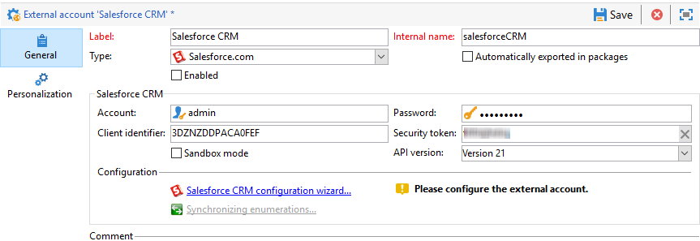

# Connect-campagne en Salesforce.com{#connect-to-sfdc}

Op deze pagina leert u hoe u Campaign Classic kunt verbinden met **Salesforce**.

Gegevenssynchronisatie wordt uitgevoerd via een specifieke werkstroomactiviteit. [Meer informatie](../../platform/using/crm-data-sync.md).

Met de externe account kunt u Salesforce-gegevens importeren en exporteren naar Adobe Campaign.
Volg onderstaande stappen om CRM-connector voor Salesforce te configureren:

1. Een nieuwe externe account maken via het dialoogvenster **[!UICONTROL Administration > Platform > External accounts]** knooppunt van de boomstructuur Adobe Campaign.
1. Selecteer **[!UICONTROL Salesforce.com]**.
1. Voer instellingen in om de verbinding in te schakelen.

   

   Om de externe rekening van Salesforce CRM te vormen om met Adobe Campaign te werken, moet u de volgende details verstrekken:

   * **[!UICONTROL Account]**
Account gebruikt om u aan te melden bij Salesforce CRM.

   * **[!UICONTROL Password]**
Wachtwoord gebruikt om u aan te melden bij Salesforce CRM.

   * **[!UICONTROL Client identifier]**
Als u wilt weten waar u uw client-id vindt, raadpleegt u deze [page](https://help.salesforce.com/articleView?id=000205876&amp;type=1).

   * **[!UICONTROL Security token]**
Als u wilt weten waar u uw beveiligingstoken vindt, raadpleegt u deze [page](https://help.salesforce.com/articleView?id=000205876&amp;type=1).

   * **[!UICONTROL API version]**
Selecteer de versie van de API.
1. Stel de configuratietovenaar in werking om de beschikbare lijst van CRM te produceren: Met de configuratietovenaar kunt u tabellen verzamelen en het bijbehorende schema maken.

   

   >[!NOTE]
   >
   >Als u de installatie wilt goedkeuren, moet u zich afmelden en weer terugzetten op de Adobe Campaign-console.

1. Controleer het schema dat in Adobe Campaign is gegenereerd in het dialoogvenster **[!UICONTROL Administration > Configuration > Data schemas]** knooppunt.

   Voorbeeld voor **Salesforce** schema:

   

1. Als het schema eenmaal is gemaakt, kunt u opsommingen automatisch synchroniseren van Salesforce naar Adobe Campaign.

   Om dit te doen, klik **[!UICONTROL Synchronizing enumerations...]** en selecteer de opsomming van Adobe Campaign die de opsomming Salesforce aanpast.

   

   >[!NOTE]
   >
   >U kunt alle waarden van een opsomming van Adobe Campaign door die van CRM vervangen: Selecteer **[!UICONTROL Yes]** in de **[!UICONTROL Replace]** kolom.

   Klikken **[!UICONTROL Next]** en vervolgens **[!UICONTROL Start]** om te beginnen met het importeren van de lijst.

1. Controleer de geïmporteerde waarden in het dialoogvenster **[!UICONTROL Administration > Platform > Enumerations]** -menu.

   

   >[!NOTE]
   >
   > Meerdere selectienumeraties worden niet ondersteund.

Campagne en Salesforce.com zijn nu verbonden. U kunt gegevenssynchronisatie tussen de twee systemen instellen.

Als u gegevens wilt synchroniseren tussen Adobe Campaign-gegevens en SFDC, moet u een workflow maken en de **[!UICONTROL CRM connector]** activiteit.

Meer informatie over gegevenssynchronisatie [op deze pagina](../../platform/using/crm-data-sync.md).
