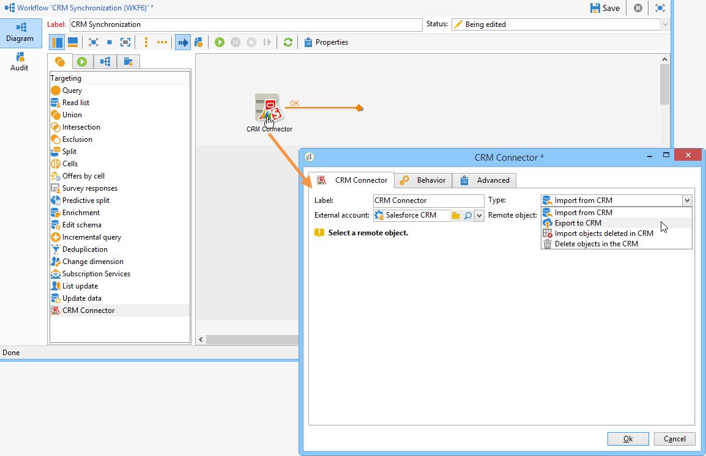

# Connect-campagne en Salesforce.com{#connect-to-sfdc}

In deze pagina, zult u leren hoe te om Campaign Classic met **Salesforce** te verbinden.

Gegevenssynchronisatie wordt uitgevoerd via een toegewijde werkstroomactiviteit. [Meer informatie](../../platform/using/crm-data-sync.md).

Met de externe account kunt u Salesforce-gegevens importeren en exporteren naar Adobe Campaign.
Volg onderstaande stappen om CRM-connector voor Salesforce te configureren:

1. Maak een nieuwe externe account via het knooppunt **[!UICONTROL Administration > Platform > External accounts]** van de Adobe Campaign-structuur.
1. Selecteer **[!UICONTROL Salesforce.com]**.
1. Voer instellingen in om de verbinding in te schakelen.

   

   Als u de externe Salesforce CRM-account wilt configureren voor Adobe Campaign, moet u de volgende gegevens opgeven:

   * **[!UICONTROL Account]**
Account gebruikt voor aanmelden bij Salesforce CRM.

   * **[!UICONTROL Password]**
Wachtwoord gebruikt om u aan te melden bij Salesforce CRM.

   * **[!UICONTROL Client identifier]**
Om te weten waar te om uw cliëntherkenningsteken te vinden, verwijs naar deze [ pagina ](https://help.salesforce.com/articleView?id=000205876&amp;type=1).

   * **[!UICONTROL Security token]**
Om te weten waar te om uw veiligheidstoken te vinden, verwijs naar deze [ pagina ](https://help.salesforce.com/articleView?id=000205876&amp;type=1).

   * **[!UICONTROL API version]**
Selecteer de versie van de API.
1. Stel de configuratiemedewerker in werking om de beschikbare lijst van CRM te produceren: de configuratiemedewerker laat u lijsten verzamelen en het passende schema tot stand brengen.

   

   >[!NOTE]
   >
   >Als u de installatie wilt goedkeuren, moet u zich afmelden en weer terugzetten op de Adobe Campaign-console.

1. Controleer het schema dat in Adobe Campaign is gegenereerd in het knooppunt **[!UICONTROL Administration > Configuration > Data schemas]** .

   Voorbeeld voor **Salesforce** schema:

   

1. Als het schema eenmaal is gemaakt, kunt u opsommingen automatisch synchroniseren van Salesforce naar Adobe Campaign.

   Klik hiertoe op de koppeling **[!UICONTROL Synchronizing enumerations...]** en selecteer de opsomming van Adobe Campaign die overeenkomt met de opsomming van Salesforce.

   

   >[!NOTE]
   >
   >U kunt alle waarden van een Adobe Campaign-opsomming vervangen door die van de CRM: hiervoor selecteert u **[!UICONTROL Yes]** in de kolom **[!UICONTROL Replace]** .

   Klik op **[!UICONTROL Next]** en vervolgens op **[!UICONTROL Start]** om de lijst te importeren.

1. Controleer de geïmporteerde waarden in het menu **[!UICONTROL Administration > Platform > Enumerations]** .

   

   >[!NOTE]
   >
   > Meerdere selectienumeraties worden niet ondersteund.

Campagne en Salesforce.com zijn nu verbonden. U kunt gegevenssynchronisatie tussen de twee systemen instellen.

Als u gegevens wilt synchroniseren tussen Adobe Campaign-gegevens en SFDC, moet u een workflow maken en de **[!UICONTROL CRM connector]** -activiteit gebruiken.

Leer meer over gegevenssynchronisatie [ in deze pagina ](../../platform/using/crm-data-sync.md).
