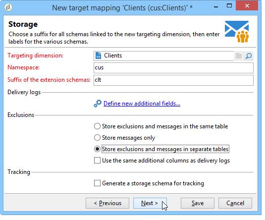

# Gegevenstoewijzing definiëren {#defining-data-mapping}

Met Adobe Campaign kunt u toewijzingen definiëren voor de gegevens in een externe tabel.

Om dit te doen, zodra het schema van de externe lijst is gecreeerd, moet u een nieuwe leveringsafbeelding tot stand brengen om de gegevens in deze lijst als leveringsdoel te gebruiken.

Hiervoor voert u de volgende stappen uit:

1. Maak een nieuwe leveringstoewijzing en kies de doeldimensie, het schema dat u net hebt gemaakt, bijvoorbeeld.

   

1. Geef de velden op waarin de leveringsgegevens zijn opgeslagen (achternaam, voornaam, e-mail, adres, enz.).

   

1. Specificeer de parameters voor informatieopslag, met inbegrip van het achtervoegsel van de uitbreidingsregelingen om hen gemakkelijk identificeerbaar te zijn.

   

   U kunt kiezen of u uitsluitingen (**excludelog**), berichten (**broadlog**) of in een aparte tabel wilt opslaan.

   U kunt ook kiezen of u het bijhouden van gegevens voor deze leveringstoewijzing (**trackinglog**) wilt beheren.

1. Selecteer vervolgens de extensies waarmee u rekening wilt houden. Het extensietype is afhankelijk van de parameters en opties van uw platform (uw licentiecontract weergeven).

   

   Klik op de **[!UICONTROL Save]** knop om het maken van de leveringstoewijzing te starten: alle gekoppelde tabellen worden automatisch gemaakt op basis van de geselecteerde parameters.
