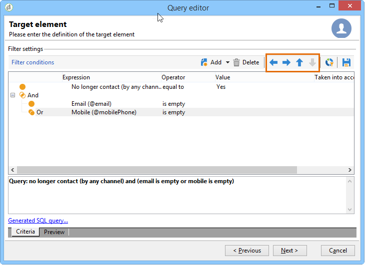
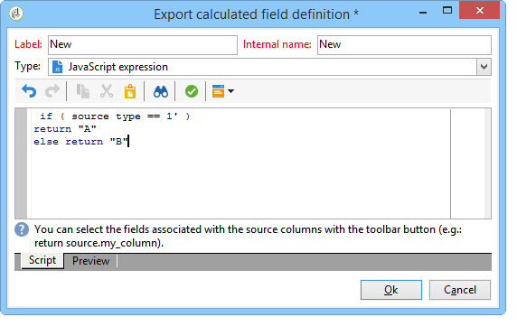

# Filtervoorwaarden definiëren{#defining-filter-conditions}

## De operator {#choosing-the-operator} kiezen

Binnen het filtreren voorwaarden, moet u twee waarden verbinden samen gebruikend een exploitant.

Hieronder volgt een lijst met de beschikbare operatoren:

<table> 
 <thead> 
  <tr> 
   <th> Operator  </th> 
   <th> Doel  </th> 
   <th> Voorbeeld  </th> 
  </tr> 
 </thead> 
 <tbody> 
  <tr> 
   <td> Equal to   </td> 
   <td> Retourneert een resultaat dat identiek is aan de gegevens die zijn ingevoerd in de tweede kolom Waarde.  </td> 
   <td> <strong>Achternaam (@lastName) gelijk aan 'Jones'</strong> retourneert alleen ontvangers met als achternaam Jones.  </td> 
  </tr> 
  <tr> 
   <td> Greater than   </td> 
   <td> Retourneert een waarde die groter is dan de ingevoerde waarde.  </td> 
   <td> <strong>Leeftijd (@tijdperk) groter dan 50</strong>, geeft alle waarden groter dan '50', d.w.z. "51", "52", enz.  </td> 
  </tr> 
  <tr> 
   <td> Less than   </td> 
   <td> Retourneert een waarde die kleiner is dan de ingevoerde waarde.  </td> 
   <td> <strong>Aanmaakdatum (@created) voor 'DaysAgo(100)'</strong>, retourneert alle ontvangers die minder dan 100 dagen geleden zijn gemaakt.  </td> 
  </tr> 
  <tr> 
   <td> Greater than or equal to   </td> 
   <td> Retourneert alle waarden gelijk aan of groter dan de ingevoerde waarde.  </td> 
   <td> <strong>Leeftijd (@age) groter dan of gelijk aan '30'</strong>, retourneert alle ontvangers van 30 jaar of ouder.  </td> 
  </tr> 
  <tr> 
   <td> Less than or equal to   </td> 
   <td> Retourneert alle waarden gelijk aan of lager dan de ingevoerde waarde.  </td> 
   <td> <strong>Leeftijd (@age) kleiner dan of gelijk aan '60'</strong>, retourneert alle ontvangers van 60 jaar of ouder.  </td> 
  </tr> 
  <tr> 
   <td> Niet gelijk aan   </td> 
   <td> Retourneert alle waarden die niet identiek zijn aan de ingevoerde waarde.  </td> 
   <td> <strong>Taal (@taal) gelijk aan 'Engels'</strong>.  </td> 
  </tr> 
  <tr> 
   <td> Begint met   </td> 
   <td> Retourneert de resultaten die beginnen met de ingevoerde waarde.  </td> 
   <td> <strong>Account # (@account) begint met '32010'.</strong>  </td> 
  </tr> 
  <tr> 
   <td> Begint niet met   </td> 
   <td> Retourneert de resultaten die niet beginnen met de ingevoerde waarde  </td> 
   <td> <strong>Account # (@account) begint niet met '20'</strong>.  </td> 
  </tr> 
  <tr> 
   <td> Contains   </td> 
   <td> Retourneert de resultaten die ten minste de ingevoerde waarde bevatten.  </td> 
   <td> <strong>E-maildomein (@domain) bevat 'mail'</strong>, retourneert alle domeinnamen die 'mail' bevatten. Het domein 'gmail.com' wordt dus ook geretourneerd.  </td> 
  </tr> 
  <tr> 
   <td> Bevat niet   </td> 
   <td> Retourneert resultaten die niet de ingevoerde waarde bevatten.  </td> 
   <td> <strong>E-maildomein (@domein) bevat geen 'vo'</strong>. In dit geval worden domeinnamen die 'vo' bevatten, niet geretourneerd. De domeinnaam 'voila.fr' wordt niet weergegeven in de resultaten.  </td> 
  </tr> 
  <tr> 
   <td> Like   </td> 
   <td> Like lijkt heel sterk op de operator Contains. Hiermee kunt u een jokerteken % in de waarde invoegen.  </td> 
   <td> <strong>Achternaam (@lastName) zoals 'Jon%s'</strong>. Hier wordt het jokerteken gebruikt als een joker om de naam "Jones" te zoeken, mocht de operator de ontbrekende letter tussen 'n' en 's' vergeten hebben.  </td> 
  </tr> 
  <tr> 
   <td> Not like   </td> 
   <td> Heeft overeenkomsten met Like . Hiermee kunt u de ingevoerde waarde niet herstellen. Ook hier moet de ingevoerde waarde het jokerteken % bevatten.  </td> 
   <td> <strong>Achternaam (@lastName) houdt niet van 'Smi%h'</strong>. Hier worden de ontvangers met de achternaam 'Smi%h' niet geretourneerd.  </td> 
  </tr> 
  <tr> 
   <td> Is empty   </td> 
   <td> In dit geval, past het resultaat wij zoeken een lege waarde in de tweede kolom van de Waarde aan.  </td> 
   <td> <strong>Met Mobile (@mobilePhone) worden alle ontvangers zonder mobiel nummer </strong> geretourneerd.  </td> 
  </tr> 
  <tr> 
   <td> Is niet leeg   </td> 
   <td> Werkt in omgekeerde volgorde naar de operator Is leeg. U hoeft geen gegevens in te voeren in de tweede kolom Waarde.  </td> 
   <td> <strong>E-mail (@email) is niet leeg</strong>.  </td> 
  </tr> 
  <tr> 
   <td> Is opgenomen in   </td> 
   <td> Retourneert resultaten die zijn opgenomen in de aangegeven waarden. Deze waarden moeten door een komma worden gescheiden.  </td> 
   <td> <strong>Geboortedatum (@geboortedatum) is opgenomen in 12-10-1979.12-10-1984'</strong>, en retourneert de ontvangers die geboren zijn tussen deze data.    </td> 
  </tr> 
  <tr> 
   <td> Is niet opgenomen in   </td> 
   <td> Werkt zoals de Is inbegrepen in exploitant. Hier, willen wij ontvangers uitsluiten die op de ingegane waarden worden gebaseerd.  </td> 
   <td> <strong>Geboortedatum (@geboortedatum) is niet opgenomen in 10-12-1979.12-10-1984"</strong>. In tegenstelling tot het vorige voorbeeld worden ontvangers die binnen deze datums geboren zijn, niet geretourneerd.  </td> 
  </tr> 
 </tbody> 
</table>

## EN, OF, BEHALEN {#using-and--or--except}

Voor vragen die verscheidene het filtreren voorwaarden gebruiken, moet u verbindingen tussen de voorwaarden bepalen. Er zijn drie mogelijke koppelingen:

* **[!UICONTROL And]** Hiermee kunt u twee filtervoorwaarden combineren.
* **[!UICONTROL Or]** laat u een alternatief aanbieden,
* **[!UICONTROL Except]** Hiermee kunt u een uitzondering definiëren.

Klik **[!UICONTROL And]** (standaard aangeboden) en kies een optie in de vervolgkeuzelijst.

* **[!UICONTROL And]**: voegt een voorwaarde toe en laat overfiltreren toe.
* **[!UICONTROL Or]**: voegt een voorwaarde toe en laat overfiltreren toe.

   In het volgende voorbeeld kunt u ontvangers vinden waarvan het e-maildomein &quot;orange.co.uk&quot; OF waarvan de postcode begint met &quot;NW&quot;.

   

* **[!UICONTROL Except]**: als u twee filters hebt en de eerste geen waarde retourneert, maakt dit type koppeling een uitzondering.

   In het volgende voorbeeld, willen wij ontvangers terugkeren waarvan e-maildomein &quot;orange.co.uk&quot;BEHALVE bevat als de achternaam van de ontvanger &quot;Smith&quot;is.

   

In dit voorbeeld ziet u een filter waarmee u het volgende kunt weergeven: ontvangers die Spaans spreken, OR zijn vrouwen met mobiele nummers, OR ontvangers zonder accountnummer, en wiens bedrijfsnaam begint met de letter &quot;N&quot;.

## Voorwaarden {#prioritizing-conditions} prioriteren

In deze sectie wordt uitgelegd hoe u voorwaarden kunt prioriteren dankzij de blauwe pijlen op de werkbalk.

* Met de pijl die naar rechts wijst, kunt u een niveau van ronde haakjes aan het filter toevoegen.
* Met de pijl die naar links wijst, kunt u een geselecteerd haakjesniveau uit het filter verwijderen.

   

* Met de verticale pijlen kunt u een voorwaarde verplaatsen en zo de uitvoeringsvolgorde wijzigen.

In dit voorbeeld ziet u hoe u de pijl kunt gebruiken om een haakjesniveau te verwijderen. Begin bij de volgende filtervoorwaarde: **[!UICONTROL City equal to London OR gender equal to male and mobile not indicated OR account # starts with "95" and company name starts with "A"]**.

Plaats de cursor op de filtervoorwaarde **[!UICONTROL Gender (@gender) equal to Male]** en klik op de pijl **[!UICONTROL Remove a parenthesis level]**.

De voorwaarde **[!UICONTROL Gender (@gender) equal to Male]** is uit zijn haakje genomen. Het is op hetzelfde niveau gegaan als de voorwaarde &quot;Stad is gelijk aan Londen&quot;. Deze voorwaarden zijn met elkaar verbonden (**[!UICONTROL And]**).

## Te extraheren gegevens selecteren {#selecting-data-to-extract}

De beschikbare velden verschillen per tabel. Alle velden worden opgeslagen in een hoofdknooppunt dat **[!UICONTROL Main element]** wordt genoemd. In het volgende voorbeeld bevinden de beschikbare velden zich in de ontvangende tabel. Velden worden altijd in alfabetische volgorde weergegeven.

Het detail van het geselecteerde veld wordt onder in het venster weergegeven. Het veld **[!UICONTROL Email domain]** is bijvoorbeeld een **[!UICONTROL Calculated SQL field]** en de extensie is **[!UICONTROL (@domain)]**.

>[!NOTE]
>
>Gebruik het gereedschap **[!UICONTROL Search]** om een beschikbaar veld te zoeken.

Dubbelklik op een beschikbaar veld om dit toe te voegen aan de uitvoerkolommen. Aan het einde van de query maakt elk geselecteerd veld een kolom in het venster **[!UICONTROL Data preview]**.

Geavanceerde velden worden niet standaard weergegeven. Klik op **[!UICONTROL Display advanced fields]** in de rechteronderhoek van de beschikbare velden om alles weer te geven. Klik nogmaals om terug te keren naar de vorige weergave.

In de ontvangende tabel zijn de geavanceerde velden bijvoorbeeld **Boolean 1**, **[!UICONTROL Boolean 2]**, **[!UICONTROL Boolean 3]**, **[!UICONTROL Foreign key of "Folder" link]**, enz.

Het volgende voorbeeld toont de geavanceerde gebieden van de ontvankelijke lijst.

De verschillende categorieën velden:

<table> 
 <thead> 
  <tr> 
   <th> Pictogram  </th> 
   <th> Beschrijving  </th> 
   <th> Voorbeelden  </th> 
  </tr> 
 </thead> 
 <tbody> 
  <tr> 
   <td>  </td> 
   <td> Eenvoudig veld  </td> 
   <td> E-mail, geslacht, enz.  </td> 
  </tr> 
  <tr> 
   <td>  </td> 
   <td> Primaire sleutel. Dit SQL-veld is een manier om een record in een tabel te identificeren.  </td> 
   <td> Ontvangers van id's zijn primaire sleutels en id's zijn per definitie uniek.  </td> 
  </tr> 
  <tr> 
   <td>  </td> 
   <td> Buitenlandse sleutel. Wordt gebruikt als een koppeling naar een andere tabel.  </td> 
   <td> Ontvanger buitenlandse sleutel, service buitenlandse sleutel, enz.  </td> 
  </tr> 
  <tr> 
   <td>  </td> 
   <td> Berekend veld. Dit type van gebied wordt berekend op verzoek gebruikend de waarden in het gegevensbestand.  </td> 
   <td> Leeftijd, e-maildomein, enz.  </td> 
  </tr> 
  <tr> 
   <td>  </td> 
   <td> Veld met lange teksten.  </td> 
   <td> Opmerking, volledig adres, enz.  </td> 
  </tr> 
  <tr> 
   <td>  </td> 
   <td> Geïndexeerde SQL-velden.   </td> 
   <td> Volledige naam, ISO-code enz.   </td> 
  </tr> 
 </tbody> 
</table>

Koppeling maken naar een tabel en verzamelingselement:

<table> 
 <thead> 
  <tr> 
   <th> Pictogram  </th> 
   <th> Beschrijving  </th> 
   <th> Voorbeeld  </th> 
  </tr> 
 </thead> 
 <tbody> 
  <tr> 
   <td>  </td> 
   <td> Met name koppelingen naar een tabel. Deze komen overeen met 1-1 type associaties. Een instantie van de brontabel kan slechts één instantie van de doeltabel bevatten. Er kan bijvoorbeeld slechts één ontvanger zijn gekoppeld aan een land.  </td> 
   <td> Map, provincie, land, enz.   </td> 
  </tr> 
  <tr> 
   <td>  </td> 
   <td> Het element van de inzameling op een specifieke lijst. Deze komen overeen met 1-N type associaties. Eén exemplaar van de brontabel valt samen met meerdere exemplaren van de doeltabel, maar één instantie van de doeltabel kan slechts één instantie van de brontabel bevatten. Eén ontvanger kan zich bijvoorbeeld abonneren op 'n'-abonnementbrieven.  </td> 
   <td> Abonnementen, lijsten, logboeken van uitsluitingen, enz.  </td> 
  </tr> 
 </tbody> 
</table>

>[!NOTE]
>
>* Gebruik de knop **[!UICONTROL Add]** (boven de zijpictogrambalk) om een uitvoerkolom toe te voegen waarin u de expressie wilt bewerken. Raadpleeg [Expressies maken](#building-expressions) voor meer informatie over het bewerken van een expressie.
>* Verwijder een uitvoerkolom door op de rode letter &#39;x&#39; (**Delete**) te klikken.
>* Wijzig de volgorde van de uitvoerkolommen met de pijlen.
>* De **[!UICONTROL Distribution of values]** dient als een manier om de verdeling van de waarden van het geselecteerde veld te bekijken (bijvoorbeeld de distributies die gekoppeld zijn aan de ontvangende steden, de ontvangende talen, enz.).

## Berekende velden {#creating-calculated-fields} maken

Voeg zo nodig een kolom toe tijdens het opmaken van gegevens. Een berekend veld voegt een kolom toe aan de sectie met de voorvertoning van gegevens. Klik op **[!UICONTROL Add a calculated field]**.

Er zijn vier typen berekende velden:

* **[!UICONTROL Fixed string]**: Hiermee kunt u een tekenreeks met tekens toevoegen.

   

* **[!UICONTROL String with JavaScript tags]**: Met de waarde van het berekende veld wordt een reeks tekens en JavaScript-instructies gecombineerd.

   

* **[!UICONTROL JavaScript expression]**: De waarde van het berekende veld is het resultaat van een JavaScript-functieevaluatie. De geretourneerde waarde kan worden getypt (getal, datum, enz.).

   

* **[!UICONTROL Enumerations]**: Met dit type veld kunt u de inhoud van een van de uitvoerkolommen in een nieuwe kolom gebruiken of wijzigen.

   Het is mogelijk om de bronwaarde van een kolom te gebruiken en het een bestemmingswaarde te geven. Deze bestemmingswaarde zal in de nieuwe outputkolom worden getoond.

   Een voorbeeld van het toevoegen van berekend gebiedstype **[!UICONTROL Enumerations]** is beschikbaar, verwijs naar [deze sectie](../../workflow/using/adding-enumeration-type-calculated-field.md).

   

   Het berekende veld van het type **[!UICONTROL Enumerations]** kan vier voorwaarden bevatten:

   * **[!UICONTROL Keep the source value]** Hiermee herstelt u de bronwaarde in het doel zonder deze te wijzigen.
   * **[!UICONTROL Use the following value]** Hiermee kunt u een standaarddoelwaarde voor niet-gedefinieerde bronwaarden invoeren.
   * **[!UICONTROL Generate a warning and continue]** waarschuwt de gebruiker dat de bronwaarde niet kan worden gewijzigd.
   * **[!UICONTROL Generate an error and reject the line]** voorkomt dat de regel wordt berekend en geïmporteerd.

Klik op **[!UICONTROL Detail of calculated field]** om de details van het ingevoegde veld weer te geven.

Klik op het kruisje **[!UICONTROL Remove the calculated field]** om dit berekende veld te verwijderen.

## Expressies maken {#building-expressions}

Met het gereedschap voor het bewerken van expressies kunt u aggregaten berekenen, functies genereren of een formule bewerken met behulp van een expressie.

In het volgende voorbeeld ziet u hoe u een telling op een primaire toets uitvoert.

Voer de volgende stappen uit:

1. Klik **[!UICONTROL Add]** in het **[!UICONTROL Data to extract]** venster. Selecteer in het venster **[!UICONTROL Formula type]** een type formule om de expressie in te voeren.

   Er zijn verschillende typen beschikbare formules: **[!UICONTROL Field only]**, **[!UICONTROL Aggregate]**, **[!UICONTROL Expression]**.

   Selecteer **[!UICONTROL Process on an aggregate function]** en **[!UICONTROL Count]**. Klik op **[!UICONTROL Next]**.

   

1. De primaire sleutel wordt berekend.

   

Hier volgt een gedetailleerde weergave van de opties in het venster **[!UICONTROL Formula types]**:

1. **[!UICONTROL Field only]** Hiermee kunt u terugkeren naar het  **[!UICONTROL Field to select]** venster.
1. **[!UICONTROL Aggregate (Process on an aggregate function)]**. Hier volgen enkele voorbeelden van het gebruik van aggregaten:

   * **[!UICONTROL Count]** Hiermee kunt u een aantal primaire sleutels uitvoeren.
   * **[!UICONTROL Sum]** Hiermee kunt u alle aankopen optellen die een klant gedurende een jaar heeft gedaan.
   * **[!UICONTROL Maximum value]** laat u de klanten vinden die de meeste &quot; n &quot; producten hebben gekocht.
   * **[!UICONTROL Minimum value]** Hiermee kunt u klanten doorzoeken en zoeken naar klanten die zich onlangs op een aanbieding hebben geabonneerd.
   * **[!UICONTROL Average]**. Met deze functie kunt u de gemiddelde leeftijd van de ontvangers berekenen.

      Met het vak **[!UICONTROL Distinct]** kunt u unieke en niet-nulwaarden van een kolom herstellen. Bijvoorbeeld, kunt u alle het volgen logboeken van een ontvanger terugkrijgen en deze het volgen logboeken worden veranderd in waarde 1 aangezien zij allen de zelfde ontvanger aangaan.

1. **[!UICONTROL Expression]** opent het  **[!UICONTROL Edit the expression]** venster. Zo kunt u telefoonnummers met te veel cijfers detecteren. Dit kunnen invoerfouten zijn.

   

   Voor een lijst van alle beschikbare functies, verwijs naar [Lijst van functies](#list-of-functions).

## Lijst met functies {#list-of-functions}

Als een **[!UICONTROL Expression]** typeformule wordt gekozen, zult u aan het &quot;uitgeeft de uitdrukking&quot;venster worden genomen. Verschillende categorieën functies kunnen aan de beschikbare velden worden gekoppeld: **[!UICONTROL Aggregates]**, **[!UICONTROL String]**, **[!UICONTROL Date]**, **[!UICONTROL Numerical]**, **[!UICONTROL Currency]**, **[!UICONTROL Geomarketing]**, **[!UICONTROL Windowing function]** en **[!UICONTROL Others]**.

De expressie-editor ziet er als volgt uit:

Hiermee kunt u velden in de databasetabellen selecteren en er geavanceerde functies aan toevoegen. De volgende functies zijn beschikbaar:

**Aggregaten**

<table> 
 <tbody> 
  <tr> 
   <td> <strong>Naam</strong>  </td> 
   <td> <strong>Beschrijving</strong>  </td> 
   <td> <strong>Syntaxis</strong>  </td> 
  </tr> 
  <tr> 
   <td> <strong>Avg</strong>  </td> 
   <td> Hiermee wordt het gemiddelde geretourneerd van een kolom van het type Number  </td> 
   <td> Avg(&lt;waarde&gt;) </td> 
  </tr> 
  <tr> 
   <td> <strong>Aantal</strong>  </td> 
   <td> Telt de niet-null waarden van een kolom  </td> 
   <td> Count(&lt;waarde&gt;) </td>  
  </tr> 
  <tr> 
   <td> <strong>CountAll</strong>  </td> 
   <td> Telt de geretourneerde waarden (alle velden)  </td> 
   <td> CountAll()  </td> 
  </tr> 
  <tr> 
   <td> <strong>Aftelbaar</strong>  </td> 
   <td> Telt de verschillende niet-null waarden van een kolom  </td> 
   <td> Countdistinct(&lt;waarde&gt;) </td> 
  </tr> 
  <tr> 
   <td> <strong>Max</strong>  </td> 
   <td> Retourneert de maximumwaarde van een getal, tekenreeks of datumtekstkolom  </td> 
   <td> Max(&lt;waarde&gt;) </td>  
  </tr> 
  <tr> 
   <td> <strong>Min</strong>  </td> 
   <td> Hiermee wordt de minimumwaarde van een kolom met het getal, tekenreeks of datumtype geretourneerd  </td> 
   <td> Min(&lt;waarde&gt;) </td> 
  </tr> 
  <tr> 
   <td> <strong>StdDev</strong>  </td> 
   <td> Retourneert de standaardafwijking van een getal, tekenreeks of datumkolom  </td> 
   <td> StdDev(&lt;value&gt;) </td> 
  </tr> 
  <tr> 
   <td> <strong>Som</strong>  </td> 
   <td> Retourneert de som van de waarden van een getal, tekenreeks of datumtekstkolom  </td> 
   <td> Sum(&lt;waarde&gt;) </td> 
  </tr> 
 </tbody> 
</table>

**Tekenreeks**

<table> 
 <tbody> 
  <tr> 
   <td> <strong>Naam</strong>  </td> 
   <td> <strong>Beschrijving</strong>  </td> 
   <td> <strong>Syntaxis</strong>  </td> 
  </tr> 
  <tr> 
   <td> <strong>AllNonNull2</strong>  </td> 
   <td> Geeft aan of alle parameters niet null en niet leeg zijn  </td> 
   <td> AllNonNull2(&lt;tekenreeks&gt;, &lt;tekenreeks&gt;) </td> 
  </tr> 
  <tr> 
   <td> <strong>AllNonNull3</strong>  </td> 
   <td> Geeft aan of alle parameters niet null en niet leeg zijn  </td> 
   <td> AllNonNull3(&lt;tekenreeks&gt;, &lt;tekenreeks&gt;, &lt;tekenreeks&gt;) </td> 
  </tr> 
  <tr> 
   <td> <strong>Ascii</strong>  </td> 
   <td> Hiermee wordt de ASCII-waarde van het eerste teken in de tekenreeks geretourneerd.  </td> 
   <td> Ascii(&lt;tekenreeks&gt;) </td> 
  </tr> 
  <tr> 
   <td> <strong>Char</strong>  </td> 
   <td> Hiermee wordt het teken geretourneerd dat overeenkomt met de ASCII-code ‘n’  </td> 
   <td> Char(&lt;nummer&gt;) </td>  
  </tr> 
  <tr> 
   <td> <strong>Charindex</strong>  </td> 
   <td> Retourneert de positie van tekenreeks 2 in tekenreeks 1.  </td> 
   <td> Charindex(&lt;tekenreeks&gt;, &lt;tekenreeks&gt;) </td> 
  </tr> 
  <tr> 
   <td> <strong>GetLine</strong>  </td> 
   <td> Retourneert de n-de (van 1 tot en met n) regel van de tekenreeks  </td> 
   <td> GetLine(&lt;tekenreeks&gt;) </td> 
  </tr> 
  <tr> 
   <td> <strong>IfEquals</strong>  </td> 
   <td> Retourneert de derde parameter als de eerste twee parameters gelijk zijn. Als niet, keert de laatste parameter  terug </td> 
   <td> IfEquals(&lt;tekenreeks&gt;, &lt;tekenreeks&gt;, &lt;tekenreeks&gt;, &lt;tekenreeks&gt;) </td> 
  </tr> 
  <tr> 
   <td> <strong>IsMemoNull</strong>  </td> 
   <td> Geeft aan of het als parameter doorgegeven memo null is  </td> 
   <td> IsMemoNull(&lt;memo&gt;) </td> 
  </tr> 
  <tr> 
   <td> <strong>JuxtWords</strong>  </td> 
   <td> Voegt de doorgegeven tekenreeksen samen als parameters. Voegt indien nodig spaties tussen de tekenreeksen toe.  </td> 
   <td> JuxtWords(&lt;tekenreeks&gt;, &lt;tekenreeks&gt;) </td> 
  </tr> 
  <tr> 
   <td> <strong>JuxtWords3</strong>  </td> 
   <td> Voegt de doorgegeven tekenreeksen samen als parameters. Hiermee voegt u, indien nodig, spaties toe tussen de tekenreeksen  </td> 
   <td> JuxtWords3(&lt;tekenreeks&gt;, &lt;tekenreeks&gt;, &lt;tekenreeks&gt;) </td>  
  </tr> 
  <tr> 
   <td> <strong>LPad</strong>  </td> 
   <td> Hiermee wordt de voltooide tekenreeks links geretourneerd  </td> 
   <td> LPad(&lt;string&gt;, &lt;number&gt;, &lt;character&gt;) </td> 
  </tr> 
  <tr> 
   <td> <strong>Left</strong>  </td> 
   <td> Retourneert de eerste n tekens van de tekenreeks  </td> 
   <td> Left(&lt;tekenreeks&gt;, &lt;nummer&gt;) </td> 
  </tr> 
  <tr> 
   <td> <strong>Length</strong>  </td> 
   <td> Retourneert de lengte van de tekenreeks  </td> 
   <td> Length(&lt;tekenreeks&gt;) </td> 
  </tr> 
  <tr> 
   <td> <strong>Lower</strong>  </td> 
   <td> Hiermee wordt de tekenreeks in kleine letters geretourneerd  </td> 
   <td> Lower(&lt;tekenreeks&gt;) </td> 
  </tr> 
  <tr> 
   <td> <strong>Ltrim</strong>  </td> 
   <td> Hiermee worden spaties links van de tekenreeks verwijderd  </td> 
   <td> Ltrim(&lt;tekenreeks&gt;) </td> 
  </tr> 
  <tr> 
   <td> <strong>Md5Digest</strong>  </td> 
   <td> Retourneert een hexadecimale representatie van de MD5-toets van een tekenreeks  </td> 
   <td> Md5Digest(&lt;tekenreeks&gt;) </td> 
  </tr> 
  <tr> 
   <td> <strong>MemoContains</strong>  </td> 
   <td> Hiermee wordt opgegeven of het memo de tekenreeks bevat die als parameter is doorgegeven  </td> 
   <td> MemoContains(&lt;memo&gt;, &lt;tekenreeks&gt;) </td> 
  </tr> 
  <tr> 
   <td> <strong>RPad</strong>  </td> 
   <td> Hiermee wordt de voltooide tekenreeks aan de rechterkant geretourneerd  </td> 
   <td> RPad(&lt;tekenreeks&gt;, &lt;nummer&gt;, &lt;teken&gt;) </td> 
  </tr> 
  <tr> 
   <td> <strong>Right</strong>  </td> 
   <td> Retourneert de laatste n tekens van de tekenreeks  </td> 
   <td> Right(&lt;tekenreeks&gt;)  </td> 
  </tr> 
  <tr> 
   <td> <strong>Rtrim</strong>  </td> 
   <td> Hiermee worden spaties rechts van de tekenreeks verwijderd  </td> 
   <td> Rtrim(&lt;tekenreeks&gt;)  </td> 
  </tr> 
  <tr> 
   <td> <strong>Smart</strong>  </td> 
   <td> Retourneert de tekenreeks met de eerste letter van elk woord in hoofdletters  </td> 
   <td> Smart(&lt;tekenreeks&gt;)  </td> 
  </tr> 
  <tr> 
   <td> <strong>Substring</strong>  </td> 
   <td> Hiermee wordt de subtekenreeks opgehaald die begint op teken n1 van de tekenreeks en lengte n2  </td> 
   <td> Substring(&lt;tekenreeks&gt;, &lt;offset&gt;, &lt;lengte&gt;)  </td>  
  </tr> 
  <tr> 
   <td> <strong>ToString</strong>  </td> 
   <td> Zet het getal om in een tekenreeks  </td> 
   <td> ToString(&lt;number&gt;, &lt;number&gt;)  </td>  
  </tr> 
  <tr> 
   <td> <strong>Upper</strong>  </td> 
   <td> Hiermee wordt de tekenreeks in hoofdletters geretourneerd  </td> 
   <td> Upper(&lt;tekenreeks&gt;)  </td>  
  </tr> 
  <tr> 
   <td> <strong>VirtualLink</strong>  </td> 
   <td> Retourneert de externe sleutel van een koppeling die als een parameter is doorgegeven als de andere twee parameters gelijk zijn  </td> 
   <td> VirtualLink(&lt;nummer&gt;, &lt;nummer&gt;, &lt;nummer&gt;)  </td>  
  </tr> 
  <tr> 
   <td> <strong>VirtualLinkStr</strong>  </td> 
   <td> Retourneert de externe sleutel (tekst) van een koppeling die als parameter wordt doorgegeven als de andere twee parameters gelijk zijn  </td> 
   <td> VirtualLinkStr(&lt;tekenreeks&gt;, &lt;nummer&gt;, &lt;nummer&gt;)  </td>  
  </tr> 
  <tr> 
   <td> <strong>dataLength</strong>  </td> 
   <td> Hiermee wordt de tekenreeksgrootte  geretourneerd </td> 
   <td> dataLength(&lt;string&gt;)  </td>  
  </tr> 
 </tbody> 
</table>

**Datum**

<table> 
 <tbody> 
  <tr> 
   <td> <strong>Naam</strong>  </td> 
   <td> <strong>Beschrijving</strong>  </td> 
   <td> <strong>Syntaxis</strong>  </td> 
  </tr> 
  <tr> 
   <td> <strong>AddDays</strong>  </td> 
   <td> Hiermee voegt u een aantal dagen toe aan een datum  </td> 
   <td> AddDays(&lt;datum&gt;, &lt;nummer&gt;)  </td>  
  </tr> 
  <tr> 
   <td> <strong>AddHours</strong>  </td> 
   <td> Hiermee voegt u een aantal uren toe aan een datum  </td> 
   <td> AddHours(&lt;datum&gt;, &lt;nummer&gt;)  </td>  
  </tr> 
  <tr> 
   <td> <strong>AddMinutes</strong>  </td> 
   <td> Hiermee voegt u een aantal minuten toe aan een datum  </td> 
   <td> AddMinutes(&lt;datum&gt;, &lt;nummer&gt;)  </td>  
  </tr> 
  <tr> 
   <td> <strong>AddMonths</strong>  </td> 
   <td> Hiermee voegt u een aantal maanden toe aan een datum  </td> 
   <td> AddMonths(&lt;datum&gt;, &lt;nummer&gt;)  </td>  
  </tr> 
  <tr> 
   <td> <strong>AddSeconds</strong>  </td> 
   <td> Hiermee voegt u een aantal seconden toe aan een datum  </td> 
   <td> AddSeconds(&lt;datum&gt;, &lt;nummer&gt;)  </td>  
  </tr> 
  <tr> 
   <td> <strong>AddYears</strong>  </td> 
   <td> Hiermee voegt u een aantal jaren toe aan een datum  </td> 
   <td> AddYear(&lt;datum&gt;, &lt;nummer&gt;)  </td>  
  </tr> 
  <tr> 
   <td> <strong>DateOnly</strong>  </td> 
   <td> Retourneert alleen de datum (met de tijd 00:00)*  </td> 
   <td> DateOnly(&lt;datum&gt;)  </td>  
  </tr> 
  <tr> 
   <td> <strong>Day</strong>  </td> 
   <td> Retourneert het getal dat de dag van de datum vertegenwoordigt  </td> 
   <td> Day(&lt;datum&gt;)  </td>  
  </tr> 
  <tr> 
   <td> <strong>DayOfYear</strong>  </td> 
   <td> Retourneert het getal van de dag in het jaar van de datum  </td> 
   <td> DayOfYear(&lt;datum&gt;)  </td>  
  </tr> 
  <tr> 
   <td> <strong>DaysAgo</strong>  </td> 
   <td> Retourneert de datum die overeenkomt met de huidige datum minus n dagen  </td> 
   <td> DaysAgo(&lt;nummer&gt;)  </td>  
  </tr> 
  <tr> 
   <td> <strong>DaysAgoInt</strong>  </td> 
   <td> Retourneert de datum (geheel getal jjjjmmdd) die overeenkomt met de huidige datum minus n dagen  </td> 
   <td> DaysAgoInt(&lt;nummer&gt;)  </td>  
  </tr> 
  <tr> 
   <td> <strong>DaysDiff</strong>  </td> 
   <td> Aantal dagen tussen twee datums  </td> 
   <td> DaysDiff(&lt;einddatum&gt;, &lt;begindatum&gt;)  </td>  
  </tr> 
  <tr> 
   <td> <strong>DaysOld</strong>  </td> 
   <td> Retourneert de leeftijd in dagen van een datum  </td> 
   <td> DaysOld(&lt;datum&gt;)  </td>  
  </tr> 
  <tr> 
   <td> <strong>GetDate</strong>  </td> 
   <td> Hiermee wordt de huidige systeemdatum van de server geretourneerd  </td> 
   <td> GetDate()  </td> 
  </tr> 
  <tr> 
   <td> <strong>Hour</strong>  </td> 
   <td> Retourneert het uur van de datum  </td> 
   <td> Hour(&lt;datum&gt;)  </td>  
  </tr> 
  <tr> 
   <td> <strong>HoursDiff</strong>  </td> 
   <td> Retourneert het aantal uren tussen twee datums  </td> 
   <td> HoursDiff(&lt;einddatum&gt;, &lt;begindatum&gt;)  </td>  
  </tr> 
  <tr> 
   <td> <strong>Minute</strong>  </td> 
   <td> Retourneert de minuten van de datum  </td> 
   <td> Minute(&lt;datum&gt;)  </td>  
  </tr> 
  <tr> 
   <td> <strong>MinutesDiff</strong>  </td> 
   <td> Retourneert het aantal minuten tussen twee datums  </td> 
   <td> MinutesDiff(&lt;einddatum&gt;, &lt;begindatum&gt;)  </td>  
  </tr> 
  <tr> 
   <td> <strong>Month</strong>  </td> 
   <td> Retourneert het getal dat de maand van de datum vertegenwoordigt  </td> 
   <td> Month(&lt;datum&gt;)  </td>  
  </tr> 
  <tr> 
   <td> <strong>MonthsAgo</strong>  </td> 
   <td> Retourneert de datum die overeenkomt met de huidige datum minus n maanden  </td> 
   <td> MonthsAgo(&lt;nummer&gt;)  </td>  
  </tr> 
  <tr> 
   <td> <strong>MonthsDiff</strong>  </td> 
   <td> Retourneert het aantal maanden tussen twee datums  </td> 
   <td> MonthsDiff(&lt;einddatum&gt;, &lt;begindatum&gt;)  </td>  
  </tr> 
  <tr> 
   <td> <strong>MonthsOld</strong>  </td> 
   <td> Retourneert de leeftijd in maanden van een datum  </td> 
   <td> MonthsOld(&lt;datum&gt;)  </td>  
  </tr> 
  <tr> 
   <td> <strong>Second</strong>  </td> 
   <td> Retourneert de seconden van de datum  </td> 
   <td> Second(&lt;datum&gt;)  </td>  
  </tr> 
  <tr> 
   <td> <strong>SecondsDiff</strong>  </td> 
   <td> Retourneert het aantal seconden tussen twee datums  </td> 
   <td> SecondsDiff(&lt;einddatum&gt;, &lt;begindatum&gt;)  </td>  
  </tr> 
  <tr> 
   <td> <strong>SubDays</strong>  </td> 
   <td> Hiermee trekt u een aantal dagen van een datum af  </td> 
   <td> SubDays(&lt;datum&gt;, &lt;nummer&gt;)  </td>  
  </tr> 
  <tr> 
   <td> <strong>SubHours</strong>  </td> 
   <td> Hiermee trekt u een aantal uren van een datum af  </td> 
   <td> SubHours(&lt;datum&gt;, &lt;nummer&gt;)  </td>  
  </tr> 
  <tr> 
   <td> <strong>SubMinutes</strong>  </td> 
   <td> Hiermee trekt u een aantal aantal minuten van een datum af  </td> 
   <td> SubMinutes(&lt;datum&gt;, &lt;nummer&gt;)  </td>  
  </tr> 
  <tr> 
   <td> <strong>SubMonths</strong>  </td> 
   <td> Hiermee trekt u een aantal maanden van een datum af  </td> 
   <td> SubMonths(&lt;datum&gt;, &lt;nummer&gt;)  </td>  
  </tr> 
  <tr> 
   <td> <strong>SubSeconds</strong>  </td> 
   <td> Hiermee trekt u een aantal seconden van een datum af  </td> 
   <td> SubSeconds(&lt;datum&gt;, &lt;nummer&gt;)  </td>  
  </tr> 
  <tr> 
   <td> <strong>SubYears</strong>  </td> 
   <td> Hiermee trekt u een aantal jaren van een datum af  </td> 
   <td> SubYears(&lt;datum&gt;, &lt;nummer&gt;)  </td>  
  </tr> 
  <tr> 
   <td> <strong>ToDate</strong>  </td> 
   <td> Converteert een datum + tijd als datum  </td> 
   <td> ToDate(&lt;datum + tijd&gt;)  </td>  
  </tr> 
  <tr> 
   <td> <strong>ToDateTime</strong>  </td> 
   <td> Zet een tekenreeks om in een datum + tijd  </td> 
   <td> ToDateTime(&lt;tekenreeks&gt;)  </td>  
  </tr> 
  <tr> 
   <td> <strong>TruncDate</strong>  </td> 
   <td> Rondt een datum+tijd af naar de dichtstbijzijnde seconde  </td> 
   <td> TruncDate(@lastModified, &lt;aantal seconden&gt;)  </td> 
  </tr> 
  <tr> 
   <td> <strong>TruncDateTZ</strong>  </td> 
   <td> Rondt een datum + tijd af naar een bepaalde precisie die in seconden wordt uitgedrukt  </td> 
   <td> TruncDateTZ(&lt;datum&gt;, &lt;aantal seconden&gt;, &lt;tijdzone&gt;)  </td> 
  </tr> 
  <tr> 
   <td> <strong>TruncQuarter</strong>  </td> 
   <td> Rondt een datum af naar het kwartaal  </td> 
   <td> TruncQuarter(&lt;datum&gt;)  </td>  
  </tr> 
  <tr> 
   <td> <strong>TruncTime</strong>  </td> 
   <td> Rondt het tijdsdeel af naar de dichtstbijzijnde seconde  </td> 
   <td> TruncTim(e&lt;date&gt;, &lt;number of seconds&gt;)  </td>  
  </tr> 
  <tr> 
   <td> <strong>TruncWeek</strong>  </td> 
   <td> Rondt een datum af naar de week  </td> 
   <td> TruncWeek(&lt;datum&gt;)  </td>  
  </tr> 
  <tr> 
   <td> <strong>TruncYear</strong>  </td> 
   <td> Rondt een datum + tijd naar 1 januari van het jaar  </td> 
   <td> TruncYear(&lt;datum&gt;)  </td>  
  </tr> 
  <tr> 
   <td> <strong>TruncWeek</strong>  </td> 
   <td> Retourneert het getal dat de dag in de week van de datum vertegenwoordigt  </td> 
   <td> WeekDay(&lt;datum&gt;)  </td>  
  </tr> 
  <tr> 
   <td> <strong>Year</strong>  </td> 
   <td> Retourneert het getal dat het jaar van de datum vertegenwoordigt  </td> 
   <td> Year(&lt;datum&gt;)  </td>  
  </tr> 
  <tr> 
   <td> <strong>YearAnd Month</strong>  </td> 
   <td> Retourneert het getal dat het jaar en de maand van de datum vertegenwoordigt.  </td> 
   <td> YearAndMonth(&lt;datum&gt;)  </td>  
  </tr> 
  <tr> 
   <td> <strong>YearDiff</strong>  </td> 
   <td> Retourneert het aantal jaren tussen de twee datums  </td> 
   <td> YearsDiff(&lt;einddatum&gt;, &lt;begindatum&gt;)  </td>  
  </tr> 
  <tr> 
   <td> <strong>YearsOld</strong>  </td> 
   <td> Retourneert de leeftijd in jaren van een datum  </td> 
   <td> YearOld(&lt;datum&gt;)  </td>  
  </tr> 
 </tbody> 
</table>

>[!NOTE]
>
>Merk op dat de **functie Dateonly** rekening houdt met de tijdzone van de server, niet de exploitant.

**Numerieke waarden**

<table> 
 <tbody> 
  <tr> 
   <td> <strong>Naam</strong>  </td> 
   <td> <strong>Beschrijving</strong>  </td> 
   <td> <strong>Syntaxis</strong>  </td> 
  </tr> 
  <tr> 
   <td> <strong>Abs</strong>  </td> 
   <td> Retourneert de absolute waarde van een getal  </td> 
   <td> Abs(&lt;nummer&gt;)  </td>  
  </tr> 
  <tr> 
   <td> <strong>Ceil</strong>  </td> 
   <td> Retourneert het laagste gehele getal dat groter is dan of gelijk is aan een getal  </td> 
   <td> Ceil(&lt;nummer&gt;)  </td>  
  </tr> 
  <tr> 
   <td> <strong>Floor</strong>  </td> 
   <td> Hiermee wordt het grootste gehele getal geretourneerd dat groter is dan of gelijk is aan een getal  </td> 
   <td> Floor(&lt;nummer&gt;)  </td>  
  </tr> 
  <tr> 
   <td> <strong>Greatest</strong>  </td> 
   <td> Retourneert het hoogste van twee getallen  </td> 
   <td> Greatest(&lt;nummer 1&gt;, &lt;nummer 2&gt;)  </td>  
  </tr> 
  <tr> 
   <td> <strong>Least</strong>  </td> 
   <td> Retourneert het laagste van twee getallen  </td> 
   <td> Least(&lt;nummer 1&gt;, &lt;nummer 2&gt;)  </td>  
  </tr> 
  <tr> 
   <td> <strong>Mod</strong>  </td> 
   <td> Retourneert de rest van de integer-deling van n1 door n2  </td> 
   <td> Mod(&lt;nummer 1&gt;, &lt;nummer 2&gt;)  </td>  
  </tr> 
  <tr> 
   <td> <strong>Percent</strong>  </td> 
   <td> Retourneert de verhouding van twee getallen uitgedrukt als een percentage  </td> 
   <td> Percent(&lt;nummer 1&gt;, &lt;nummer 2&gt;)  </td>  
  </tr> 
  <tr> 
   <td> <strong>Random</strong>  </td> 
   <td> Hiermee wordt de willekeurige waarde geretourneerd  </td> 
   <td> Random()  </td> 
  </tr> 
  <tr> 
   <td> <strong>Round</strong>  </td> 
   <td> Rondt een getal af naar n decimalen  </td> 
   <td> Round(&lt;nummer&gt;, &lt;aantal decimalen&gt;)  </td>  
  </tr> 
  <tr> 
   <td> <strong>Sign</strong>  </td> 
   <td> Hiermee wordt het teken van het getal geretourneerd  </td> 
   <td> Sign(&lt;nummer&gt;)  </td>  
  </tr> 
  <tr> 
   <td> <strong>ToDouble</strong>  </td> 
   <td> Hiermee wordt een geheel getal omgezet in een zwevende waarde  </td> 
   <td> ToDouble(&lt;nummer&gt;)  </td>  
  </tr> 
  <tr> 
   <td> <strong>ToInt64</strong>  </td> 
   <td> Zet een zwevende waarde om in een 64-bits geheel getal  </td> 
   <td> ToInt64(&lt;nummer&gt;)  </td>  
  </tr> 
  <tr> 
   <td> <strong>ToInteger</strong>  </td> 
   <td> Hiermee wordt een zwevende waarde omgezet in een geheel getal  </td> 
   <td> ToInteger(&lt;nummer&gt;)  </td>  
  </tr> 
  <tr> 
   <td> <strong>Trunc</strong>  </td> 
   <td> Kapt aantal decimalen af van n1 tot n2  </td> 
   <td> Trunc(&lt;n1&gt;, &lt;n2&gt;)  </td>  
  </tr> 
 </tbody> 
</table>

1. Valuta

<table> 
 <tbody> 
  <tr> 
   <td> <strong>Naam</strong>  </td> 
   <td> <strong>Beschrijving</strong>  </td> 
   <td> <strong>Syntaxis</strong>  </td> 
  </tr> 
  <tr> 
   <td> <strong>ConvertCurrency</strong>  </td> 
   <td> Hiermee wordt een bedrag in een bronvaluta omgezet in een bedrag in een doelvaluta  </td> 
   <td> ConvertCurrency(&lt;bedrag&gt;, &lt;bronvaluta&gt;, &lt;doelvaluta&gt;, &lt;conversiedatum&gt;)  </td>  
  </tr> 
  <tr> 
   <td> <strong>FormatCurrency</strong>  </td> 
   <td> Maakt het weergegeven bedrag op basis van de geselecteerde valutainstellingen  </td> 
   <td> FormatCurrency(&lt;bedrag&gt;, &lt;currency&gt;)  </td>  
  </tr> 
 </tbody> 
</table>

**Geomarketing**

<table> 
 <tbody> 
  <tr> 
   <td> <strong>Naam</strong>  </td> 
   <td> <strong>Beschrijving</strong>  </td> 
   <td> <strong>Syntaxis</strong>  </td> 
  </tr> 
  <tr> 
   <td> <strong>Distance</strong>  </td> 
   <td> Retourneert de afstand tussen twee punten die worden gedefinieerd door hun lengte en breedte, uitgedrukt in graden.  </td> 
   <td> Distance(&lt;Lengtegraad A&gt;, &lt;Breedtegraad A&gt;, &lt;Lengtegraad B&gt;, &lt;Breedtegraad B&gt;)  </td>  
  </tr> 
 </tbody> 
</table>

**Overige**

<table> 
 <tbody> 
  <tr> 
   <td> <strong>Naam</strong>  </td> 
   <td> <strong>Beschrijving</strong>  </td> 
   <td> <strong>Syntaxis</strong>  </td> 
  </tr> 
  <tr> 
   <td> <strong>Case</strong>  </td> 
   <td> Retourneert waarde 1 als de voorwaarde true is. Als niet, keert het waarde 2.  terug </td> 
   <td> Case(When(&lt;voorwaarde&gt;, &lt;waarde 1&gt;), Else(&lt;waarde 2&gt;))  </td> 
  </tr> 
  <tr> 
   <td> <strong>ClearBit</strong>  </td> 
   <td> Hiermee verwijdert u de markering in de waarde  </td> 
   <td> ClearBit(&lt;identificatiecode&gt;, &lt;markering&gt;)  </td>  
  </tr> 
  <tr> 
   <td> <strong>Coalesce</strong>  </td> 
   <td> Retourneert waarde 2 als waarde 1 null of nihil is, anders wordt waarde 1 geretourneerd  </td> 
   <td> Coalesce(&lt;waarde 1&gt;, &lt;waarde 2&gt;)  </td>  
  </tr> 
  <tr> 
   <td> <strong>Decode</strong>  </td> 
   <td> Retourneert waarde 3 als waarde 1 = waarde 2. Indien geen waarde 4 wordt geretourneerd.  </td> 
   <td> Decode(&lt;waarde 1&gt;, &lt;waarde 2&gt;, &lt;waarde 3&gt;, &lt;waarde 4&gt;)  </td>  
  </tr> 
  <tr> 
   <td> <strong>Else</strong>  </td> 
   <td> Retourneert waarde 1 (mag alleen worden gebruikt als parameter van de case-functie)  </td> 
   <td> else(&lt;value 1&gt;, &lt;value 2&gt;)  </td>  
  </tr> 
  <tr> 
   <td> <strong>GetEmailDomain</strong>  </td> 
   <td> Extraheert het domein uit een e-mailadres  </td> 
   <td> GetEmailDomain(&lt;waarde&gt;)  </td>  
  </tr> 
  <tr> 
   <td> <strong>GetMirrorURL</strong>  </td> 
   <td> Hiermee wordt de URL van de server van de spiegelpagina opgehaald  </td> 
   <td> GetMirrorURL(&lt;waarde&gt;)  </td>  
  </tr> 
  <tr> 
   <td> <strong>Iif</strong>  </td> 
   <td> Retourneert waarde 1 als de expressie true is. Zo niet, retourneert waarde 2  </td> 
   <td> Iif(&lt;voorwaarde&gt;, &lt;waarde 1&gt;, &lt;waarde 2&gt;)  </td>  
  </tr> 
  <tr> 
   <td> <strong>IsBitSet</strong>  </td> 
   <td> Geeft aan of de markering zich in de waarde bevindt  </td> 
   <td> IsBitSet(&lt;identificatiecode&gt;, &lt;markering&gt;)  </td>  
  </tr> 
  <tr> 
   <td> <strong>IsEmptyString</strong>  </td> 
   <td> Retourneert waarde 2 als tekenreeks 1 leeg is. Retourneert anders waarde 3  </td> 
   <td> IsEmptyString(&lt;value 1&gt;, &lt;value 2&gt;, &lt;value 3&gt;)  </td>  
  </tr> 
  <tr> 
   <td> <strong>NoNull</strong>  </td> 
   <td> Retourneert de lege tekenreeks als het argument NULL is  </td> 
   <td> NoNull(&lt;waarde&gt;)  </td>   
  </tr> 
  <tr> 
   <td> <strong>RowId</strong>  </td> 
   <td> Retourneert het regelnummer  </td> 
   <td> RowId  </td> 
  </tr> 
  <tr> 
   <td> <strong>SetBit</strong>  </td> 
   <td> Hiermee wordt de markering in de waarde geforceerd  </td> 
   <td> SetBit(&lt;identificatiecode&gt;, &lt;markering&gt;)  </td>  
  </tr> 
  <tr> 
   <td> <strong>ToBoolean</strong>  </td> 
   <td> Hiermee wordt een getal omgezet in een Booleaanse waarde  </td> 
   <td> ToBoolean(&lt;nummer&gt;)  </td>   
  </tr> 
  <tr> 
   <td> <strong>When</strong>  </td> 
   <td> Retourneert waarde 1 als de expressie true is. Als niet, keert het waarde 2 terug (kan slechts als parameter van de case functie worden gebruikt)  </td> 
   <td> When(&lt;voorwaarde&gt;, &lt;waarde 1&gt;)  </td>  
  </tr> 
 </tbody> 
</table>

**Vensterfuncties**

<table> 
 <tbody> 
  <tr> 
   <td> <strong>Naam</strong>  </td> 
   <td> <strong>Beschrijving</strong>  </td> 
   <td> <strong>Syntaxis</strong>  </td> 
  </tr> 
  <tr> 
   <td> <strong>Desc</strong>  </td> 
   <td> Hiermee wordt een aflopende sortering toegepast  </td> 
   <td> Desc(&lt;waarde 1&gt;)  </td>  
  </tr> 
  <tr> 
   <td> <strong>OrderBy</strong>  </td> 
   <td> Hiermee wordt het resultaat binnen de partitie gesorteerd  </td> 
   <td> OrderBy(&lt;waarde 1&gt;)  </td>  
  </tr> 
  <tr> 
   <td> <strong>PartitionBy</strong>  </td> 
   <td> Verdeelt het resultaat van een query op een lijst  </td> 
   <td> PartitionBy(&lt;waarde 1&gt;)  </td>  
  </tr> 
  <tr> 
   <td> <strong>RowNum</strong>  </td> 
   <td> Hiermee genereert u een regelnummer op basis van de tabelpartitie en een sorteervolgorde.  </td> 
   <td> RowNum(PartitionBy(&lt;waarde 1&gt;), OrderBy(&lt;waarde 1&gt;))  </td> 
  </tr> 
 </tbody> 
</table>