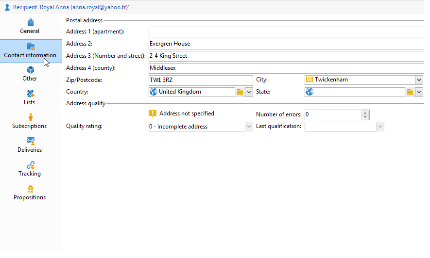

# Een profiel bewerken{#editing-a-profile}

Klik op de naam van een profiel in de lijst met profielen om informatie over een profiel weer te geven.

De profieldetails komen omhoog in een nieuw lusje.

De gegevens over profielen worden gegroepeerd in tabbladen.

De tabbladen en hun inhoud zijn afhankelijk van uw configuratie en geïnstalleerde pakketten.

>[!CAUTION]
>
>Het XML-schema en het formulier dat betrekking heeft op de velden in de profielentabel, zijn toegankelijk via het knooppunt **[!UICONTROL Administration > Configuration > Data schemas]** van de Adobe Campaign-structuur. Alleen deskundige gebruikers kunnen wijzigingen aanbrengen in deze schema&#39;s.
>
>Zie [deze pagina](../../configuration/using/about-schema-edition.md) voor meer informatie.

## Algemeen tabblad {#general-tab}

Dit scherm bevat alle algemene gegevens over het geselecteerde profiel. Het bevat met name de achternaam, voornaam, e-mailadres, e-mailontvangstnotatie, enz. Het ziet er zo uit:

>[!NOTE]
>
>Wanneer de optie **[!UICONTROL No longer contact (by any channel)]** is geselecteerd, betekent dit dat het profiel op lijst van afgewezen personen staat, d.w.z. dat in het profiel de wens is geuit dat geen contact wordt opgenomen (bijvoorbeeld door op een koppeling voor niet-abonnementen in een nieuwsbrief te klikken). Deze zullen niet meer het doelwit zijn van leveringen via welke kanalen dan ook (e-mail, direct mail, enz.). Raadpleeg [deze pagina](../../delivery/using/understanding-quarantine-management.md) voor meer informatie.

## Tabblad Contactgegevens {#contact-information-tab}

Dit scherm bevat het directe-mailadres van het geselecteerde profiel. Het ziet er zo uit:

Dit scherm toont de kwaliteitsindex van het adres, evenals hoeveel fouten het adres bevat. Deze informatie wordt gebruikt direct door de postdrager die op het aantal fouten wordt gebaseerd die tijdens vorige leveringen worden gevonden, en is niet manueel wijzigbaar.

## Ander tabblad {#other-tab}

Dit scherm bevat door de gebruiker gedefinieerde velden die op basis van vereisten kunnen worden aangepast. U kunt ook de namen van de velden wijzigen en de indeling ervan definiëren via **[!UICONTROL Field properties...]**, zoals hieronder wordt weergegeven:

>[!NOTE]
>
>Raadpleeg [deze pagina](../../configuration/using/new-field-wizard.md) voor meer informatie over veldeigenschappen en het toevoegen van velden.

## Lijsten, tabblad {#lists-tab}

In dit scherm worden de groep(en) weergegeven waartoe het geselecteerde profiel behoort. Klik op **[!UICONTROL Add]** om het profiel in te schrijven op een lijst. Klik op **[!UICONTROL Detail]** om de beschrijving en de lijst met profielen in de geselecteerde lijst weer te geven.

Raadpleeg [Lijsten maken en beheren](../../platform/using/creating-and-managing-lists.md) voor meer informatie.

## Tabblad Abonnementen {#subscriptions-tab}

Dit scherm bevat de informatiediensten waarop het profiel heeft geabonneerd.

Met de knop **[!UICONTROL Detail]** worden de eigenschappen van het geselecteerde abonnement weergegeven. De **[!UICONTROL Add]** knoop wordt gebruikt om een nieuw abonnement manueel toe te voegen.

Raadpleeg [deze pagina](../../delivery/using/managing-subscriptions.md) voor meer informatie.

## Tabblad Aflevering {#deliveries-tab}

In dit scherm worden de leveringslogboeken voor het geselecteerde profiel weergegeven. U kunt de labels, datums en status van de aan het profiel geadresseerde leveringsacties ook via alle kanalen weergeven.

## Tabblad {#tracking-tab} bijhouden

In dit scherm kunt u de trackinglogboeken voor het geselecteerde profiel weergeven. Deze informatie wordt gebruikt om profielgedrag na leveringen te volgen.

Dit tabblad geeft het cumulatieve totaal weer van alle URL&#39;s die in leveringen worden bijgehouden.

De lijst is configureerbaar, en bevat gewoonlijk: klikte URL, datum en tijd van klik, en het document dat URL bevatte.

>[!NOTE]
>
>Raadpleeg [deze pagina](../../delivery/using/delivery-dashboard.md) voor meer informatie over trackingfunctionaliteit.

