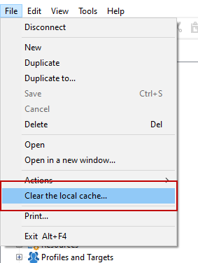

# Veelgestelde vragen over campagneinstellingen {#settings-faq}

Leer belangrijke configuraties om uw instantie van de Campagne aan uw behoeften te plaatsen.

## Kan ik de taal van de interface van de Campagne veranderen? {#can-i-change-the-language-of-campaign-interface-}

Campagnetaal wordt geselecteerd wanneer u de instantie maakt. U kunt deze naderhand niet wijzigen. For more on this, refer to [this section](../../installation/using/creating-an-instance-and-logging-on.md).

De gebruikersinterface van Adobe Campagne is beschikbaar in vier talen: Engels, Frans, Duits en Japans. De clientconsole en de server moeten in dezelfde taal zijn ingesteld. Elke Campagne-instantie kan slechts in één taal worden uitgevoerd.

Voor het Engels, wanneer het installeren van Campaign, kunt u of Engels van de V.S. of Engels van het VK selecteren: de datumnotaties en de tijdnotaties verschillen. For more on these differences refer to [this section](../../platform/using/adobe-campaign-workspace.md#date-and-time).

## Kan ik Campaign Classic met andere Adobe-oplossingen gebruiken? {#can-i-use-campaign-classic-with-other-adobe-solutions-}

U kunt de leveringsfuncties en de geavanceerde functies voor campagnebeheer van Adobe Campaign combineren met een reeks oplossingen die u helpen uw gebruikerservaring aan te passen.

Klik hier om te leren [hoe u met andere Adobe-oplossingen](../../integrations/using/about-campaign-integrations.md) werkt en [hoe u IMS instelt in Campagne](../../integrations/using/about-adobe-id.md).

## Hoe kan ik het volgen mogelijkheden op mijn instantie van de Campagne plaatsen? {#how-can-i-set-up-tracking-capabilities-on-my-campaign-instance-}

Als deskundige gebruiker, kunt u het volgen mogelijkheden op uw instantie van de Campagne vormen.

[Klik hier voor meer](../../installation/using/deploying-an-instance.md#tracking-configuration)informatie.

## Hoe te om e-mailleverbaarheid te vormen? {#how-to-configure-email-deliverability-}

Naast de gids [over de](https://docs.adobe.com/content/help/en/campaign-classic/using/sending-messages/deliverability-management/about-deliverability.html)draagbaarheid waarmee u aan de slag gaat, leest u de sectie over de configuratie van de e-mailleverbaarheid voor meer informatie over de manier waarop u uw exemplaar kunt configureren om de capaciteit voor het leveren van campagnes te maximaliseren.

[Klik hier voor meer](../../installation/using/email-deliverability.md)informatie.

## Hoe kan ik inhoudsgoedkeuring implementeren? {#how-can-i-implement-content-approval-}

Met de campagne kunt u goedkeuringsprocessen instellen voor de belangrijkste stappen van de marketingcampagne, in de modus Samenwerken. Voor elke campagne kunt u het leveringsdoel, de inhoud en de kosten goedkeuren. De Adobe Campagnebeheerders die voor goedkeuring verantwoordelijk zijn kunnen per e-mail op de hoogte worden gesteld en kunnen goedkeuring van de console of via een verbinding van het Web goedkeuren of verwerpen.

[Klik hier om meer](../../campaign/using/marketing-campaign-approval.md#checking-and-approving-deliveries) te leren en stappen te ontdekken om uw goedkeuring van de leveringsinhoud in Campagne uit te voeren.

## Hoe kan ik tot gegevens toegang hebben die in een extern gegevensbestand worden opgeslagen? {#how-can-i-access-data-stored-in-an-external-database-}

De Campagne van Adobe verstrekt de Federated optie van de Toegang van Gegevens (FDA) om informatie te verwerken die in één of meerdere externe gegevensbestanden wordt opgeslagen: u hebt toegang tot externe gegevens zonder de structuur van Adobe Campagne-gegevens te wijzigen.

[Klik hier voor meer](../../platform/using/connecting-to-database.md)informatie.

## Met welke externe databases kan ik een campagne verbinden? {#which-external-databases-can-i-connect-campaign-to-}

Externe database die compatibel is met Campagne via FDA (Federated Data Access) wordt vermeld in de [compatibiliteitsmatrix](https://helpx.adobe.com/campaign/kb/compatibility-matrix.html).

## Kan Adobe Campagne integreren met LDAP? {#can-adobe-campaign-integrate-with-ldap-}

Als klant op locatie/hybride klant kunt u Campagne Classic integreren met uw LDAP-directory.

[Klik hier voor meer informatie](../../installation/using/connecting-through-ldap.md).

## Hoe kan ik schakelaars van opstellingsCRM in Campaign? {#how-can-i-set-up-crm-connectors-in-campaign-}

Adobe Campaign biedt verschillende CRM-connectors waarmee u uw Adobe Campagne-platform kunt koppelen aan systemen van derden. Deze schakelaars van CRM laten u toe om contacten, rekeningen, aankopen, enz. te synchroniseren. Ze zorgen ervoor dat uw toepassing eenvoudig kan worden geïntegreerd met verschillende externe en zakelijke toepassingen.

Deze connectors maken snelle en eenvoudige gegevensintegratie mogelijk: De Campagne van Adobe verstrekt een specifieke tovenaar voor het verzamelen en het selecteren van uit de lijsten beschikbaar in CRM. Dit garandeert tweerichtingssynchronisatie om ervoor te zorgen dat de gegevens altijd up-to-date zijn in alle systemen.

Lees uit [Configure CRM schakelaars](../../platform/using/crm-connectors.md) om te leren hoe te om uw hulpmiddel van CRM met de Campagne van Adobe te synchroniseren. Bekijk deze gebruiksvideo over de integratie [van](https://helpx.adobe.com/campaign/kt/acc/using/acc-integrate-dynamics365-with-acc-feature-video-set-up.html)Adobe Campaign en Microsoft Dynamics 365.

## Hoe te om Zacht Geheime voorgeheugen Duidelijk uit te voeren wanneer de kwesties machine-specifiek of gebruiker-specifiek zijn? {#perform-soft-cache-clear}

Als u problemen hebt met bijvoorbeeld de nieuwe logo&#39;s die correct worden gereflecteerd en die de gegevens kunnen exporteren die specifiek zijn voor de computer of voor de gebruiker, moet u mogelijk een zachte cache wissen met Windows (Windows 7, Windows XP, Windows 10).

Nadat u zich hebt aangemeld, gaat u naar **[!UICONTROL File]** > **[!UICONTROL Clear the local cache]**. Meld u vervolgens af en meld u weer aan.

Als dit nog steeds niet helpt, probeert u de Harde cache te wissen door de onderstaande stappen uit te voeren.

## Hoe te om het Geheime voorgeheugen Duidelijk uit te voeren wanneer de kwesties machine-specifiek of gebruiker-specifiek zijn? {#perform-hard-cache-clear}

Als u problemen hebt, zoals de nieuwe logo&#39;s die correct worden gereflecteerd, en de gegevens die machinespecifiek/gebruikerspecifiek zijn met succes kunt exporteren, moet u mogelijk een Hard cachegeheugen wissen met Windows (Windows 7, Windows XP, Windows 10).

1. Kies in de clientconsole **[!UICONTROL File]** > **[!UICONTROL Clear the local cache]**.

1. Logout en close the client console (rich client).

1. Ga naar de volgende locaties op basis van uw versie van het besturingssysteem:

   * Windows 7: C:\Users\&lt; Gebruikersnaam > \AppData\Roaming\Neolane\NL_5\
   * Windows XP: C:\Documents and Settings\&lt; Gebruikersnaam >\Application Data\Neolane\NL_5
   Hier ziet u vele xml dossiers genoemd nlclient-config-&lt; alfanumerieke waarde >.xml.

1. Verwijder deze XML-bestanden en de bijbehorende mappen.

   >[!CAUTION]
   >
   >Verwijder het bestand nlclient_cnx.xml niet.

1. Meld u aan bij de clientconsole.