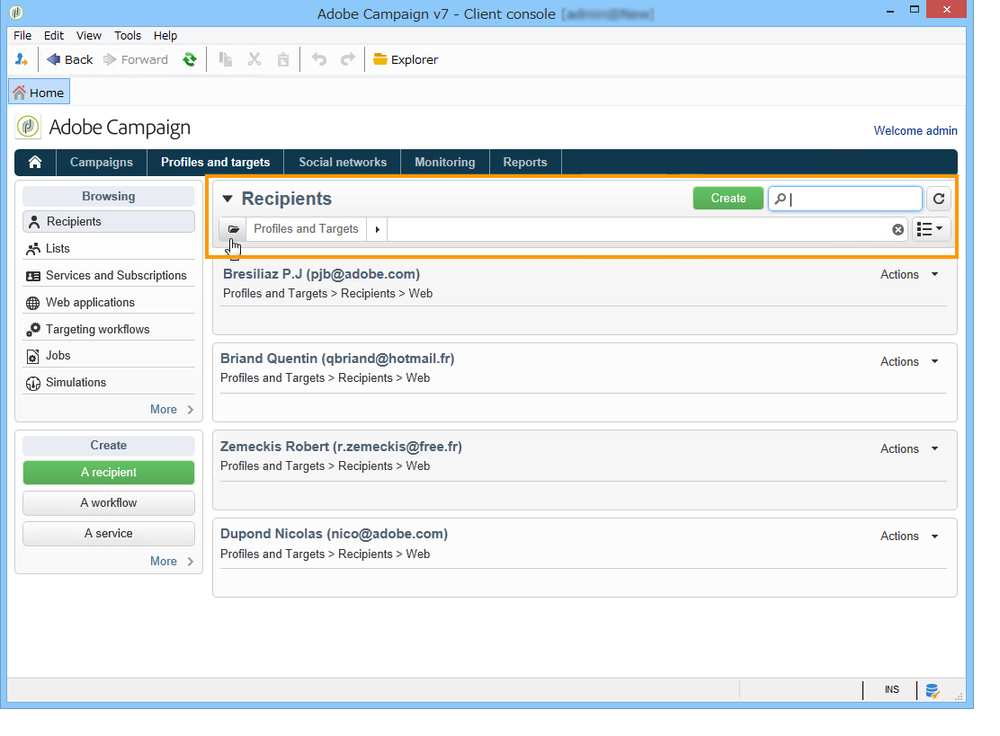
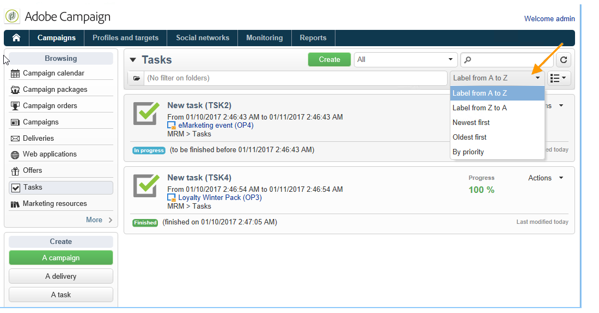

# Filteropties{#filtering-options}

## Filteren {#about-filtering}

Standaard geeft Adobe Campaign alle gegevens weer in de database waarvoor de betrokken operator leestrechten heeft.

Deze gegevens kunnen worden gefilterd via de opties in de bovenste sectie van het browservenster.

Er zijn verschillende manieren om de gegevens te filteren die moeten worden weergegeven. Indien nodig kunnen deze samen worden gebruikt:

* Filter op mappen, raadpleeg [Filteren op map](#filter-by-folder).
* Filter op status, verwijs naar [Filter op status](#filter-by-status),
* Gegevenssortering, verwijs naar [Volgorde door](#order-by),
* Zoeken, raadpleegt u [Snel zoeken](#quick-search).

## Filteren op map {#filter-by-folder}

Klik op het **[!UICONTROL Folder]** pictogram om de map met de gegevens te selecteren die u wilt weergeven.

Alleen de profielen in de map worden weergegeven:

Gebruik het kruisje rechts van het veld voor mapselectie om terug te keren naar de standaardweergavemodus.

## Filteren op status {#filter-by-status}

Afhankelijk van het type informatie dat wordt weergegeven, kunt u een filter toepassen op status of op status. Voor leveringen kunt u er bijvoorbeeld voor kiezen om alleen voltooide leveringen weer te geven, zoals hieronder wordt weergegeven:

## Volgorde van {#order-by}

U kunt de sorteervolgorde van de gegevens op pagina&#39;s selecteren via de vervolgkeuzelijst rechts van het filterveld &#39;per map&#39;. De inhoud van dit veld is afhankelijk van het type gegevens op de pagina.

U kunt taken bijvoorbeeld sorteren op prioriteit, aanmaakdatum of alfabetische volgorde.

## Snel zoeken {#quick-search}

Met het zoekveld hebt u snel toegang tot het gewenste item: Voer de tekens in die zijn opgenomen in het label of de interne naam van het item dat u wilt weergeven, en bevestig vervolgens dat u een automatisch filter op de gegevens op de pagina wilt toepassen.

Als u alle items opnieuw wilt weergeven, klikt u op het kruisje om de inhoud van het zoekveld te verwijderen.
