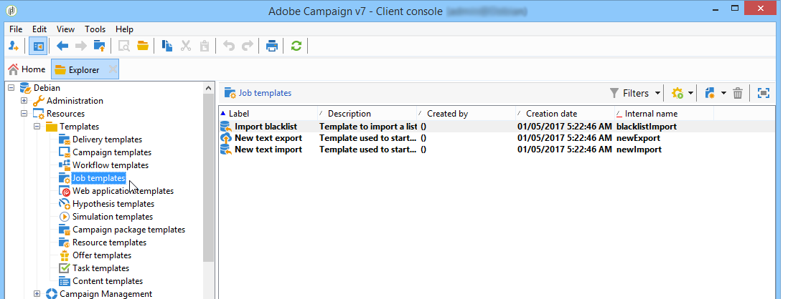
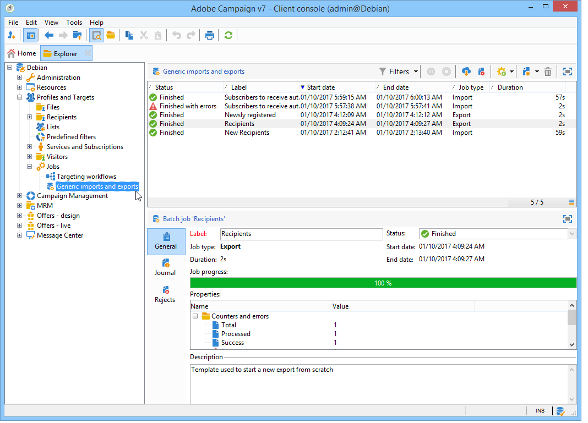
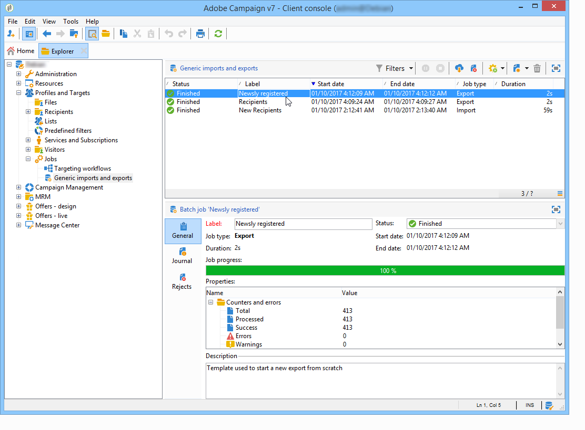

# Algemene invoer en uitvoer{#generic-imports-and-exports}

De Campagne van Adobe biedt een module van de gegevensuitvoer die het gemakkelijk maakt om een lijst van klanten of vooruitzichten (bijvoorbeeld, na een het richten verrichting) te halen die dan deel van een doelbevolking zullen worden.

Adobe Campaign beschikt ook over een importmodule waarmee u uw database gegevens uit externe bestanden kunt verschaffen.

>[!NOTE]
>
>De uitvoer en de invoer worden gevormd in specifieke malplaatjes die door werkschema&#39;s via de **[!UICONTROL Import]** en **[!UICONTROL Export]** activiteiten worden uitgevoerd. Ze kunnen automatisch volgens een schema worden herhaald, bijvoorbeeld om de gegevensuitwisseling tussen verschillende informatiesystemen te automatiseren. Indien nodig, kunt u een occasionele invoer of uitvoer via de **[!UICONTROL Profiles and Targets > Jobs > Generic imports and exports]** knoop van de boom van de Campagne van Adobe tot stand brengen.

U kunt:

* Maak een import- of exportsjabloon en configureer deze (zie hieronder).
* Een import- of exportbewerking maken: Raadpleeg Gegevens [exporteren](../../platform/using/exporting-data.md) of Gegevens importeren.
* Start het importeren of exporteren en controleer of het wordt uitgevoerd. zie [Uitvoering volgen](#execution-tracking).

>[!CAUTION]
>
>Gegevensimport in campagne moet via workflows worden uitgevoerd om de consistentie van gegevens te waarborgen en de efficiëntie te verbeteren. Raadpleeg voor meer informatie de secties [Gegevens](../../workflow/using/importing-data.md)importeren, Beste werkwijzen  importeren en Sjabloonvoorbeeld  importeren.

## Een taaksjabloon maken {#creating-a-job-template}

Importeren- en exportsjablonen worden opgeslagen in de **[!UICONTROL Resources > Templates > Job templates]** directory van de Adobe Campagne-structuur.

Standaard staan er drie importsjablonen en één exportsjabloon in deze map. Ze mogen niet worden gewijzigd. U kunt ze dupliceren om uw eigen sjablonen te maken of een nieuwe sjabloon maken via het menu **[!UICONTROL New > Import template]** / **[!UICONTROL Export template]** .

De procedure voor het creëren van een procesmalplaatje wordt voorgesteld in de tovenaar [van de](../../platform/using/exporting-data.md#export-wizard) Uitvoer en de tovenaar [van de](../../platform/using/importing-data.md#import-wizard)Invoer.

>[!NOTE]
>
>De native sjabloon **[!UICONTROL Import blacklist]** is al geconfigureerd voor het importeren van een lijst met e-mailadressen die op de zwarte lijst staan.
> 
>Met de sjablonen **[!UICONTROL New text import]** en **[!UICONTROL New text export]** sjablonen kunt u een geheel nieuwe import of export configureren.

## Nieuwe import/export maken {#creating-a-new-import-export}

Nadat de sjabloon is geconfigureerd, kunnen import- en exportbewerkingen in verschillende contexten worden gestart in Adobe Campaign.

Met al deze opties opent u de wizard [Importeren](../../platform/using/importing-data.md) of [Exporteren](../../platform/using/exporting-data.md#export-wizard) .

* Klik in het **[!UICONTROL Profiles and targets]** gedeelte van de Adobe Campagne-werkruimte op de **[!UICONTROL Jobs]** koppeling: dit brengt u naar de lijst van bestaande in - en uitvoer .

   Klik op de **[!UICONTROL Create]** knop en selecteer het type taak dat u wilt uitvoeren.

   

* U kunt ook de import en export starten vanuit het gedeelte Toezicht van de werkruimte: met twee speciale koppelingen kunt u het importeren of exporteren rechtstreeks starten.

   

* U kunt importeren en exporteren ook vanuit de Adobe Campaign Explorer.

   Als u gegevens wilt exporteren/importeren, klikt u op het **[!UICONTROL Profiles and Targets > Jobs > Generic imports and exports]** knooppunt, vervolgens op het **[!UICONTROL New]** pictogram en selecteert u **[!UICONTROL Export]** of **[!UICONTROL Import]**. Hiermee opent u de juiste wizard.

   

## Uitvoering bijhouden {#execution-tracking}

U kunt het volgen van de uitvoering in de hogere sectie van deze redacteur bekijken. U kunt de wizard Exporteren sluiten en de uitvoering van de taak weergeven via de lijst met import-/exporttaken.

* Op het **[!UICONTROL Log]** tabblad kunt u logberichten over uitvoering bekijken.
* Het **[!UICONTROL Rejects]** tabblad bevat de geweigerde records. Zie [Gedrag in geval van een fout](../../platform/using/importing-data.md#behavior-in-the-event-of-an-error).

>[!NOTE]
>
>De status van de import-/exporttaak wordt weergegeven in de [taakstatus](../../platform/using/importing-data.md#job-statuses).

