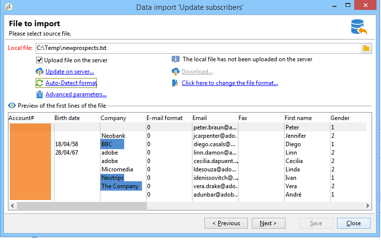

# Voorbeelden van algemene importactiviteiten {#import-operations-samples}

## Importeren uit een lijst met ontvangers {#example--import-from-a-list-of-recipients}

Voer de volgende stappen uit om een lijst met ontvangers te maken en op te geven op basis van het overzicht van lijsten:

1. De lijst maken

   * Klik op de knop **[!UICONTROL Lists]** in de **[!UICONTROL Profiles and targets]** menu van de startpagina van Adobe Campaign.
   * Klik op de knop **[!UICONTROL Create]** en vervolgens de **[!UICONTROL Import a list]** knop.

1. Het te importeren bestand selecteren

   Klik op de map rechts van het dialoogvenster **[!UICONTROL Local file]** en selecteert u het bestand dat de lijst bevat die u wilt importeren.

   

1. Lijstnaam en -opslag

   Voer de naam van de lijst in en selecteer de map waarin deze moet worden opgeslagen.

   

1. Het importeren starten

   Klikken **[!UICONTROL Next]** en vervolgens **[!UICONTROL Start]** om de lijst te importeren.

   

## Nieuwe records uit een tekstbestand importeren {#example--import-new-records-from-a-text-file-}

Voer de volgende stappen uit om nieuwe, in een tekstbestand opgeslagen ontvangerprofielen te importeren in de Adobe Campaign-database:

1. Een sjabloon kiezen

   * Klik op de startpagina van Adobe Campaign op de knop **[!UICONTROL Profiles and targets]** koppeling, dan **[!UICONTROL Jobs]**. Klik boven de lijst met taken op **[!UICONTROL New import]**.
   * Houd de **[!UICONTROL New text import]** sjabloon standaard geselecteerd.
   * Wijzig het label en de beschrijving.
   * Selecteer **[!UICONTROL Simple import]**.
   * De standaardtaakmap behouden.
   * Klikken **[!UICONTROL Advanced parameters]** en selecteert u de **[!UICONTROL Tracking mode]** om de details van uw import tijdens de uitvoering weer te geven.

1. Het te importeren bestand selecteren

   Klik op de map rechts van het dialoogvenster **[!UICONTROL Local file]** en selecteer het bestand dat u wilt importeren.

   

1. Velden koppelen

   Klik op de knop **[!UICONTROL Guess the destination fields]** pictogram om de bron- en doelschema&#39;s automatisch toe te wijzen. Controleer de informatie in dit venster voordat u op **[!UICONTROL Next]**.

   

1. Afstemming

   * Ga naar de **Ontvangers (nms:ontvanger)** tabel.
   * Selecteer de **[!UICONTROL Insertion]** en laat de standaardwaarden in de andere velden staan.

     

1. Ontvangers importeren

   * Geef indien nodig een map op waarin de records moeten worden geïmporteerd.

     

1. Het importeren starten

   * Klik op **[!UICONTROL Start]**.

     In het centrale gedeelte van de editor kunt u controleren of de importbewerking is voltooid en het aantal verwerkte records weergeven.

     

     De **[!UICONTROL Tracking]** in de modus kunt u de details van de import bijhouden voor elke record in het bronbestand. Om dit te doen, van de homepage klik **[!UICONTROL Profiles and Targets]** dan **[!UICONTROL Processes]**, selecteert u de desbetreffende importbewerking en zoekt u de **[!UICONTROL General]**, **[!UICONTROL Journal]** en **[!UICONTROL Rejects]** tabs.

      * Voortgang van importeren controleren

        

      * Procesweergave voor elke record

        

## Ontvangers bijwerken en invoegen {#example--update-and-insert-recipients}

We willen bestaande records in de database bijwerken en nieuwe records maken vanuit een tekstbestand. Hier volgt een voorbeeld van de procedure:

1. Een sjabloon kiezen

   Herhaal de stappen die in voorbeeld 2 hierboven worden beschreven.

1. Te importeren bestand

   Selecteer het bestand dat u wilt importeren.

   In ons voorbeeld toont het overzicht van de eerste regels van het bestand aan dat het bestand updates bevat voor drie records en dat er een record wordt gemaakt.

   

1. Velden koppelen

   Pas de procedure toe in voorbeeld 2 hierboven.

1. Afstemming

   * Behouden **[!UICONTROL Update or insert]** standaard geselecteerd.
   * De optie behouden **[!UICONTROL Management of duplicates]** in **[!UICONTROL Update]** -modus, zodat bestaande records in de database worden gewijzigd met gegevens uit het tekstbestand.
   * Selecteer de velden **[!UICONTROL Birth date]**, **[!UICONTROL Name]** en **[!UICONTROL Company]** en een verzoeningssleutel aan hen toewijzen.

     

1. Het importeren starten

   * Klik op **[!UICONTROL Start]**.

     In het venster Tekstspatiëring kunt u controleren of het importeren is gelukt en het aantal verwerkte records weergeven.

     

   * Kijk in de ontvankelijke lijst om te controleren dat de verslagen door deze verrichting zijn gewijzigd.

     

## De waarden uitbreiden met die van een extern bestand {#example--enrich-the-values-with-those-of-an-external-file}

Wij willen bepaalde gebieden in een gegevensbestandlijst van een tekstdossier wijzigen, die aan de waarden in het gegevensbestand voorrang geven.

In dit voorbeeld ziet u dat bepaalde velden in het tekstbestand een waarde hebben, terwijl de bijbehorende velden in de database leeg zijn. Andere velden bevatten een andere waarde dan de waarde in de database.

* Inhoud van het te importeren tekstbestand.

  

* Databasestatus voor importeren

  

Voer de volgende stappen uit:

1. Een sjabloon kiezen

   Pas de procedure toe in voorbeeld 2 hierboven.

1. Te importeren bestand

   Selecteer het bestand dat u wilt importeren.

1. Velden koppelen

   Pas de procedure toe in voorbeeld 2 hierboven.

   In de voorvertoning van de eerste regels van het bestand ziet u dat het bestand updates voor bepaalde records bevat.

1. Afstemming

   * Ga naar de tabel en selecteer de **[!UICONTROL Update]** -bewerking.
   * Selecteer de optie **[!UICONTROL Reject entity]** voor de **[!UICONTROL Management of doubles]** veld.
   * De optie behouden **[!UICONTROL Management of duplicates]** in **[!UICONTROL Update]** -modus, zodat bestaande records in de database worden gewijzigd met gegevens uit het tekstbestand.
   * Plaats de cursor op de **[!UICONTROL Last name (@lastName)]** en selecteer de **[!UICONTROL Update only if destination is empty]** -optie.
   * Deze bewerking herhalen voor de **[!UICONTROL Company (@company)]** knooppunt.
   * Een afstemmingssleutel toewijzen aan de velden **[!UICONTROL Birth date]**, **[!UICONTROL Email]** en **[!UICONTROL First name]**.

     

1. Het importeren starten

   Klik op **[!UICONTROL Start]**.

   Kijk in de lijst van ontvangers om te controleren dat de verslagen door de invoer zijn gewijzigd.

   

   Alleen lege waarden zijn vervangen door waarden uit het tekstbestand, maar de bestaande waarde in de database is niet overschreven door de waarde uit het importbestand.

## De waarden in een extern bestand bijwerken en verrijken {#example--update-and-enrich-the-values-from-those-in-an-external-file}

We willen bepaalde velden in een databasetabel wijzigen vanuit een tekstbestand, waarbij prioriteit wordt gegeven aan de waarden in het tekstbestand.

In dit voorbeeld ziet u dat bepaalde velden in het tekstbestand een lege waarde hebben, terwijl de bijbehorende velden in de database niet leeg zijn. Andere velden bevatten een andere waarde dan de velden in de database.

* Inhoud van het te importeren tekstbestand.

  

* Databasestatus voor importeren

  

1. Een sjabloon kiezen

   Pas de procedure toe in voorbeeld 2 hierboven.

1. Te importeren bestand

   Selecteer het bestand dat u wilt importeren.

   In de voorvertoning van de eerste regels van het bestand ziet u dat het bestand lege velden en updates voor bepaalde records bevat.

1. Velden koppelen

   Pas de procedure toe in voorbeeld 2 hierboven.

1. Afstemming

   * Ga naar de tabel en selecteer **[!UICONTROL Update]**.
   * Selecteer de optie **[!UICONTROL Reject entity]** voor de **[!UICONTROL Management of doubles]** veld.
   * De optie behouden **[!UICONTROL Management of duplicates]** in **[!UICONTROL Update]** voor bestaande records in de database te wijzigen met gegevens uit het tekstbestand.
   * Plaats de cursor op de **[!UICONTROL Account number (@account)]** en selecteer de optie **[!UICONTROL Take empty values into account]**.
   * Selecteer de velden **[!UICONTROL Birth date]**, **[!UICONTROL Email]** en **[!UICONTROL First name]** en een verzoeningssleutel aan hen toewijzen.

     

1. Het importeren starten

   * Klik op **[!UICONTROL Start]**.
   * Kijk in de ontvankelijke lijst om te controleren dat de verslagen door de verrichting zijn gewijzigd.

     

     De waarden van het tekstbestand die leeg waren, hebben de waarden in de database overschreven. De bestaande waarden in de database zijn bijgewerkt met die in het importbestand overeenkomstig de **[!UICONTROL Update]** geselecteerd voor duplicaten in stap 4.
