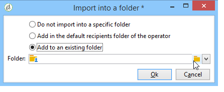
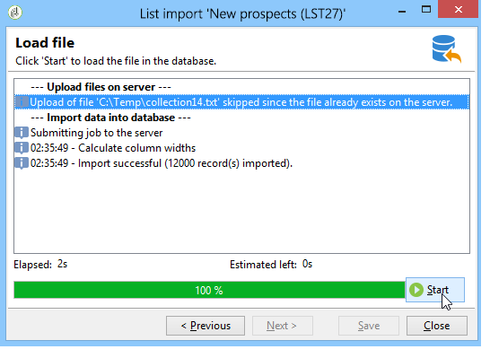
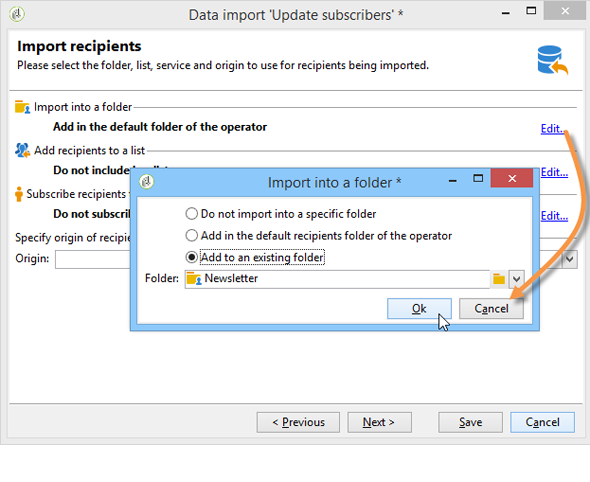
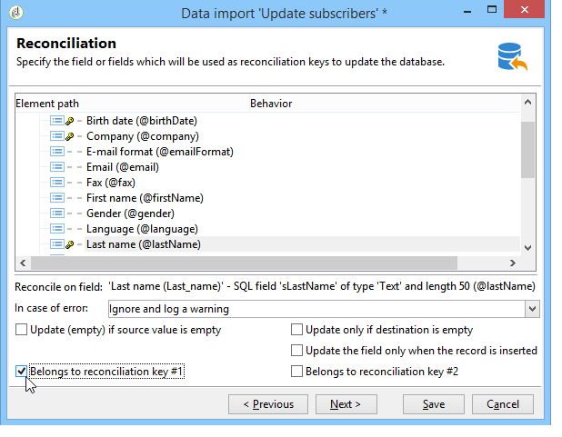
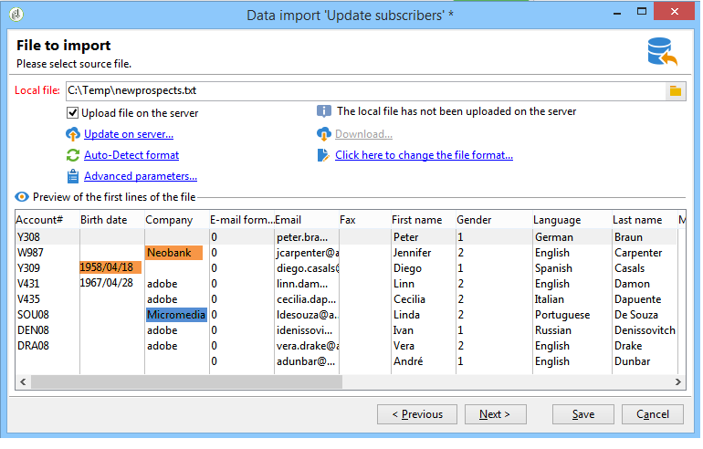
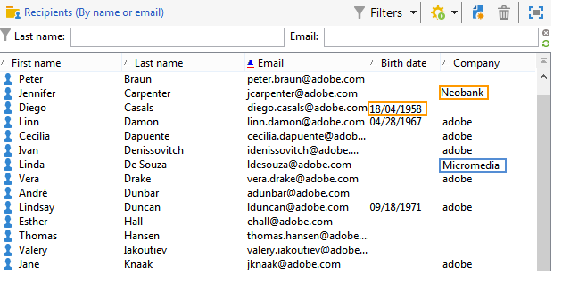

# Gegevens importeren{#importing-data}

Met Adobe Campaign kunt u gegevens uit een of meer bestanden in tekst-, CSV-, TAB- of XML-indeling importeren naar de database. Deze bestanden zijn gekoppeld aan een tabel (hoofd of gekoppeld) en elk veld van het bronbestand of de bronbestanden is gekoppeld aan een veld van de database. De importconfiguratie kan worden opgeslagen voor hergebruik, zodat u importtaken kunt plannen waarmee uw replicatiebewerkingen worden geautomatiseerd.

>[!NOTE]
>
>U kunt gegevens importeren zonder deze toe te wijzen aan de databasegegevens met behulp van de **[!UICONTROL Import a list]** functie.
> 
>De gegevens kunnen vervolgens uitsluitend in workflows via het **[!UICONTROL Read list]** object worden gebruikt. Raadpleeg [deze pagina](../../workflow/using/read-list.md)voor meer informatie.
>
>Bekijk de video [Profielen](https://docs.adobe.com/content/help/en/campaign-learn/campaign-classic-tutorials/getting-started/importing-profiles.html) importeren voor meer informatie.

## Structuur van de te importeren gegevens {#structure-of-the-data-to-import}

In het bronbestand valt elke regel samen met een record. De gegevens in records worden gescheiden door scheidingstekens (spatie, tab, teken enz.). Dit betekent dat de gegevens in de vorm van kolommen worden teruggewonnen, en elke kolom wordt geassocieerd met een gebied van het gegevensbestand.

## Wizard Importeren {#import-wizard}

Met de wizard Importeren kunt u het importeren configureren, de opties ervan definiëren (zoals gegevenstransformatie) en de uitvoering starten. Het is een reeks schermen waarvan de inhoud afhankelijk is van het type import (enkelvoudig of meervoudig) en de rechten van de operator.

>[!NOTE]
>
>Als u een server van het Web IIS gebruikt, kan een configuratie noodzakelijk zijn om het uploaden van grote dossiers (>28 MB) toe te staan.
>
>Zie [deze sectie](../../installation/using/integration-into-a-web-server-for-windows.md#changing-the-upload-file-size-limit)voor meer informatie.

### Stap 1 - De importsjabloon kiezen {#step-1---choosing-the-import-template}

Wanneer u de wizard Importeren start, moet u eerst een sjabloon selecteren. Als voorbeeld, om de invoer van ontvangers te vormen die een nieuwsbrief ontvingen, volg de stappen hieronder:

1. Selecteer de **[!UICONTROL Profiles and Targets > Job > Generic imports and exports]** map.
1. Klik op **Nieuw** en vervolgens op **Importeren** om de importsjabloon te maken.

   

1. Klik op de pijl rechts van het **[!UICONTROL Import template]** veld om de sjabloon te selecteren of klik **[!UICONTROL Select link]** om door de structuur te bladeren.

   De native sjabloon is **[!UICONTROL New text import]**. Deze sjabloon moet niet worden gewijzigd, maar u kunt het dupliceren om een nieuwe sjabloon te configureren, afhankelijk van uw vereisten. Importeersjablonen worden standaard in het **[!UICONTROL Profiles and targets > Templates > Job templates]** knooppunt opgeslagen.

1. Voer in het **[!UICONTROL Label]** veld een naam in voor deze importbewerking. U kunt een beschrijving toevoegen.
1. Selecteer het type import in het desbetreffende veld. Er zijn twee mogelijke typen importbewerkingen: als u slechts één bestand wilt importeren en meerdere bestanden in één uitvoering wilt importeren. **[!UICONTROL Simple import]** **[!UICONTROL Multiple import]**

   Selecteer bij een meervoudige importbewerking **[!UICONTROL Multiple import]** de optie in de **[!UICONTROL Import type]** vervolgkeuzelijst in het eerste scherm van de wizard Importeren.

   

1. Geef de velden op die u wilt importeren door op **[!UICONTROL Add]** te klikken.

   

   Telkens wanneer een bestand wordt toegevoegd, wordt het scherm van de **[!UICONTROL File to import]** wizard weergegeven. Zie sectie [Stap 2 - Brondossierselectie](#step-2---source-file-selection) en volg de stappen in de tovenaar om de de invoeropties zoals voor eenvoudige invoer te bepalen.

   >[!NOTE]
   >
   >Meerdere importen moeten alleen aan specifieke behoeften voldoen en worden niet aanbevolen.

#### Geavanceerde parameters {#advanced-parameters}

Met de **[!UICONTROL Advanced parameters]** koppeling hebt u toegang tot de volgende opties:

* **[!UICONTROL General]** tab

   * **[!UICONTROL Stop execution if there are too many rejects]**

      Deze optie is standaard ingeschakeld. U kunt de selectie opheffen als u het importeren wilt blijven uitvoeren, ongeacht het aantal afwijzingen. De uitvoering wordt standaard gestopt wanneer de eerste 100 regels worden geweigerd.

   * **[!UICONTROL Trace mode]**

      Selecteer deze optie om de uitvoering van het importeren voor elke regel bij te houden.

   * **[!UICONTROL Start the job in a detached process]**

      Deze optie is standaard ingeschakeld. Hiermee kunt u de uitvoering van het importeren loskoppelen, zodat dit geen invloed heeft op andere taken in de database.

   * **[!UICONTROL Do not update enumerations]**

      Selecteer deze optie om te voorkomen dat de lijst met opgesomde waarden in de database wordt verrijkt. Zie [Opsommingen](../../platform/using/managing-enumerations.md)beheren.

* **[!UICONTROL Variables]** tab

   U kunt variabelen definiëren die aan de taak zijn gekoppeld en die toegankelijk zijn in de query-editors en berekende velden. Als u een variabele wilt maken, klikt u op de variabele **[!UICONTROL Add]** en gebruikt u deze.

   >[!CAUTION]
   >
   >Het **[!UICONTROL Variables]** lusje is voor slechts werkstroomtype programmeringsgebruik, en zou door deskundige slechts gebruikers moeten worden gevormd.

### Stap 2 - Bronbestandsselectie {#step-2---source-file-selection}

Het bronbestand kan de tekstindeling (txt, csv, tab, vaste kolommen) of xml hebben.

Standaard **[!UICONTROL Upload file on the server]** is deze geselecteerd. Klik op de map rechts van het **[!UICONTROL Local file]** veld om naar de lokale schijf te bladeren en selecteer het bestand dat u wilt importeren. U kunt deze optie deselecteren om het toegangspad en de naam in te voeren van het bestand als dit zich op de server bevindt.

Wanneer het bestand is opgegeven, kunt u de gegevens ervan weergeven in de onderste sectie van het venster door op **[!UICONTROL Auto-detect format]** te klikken. In deze voorvertoning worden de eerste 200 regels van het bronbestand weergegeven.

Gebruik de opties boven deze weergave om het importeren te configureren. De parameters die via deze opties worden gedefinieerd, worden overgebracht naar de voorvertoning. De volgende opties zijn beschikbaar:

* **[!UICONTROL Click here to change the file format...]** Hiermee kunt u de bestandsindeling controleren en de configuratie perfectioneren.
* **[!UICONTROL Update on server...]** Hiermee kunt u het lokale bestand overbrengen naar de server. Deze optie is alleen beschikbaar als **[!UICONTROL Upload file on the server]** is geselecteerd.
* **[!UICONTROL Download]** is alleen beschikbaar als het bestand op de server is geüpload.
* **[!UICONTROL Auto-detect format]** wordt gebruikt om het formaat van de gegevensbron opnieuw te initialiseren. Met deze optie kunt u de oorspronkelijke indelingen opnieuw toepassen op gegevens die zijn opgemaakt via de **[!UICONTROL Click here to change the file format...]** optie.
* Met de **[!UICONTROL Advanced parameters]** koppeling kunt u de brongegevens filteren en toegang krijgen tot geavanceerde opties. Vanuit dit scherm kunt u ervoor kiezen om slechts een deel van het bestand te importeren. U kunt ook een filter definiëren, bijvoorbeeld om alleen gebruikers van het type Prospect of Klant te importeren, op basis van de waarde van de corresponderende regel. Deze opties mogen alleen worden gebruikt door deskundige JavaScript-gebruikers.

#### De bestandsindeling wijzigen {#changing-the-file-format}

Met de **[!UICONTROL Click here to change the file format...]** optie kunt u de gegevens van het bronbestand opmaken, en met name het kolomscheidingsteken en het type gegevens voor elk veld opgeven. Deze configuratie wordt uitgevoerd via het volgende venster:

In deze stap kunt u beschrijven hoe de waarden van de bestandsvelden moeten worden gelezen. In het geval van een datum kunnen de datum- of datum- en tijdgegevens bijvoorbeeld worden gekoppeld aan een notatie (dd/mm/jjjj, mm/dd/jj, enz.). Als de invoergegevens niet overeenkomen met de verwachte indeling, worden deze tijdens het importeren geweigerd.

U kunt het resultaat van de configuratie weergeven in de voorvertoningszone in het onderste gedeelte van het venster.

Klik **[!UICONTROL OK]** om de opmaak op te slaan en klik vervolgens **[!UICONTROL Next]** om de volgende stap weer te geven.

### Stap 3 - Veldtoewijzing {#step-3---field-mapping}

U moet dan het bestemmingsschema selecteren en de gegevens van elke kolom op gebieden in het gegevensbestand in kaart brengen.

* In het **[!UICONTROL Destination schema]** veld kunt u het schema selecteren waarin de gegevens worden geïmporteerd. Deze informatie is verplicht. Klik op het **[!UICONTROL Select link]** pictogram om een van de bestaande schema&#39;s te selecteren. Klik **[!UICONTROL Edit link]** om de inhoud van de geselecteerde tabel weer te geven.
* In de centrale tabel staan alle velden die in het bronbestand zijn gedefinieerd. Selecteer de velden die u wilt importeren om er een doelbestand aan te koppelen. Deze velden kunnen handmatig of automatisch worden toegewezen.

   Als u een veld handmatig wilt toewijzen, klikt u op het selectievakje om het bronveld te selecteren en klikt u op de tweede kolom om de cel te activeren die overeenkomt met het geselecteerde veld. Klik vervolgens op het **[!UICONTROL Edit expression]** pictogram om alle velden van de huidige tabel weer te geven. Selecteer het doelveld en klik **[!UICONTROL OK]** om de toewijzing te valideren.

   Als u de bronvelden en doelvelden automatisch wilt koppelen, klikt u op het **[!UICONTROL Guess the destination fields]** pictogram rechts van de lijst met velden. De voorgestelde velden kunnen indien nodig worden gewijzigd.

   >[!CAUTION]
   >
   >Het resultaat van deze bewerking moet altijd worden gevalideerd voordat u verdergaat met de volgende stap.

* U kunt een transformatie toepassen op de geïmporteerde velden. Klik hiertoe in de cel van de **[!UICONTROL Transformation]** kolom die betrekking heeft op het desbetreffende veld en selecteer de transformatie die u wilt toepassen.

   

   >[!CAUTION]
   >
   >De transformatie wordt toegepast op het moment van importeren. Als beperkingen op het bestemmingsgebied, echter (in het bovenstaande voorbeeld, op het @lastname gebied) zijn bepaald, nemen deze beperkingen prioriteit.

* U kunt berekende velden toevoegen met het juiste pictogram rechts van de centrale tabel. Met berekende velden kunt u complexe transformaties uitvoeren, virtuele kolommen toevoegen of de gegevens van meerdere kolommen samenvoegen. Raadpleeg de volgende secties voor meer informatie over de verschillende mogelijkheden.

#### Berekende velden {#calculated-fields}

Berekende velden zijn nieuwe kolommen die aan het bronbestand worden toegevoegd en uit andere kolommen worden berekend. Berekende velden kunnen vervolgens worden gekoppeld aan velden in de Adobe Campagne-database. Afstemmingen zijn echter niet mogelijk op berekende velden.

Er zijn vier typen berekende velden:

* **[!UICONTROL Fixed string]**: de waarde van het berekende veld is gelijk voor alle regels van het bronbestand. Hiermee kunt u de waarde instellen van een veld met records die zijn ingevoegd of bijgewerkt. U kunt bijvoorbeeld voor alle geïmporteerde records een markering instellen op &quot;ja&quot;.
* **[!UICONTROL String with JavaScript tags]**: de waarde van het berekende veld is een tekenreeks met JavaScript-opdrachten.
* **[!UICONTROL JavaScript expression]**: De waarde van het berekende veld is het resultaat van de evaluatie van een JavaScript-functie. De geretourneerde waarde kan een getal, een datum enzovoort zijn.
* **[!UICONTROL Enumeration]**: de waarde van het veld wordt toegewezen aan de waarde in het bronbestand. De redacteur laat u de bronkolom specificeren en de lijst van opsommingswaarden ingaan, zoals in het volgende voorbeeld:

   

   Het **[!UICONTROL Preview]** lusje laat u het resultaat van de bepaalde configuratie bekijken. Hier is de **[!UICONTROL Subscription]** kolom toegevoegd. De waarde wordt berekend vanuit het veld **Status** .

   

### Stap 4 - Verzoening {#step-4---reconciliation}

Met de afstemmingsstap van de importwizard kunt u de modus definiëren waarmee de gegevens uit het bestand worden afgestemd op de bestaande gegevens in de database en kunt u de prioriteitsregels instellen tussen de bestandsgegevens en de databasegegevens. Het configuratievenster ziet er als volgt uit:

Het centrale gedeelte van het scherm bevat een structuur met de velden en tabellen van de Adobe Campagne-database waarnaar de gegevens worden geïmporteerd.

Er zijn speciale opties beschikbaar voor elk knooppunt (tabel of veld). Wanneer u op het betrokken knooppunt klikt in de lijst, worden de parameters en een korte beschrijving ervan hieronder weergegeven. Het gedrag dat voor elk element wordt bepaald wordt getoond in de overeenkomstige **[!UICONTROL Behavior]** kolom.

#### Soorten bewerkingen {#types-of-operation}

Voor elke tabel waarop de invoer betrekking heeft, moet u het type bewerking definiëren. De volgende bewerkingen zijn beschikbaar voor het hoofdelement van de database:

* **[!UICONTROL Update or insertion]**: werkt het verslag bij als het in het gegevensbestand bestaat, en leidt tot het als niet.
* **[!UICONTROL Insertion]**: voegt records in de database in.
* **[!UICONTROL Update]**: werkt alleen bestaande records bij (negeert andere records).
* **[!UICONTROL Reconciliation only]**: zoekt naar de record in de database, maar voert geen update uit. Hiermee kunt u bijvoorbeeld de map met ontvangers koppelen om te importeren volgens een kolom van het bestand zonder de gegevens in de mappen bij te werken.
* **[!UICONTROL Deletion]**: Hiermee kunt u records in de database vernietigen.

De volgende opties zijn beschikbaar voor elk veld in de tabel waarop de invoer betrekking heeft:

* **[!UICONTROL Update (empty) if source value is empty]**: in het geval van een update verwijdert de waarde in het veld de databasewaarde als het veld leeg is in het bronbestand. Anders wordt het databaseveld bewaard.
* **[!UICONTROL Update only if destination is empty]**: de waarde van het bronbestand overschrijft de waarde in het databaseveld niet, tenzij het databaseveld leeg is. In dat geval wordt de waarde van het bronbestand gebruikt.
* **[!UICONTROL Update the field only when the record is inserted]**: tijdens een update- of invoegbewerking worden alleen nieuwe bronbestandsrecords geïmporteerd.

>[!NOTE]
>
>De definitie van een afstemmingssleutel is altijd **verplicht**, behalve in geval van invoeging zonder deduplicatie.

#### Afstemmingssleutels {#reconciliation-keys}

Er moet ten minste één afstemmingssleutel worden ingevuld om deduplicatie te beheren.

Een afstemmingssleutel is een set velden die wordt gebruikt om een record te identificeren. Als u bijvoorbeeld ontvangers wilt importeren, kan de afstemmingssleutel het rekeningnummer, het veld E-mail of de velden Achternaam, Voornaam, Bedrijf zijn, enzovoort.

In dit geval vergelijkt de importengine de waarden van het bestand met die van de database voor alle velden van de sleutel om te zien of een regel van een bestand overeenkomt met een bestaande ontvanger in de database. Wanneer velden specifiek zijn voor een record, kan een nauwkeurige vergelijking tussen de bron- en de doelgegevens worden uitgevoerd, zodat de integriteit van de gegevens na het importeren wordt gegarandeerd. Voor dezelfde tabel kan een tweede afstemmingssleutel worden ingevuld; wordt gebruikt voor de lijnen waarvan de eerste sleutel leeg is.

Kies geen veld dat tijdens het importeren kan worden gewijzigd. als dit gebeurt , kan de engine aanvullende records maken .

>[!NOTE]
>
>Voor het importeren van ontvangers wordt de id van de geselecteerde map impliciet aan de sleutel toegevoegd.
>
>Afstemming wordt daarom alleen op deze map uitgevoerd (tenzij er geen map is geselecteerd).

#### Deduplicatie {#deduplication}

>[!NOTE]
>
>Een &#39;dubbel&#39; is een item dat twee of meer keren voorkomt in het bestand dat moet worden geïmporteerd.
>
>Een &#39;duplicaat&#39; is een item dat aanwezig is in het bestand dat moet worden geïmporteerd en in de database.

In het **[!UICONTROL Management of doubles]** veld kunt u de deduplicatie van gegevens configureren. Deduplicatie heeft betrekking op records die meerdere keren **in het bronbestand** voorkomen (of bronbestanden in geval van een import van meerdere bestanden), d.w.z. regels waarvoor de velden van de afstemmingssleutel identiek zijn.

* Duplicaat beheer in **[!UICONTROL Update]** modus (de standaardmodus) voert geen deduplicatie uit. De laatste record heeft daarom prioriteit (omdat deze de gegevens van de voorgaande records bijwerkt). Het tellen van duplicaten wordt niet uitgevoerd in deze modus.
* Duplicaat beheer in **[!UICONTROL Ignore]** **[!UICONTROL Reject entity]** wijze of sluit duplicaten van de invoer uit. In dit geval wordt geen record geïmporteerd.
* In de **[!UICONTROL Reject entity]** modus wordt het element niet geïmporteerd en wordt een fout gegenereerd in de importlogboeken.
* In de **[!UICONTROL Ignore]** modus wordt het element niet geïmporteerd, maar wordt geen spoor van de fout bewaard. In deze modus kunt u de prestaties optimaliseren.

>[!CAUTION]
>
>Deduplicatie wordt alleen in het geheugen uitgevoerd. De omvang van een invoer met deduplicatie is daarom beperkt. De limiet is afhankelijk van verschillende parameters (capaciteit van de toepassingsserver, activiteit, aantal velden in de sleutel, enz.). De maximale grootte voor een deduplicatie is ongeveer 1.000.000 regels.

Deduplicatie heeft betrekking op een record die zowel in het bronbestand als in de database aanwezig is. Het betreft bewerkingen met alleen updates (d.w.z. **[!UICONTROL Update and insertion]** of **[!UICONTROL Update]**). Met de **[!UICONTROL Duplicate management]** optie kunt u de record bijwerken of negeren als deze zich in zowel het bronbestand als de database bevindt. De **[!UICONTROL Update or insert based on origin]** optie behoort tot de optionele module en kan niet worden gebruikt in een standaardcontext.

De opties **[!UICONTROL Reject]** en **[!UICONTROL Ignore]** werken zoals hierboven beschreven.

#### Gedrag in geval van een fout {#behavior-in-the-event-of-an-error}

De meeste gegevensoverdrachtsbewerkingen genereren verschillende soorten fouten (incoherente regelindeling, ongeldig e-mailadres, enz.). Alle fouten en waarschuwingen die door de importengine worden gegenereerd, worden opgeslagen en gekoppeld aan het importexemplaar.

De details van deze verwerpingen kunnen via het **[!UICONTROL Rejects]** lusje worden bekeken.

Er zijn twee typen afwijzing (het type wordt weergegeven in de **[!UICONTROL Connector]** kolom):

* Afwijzingen van de tekstconnector hebben betrekking op fouten die optreden tijdens het verwerken van de bestandsregel (berekend veld, gegevensanalyse, enz.). In dit geval wordt bij een fout de hele regel altijd geweigerd.
* Afkeuringen van databaseverbindingen hebben betrekking op fouten die optreden tijdens het afstemmen van gegevens of het schrijven naar de database. In het geval van een import naar meerdere tabellen kan de afwijzing alleen betrekking hebben op een deel van de record (bijvoorbeeld bij het importeren van ontvangers en bijbehorende gebeurtenissen kan een fout het bijwerken van een gebeurtenis voorkomen zonder de ontvanger te negeren).

Op de pagina voor het afstemmen van gegevens kunt u het gewenste veld voor het type foutbeheer per veld en tabel per tabel definiëren.

* **[!UICONTROL Ignore and log a warning]**: alle velden worden geïmporteerd in de database, behalve de velden die een fout hebben gegenereerd.
* **[!UICONTROL Reject parent element]**: de gehele regel van de record wordt geweigerd, niet alleen het veld dat een fout heeft veroorzaakt.
* **[!UICONTROL Reject all elements]**: de importstops en alle elementen van de record worden afgewezen.

   

De structuur in het afstotingsscherm van een importinstantie geeft aan welke velden zijn geweigerd en waar de fouten zijn opgetreden.

U kunt een bestand met deze records genereren via het **[!UICONTROL Export rejects]** pictogram:

### Stap 5 - Extra stap bij het importeren van ontvangers {#step-5---additional-step-when-importing-recipients}

In de volgende stap van de wizard Importeren kunt u de map selecteren of maken waarin gegevens worden geïmporteerd, geïmporteerde ontvangers automatisch toewijzen met een (nieuwe of bestaande) lijst en ontvangers abonneren op een service.

>[!NOTE]
>
>Deze stap wordt alleen weergegeven wanneer u ontvangers importeert en wanneer u de standaardtabel voor ontvangers van Adobe Campagne (**nms:ontvanger**) gebruikt.

* Klik op de **[!UICONTROL Edit]** koppelingen om de map, de lijst of de service te selecteren waaraan u de ontvangers wilt koppelen of zich erop wilt abonneren.

   1. Importeren in een map

      Met de **[!UICONTROL Edit...]** koppeling in de **[!UICONTROL Import into a folder]** sectie kunt u de map selecteren of maken waarin de ontvangers worden geïmporteerd. Als standaard geen partitie is gedefinieerd, worden de gegevens geïmporteerd in de standaardmap van de operator.

      >[!NOTE]
      >
      >De standaardmap voor een operator is de eerste map waarvoor de operator schrijftoegang heeft. Zie Toegangsbeheer voor [mappen](../../platform/using/access-management.md#folder-access-management).

      Als u de importmap wilt selecteren, klikt u op de pijl rechts van het **[!UICONTROL Folder]** veld en selecteert u de desbetreffende map. U kunt het **[!UICONTROL Select link]** pictogram ook gebruiken om de structuur in een nieuw venster weer te geven of een nieuwe map te maken.

      

      Als u een nieuwe map wilt maken, selecteert u het knooppunt waaruit u een map wilt toevoegen en klikt u met de rechtermuisknop. Selecteer **[!UICONTROL Create a new 'Recipients' folder]**.

      

      De map wordt toegevoegd onder het huidige knooppunt. Voer de naam van de nieuwe map in, klik op Enter om te bevestigen en klik op **[!UICONTROL OK]**.

      

   1. Koppelen aan een lijst

      Met de **[!UICONTROL Edit...]** koppeling in de **[!UICONTROL Add recipients to a list]** sectie kunt u een lijst selecteren of maken waarin de ontvangers worden geïmporteerd.

      

      U kunt een nieuwe lijst voor deze ontvangers tot stand brengen door te klikken **[!UICONTROL Select link]**, dan **[!UICONTROL Create]**. Het maken en beheren van lijsten wordt weergegeven in [Lijsten](../../platform/using/creating-and-managing-lists.md)maken en beheren.

      

      U kunt besluiten om de ontvangers aan degenen toe te voegen die reeds in een lijst aanwezig zijn, of de lijst met de nieuwe ontvangers opnieuw te maken. In dit geval worden ontvangers verwijderd en vervangen door de geïmporteerde ontvangers als de lijst al ontvangers bevatte.

   1. Abonneren op een service

      Als u alle geïmporteerde ontvangers wilt abonneren op een informatiedienst, klikt u op de **[!UICONTROL Edit...]** koppeling van de **[!UICONTROL Subscribe recipients to a service]** sectie om de informatiedienst te selecteren of te maken waarop de ontvangers zich moeten abonneren. U kunt de **[!UICONTROL Send a confirmation message]** optie selecteren: De inhoud van dit bericht wordt bepaald in het leveringsmalplaatje verbonden aan de abonnementsdienst.

      

      U kunt een nieuwe dienst voor deze ontvangers tot stand brengen door te klikken **[!UICONTROL Select link]** en dan het **[!UICONTROL Create]** pictogram. Het beheer van de informatiediensten wordt in [dit deel](../../delivery/using/managing-subscriptions.md)gepresenteerd.

* Gebruik het **[!UICONTROL Origin]** veld om informatie over de oorsprong van ontvangers toe te voegen aan hun profielen. Deze informatie is met name nuttig in het kader van een meervoudige import.

Klik **[!UICONTROL Next]** om deze stap te valideren en de volgende stap weer te geven.

### Stap 6 - Het importeren starten {#step-6---launching-the-import}

In de laatste stap van de wizard kunt u gegevensimport starten. Klik op de **[!UICONTROL Start]** knop om dit te doen.

### Taakstatussen {#job-statuses}

Taakstatus geeft de huidige status van een taak aan. Elke status wordt vertegenwoordigd door een speciaal pictogram en label. Deze informatie wordt weergegeven in de lijst met taken. De statussen en hun pictogrammen worden hieronder weergegeven:

* **Bezig met bewerken**

   Taak wordt gemaakt.

* **Uitvoering in uitvoering**

   De taak wordt uitgevoerd.

* **Annuleren**

   Klik op de **[!UICONTROL Cancel]** knop: de actieve taak wordt geannuleerd.

* **Annulering wordt uitgevoerd**

   De annuleringsopdracht is in aanmerking genomen en de taak wordt geannuleerd.

* **Onderbroken**

   Klik **[!UICONTROL Pause]**: de baan wordt geschorst.

* **Gepauzeerd**

   Klik **[!UICONTROL Pause]**: de baan is opgeschort. U kunt het opnieuw starten door op **[!UICONTROL Start]** te klikken.

* **Voltooid**

   De uitvoering van de taak is voltooid.

* **Voltooid met fout**

   De taak is niet uitgevoerd vanwege een technische fout.

* **Server wordt afgesloten**

   De actieve taak wordt onderbroken omdat de Adobe Campagneserver is afgesloten.

## Algemene importvoorbeelden {#generic-import-samples}

### Voorbeeld: Importeren uit een lijst met ontvangers {#example--import-from-a-list-of-recipients}

Voer de volgende stappen uit om een lijst met ontvangers te maken en op te geven op basis van het overzicht van lijsten:

1. De lijst maken

   * Klik op de **[!UICONTROL Lists]** koppeling in het **[!UICONTROL Profiles and targets]** menu van de startpagina van Adobe Campagne.
   * Klik op de knop **[!UICONTROL Create]** en vervolgens op de **[!UICONTROL Import a list]** knop.

1. Het te importeren bestand selecteren

   Klik op de map rechts van het **[!UICONTROL Local file]** veld en selecteer het bestand met de lijst die u wilt importeren.

   

1. Lijstnaam en -opslag

   Voer de naam van de lijst in en selecteer de map waarin deze moet worden opgeslagen.

   

1. Het importeren starten

   Klik **[!UICONTROL Next]** en begin dan **[!UICONTROL Start]** het invoeren van de lijst.

   

### Voorbeeld: nieuwe records importeren uit een tekstbestand {#example--import-new-records-from-a-text-file-}

Voer de volgende stappen uit om nieuwe ontvangende profielen die in een tekstbestand zijn opgeslagen, te importeren in de Adobe Campagne-database:

1. Een sjabloon kiezen

   * Klik op de startpagina van Adobe Campagne op de **[!UICONTROL Profiles and targets]** koppeling en vervolgens **[!UICONTROL Jobs]**. Klik boven de lijst met taken **[!UICONTROL New import]**.
   * Laat de **[!UICONTROL New text import]** sjabloon standaard geselecteerd.
   * Wijzig het label en de beschrijving.
   * Selecteer **[!UICONTROL Simple import]**.
   * De standaardtaakmap behouden.
   * Klik **[!UICONTROL Advanced parameters]** en selecteer de **[!UICONTROL Tracking mode]** optie om de details van uw invoer tijdens uitvoering te bekijken.

1. Het te importeren bestand selecteren

   Klik op de map rechts van het **[!UICONTROL Local file]** veld en selecteer het bestand dat u wilt importeren.

   

1. Velden koppelen

   Klik op het **[!UICONTROL Guess the destination fields]** pictogram om de bron- en doelschema&#39;s automatisch toe te wijzen. Controleer de gegevens in dit venster voordat u op **[!UICONTROL Next]** klikt.

   

1. Verzoening

   * Ga naar de tabel **Ontvangers (nms:ontvanger)** .
   * Selecteer de **[!UICONTROL Insertion]** bewerking en laat de standaardwaarden in de andere velden staan.

      

1. Ontvangers importeren

   * Geef indien nodig een map op waarin de records moeten worden geïmporteerd.

      

1. Het importeren starten

   * Klik **[!UICONTROL Start]**.

      In het centrale gedeelte van de editor kunt u controleren of de importbewerking is voltooid en het aantal verwerkte records weergeven.

      

      In de **[!UICONTROL Tracking]** modus kunt u de details van de import bijhouden voor elke record in het bronbestand. Hiervoor klikt u op de startpagina op **[!UICONTROL Profiles and Targets]** de gewenste importbewerking **[!UICONTROL Processes]** en zoekt u de **[!UICONTROL General]** tabbladen **[!UICONTROL Journal]** en de **[!UICONTROL Rejects]** tabbladen.

      * Voortgang van importeren controleren

         

      * Procesweergave voor elke record

         

### Voorbeeld: Ontvangers bijwerken en invoegen {#example--update-and-insert-recipients}

We willen bestaande records in de database bijwerken en nieuwe records maken vanuit een tekstbestand. Hier volgt een voorbeeld van de procedure:

1. Een sjabloon kiezen

   Herhaal de stappen die in voorbeeld 2 hierboven worden beschreven.

1. Te importeren bestand

   Selecteer het bestand dat u wilt importeren.

   In ons voorbeeld toont het overzicht van de eerste regels van het bestand aan dat het bestand updates bevat voor drie records en dat er een record wordt gemaakt.

   

1. Velden koppelen

   Pas de procedure toe in voorbeeld 2 hierboven.

1. Verzoening

   * Laat **[!UICONTROL Update or insert]** standaard ingeschakeld.
   * Houd de optie **[!UICONTROL Management of duplicates]** in de **[!UICONTROL Update]** modus, zodat bestaande records in de database worden gewijzigd met gegevens uit het tekstbestand.
   * Selecteer de velden **[!UICONTROL Birth date]**, **[!UICONTROL Name]** en **[!UICONTROL Company]** wijs er een afstemmingssleutel aan toe.

      

1. Het importeren starten

   * Klik **[!UICONTROL Start]**.

      In het venster Tekstspatiëring kunt u controleren of het importeren is gelukt en het aantal verwerkte records weergeven.

      

   * Kijk in de ontvankelijke lijst om te controleren dat de verslagen door deze verrichting zijn gewijzigd.

      

### Voorbeeld: De waarden uitbreiden met die van een extern bestand {#example--enrich-the-values-with-those-of-an-external-file}

Wij willen bepaalde gebieden in een gegevensbestandlijst van een tekstdossier wijzigen, die aan de waarden in het gegevensbestand voorrang geven.

In dit voorbeeld ziet u dat bepaalde velden in het tekstbestand een waarde hebben, terwijl de bijbehorende velden in de database leeg zijn. Andere velden bevatten een andere waarde dan de waarde in de database.

* Inhoud van het tekstbestand dat moet worden geïmporteerd.

   

* Databasestatus voor importeren

   

Voer de volgende stappen uit:

1. Een sjabloon kiezen

   Pas de procedure toe in voorbeeld 2 hierboven.

1. Te importeren bestand

   Selecteer het bestand dat u wilt importeren.

1. Velden koppelen

   Pas de procedure toe in voorbeeld 2 hierboven.

   In de voorvertoning van de eerste regels van het bestand ziet u dat het bestand updates voor bepaalde records bevat.

1. Verzoening

   * Ga naar de tabel en selecteer de **[!UICONTROL Update]** bewerking.
   * Selecteer de optie **[!UICONTROL Reject entity]** voor het **[!UICONTROL Management of doubles]** veld.
   * Houd de optie **[!UICONTROL Management of duplicates]** in de **[!UICONTROL Update]** modus, zodat bestaande records in de database worden gewijzigd met gegevens uit het tekstbestand.
   * Plaats de cursor op het **[!UICONTROL Last name (@lastName)]** knooppunt en selecteer de **[!UICONTROL Update only if destination is empty]** optie.
   * Herhaal deze bewerking voor het **[!UICONTROL Company (@company)]** knooppunt.
   * Wijs een afstemmingssleutel aan de gebieden toe **[!UICONTROL Birth date]**, **[!UICONTROL E-mail]** en **[!UICONTROL First name]**.

      

1. Het importeren starten

   Klik **[!UICONTROL Start]**.

   Kijk in de lijst van ontvangers om te controleren dat de verslagen door de invoer zijn gewijzigd.

   

   Alleen lege waarden zijn vervangen door waarden uit het tekstbestand, maar de bestaande waarde in de database is niet overschreven door de waarde uit het importbestand.

### Voorbeeld: De waarden in een extern bestand bijwerken en verrijken {#example--update-and-enrich-the-values-from-those-in-an-external-file}

We willen bepaalde velden in een databasetabel wijzigen vanuit een tekstbestand, waarbij prioriteit wordt gegeven aan de waarden in het tekstbestand.

In dit voorbeeld ziet u dat bepaalde velden in het tekstbestand een lege waarde hebben, terwijl de bijbehorende velden in de database niet leeg zijn. Andere velden bevatten een andere waarde dan de velden in de database.

* Inhoud van het tekstbestand dat moet worden geïmporteerd.

   

* Databasestatus voor importeren

   

1. Een sjabloon kiezen

   Pas de procedure toe in voorbeeld 2 hierboven.

1. Te importeren bestand

   Selecteer het bestand dat u wilt importeren.

   In de voorvertoning van de eerste regels van het bestand ziet u dat het bestand lege velden en updates voor bepaalde records bevat.

1. Velden koppelen

   Pas de procedure toe in voorbeeld 2 hierboven.

1. Verzoening

   * Ga naar de tabel en selecteer **[!UICONTROL Update]**.
   * Selecteer de optie **[!UICONTROL Reject entity]** voor het **[!UICONTROL Management of doubles]** veld.
   * Laat de optie **[!UICONTROL Management of duplicates]** in de **[!UICONTROL Update]** modus staan, zodat bestaande records in de database kunnen worden gewijzigd met gegevens uit het tekstbestand.
   * Plaats de cursor op het **[!UICONTROL Account number (@account)]** knooppunt en selecteer de optie **[!UICONTROL Take empty values into account]**.
   * Selecteer de velden **[!UICONTROL Birth date]**, **[!UICONTROL E-mail]** en **[!UICONTROL First name]** wijs er een afstemmingssleutel aan toe.

      

1. Het importeren starten

   * Klik **[!UICONTROL Start]**.
   * Kijk in de ontvankelijke lijst om te controleren dat de verslagen door de verrichting zijn gewijzigd.

      

      De waarden van het tekstbestand die leeg waren, hebben de waarden in de database overschreven. De bestaande waarden in de database zijn bijgewerkt met die in het importbestand, in overeenstemming met de **[!UICONTROL Update]** optie die in stap 4 is geselecteerd voor duplicaten.

## Gegevens importeren uit een workflow {#importing-data-from-a-workflow}

Workflows kunnen handig zijn om een aantal importprocessen te automatiseren. Of u nu gegevens uit een lokaal bestand of uit een SFTP importeert, u kunt workflows gebruiken om de procedures voor gegevensbeheer te standaardiseren.

Raadpleeg [deze sectie](../../workflow/using/importing-data.md)voor meer informatie over het importeren van gegevens uit een workflow.
