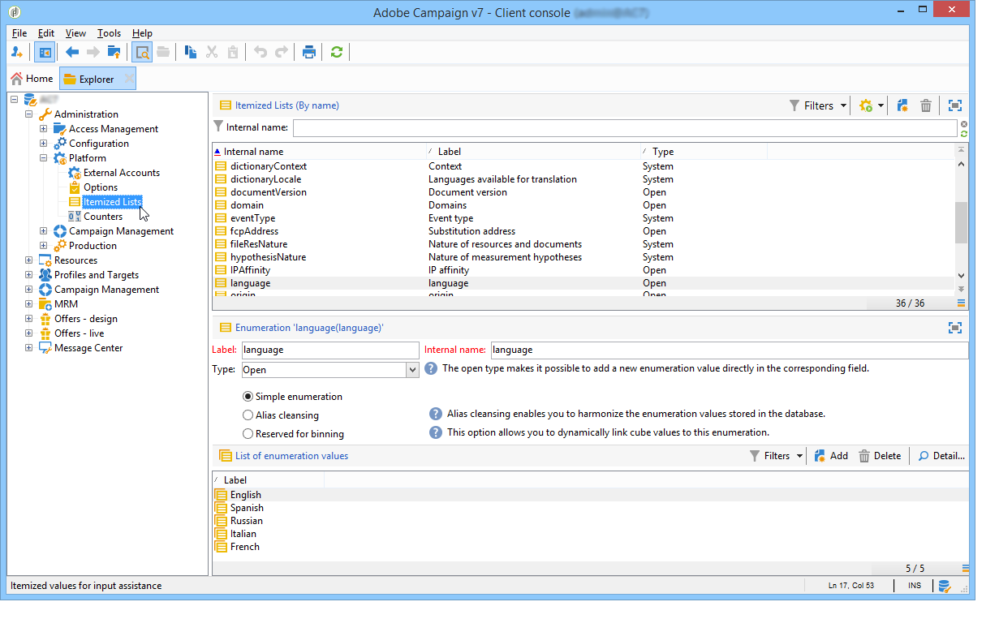

# Opsommingen beheren{#managing-enumerations}

## Opsommingen {#about-enumerations}

Een opsomming (ook wel &#39;gespecificeerde lijst&#39; genoemd) is een lijst met waarden die door het systeem worden voorgesteld om bepaalde velden te vullen. Met opsommingen kunt u de waarden van deze velden standaardiseren en informatie invoeren of gebruiken binnen query&#39;s.

De lijst met waarden wordt weergegeven als een vervolgkeuzelijst waaruit u de waarde kunt selecteren die in het veld moet worden ingevoerd. De vervolgkeuzelijst maakt ook voorspellende invoer mogelijk, waarbij de operator de eerste paar letters invoert en de toepassing de rest invult.

Sommige consolevelden zijn gedefinieerd met dit type opsommingen. Opsommingen worden &quot;open&quot; genoemd als u waarden kunt toevoegen door de gegevens rechtstreeks in het desbetreffende veld in te voeren.

## Toegang tot waarden {#access-to-values}

De waarden voor dit type veld worden gedefinieerd en het algemene beheer van deze velden (het toevoegen/verwijderen van een waarde) wordt uitgevoerd via het **[!UICONTROL Administration > Platform > Enumerations]** knooppunt van de structuur.

* De bovenste sectie bevat een lijst met velden waarvoor een gespecificeerde lijst is gedefinieerd.
* In de onderste sectie worden de voorgestelde waarden weergegeven. Deze waarden worden herhaald in de editors die dit veld gebruiken.

   

   Als u een nieuwe opsommingswaarde wilt maken, klikt u **[!UICONTROL Add]** op.

   

   Als de **[!UICONTROL Open]** optie is geselecteerd, kan de gebruiker een nieuwe gespecificeerde lijstwaarde direct op het overeenkomstige gebied toevoegen. Met een bevestigingsbericht kunt u deze waarde maken.

   

* Als de **[!UICONTROL Closed]** optie is geselecteerd, kunnen gebruikers geen nieuwe waarden maken, maar alleen een keuze maken uit de beschikbare waarden.

## Gegevens standaardiseren {#standardizing-data}

### Informatie over het opschonen van aliassen {#about-alias-cleansing}

In de gespecificeerde lijstgebieden, kunt u waarden buiten opsommingswaarden ingaan. Deze kunnen worden opgeslagen zoals ze zijn of worden gereinigd.

>[!CAUTION]
>
>Het zuiveren van gegevens is een kritiek proces dat de gegevens in het gegevensbestand beïnvloedt. Adobe Campaign voert updates voor massagegevens uit, waardoor sommige waarden kunnen worden verwijderd. Deze bewerking is daarom voorbehouden aan professionele gebruikers.

De ingevoerde waarde is dan:

* Toegevoegd aan de gespecificeerde lijstwaarden: in dat geval moet de **[!UICONTROL Open]** optie worden geselecteerd;
* of automatisch vervangen door de overeenkomstige alias: In dat geval moet dit geval worden gedefinieerd op het **[!UICONTROL Alias]** tabblad van de gespecificeerde lijst,
* of is opgeslagen in de lijst met aliassen: er wordt later een alias aan toegewezen.

   >[!NOTE]
   >
   >Als u mogelijkheden voor gegevenszuivering wilt gebruiken, selecteert u de **[!UICONTROL Alias cleansing]** optie in de gespecificeerde lijst.

### Aliassen gebruiken {#using-aliases}

Met deze optie **[!UICONTROL Alias cleansing]** kunt u aliassen gebruiken voor de geselecteerde gespecificeerde lijst. Als deze optie is geselecteerd, wordt het **[!UICONTROL Alias]** tabblad onder in het venster weergegeven.

#### Een alias maken {#creating-an-alias}

Klik op een alias om een alias te maken **[!UICONTROL Add]**.

Voer de alias die u wilt omzetten en de waarde in die u wilt toepassen en klik op **[!UICONTROL Ok]**.

Controleer parameters voordat u deze bewerking bevestigt.

>[!CAUTION]
>
>Zodra dit stadium is bevestigd, kunnen de eerder ingevoerde waarden niet worden teruggevorderd: zij zijn vervangen.

Wanneer een gebruiker de waarde **NEILSEN** invoert in een veld &quot;bedrijf&quot; (in de Adobe Campaign-console of in een formulier), wordt deze automatisch vervangen door de waarde **NIELSEN Ltd**. Waardevervanging wordt uitgevoerd door de workflow **Alias-zuivering** . Zie Gegevens [uitvoeren opschonen](#running-data-cleansing).

#### Waarden omzetten in aliassen {#converting-values-into-aliases}

Als u een opsommingswaarde wilt omzetten in een alias, klikt u met de rechtermuisknop in de lijst met waarden en kiest u **[!UICONTROL Convert values into aliases...]**.

Kies de waarden die u wilt omzetten en klik op **[!UICONTROL Next]**.

Klik **[!UICONTROL Start]** om de conversie uit te voeren.

Zodra de uitvoering is voltooid, wordt de alias toegevoegd aan de lijst met aliassen.

#### Aliashits ophalen {#retrieving-alias-hits}

De waarden die door de gebruikers worden ingevoerd, kunnen in aliassen worden omgezet. Wanneer de gebruiker een waarde invoert die niet in de gespecificeerde lijst staat, wordt de waarde op het **[!UICONTROL Alias]** tabblad opgeslagen.

De technische workflow voor **Alias-zuivering** herstelt deze waarden elke avond om de gespecificeerde lijst bij te werken. Raadpleeg Gegevensverwijdering [uitvoeren](#running-data-cleansing)

Indien nodig kan in de **[!UICONTROL Hits]** kolom het aantal keren worden weergegeven dat deze waarde is ingevoerd. Het berekenen van deze waarde kan tijd en geheugen vergen. Zie [Invoergebeurtenissen](#calculating-entry-occurrences)berekenen voor meer informatie.

### Gegevens opschonen uitvoeren {#running-data-cleansing}

De gegevens worden gewist door de **[!UICONTROL Alias cleansing]** technische workflow. De configuraties die voor opsommingen worden gedefinieerd, worden tijdens de uitvoering toegepast. Raadpleeg de workflow [Alias Clearing](#alias-cleansing-workflow).

Het opschonen kan via de **[!UICONTROL Cleanse values...]** koppeling worden geactiveerd.

Met de **[!UICONTROL Advanced parameters...]** koppeling kunt u de datum instellen vanaf welke verzamelde waarden in aanmerking worden genomen.

Klik op de **[!UICONTROL Start]** knop om gegevens te wissen.

#### Voorvallen van item berekenen {#calculating-entry-occurrences}

Op het **[!UICONTROL Alias]** subtabblad van een gespecificeerde lijst kunt u het aantal exemplaren van een alias weergeven voor alle ingevoerde waarden. Deze informatie is een schatting en wordt in de **[!UICONTROL Hits]** kolom weergegeven.

>[!CAUTION]
>
>Het berekenen van voorvallen van aliasinggegevens kan lang duren. Daarom is voorzichtigheid geboden wanneer het gebruiken van deze functie.

U kunt de aanraakberekening handmatig uitvoeren via de **[!UICONTROL Cleanse values...]** koppeling. Klik hiertoe op de **[!UICONTROL Advanced parameters...]** koppeling en selecteer de gewenste optie(s).

* **[!UICONTROL Update the number of alias hits]**: hiermee kunt u resultaten bijwerken die al zijn berekend op basis van de ingevoerde datum.
* **[!UICONTROL Recalculate the number of alias hits from the start]**: Hiermee kunt u berekeningen uitvoeren op het gehele Adobe Campagne-platform.

U kunt ook een specifieke workflow maken, zodat de berekening automatisch gedurende een bepaalde periode wordt uitgevoerd, bijvoorbeeld eenmaal per week.

Om dit te doen, creeer een exemplaar van het **[!UICONTROL Alias cleansing]** werkschema, verander de planner en gebruik de volgende montages in de **[!UICONTROL Enumeration value cleansing]** activiteit:

* **-updateHits** om het aantal aliashits bij te werken,
* **-updateHits:full** om alle aliashits opnieuw te berekenen.

#### Workflow voor Aliasverwijdering {#alias-cleansing-workflow}

In de workflow voor **Aliaszuivering** wordt het opschonen van opsommingswaarden uitgevoerd. Standaard wordt de transactie dagelijks uitgevoerd.

Het wordt betreden via de **[!UICONTROL Administration > Production > Technical workflows]** knoop.

